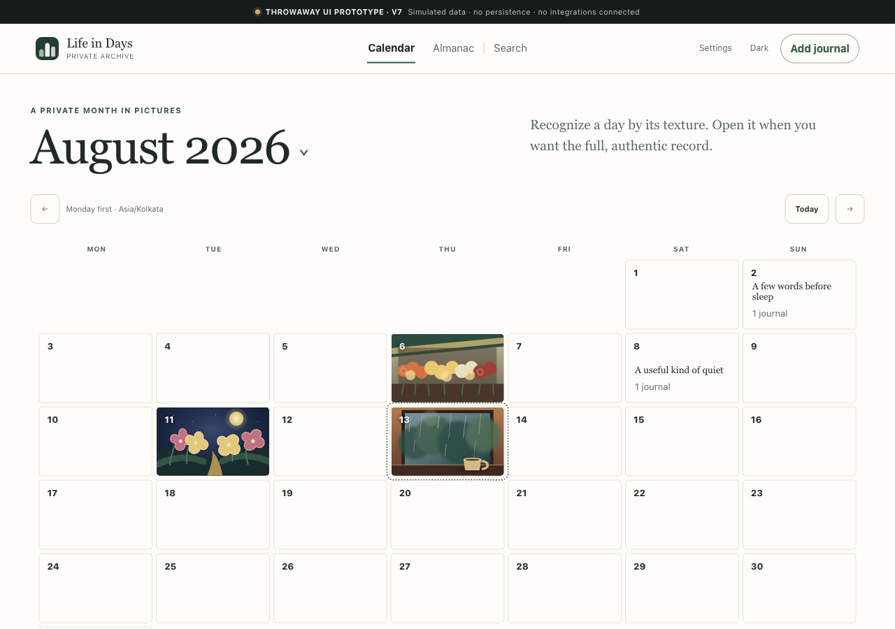

# Life in Days

Life in Days is a proposed private, single-user visual memory archive that brings together textual VoiceNotes journals, Telegram photos, and manually uploaded `.txt` or `.md` journals as trustworthy, calendar-based Journal Days.

> [!IMPORTANT]
> This repository contains a planning baseline and throwaway static UI prototypes built with fictional data. It is not a working or deployed application. No integration, persistence, authentication, backup, recovery, accessibility-conformance, or production-readiness claim is made.



## Product principles

- Authentic journals and photos remain distinct from AI-derived titles, summaries, tags, briefs, and artwork.
- Real photos and photo-derived data must never be sent to AI providers.
- Journal Dates use fixed `Asia/Kolkata` time while immutable original timestamps are preserved.
- The MVP is private and single-user, with no sharing, public links, reminders, coaching, or historical import.
- Backdating is deliberate and visible; receipt time is never silently treated as the Journal Date.

## Current status

| Area | Status |
| --- | --- |
| Phase 1 Product Council package | Complete as a planning artifact; 58 work packages across P0 and R0–R10 |
| Current bounded authority | The P0/R0 Gold Goal was published through PR #69 and activated from clean exact main at `2dc4d05cdeca8cb9aeacf393076f6c6f946ff62b`. Stage 0 control status derives from its exact-candidate dossier, append-only successor-review registry, and durable PR evidence; this README grants no R0 action. All 50 R1-R10 tasks and their 300 task artifacts remain frozen and out of scope. |
| Per-task Product Council gate | 58 six-artifact P0 dossier bundles exist; all 58 are Incomplete, with 45 Hold + 13 Historical non-authorizing, 0 Ready, and 0 execution-allowed. |
| PC-001 readiness controls | Gate A and exact-candidate five-seat audit-only review merged through PRs #66/#67. PC-001 remains Historical non-authorizing, its six artifacts remain In review, and `taskApprovals` is empty. |
| Release PRDs/PID | Council-reviewed planning baselines; task-specific approval and executed evidence remain separate |
| R0 shared-host coexistence spike | Historically In progress; no substantive stage is authorized. Its first permitted future lane is a separately reviewed `local-synthetic/synthetic-foundation` Gate A/Gate B stage; private-host read authority remains absent. |
| Latest frozen UI prototype | v10 Resilient Application Shell |
| Product implementation and deployment | Substantive implementation has not started; live state is Unknown — private read authority pending; no implementation release is Done |
| Conditional storage transition | R10 is trigger-gated and intentionally has no dates |

The prototypes use browser-memory-only behavior and simulated states. They do not connect to VoiceNotes, Telegram, AI providers, storage, authentication, backup, or recovery systems.

## Start here

| Area | Document |
| --- | --- |
| AI-agent operating contract | [Living Phase 1 roadmap and Excel instructions](AGENTS.md) |
| AI-agent orientation | [Phase 1 AI Agent Resource Index — 2026-08-14 15:10:39 IST](docs/project/AI-AGENT-RESOURCE-INDEX-2026-08-14-15-10-39-IST.md) |
| Historical broad execution goal | [Codex Goal prompt — Phase 1 P0 requirements to private production](docs/project/CODEX-GOAL-PROMPT-P0-TO-PRODUCTION.md) |
| Current bounded Goal artifact | [P0 Codex Gold Goal — complete P0 and R0 only, then stop](docs/project/P0-CODEX-GOLD-GOAL-PROMPT-P0-R0-ONLY-2026-08-15.md) |
| Complete navigation | [Document index](docs/INDEX.md) |
| Phase 1 council decision | [Product Council Decision Record](docs/council/PHASE1-COUNCIL-DECISION-RECORD.md) |
| Current execution authority | [P0 Execution Authorization](docs/council/execution/P0-PHASE1-EXECUTION-AUTHORIZATION.md) |
| Five-seat execution council | [P0 Execution Council Charter](docs/council/execution/P0-PHASE1-EXECUTION-COUNCIL-CHARTER.md) |
| Per-task start gate | [P0 Task Definition of Ready](docs/council/execution/P0-PHASE1-TASK-DEFINITION-OF-READY.md) |
| Task artifact register | [P0 Task Artifact Register](docs/project/P0-PHASE1-TASK-ARTIFACT-REGISTER.json) |
| Task readiness state | [P0 Task Readiness State](docs/project/P0-PHASE1-TASK-READINESS-STATE.json) |
| Stable reviewer identities | [P0 Execution Reviewer Registry](docs/council/execution/P0-EXECUTION-REVIEWER-REGISTRY.json) |
| Exact-candidate approvals | [P0 Execution Approval Registry](docs/council/execution/P0-EXECUTION-APPROVAL-REGISTRY.json) |
| Machine owner-action state | [P0 Owner Action State](docs/council/execution/P0-OWNER-ACTION-STATE.json) |
| Task dossier library | [P0 Task Work Items](docs/work-items/) |
| Owner-only dependencies | [P0 Owner Action Ledger](docs/council/execution/P0-OWNER-ACTION-LEDGER.md) |
| Detailed release plan | [Phase 1 Release Plan](docs/project/PHASE1-RELEASE-PLAN.md) |
| Review workbook | [Phase 1 Excel Release Plan](outputs/phase1/Life-in-Days-Phase1-Release-Plan.xlsx) |
| Live visualization | [Life Reflection GitHub Project](https://github.com/users/arunpr614/projects/1) |
| Product intent | [Proposed shared understanding](docs/discovery/SHARED-UNDERSTANDING.md) |
| Requirements | [Product Requirements Document](docs/product/PRODUCT-REQUIREMENTS.md) |
| Release requirements | [Release PRDs and conditional PID](docs/product/releases/) |
| Experience | [UX Specification](docs/design/UX-SPECIFICATION.md) |
| Phase 1 design review | [UX Design Review](docs/council/UX-DESIGN-REVIEW.md) |
| Architecture | [Phase 1 Implementation Plan](docs/architecture/PHASE1-IMPLEMENTATION-PLAN.md) |
| Shared-host deployment | [Hetzner Shared-host Spike](docs/research/HETZNER-SHARED-HOST-DEPLOYMENT-SPIKE.md) |
| Wayfinder adoption | [Wayfinder Phase 1 Adoption Report](docs/research/WAYFINDER-PHASE1-GITHUB-INTEGRATION-RESEARCH.md) |
| GitHub roadmap research | [GitHub Projects Roadmap Research](docs/research/GITHUB-PROJECTS-ROADMAP-RESEARCH.md) |
| Historical roadmap pilot | [GitHub Roadmap Design Spike](docs/spikes/LIFE-IN-DAYS-GITHUB-ROADMAP-DESIGN.md) |
| Delivery task source | [Phase 1 Roadmap Manifest](docs/project/PHASE1-ROADMAP-MANIFEST.json) |
| Roadmap synchronization | [GitHub Project Sync Runbook](docs/project/PHASE1-GITHUB-PROJECT-SYNC.md) |
| Prototype roadmap | [Prototype Completeness Tracker](docs/project/PROTOTYPE-COMPLETENESS-TRACKER.md) |
| Requirement coverage | [Requirements Traceability](docs/project/REQUIREMENTS-TRACEABILITY.md) |

The [project Wiki](https://github.com/arunpr614/Life-Reflection/wiki) mirrors every Markdown project artifact into reader-friendly pages. The version-controlled source documents and their stated precedence remain authoritative.

GitHub history begins with a sanitized snapshot of the current project files. Machine-local paths and pre-publication author metadata are intentionally excluded, while the local repository retains the earlier development history. Some documents preserve earlier commit identifiers as evidence labels; those identifiers may not resolve in the public repository. See [Publication provenance](PUBLICATION.md).

## Run the latest static prototype

Node.js is the only runtime requirement. No package installation, live service, or credential is used.

```sh
cd prototypes/calendar-ui
npm run check:v10
npm run prototype
```

Then open:

```text
http://127.0.0.1:4173/index-v10.html?view=calendar&month=2026-08
```

The root `/` route is the historical v1 prototype, so use the explicit v10 URL. See the [v10 run guide](prototypes/calendar-ui/README-v10.md) for its exact scope and evidence boundary.

## Repository map

- `docs/discovery/` — decisions, source research, and provider evaluation plans
- `docs/product/` — detailed product requirements
- `docs/design/` — experience and accessibility specification
- `docs/architecture/` — proposed implementation and operations plan
- `docs/research/` — Phase 1 deployment and integration spikes
- `docs/spikes/` — bounded design spikes and pilot proposals
- `docs/project/` — gates, tasks, traceability, and prototype roadmap
- `docs/council/` — governance, role charters, and review records
- `docs/work-items/` — six P0-prefixed task-bound Product, Architecture, Design, QA, Delivery, and Council artifacts for every canonical issue
- `docs/prototypes/` — versioned handoffs, council decisions, and screenshots
- `outputs/` — generated review artifacts, including the Phase 1 Excel plan
- `tools/` — deterministic generators and GitHub synchronization utilities
- `prototypes/calendar-ui/` — dependency-free static prototype versions
- `design-qa*.md` — bounded, version-specific prototype QA records
- `PUBLICATION.md` — public-snapshot scope and provenance

## Privacy boundary

The checked-in prototype media and journal content are fictional fixtures. Never commit real journals, photos, identifiers, credentials, provider responses, private URLs, or descriptions derived from private photos. See [Security](SECURITY.md) for private reporting instructions if sensitive material is exposed.

## Contributing

This is an owner-led personal project. Read [Contributing](CONTRIBUTING.md) before proposing a change, especially the synthetic-data and frozen-prototype rules.

## License

No open-source license has been selected. Copyright remains with the repository owner; the public repository does not by itself grant reuse rights.
