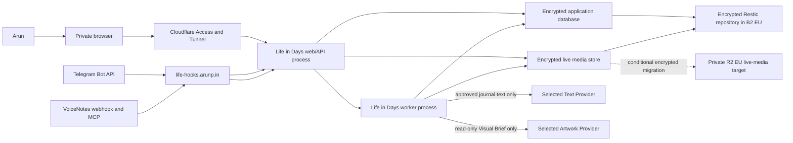
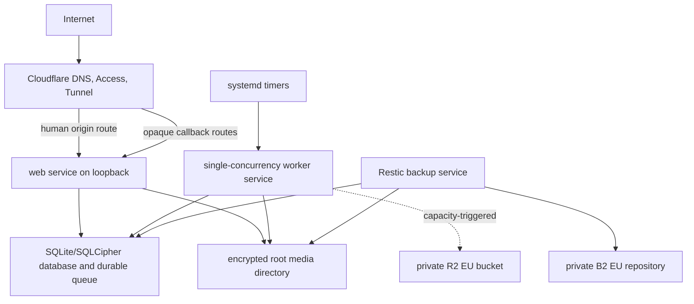
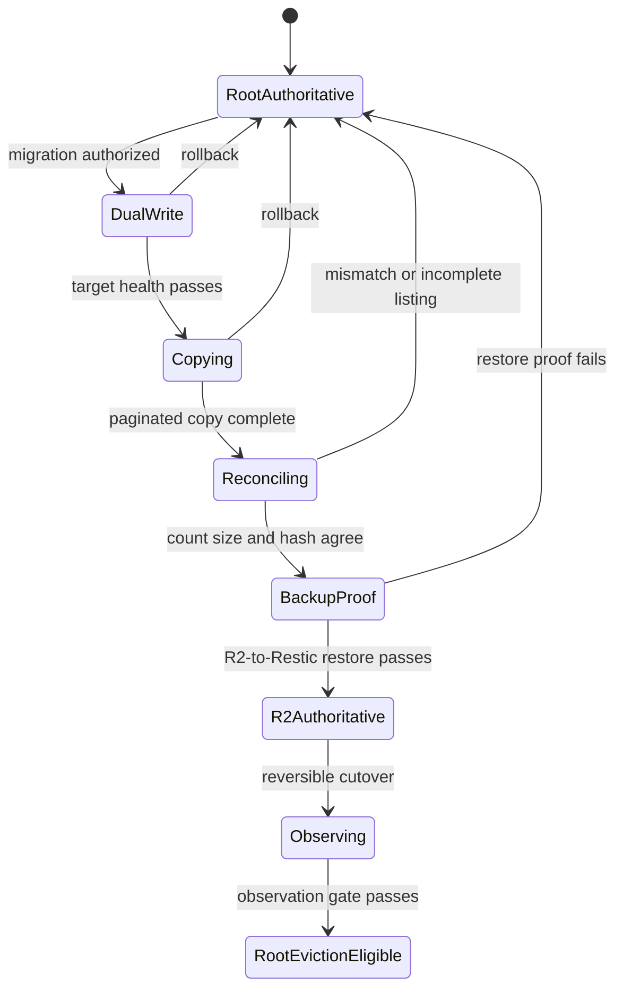
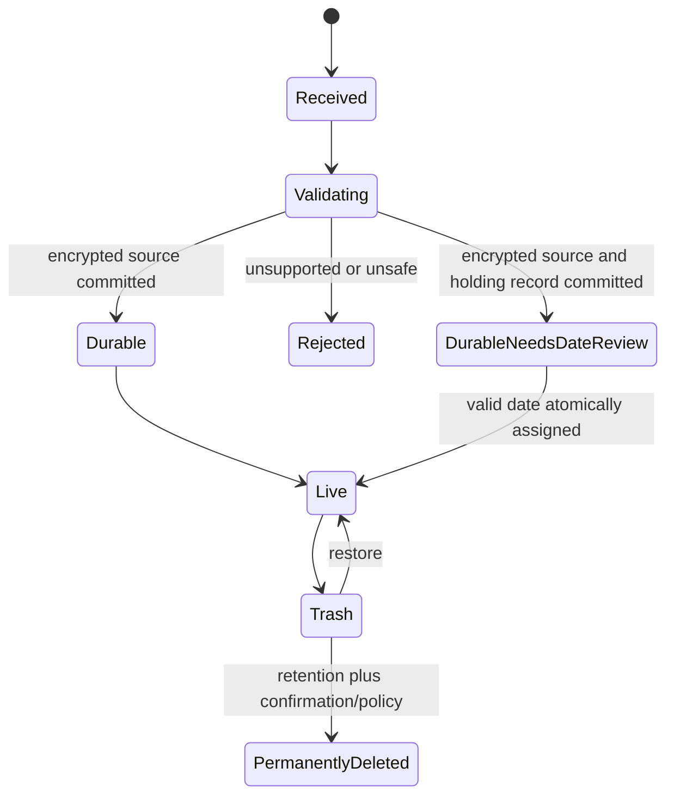
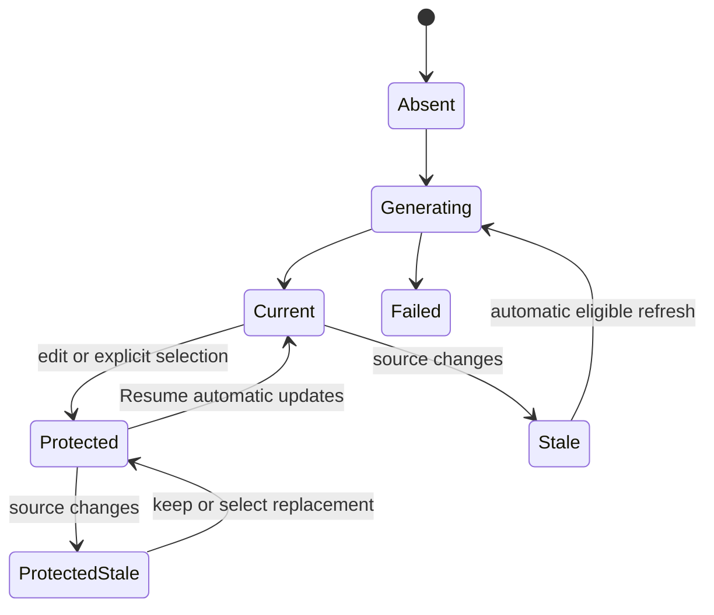
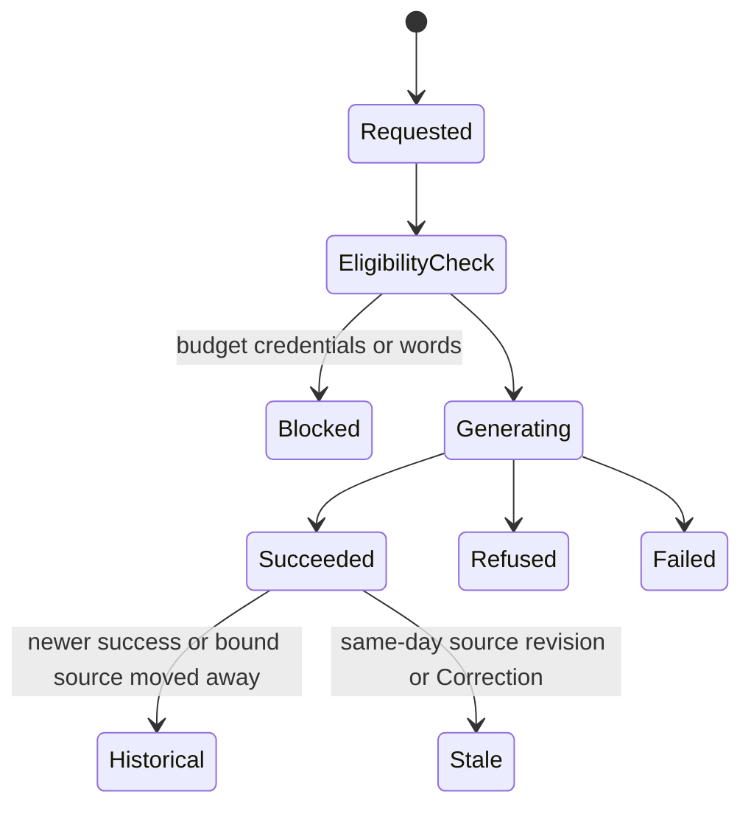

# Life in Days — detailed implementation plan

Updated: 2026-08-14
Owner: Product Council — Technical Architecture seat, integrated by the council chair
Status: shared architecture input; task entry is governed by the P0 task-dossier and Product Council readiness controls. No implementation, evaluation, credential collection, infrastructure mutation, deployment, or launch is claimed by this document.

## 1. Purpose and authority

This plan translates the [Product Requirements Document](../product/PRODUCT-REQUIREMENTS.md), [UX Specification](../design/UX-SPECIFICATION.md), and [Project Tracker](../project/PROJECT-TRACKER.md) into a build and verification sequence. It is detailed enough to guide implementation after the applicable gates pass, but it does not override Arun's decisions, the [discovery requirements](../discovery/REQUIREMENTS.md), or the domain language in [`CONTEXT.md`](../../CONTEXT.md).

Precedence is:

1. Arun's direct decisions and corrections.
2. The P0 execution authorization and a task-specific Product Council readiness decision.
3. Confirmed discovery requirements and `CONTEXT.md`.
4. PRD and UX behavior.
5. This shared implementation-plan input and the task-specific technical plan.

The P0 execution authorization supersedes the earlier universal `GOV-008` / G1 confirmation stop. It authorizes local/public readiness-control work only. A substantive task may start only after its six P0-prefixed dossier artifacts pass the five-seat Product Council gate at a reviewed revision. Credentialed, private-host, paid-provider, authentic-content, deployment, recovery, and release acts remain separately owner-controlled where recorded.

## 2. Decision classification

The plan distinguishes confirmed product decisions from architectural recommendations and gated choices.

| Area | Classification | Current position | Gate / evidence |
| --- | --- | --- | --- |
| Product model | Confirmed | Private, single-user, prospective visual memory archive in `Asia/Kolkata` | P0 execution authorization; task-specific council readiness |
| Deployment shape | Confirmed boundary | One existing Hetzner server, Cloudflare routing, best-effort availability | G2 architecture acceptance; G7 deployment authorization |
| Application shape | Recommendation | One TypeScript modular monolith with a web process and a worker process | ADR-001 at G2 |
| Browser UI | Recommendation | Responsive React application served from the same origin as the API | ADR-001; UX prototype review |
| Primary database | Recommendation | SQLite with SQLCipher and FTS5 for the single-user workload | ADR-002 proof of encryption, search, backup, migration, and runtime support |
| Job system | Recommendation | Durable database-backed queue with leased jobs and idempotency keys | ADR-003; restart/concurrency spike |
| Local media encryption | Recommendation | Authenticated streaming encryption with a versioned envelope; no plaintext disk staging | ADR-004 crypto review and test vectors |
| Image processing | Recommendation | Isolated, bounded libvips-based worker with verified HEIC/HEIF support | Codec/security spike |
| AI models | Gated | No exact text or artwork model selected | Approved synthetic/blind evaluations at G3 |
| VoiceNotes contract | Gated | Webhook wakes reconciliation; official MCP is proposed authority | Synthetic integration spike at G3 |
| Live media | Confirmed direction | Encrypted root-disk launch, conditional private R2 EU migration | Storage thresholds and M11 cutover evidence |
| Recovery store | Confirmed direction | Encrypted Restic repository in private Backblaze B2 EU Central | Backup/restore evidence and Recovery Ceremony |
| Human access | Confirmed direction | Cloudflare Access exact-account policy, MFA, seven-day session | G7 configuration and negative tests |
| Machine callbacks | Confirmed direction | Separate `life-hooks.arunp.in` routes with independent authentication | G7 configuration and contract tests |
| Exact encryption/key design | Gated | Application-controlled, no additional subscription; not E2EE/zero knowledge | ADR-004 plus Recovery Ceremony |

No recommendation becomes a decision merely because it appears here. A gated failure reopens the affected branch; it is not papered over with an undocumented substitute.

## 3. Architectural drivers

### 3.1 Trust drivers

- Authentic Source Items must remain separate from Corrections and Derived Artifacts.
- Original timestamps, source revisions, conflicts, suppressions, Trash, and generation provenance must remain reconstructable.
- A retry, replay, late source, or process crash must not duplicate, overwrite, misdate, or lose a memory.
- A real Daily Photo always outranks Generated Artwork for Calendar Cover.
- No personal journal text is silently merged; no protected generated field is silently overwritten.

### 3.2 Privacy and security drivers

- Real photo bytes, thumbnails, EXIF, Telegram identifiers, captions, signed URLs, and photo-derived descriptions must be structurally impossible to serialize into AI calls.
- Copied database/media storage and backups must be unreadable without application-controlled recovery material.
- Plaintext image bytes must not be staged on persistent disk or unencrypted swap.
- Human and machine authentication must be separate and fail closed.
- Secrets, journal text, captions, prompts, images, provider responses, assertions, and signed URLs are forbidden from ordinary logs.

### 3.3 Operational drivers

- The design must fit a low-volume, single-user application on the existing server.
- Capture, browsing, search, export, and backup continue when AI is disabled, over budget, or unavailable.
- Background work must survive restarts and expose precise health evidence.
- Backup success is insufficient; sampled and full restoration must be demonstrable.
- Root-disk watermarks must reject safely before free space becomes dangerous.

### 3.4 Product and UX drivers

- Image-first Calendar, Monthly Almanac, deterministic Search, and Journal Day detail are primary surfaces; there is no separate user-facing Timeline destination.
- All failure, stale, conflict, date-review, Trash, suppression, and provider states need accessible UI.
- The web application targets current desktop/mobile browsers, keyboard access, reduced motion, and WCAG 2.2 AA contrast.
- There is no native app, offline-first synchronization, multi-user model, reminder loop, coaching, or public content in MVP.

## 4. Proposed system architecture

### 4.1 Context and trust boundaries



The diagram does not imply that Cloudflare, Telegram, VoiceNotes, an AI provider, or the running server cannot observe data they legitimately process. Life in Days must not be described as end-to-end encrypted or zero knowledge.

### 4.2 Runtime deployment



Recommended service boundaries:

- `life-web`: same-origin HTML/assets/API and both webhook receivers.
- `life-worker`: durable jobs, reconciliation, derivation, exports, maintenance, and migration.
- `life-backup`: root-restricted Restic commands and verification, invoked by timers outside request paths.
- `cloudflared`: existing tunnel process, configured separately after deployment authorization.

One codebase and one deployable release reduce complexity. Separate processes isolate request latency and worker crashes without introducing distributed-service coordination.

### 4.3 Modular-monolith rule

Modules may call one another only through declared application services or events. Integration adapters cannot write domain tables directly. The domain layer cannot import Telegram, VoiceNotes, Cloudflare, AI-provider, filesystem, R2, or B2 SDK types. This protects later adapter replacement and keeps test fixtures synthetic.

## 5. Recommended stack and alternatives

### 5.1 Recommended baseline

| Layer | Recommendation | Reason | Proof required |
| --- | --- | --- | --- |
| Language/runtime | TypeScript on the then-supported Node.js LTS | One language across UI, API, worker, schemas, and adapters | Pin/test exact versions in ADR-001 |
| UI | React with Vite and a small client router/query layer | Responsive SPA behavior without a second server framework | SSR is unnecessary behind private Access unless tests show otherwise |
| HTTP/API | Fastify with schema-driven request/response validation | Small, explicit, high-performance boundary | Negative auth, payload-size, CSRF, and cache tests |
| Data | SQLite + SQLCipher + FTS5 in WAL mode | Single-user simplicity, encrypted searchable database, portable backups | Native-build, encryption, FTS, concurrency, recovery spike |
| SQL access | Explicit repositories with migrations; thin query builder if useful | Domain invariants remain visible; avoids opaque ORM lifecycle | Migration/rollback tests |
| Jobs | Database-backed `jobs` table and lease protocol | Zero extra service and transactional outbox behavior | Crash/retry/concurrency tests |
| Validation | Shared JSON-schema-compatible runtime schemas | Reject untrusted webhook/upload/provider data at boundaries | Contract suite |
| Media crypto | Versioned authenticated secretstream/envelope implementation | Chunked encryption and integrity without plaintext files | ADR-004/security review |
| Image processing | libvips-compatible isolated process | Efficient thumbnailing and metadata stripping | HEIC/HEIF and bomb-resistance spike |
| Styling | CSS custom properties plus accessible primitives | Small design system, light/dark theming, low lock-in | UX and browser acceptance |
| Deployment | Reproducible OCI images with systemd or Compose orchestration | Portable builds and explicit service lifecycle | Server compatibility and rollback rehearsal |

Exact packages and versions are intentionally absent until implementation authorization, dependency/security review, and lockfile creation.

### 5.2 Alternatives to decide in ADR-001/002

- **PostgreSQL instead of SQLCipher SQLite:** stronger multi-process tooling, but adds service/backup complexity and makes encrypted lexical search harder without disk-level trust or a keyed search index. Choose only if the SQLite spike fails concurrency, native-runtime, migration, or recovery gates.
- **Server-rendered framework instead of Vite/Fastify:** useful only if it materially simplifies same-origin routing/deployment. Public SEO is irrelevant.
- **External queue/Redis:** not justified at single-user volume. Introduce only if durable SQLite leases cannot meet correctness requirements.
- **Separate frontend/backend repositories:** rejected by default; it increases coordination and version drift without an independent deployment need.

## 6. Repository and module layout

Proposed layout after G4 build readiness:

```text
AI_Life_reflect/
├── apps/
│   ├── web/                 # React UI and browser entry
│   ├── api/                 # Fastify composition root and routes
│   └── worker/              # job runner and scheduled commands
├── packages/
│   ├── domain/              # entities, value objects, invariants, commands
│   ├── application/         # use cases, ports, transactions, policies
│   ├── contracts/           # validated HTTP/webhook/provider DTOs
│   ├── persistence/         # SQLCipher schema, repositories, migrations, FTS
│   ├── media/               # encryption, media store ports, thumbnails
│   ├── integrations/        # Telegram, VoiceNotes, AI, Cloudflare, R2 adapters
│   ├── jobs/                # queue, leasing, schedules, handlers
│   ├── observability/       # allowlisted events and health projections
│   ├── design-system/       # accessible UI primitives and tokens
│   └── test-fixtures/       # synthetic journals/images/webhook fixtures
├── infra/
│   ├── containers/          # reproducible image definitions
│   ├── systemd/             # service/timer templates
│   ├── cloudflare/          # secret-free configuration templates
│   ├── backup/              # Restic scripts/config templates and restore checks
│   └── runbooks/            # deploy, rollback, incident, capacity, recovery
├── tests/
│   ├── contract/
│   ├── integration/
│   ├── privacy/
│   ├── e2e/
│   └── recovery/
└── docs/
```

Generated assets, secrets, live databases, media, exports, provider responses, and personal content must be excluded from Git by construction.

## 7. Domain and persistence model

### 7.1 Core records

| Record | Essential fields | Rules |
| --- | --- | --- |
| `journal_days` | ID, Journal Date, visibility projection, created/updated instants | At most one aggregate per `Asia/Kolkata` date; visible only with a live Source Item |
| `source_items` | ID, kind, nullable Journal Day, origin, Original Timestamp, upstream identity, lifecycle state | Source identity and original evidence are immutable; Journal Day may be null only in Needs Date Review |
| `source_revisions` | ID, source ID, sequence, content ciphertext/reference, checksum, upstream timestamp/status | Append-only; every upstream version retained |
| `corrections` | ID, source ID, base revision, corrected content/date, author, created instant, status | Never rewrites source; conflicts are explicit |
| `daily_photos` | ID, source ID, media asset ID, caption, private accessibility description, ordering, cover selection, nullable Journal Day | Journal Day may be null only in Needs Date Review; description is owner-authored local metadata and never AI input |
| `media_assets` | ID, checksum, bytes, dimensions, MIME, encryption envelope, backend, object key, reference state | Global checksum identity; exact encrypted Original plus derivative records |
| `derived_artifacts` | ID, Journal Day, type, active version, protection/stale state | Separate title, summary, tags, Visual Brief, artwork families |
| `derived_versions` | ID, artifact ID, source-revision set/hash, provider/model, prompt/schema versions, output ciphertext/ref, usage/cost, status | Append-only provenance; no silent overwrite |
| `artwork_attempts` | ID, trigger, Visual Brief version, provider/model, eligibility snapshot, budget reservation, result/refusal/error | Manual request or 01:00 sweep only |
| `suppressions` | ID, kind, opaque source/day identity, reason, created/removed instants | Source Suppression prevents re-import; Artwork Suppression prevents automatic sweep recreation; explicit removal only |
| `trash_entries` | ID, target kind/ID, deleted instant, purge due, state | Thirty-day live retention; backup expiry is independent |
| `webhook_receipts` | provider, external event ID, received instant, auth result, processing state | Idempotency evidence; no personal payload in ordinary event log |
| `jobs` / `job_attempts` | type, dedupe key, payload ciphertext/minimized IDs, state, lease, attempts, next run, external-effect state | Durable and observable; external attempts distinguish prepared/sending/unknown outcome/confirmed and are never assumed idempotent |
| `capture_intents` | ID, provider identity, opaque object keys, expected objects, stage, created/expiry instants | Created before persistent object writes; supports retry, orphan reconciliation, quarantine, and acknowledgement gating |
| `provider_configs` | provider/model IDs, capability, lifecycle dates, sweep eligibility, active state | No credential value in database; independent text/art settings |
| `usage_ledger` | request/attempt ID, predicted/actual cost, allocation, month, status | Atomic budget enforcement and reconciliation |
| `integration_state` | integration, activation instant, cursor, last success/error class | Integration Activation is recorded once and cannot be backdated or replaced by disable/re-enable in MVP |
| `exports` | ID, state, manifest hash, encrypted artifact ref, expiry/download state | One-time passphrase is never stored |
| `backup_evidence` / `restore_evidence` | snapshot IDs, inventory/check results, sampled objects, duration, outcome | Health reports evidence, not assumptions |
| `audit_events` | timestamp, actor class, opaque target, action, outcome | Allowlists only; never personal content or secrets |
| `storage_migrations` | asset/backend state, source/target hashes, backup proof, cutover/rollback state | Reconciled and reversible per object |
| `telegram_albums` | private chat + media-group identity, member identities, first/last receipt, settle deadline, date-directive state, acknowledgement state | Durable bounded-settling aggregate; no assumption of an album-complete provider event |

### 7.2 Required invariants

1. `Journal Date` and `Original Timestamp` are different values; redating never changes the latter.
2. A Source Revision is append-only. A Correction points to a base revision and never mutates upstream data.
3. A source/Correction conflict cannot resolve automatically and offers exactly the three approved actions.
4. Moving a Source Item updates old/new Journal Days, visibility, search, cover, and stale projections in one database transaction.
5. A Source Item/Daily Photo may lack a Journal Day only while durably held in Needs Date Review; it is absent from ordinary Calendar/Monthly Almanac queries but remains manageable.
6. A Daily Photo references one Media Asset; duplicate logical photos need not duplicate physical bytes.
7. A Generated Artwork can be Calendar Cover only when no live Daily Photo exists.
8. Protected title/summary/tag fields retain the selected value when sources change; replacement is a separate reviewable version.
9. Same-day source changes mark artwork stale while retaining it visibly; artwork leaves the active gallery/cover only when a bound source no longer belongs to that Journal Day.
10. A permanently deleted VoiceNotes source retains only the opaque identity needed for Source Suppression.
11. AI requests never contain any object implementing a photo/media/caption DTO.
12. Budget reservation and job transition occur atomically before an AI request.
13. An acknowledgement or success state occurs only after the durable transaction and required encrypted object writes succeed.
14. Every export/restore round-trip preserves source/revision/Correction/artifact/Trash/suppression relationships.
15. An external provider attempt in `unknown_outcome` is never blindly replayed; its conservative budget reservation remains held until reconciled or explicitly dispositioned.
16. Every encrypted media object is reachable from a finalized domain record or an unexpired capture intent; all other objects are quarantined and reconciled before garbage collection.

### 7.3 Transaction boundaries

- **Capture transaction:** create a durable capture intent with deterministic object keys, write/fsync encrypted objects idempotently, then create/reuse Media Asset, Source Item, Daily Photo, derivative metadata, and acknowledgement outbox state in the database. Invalid/future explicit dates commit the Source Item/Daily Photo with no Journal Day and lifecycle `needs_date_review`; assigning a valid date later atomically attaches both to the Journal Day. A failed database commit leaves an intent-addressable encrypted orphan for startup reconciliation/quarantine rather than acknowledgement or silent loss.
- **Revision transaction:** append revision, recalculate conflict/staleness, enqueue deduplicated derivation after commit.
- **Redating transaction:** lock the Source Item and both Journal Days, move, recalculate both projections, invalidate stale job completions, update search/outbox.
- **Delete/restore transaction:** transition target and reference counts, create/remove suppression where applicable, recalculate visibility/cover/search, enqueue purge or restoration work.
- **Generation commit:** compare source-revision hash and field protection/eligibility again; stale results become historical attempts rather than active output.

## 8. Database, search, and encryption design

### 8.1 SQLCipher/SQLite proof checklist

Before ADR-002 acceptance, a synthetic spike must prove:

- database pages, WAL, journals, temporary files, and backups are encrypted;
- FTS5 operates inside the encrypted database;
- key loading never appears in process arguments, environment dumps, logs, or container metadata;
- one writer plus concurrent readers meets the single-user workload;
- busy timeouts, transactions, crash recovery, migrations, integrity checks, and backup APIs behave correctly;
- a representative encrypted backup restores on a clean environment;
- the selected Node binding is maintained, reproducibly built, and license-compatible.

If any hard gate fails, ADR-002 compares PostgreSQL plus application-layer encryption/search tokens rather than silently weakening encryption or search requirements.

### 8.2 Lexical search

- Index current displayed journal text, current title/summary/tags, and Photo Captions.
- Index normalized tokens and exact phrases through FTS5; date and tag filters use relational fields.
- Trash and superseded revisions use separate history queries enabled only by **Include history**.
- Search index changes occur in the same transaction where possible; otherwise a transactional outbox makes reindexing retryable and exposes lag.
- Search snippets are generated only for the authenticated response and never logged or placed in URLs.
- Reindex command builds a shadow index from authoritative encrypted records, validates counts/checksums, then swaps atomically.

### 8.3 Encryption ADR input

ADR-004 must compare at least:

- SQLCipher database encryption with a dedicated database key.
- Versioned authenticated streaming encryption for media and export staging, preferably secretstream-style chunking or an equally reviewed construction.
- Separate keys for database, media envelopes, provider-secret wrapping if used, and Restic.
- Root-only secret files or an approved runtime secret mount; never Git, chat, database rows, client bundles, or general environment dumps.
- Versioned ciphertext headers containing only algorithm/version/key identifier/nonce metadata needed to decrypt.
- Rotation by new writes under a new key version plus resumable rewrap; no destructive in-place bulk rewrite without verified backup.
- Recovery material stored once in Arun's password manager and independently as a sealed offline copy.

Plaintext may exist in bounded process memory because the running application must display and process journals. The threat model explicitly does not protect against a fully compromised running server.

## 9. Media lifecycle

### 9.1 Capture pipeline

1. Validate Telegram request authentication and allowlists before download.
2. Stream provider bytes into bounded memory while computing checksum and byte count.
3. Abort above 20 MB; do not retain a partial logical item.
4. Decode in a constrained worker to verify MIME, animation, dimensions, and pixel count.
5. Preserve exact received bytes as Original; generate thumbnails locally with EXIF removed.
6. Encrypt each object before persistent write; `fsync` file and directory before database commit.
7. Reuse an existing Media Asset on global checksum match; create a distinct Daily Photo only under approved duplicate behavior.
8. Commit Source Item and acknowledgement job; acknowledge Telegram only after durability.
9. Zero/release plaintext buffers; record only sanitized outcome metadata.

Before download, create and commit a `capture_intent` containing the provider idempotency identity and opaque incoming object keys. Every retry reuses that intent. Object writes are idempotent and followed by file/directory durability checks. Finalization atomically links the objects to Media Asset and Source Item records and closes the intent. Startup reconciliation resumes valid written intents, expires never-written intents, and quarantines mismatched or unreferenced ciphertext for inventory review before deletion. Fault tests interrupt every boundary between intent creation, Original write, thumbnail write, database finalization, and acknowledgement.

The constrained image worker has CPU, memory, time, pixel, dimension, file-descriptor, and concurrency limits. HEIC/HEIF support must be demonstrated on the target architecture; unsupported codec failures return a clear rejection and do not change accepted-format claims silently.

### 9.2 Read path

- Browser requests an opaque application media ID over the authenticated human origin.
- Application revalidates Cloudflare identity and resource ownership.
- Storage adapter streams ciphertext; application decrypts to the response.
- Responses use private/no-store cache headers, content sniffing protection, safe content type, and no storage-provider URL.
- Originals download with a neutral safe filename; thumbnails never expose EXIF.

### 9.3 Root capacity and R2 migration

- Track encrypted object bytes, database bytes, export staging, backup staging, and host free bytes separately.
- Root-resident media budget starts at 10 GB; warn at the approved early threshold and begin M11 before host free space falls below 12 GB.
- At the emergency threshold, reject new media clearly; never delete or downsample Originals.
- R2 bucket is private, EU jurisdiction selected, public development URL disabled, least-privilege credentials used, and browser access prohibited.

Before root eviction, ADR-005 must select and prove an executable R2 backup-source adapter. The recommended candidate is a read-only, no-write-through-cache mount or equivalent streaming filesystem view backed by the private R2 API. The application first emits an application-consistent manifest of every expected opaque key, ciphertext byte count, and ciphertext hash; a complete paginated R2 inventory must match it. Restic then backs up exactly the manifest paths through the read-only view into B2. Any pagination error, missing/extra object, short read, object mutation, or hash mismatch aborts the snapshot and preserves root authority. The resulting snapshot is checked and sampled by restoring directly from B2 before cutover. A catalog-only backup or successful R2 upload never satisfies this gate.

R2 migration states:



No root copy is evicted until inventory reconciliation, live read verification, independent Restic recovery proof, and the observation period pass.

## 10. HTTP, UI, and callback contracts

Route names are recommendations, not frozen APIs. All schemas must be explicit and versioned before implementation.

### 10.1 Human application routes

| Method/path family | Purpose | Critical rules |
| --- | --- | --- |
| `GET /api/calendar` | Month projection | Authenticated; no hidden empty days; real-photo cover invariant |
| `GET /api/almanac` | Cursor-based chronological Journal Days for Monthly Almanac | Stable opaque cursor; no personal query values in URL logs where avoidable |
| `POST /api/search` | Text/date/tag search | Body-based query; Include history explicit; private/no-store |
| `GET /api/days/:date` | Journal Day detail | Fixed date grammar; provenance and current/history separation |
| `POST /api/uploads/journals` | `.txt`/`.md` upload | Auth, CSRF, 1 MiB/UTF-8/type/date/duplicate checks |
| `PATCH /api/sources/:id/date` | Redate source | Version precondition; atomic old/new-day update |
| `POST /api/sources/:id/corrections` | Create Correction | Base revision required; never upstream mutation |
| `POST /api/conflicts/:id/resolve` | Three-way explicit resolution | Action enum contains only approved options |
| `PATCH /api/derived/:id` | Edit/protect/resume field | Per-field version precondition and protection semantics |
| `POST /api/days/:date/artwork-requests` | Manual generate/regenerate | Eligibility, word warning, provider, budget, safety checks |
| `POST /api/visual-briefs/:id/regenerate` | Regenerate read-only brief | No user free-form prompt field |
| `POST /api/trash` / restore / purge | Lifecycle management | Consequence preview, idempotency, retention semantics |
| `POST /api/exports` | Build portable archive | Passphrase used in-memory; one download/one-hour expiry |
| `GET /api/system-health` | Sanitized evidence | No personal text, media, filenames, secrets, or assertions |
| `GET/PATCH /api/settings` | Theme/providers and safe settings | Provider dropdown allowlist and masked credential health only; browser never accepts, displays, or edits secret values |

Mutating requests require Cloudflare identity validation, CSRF protection, origin checks, request size limits, schema validation, idempotency where repeatable, and an optimistic concurrency token for user-visible state.

### 10.2 Machine callbacks

- `POST https://life-hooks.arunp.in/<opaque-telegram-path>` validates Telegram's webhook secret header, exact numeric sender, exact private chat, and update identity before fetching media.
- `POST https://life-hooks.arunp.in/<opaque-voicenotes-path>` applies only the authentication/signature mechanism proven in the spike. The payload is stored only as minimally necessary encrypted reconciliation evidence; webhook receipt merely schedules authoritative retrieval.
- Callback origin exposes no calendar, journal, media, settings, search, health, or export routes.
- Invalid callback requests return a generic response and a sanitized error class; do not disclose which allowlist check failed.

## 11. Integration plans

### 11.1 Telegram

- Register webhook only after G7 authorization, using a fresh bot token and secret supplied through the approved runtime path.
- Persist `update_id`, chat/message ID, media-group ID, provider file identity, and checksum for idempotency; never log them in ordinary logs.
- Accept photo messages and image documents; choose the largest available photo rendition and explain Telegram compression.
- Parse only an anchored leading `YYYY-MM-DD`; remainder becomes Photo Caption and is excluded from AI.
- Invalid/future explicit dates create a durable Needs Date Review item and bot explanation; they do not fall back silently to receipt date.
- Same-day checksum duplicate returns **already imported** plus **Add duplicate anyway**. Cross-day match warns but permits a new Daily Photo reference.
- Acknowledgement is an outbox job following durable commit. The management link still requires Cloudflare Access.

Telegram provides no album-complete event, so `media_group_id` uses a durable bounded-settling aggregate rather than a completeness claim. Each member is encrypted and committed independently, joins the album record, and extends a configurable quiet deadline measured from the latest member. The deadline value is selected from synthetic timing/replay tests at G4. A single valid leading date found on any member becomes the group directive and is applied atomically to every current member; conflicting directives, or an invalid/future directive, put every affected member in Needs Date Review. With no directive, each member retains the normal receipt-date rule. After the quiet deadline, one group acknowledgement reports the durable members and date/review state. A late member reopens the aggregate, inherits the stored directive, and produces a supplemental acknowledgement; a late directive atomically reconciles all members and reports any date change. Replayed members remain idempotent, and a restart resumes the deadline from durable state.

### 11.2 VoiceNotes

The G3 spike must determine:

1. webhook event types, authentication, payload identity, ordering, retry, and tag/date availability;
2. exact mapping from webhook identity to official MCP note identity;
3. unattended authorization/refresh feasibility;
4. authoritative transcript, tag, creation/update timestamps, pagination, rate limits, and delete/untag behavior;
5. whether reconciliation can enumerate a complete eligible set safely.

Only after a passing contract:

- record Integration Activation once;
- use webhook as a wake signal, never source truth;
- fetch authoritative note; require exact `life-in-days` tag and creation timestamp at/after activation;
- never auto-import older notes even if later edited/tagged;
- append Source Revisions on upstream changes;
- mark upstream untagged/deleted status without deleting local memory;
- reconcile periodically and fail closed on incomplete enumeration;
- create Needs Date Review when creation timestamp is unavailable.

### 11.3 Manual uploads

- Global flow requires valid Journal Date; in-day flow inherits the date.
- Accept only UTF-8 `.txt` or `.md` at or below 1 MiB.
- Preserve exact file bytes encrypted and filename as source title; normalize only a separate display/index representation.
- Checksum duplicate warns and offers **Add Anyway**; multiple Uploaded Journals per day are allowed.
- Blank browser writing, PDF, Word, and OCR endpoints do not exist in MVP.

### 11.4 AI providers

- Independent typed Text Provider and Artwork Provider adapters expose only approved evaluated configurations.
- Credentials are referenced by secret handle, never returned by settings APIs.
- No automatic provider/model fallback exists.
- Text adapter receives the minimum approved journal text and frozen instructions/schema; journal content is delimited as untrusted data.
- Artwork adapter receives only a read-only 150–300-token Visual Brief. Its request type has no raw-journal, photo, caption, media, name, account, or arbitrary user-prompt field.
- Provider-native response validates before normalization. Record requested and returned model, provider request ID, prompt/schema/config versions, source hash, usage, predicted/actual cost, latency, refusal/error, and lifecycle metadata.
- Recheck provider terms, retention, lifecycle, and pricing before credentials and before launch; do not claim zero retention or residency without evidence.

## 12. Durable jobs and schedules

### 12.1 Queue protocol

Each job has `type`, encrypted/minimal payload, `dedupe_key`, state, priority, `run_after`, attempt count, lease owner/expiry, and last sanitized error class.

Worker algorithm:

1. Begin immediate transaction and claim one eligible job whose lease is absent/expired.
2. Set lease and attempt row; commit.
3. Re-read authoritative domain state and eligibility.
4. For a local/CPU job, perform bounded work outside the transaction and continue at step 8.
5. For an external side effect, create a `prepared` attempt and reserve conservative budget atomically; attach a provider idempotency key only when that exact API documents support.
6. Transition to `sending` immediately before the call. On a documented definitive response, persist `confirmed` plus request/task identity, result/error class, and usage. A crash, timeout, connection loss, or ambiguous provider response after send transitions to or is recovered as `unknown_outcome`.
7. Reconcile `unknown_outcome` through a provider status endpoint/idempotency lookup only when documented. Never auto-resend an ambiguous attempt. Keep its conservative reservation charged/held; an explicit later retry is a new attempt subject to the remaining budget.
8. Begin transaction; revalidate source hash/version and commit result or historical stale outcome.
9. Release only a proven unused reservation difference, complete job, update health projection, and enqueue follow-ups through outbox.

Retries use capped exponential backoff with jitter only when the provider contract makes non-acceptance definitive or supplies idempotent replay. Validation, safety refusal, budget block, missing credentials, an ambiguous external outcome, and hard contract failures are not blind retries. Dead/unknown jobs remain visible and can be dispositioned after remediation without pretending the external side effect did not occur.

### 12.2 Job catalog

| Job | Trigger | Dedupe basis | Key behavior |
| --- | --- | --- | --- |
| Telegram capture | Authenticated callback | Telegram update/message identity | Download, validate, encrypt, derive, commit, acknowledge |
| Telegram acknowledgement | Capture commit | Daily Photo + outcome | Send minimal date/status/link; no journal content |
| VoiceNotes reconcile | Webhook or periodic sweep | integration + cursor/window | Authoritative exact-tag prospective reconciliation |
| Source derivation | Source change + 15 minutes | day + source-revision hash | Title/summary/tags/Visual Brief; protect fields |
| 01:00 text refresh | Daily timer | day + source hash + date | Final untouched-field refresh when changed |
| Artwork request | Explicit UI action | request ID | Five-word minimum; warn under twenty; budget/safety gates |
| 01:00 Artwork Sweep | Daily timer | day + source hash | All eligible post-activation missed days; twenty-word minimum |
| Search reindex | Domain outbox | entity + version | Transactional/recoverable index update |
| Export build | Explicit UI action | export ID | Durable metadata plus non-resumable short-lived passphrase process; complete AES-256 ZIP and manifest/checksums or fail/clean/re-enter |
| Export cleanup | Timer/download event | export ID | Delete after first successful download or one hour |
| Trash purge | Daily timer | trash ID + due instant | Permanent live deletion and reference cleanup |
| Capacity audit | Frequent timer | measurement window | Warn/project/reject; never delete originals |
| Backup evidence import | Backup service result | snapshot/check ID | Update sanitized System Health evidence |
| R2 migration | Authorized M11 batch | asset + target backend | Dual-write/copy/reconcile/restore-proof state machine |

All business schedules calculate in `Asia/Kolkata`. Timer code must test daylight/clock changes even though India currently has no DST; the IANA zone remains the authority.

### 12.3 State machines







## 13. AI orchestration and budget enforcement

### 13.1 Text derivation

- Wait 15 minutes from latest journal-source change before automatic generation.
- Generate one concise title, factual 80–140-word summary, 3–7 tags, and 150–300-token Visual Brief under versioned schemas.
- At 01:00, refresh only untouched fields whose source set changed.
- Editing or explicitly selecting a generated field protects only that field.
- Source change marks a protected field stale and creates an optional replacement; never switches it automatically.
- **Resume automatic updates** removes protection only from the chosen field.

### 13.2 Artwork

- Manual **Generate artwork now** exists at five meaningful words and warns below twenty.
- The 01:00 sweep requires twenty meaningful words, post-activation day, no real Daily Photo, no Generated Artwork, and no Artwork Suppression.
- Sweep checks every eligible missed day, not only yesterday.
- Manual request may regenerate and may run on a day with photos; photos still own Calendar Cover.
- Visual Brief is read-only. **Regenerate brief** and artwork retry are distinct actions.
- Every success creates a retained version; newest becomes active by default, and an earlier version may be selected.
- Removing all art creates Artwork Suppression, which blocks the automatic sweep only; **Allow generation** removes it. A manual Artwork Request remains available under normal gates and does not silently clear suppression.
- Safety refusal is neutral, visible, and never triggers automatic retry/fallback/source editing.

### 13.3 Budget ledger

- Production month is calculated in `Asia/Kolkata`.
- Hard total is $5; reserve $0.50 for text and allow at most $4.50 for artwork.
- Before request, calculate conservative predicted cost and atomically reserve it.
- Block when request would exceed total or allocation; manual actions have no bypass.
- On provider response, reconcile actual usage/cost and release unused reservation.
- Unknown/unpriced usage is charged at the conservative reserved amount until reconciled.
- Warn at 80%; AI stops at hard limits while archive functions continue.
- Evaluation usage belongs to a separate one-time $15 ledger and never uses personal content.

## 14. Lifecycle, export, and recovery

### 14.1 Corrections and conflicts

- Displayed journal = selected Source Revision unless an active Correction exists.
- New upstream revision against a Correction creates conflict and stores both bases.
- Diff view offers only: keep Correction, display newest upstream revision, or create new Correction based on both.
- The third action pre-fills a working copy but never auto-merges or saves it.
- Every resolution records actor, time, inputs, and resulting display choice without source text in audit logs.

### 14.2 Trash and suppressions

- Deletion moves live content to Trash for 30 days and recalculates day/cover/search state.
- Restoring a Voice Journal removes the associated temporary Source Suppression.
- Permanent deletion keeps only the opaque upstream identity required to prevent re-import.
- **Allow re-import** removes that enduring suppression.
- Removing all Generated Artwork creates Artwork Suppression against the automatic sweep. Restoration or **Allow generation** handles automatic eligibility explicitly; a separate manual request remains possible.
- A Media Asset is removed from live storage only when no live or Trash Daily Photo references it.
- Backup retention expires old bytes normally; UI never promises immediate selective backup erasure.

### 14.3 Portable export

Export contains:

- versioned manifest and schema version;
- JSON relational/domain representation;
- readable Markdown and browsable static HTML;
- original source files/photos and Generated Artwork;
- revisions, Corrections, provenance, checksums, and timestamps;
- clearly separated Trash, Source Suppressions, and Artwork Suppressions;
- only opaque identifiers for permanently deleted sources where required.

Default packaging is an AES-256 ZIP under a one-time passphrase never stored. ADR-007 must prove the implementation before build: the request hands the passphrase through an anonymous pipe to a short-lived export process; neither durable job metadata nor disk contains it. The process writes an encrypted `.partial`, fsyncs, then atomically publishes. Process/server loss marks the attempt failed, removes partial output, and requires Arun to enter a passphrase for a new attempt; encrypted export construction is intentionally not restart-resumable. An authenticated single-use download lease prevents concurrent consumers. “First successful download” means the server completes the entire response stream without a socket/write error; interrupted streams follow a bounded retry rule recorded in ADR-007, and one-hour expiry always wins. An unencrypted option requires explicit warning. A restore validator must reconstruct into a fresh environment and compare counts, relations, hashes, active selections, deletion intent, and sample rendered days.

### 14.4 Backups and disaster recovery

- Restic snapshots include application-consistent database backup, encrypted media, configuration needed for restore but no plaintext secrets, and a complete inventory manifest.
- Retention: 48 hourly, 30 daily, 12 monthly.
- Repository checks verify structure; monthly sampled restore recovers database plus selected Originals/derivatives; quarterly full drill builds a clean instance.
- Four-hour recovery is an acceptance target to measure, not an SLA claim.
- Runbooks cover server loss, database corruption, root media loss, R2 loss, B2 credential loss, provider outage, key loss, and compromised credential rotation.
- Launch waits for the Recovery Ceremony: verified password-manager key copy, independent sealed offline copy, and representative restore/decrypt using recovery material.

## 15. Security and privacy engineering

### 15.1 Threat model subjects

- Unauthorized browser/user.
- Forged or replayed Telegram/VoiceNotes callback.
- Malformed upload/image and decompression bomb.
- Prompt injection inside journal content.
- Dependency/build compromise.
- Leaked integration/provider/storage credential.
- Cloudflare cache or public object exposure.
- Running-host compromise and copied-disk compromise as separate threats.
- Disk exhaustion, partial migration, incomplete backup, lost key, and operator error.

### 15.2 Required controls

- Cloudflare Access JWT/assertion validated at origin; exact owner membership and MFA policy tested.
- Origin listens on loopback/tunnel only; no public server port.
- Webhooks have independent authentication, opaque paths, schema/size/rate limits, replay/idempotency defenses, and no human routes.
- Same-origin cookies are secure, HTTP-only where applicable, strict/lax as justified; state changes have CSRF and Origin checks.
- Content Security Policy, frame denial, strict transport, referrer minimization, permissions policy, and private/no-store headers.
- Upload MIME decode, size/pixel/dimension/animation checks in constrained worker.
- Secrets read from root-restricted runtime files, least privilege, rotation runbooks, no client exposure.
- Dependency lockfile, reproducible builds, vulnerability/license review, secret scanning, and software bill of materials before release.
- Database/media/export encryption with versioned authenticated formats and restore vectors.
- Typed AI serializers use positive allowlists. Privacy tests inject unique canaries into every forbidden photo field and assert absence at adapter boundary.
- Logs use compile-time/runtime allowlisted event fields, not broad object logging followed by redaction.
- Destructive operations use optimistic concurrency, consequence preview, explicit confirmation, audit event, and rollback where defined.

### 15.3 Photo-to-AI structural prohibition

The `ai` package must not depend on media domain types. Provider input builders accept only dedicated `TextDerivationInput` or `ArtworkBriefInput` values created from an allowlisted journal-text projection. Build/lint boundary tests reject imports from `media`, `daily-photo`, `caption`, or Telegram payload modules. Runtime schema strips/rejects unknown fields. Mock provider tests capture serialized bytes and scan canary values from Originals, thumbnails, EXIF, captions, filenames, Telegram IDs, object keys, and signed URLs. This is a release-blocking privacy suite.

## 16. Observability and System Health

### 16.1 Allowlisted operational events

Allowed examples: event time, opaque internal correlation ID, component, operation class, outcome, duration bucket, retry count, byte/count bucket, provider/model configuration ID, error class, and software version.

Forbidden: journal text, titles, summaries, tags, Visual Briefs, prompts, provider responses, captions, filenames where personal, images, thumbnails, EXIF, Telegram/VoiceNotes IDs, Cloudflare assertions, email, credentials, tokens, full URLs, object keys, signed URLs, database query parameters, or stack-local variable dumps containing those values.

Local structured logs retain 30 days. A test scans logs after every end-to-end privacy fixture.

### 16.2 System Health projections

Show factual timestamps/status for:

- latest durable Telegram capture and repeated failure state;
- latest VoiceNotes reconciliation and cursor/completeness result;
- job queue depth/oldest age/dead jobs by safe class;
- root/R2 bytes, free space, watermarks, and projection;
- monthly text/art/total AI spend and blocked requests;
- latest Restic snapshot/check, sampled restore, full drill, and Recovery Ceremony;
- export cleanup failures and storage migration state;
- application version/database migration version.

Health never exposes personal content. Telegram operational alerts fire only after repeated ingestion, reconciliation, or backup failure; no journaling reminders exist.

## 17. Capacity and performance

Initial design targets are acceptance hypotheses, not production claims:

- serialize heavy image derivation at concurrency one on the small host;
- keep webhook validation/queueing fast and bound request/download time;
- paginate Monthly Almanac/Search/History and avoid loading full journals into month views;
- serve precomputed local thumbnails, not Original images, in Calendar/Monthly Almanac;
- enforce upload/image/queue/export concurrency and memory budgets;
- checkpoint WAL and monitor database/media/export/temporary space;
- load-test synthetic archives at 1, 5, and 10 GB media plus multi-year metadata;
- measure calendar/search/day detail at mobile and desktop bandwidth/CPU profiles;
- prove one long export or artwork job cannot block capture acknowledgement.

Performance acceptance values should be recorded at G4 using the measured Hetzner host rather than invented here.

## 18. Test and evidence strategy

### 18.1 Test layers

| Layer | Scope | Examples |
| --- | --- | --- |
| Domain unit | Pure invariants and policies | date rules, covers, protection, eligibility, budgets, Trash, suppressions |
| Property/model | Sequences and concurrency | arbitrary redates/deletes/restores/revisions preserve invariants |
| Contract | External/request schemas | Telegram, VoiceNotes spike fixtures, AI native schemas, export manifest |
| Adapter integration | Real library/local emulator behavior | SQLCipher, FTS, crypto, image codecs, filesystem, R2-compatible API |
| Application integration | Database + jobs + adapters | capture, outbox, retries, stale completions, reconciliation |
| Browser E2E | User flows/states | calendar, upload, conflicts, art, settings, health, export, Trash |
| Privacy/security | Negative and canary tests | auth denial, forged callback, photo-to-AI, log/cache/URL leakage |
| Accessibility/browser | Supported matrix | keyboard, screen reader semantics, focus, contrast, zoom, reduced motion |
| Migration/recovery | Persistent-state safety | schema upgrade/rollback, export round-trip, Restic clean restore, R2 cutover |
| Failure/chaos | Dependency/process faults | kill worker, disk full, provider timeout, partial listing, corrupt object |

### 18.2 Critical scenario matrix

Release evidence must cover at least:

- midnight boundary and explicit past/invalid/future Telegram dates;
- photo message/document, media group, unsupported type, decompression bomb, 20 MB/100 MP/20,000 px boundaries;
- wrong webhook secret/sender/chat/group and replayed update;
- same-day/cross-day duplicate and shared Media Asset reference lifecycle;
- VoiceNotes pre/post activation, exact/wrong tag, missing creation date, revision, untag/delete, partial reconciliation, expired authorization;
- `.txt`/`.md`, invalid UTF-8, over 1 MiB, duplicate/Add Anyway, multiple uploads/day;
- concurrent redating and source revision; old/new day cover/visibility/search consistency;
- Correction conflict and all three resolutions without auto-merge;
- protected/unprotected title, summary, and individual tags after late source;
- manual artwork at 0/4/5/19/20 meaningful words; sweep eligibility and missed-day repair;
- real photo arriving before/during/after artwork; Calendar Cover invariant;
- artwork regeneration/version selection/suppression/allow generation/safety refusal;
- $0.50/$4.50/$5 boundaries, concurrent reservations, unknown cost, month rollover;
- provider outage without fallback and archive functions remaining available;
- Trash/restore/purge/source suppression/allow re-import/media reference counts;
- exact search current/history after every lifecycle mutation;
- export one-time passphrase/download/expiry and clean restore comparison;
- disk watermarks/emergency rejection, R2 incomplete listing/hash mismatch/rollback;
- Restic snapshot/check/sample/full restore, missing live server, lost single credential;
- unauthorized/cache/back-button/session-expiry states and all UX accessibility requirements.

### 18.3 Synthetic data

- No personal journal/photo is required for unit, contract, integration, evaluation, or routine browser tests.
- Synthetic journals span ordinary life, ambiguity, negation, names, multilingual text, prompt injection, sparse/long entries, and sensitive topics without copying Arun's content.
- Synthetic images include safe still formats, EXIF/location canaries, duplicates, malformed headers, animation, extreme dimensions, and generated non-personal subjects.
- Test screenshots/traces use synthetic content only and are scrubbed before retention.

## 19. Development workflow and CI

### 19.1 Environments

- **Local:** synthetic fixtures, fake Telegram/VoiceNotes/AI adapters, temporary keys, no personal data or live callbacks.
- **CI:** deterministic synthetic database/media, network disabled except explicitly isolated contract jobs, temporary encrypted stores destroyed after run.
- **Evaluation:** synthetic-only runner, separately authorized credentials and $15 ledger, signed scorecards.
- **Staging/release candidate:** private, production-shaped configuration with synthetic data and independent test backup.
- **Production:** only after G7 authorization, fresh runtime secrets, access checks, restore evidence, and Recovery Ceremony.

### 19.2 CI gates

1. format/lint/type and architectural-boundary checks;
2. secret/personal-data pattern scan and dependency/license review;
3. domain/property tests;
4. SQLCipher/crypto/media adapter tests;
5. contract and job crash/retry tests;
6. browser/accessibility suite with synthetic data;
7. privacy canary and unauthorized-route suite;
8. migration forward/restore/rollback-or-forward-fix rehearsal;
9. export/restore and backup smoke tests on release candidates;
10. artifact signing/SBOM/checksum and immutable release identifier.

No CI result is production evidence until the production-shaped gate explicitly requires and records it.

## 20. Phased implementation sequence

### Phase 0 — Council planning baseline (`M0`, `G0`)

- Complete and cross-review PRD (`GOV-009`), UX specification, this plan (`GOV-010`), tracker, and council record (`GOV-012`).
- Build traceability among 78 `LID-*` requirements, `UX-*` rules, tracker tasks, architecture sections, and test evidence.
- Exit only when contradictions are closed; does not authorize implementation.

### Phase 1 — Owner confirmation and architecture (`M1`, `G1–G2`)

- Obtain `GOV-008` shared-understanding confirmation.
- Create ADR-001 stack/runtime, ADR-002 encrypted database/search, ADR-003 durable queue, ADR-004 encryption/key recovery, ADR-005 media storage/R2 backup source, ADR-006 deployment/rollback, and ADR-007 encrypted-export passphrase/download lifecycle.
- Produce threat model, data-flow/privacy inventory, secrets plan, schema diagrams, capacity measurements, and test strategy.
- Run only synthetic/reversible architecture spikes explicitly allowed after G1.

### Phase 2 — Risk-retiring qualification (`M2`, `G3`)

- Run VoiceNotes spike (`VNO-001` onward) and publish observed contract; reopen product branch if it fails.
- Execute approved text and artwork evaluations (`AIQ-*`) with synthetic data and separate $15 hard cap.
- Populate dropdown configuration only with passing options; obtain Arun decision on exceptions/hard-gate failures.

### Phase 3 — Trustworthy archive foundation (`M3`, `G4`)

- Scaffold modules, migrations, encrypted DB/media store, queue/outbox, config/secrets abstractions, and synthetic fixtures (`ARC-*`, `PRV-*`).
- Implement Journal Day, Source Items/Revisions, Corrections, Daily Photos/Media Assets, Derived Artifact versions, suppressions, Trash, audit, and usage ledger (`DOM-*`).
- Prove atomic redating, cover, visibility, reference counts, search update, and stale-job rejection.
- Implement root media pipeline and private read path (`MED-*`).

### Phase 4 — Capture vertical slices (`M4`)

Recommended delivery order:

1. manual journal upload end-to-end (`UPL-*`);
2. Telegram synthetic callback to durable photo, date review, duplicate, and acknowledgement (`TEL-*`);
3. VoiceNotes adapter/reconciliation using only the passing spike contract (`VNO-*`).

Each slice includes domain, adapter, UI state, health, privacy, failure, export, backup, and tests before moving on.

### Phase 5 — Reflection and lifecycle (`M5`)

- Build design tokens/shell and accessible navigation (`UXD-*`).
- Calendar, Monthly Almanac, Journal Day detail, gallery/cover, provenance/history, Needs Date Review (`REF-*`).
- Lexical/date/tag search and Include history (`SRH-*`).
- Corrections/conflict/redating/Trash/suppression/re-import flows (`LFC-*`).
- Validate at 320 px through desktop, keyboard, zoom, reduced motion, and supported browsers.

### Phase 6 — Derived intelligence (`M6`)

- Implement evaluated provider adapters, settings, schemas, provenance, usage ledger, and no-fallback policy (`TXT-*`, `ART-*`).
- Add quiet-period/final refresh, field protection/replacement, Visual Brief, manual artwork, sweep, versions, safety/budget states.
- Run photo-to-AI structural/canary suite before any personal journal is eligible.

### Phase 7 — Resilience, privacy, and operations (`M7`)

- Complete encrypted portable export and round-trip importer/validator (`EXP-*`).
- Configure synthetic/non-production Restic/B2 backup and prove restore (`BKP-*`).
- System Health, logs, budgets, capacity, alerts, runbooks (`OPS-*`).
- Complete security/privacy/accessibility/browser/failure reviews and close critical/high findings.

### Phase 8 — Release candidate (`M8`, `G5–G6`)

- Freeze a versioned release candidate with full requirement-to-evidence matrix (`QAE-*`).
- Rehearse migrations, deploy, rollback, clean restore, session expiry, dependency outage, disk thresholds, and data portability.
- Arun validates representative synthetic scenarios. Production credentials and deployment are still not implied.

### Phase 9 — Authorized deployment and launch (`M9`, `G7–G9`)

Only after explicit deployment authorization:

- provision fresh secrets through the approved path;
- deploy loopback-only services to Hetzner;
- configure Cloudflare Access, `life.arunp.in`, `life-hooks.arunp.in`, tunnel routes, and callbacks;
- execute unauthorized access, cache, webhook, smoke, backup, restore, budget, and rollback checks;
- complete two off-server recovery-key copies and representative restore/decrypt;
- obtain final Arun go/no-go;
- enable prospective integrations and verify first real capture without exposing content in evidence.

### Phase 10 — Stabilization (`M10`)

- Review first captures/reconciliations/jobs/spend/storage/backup using sanitized evidence.
- Close defects, tune bounded concurrency, perform first sampled restore, and update runbooks.
- Do not add deferred features during stabilization.

### Conditional Phase 11 — R2 transition (`M11`)

- Start before approved capacity thresholds are crossed.
- Create private EU R2 only with authorization; dual-write, copy, reconcile, prove R2-to-Restic restore, cut over reversibly, observe, then evict root copies safely.

## 21. Deployment, migration, and rollback

### 21.1 Release package

- Immutable image digest/version and SBOM.
- Database migration bundle with preconditions and postchecks.
- Secret-free configuration template.
- Static UI assets and exact API/worker code from one commit.
- Runbook, health checks, rollback/forward-fix procedure, and expected schema version.

### 21.2 Deployment sequence

1. Verify current backup/check and free-space headroom.
2. Take application-consistent pre-deploy snapshot.
3. Pull/build verified release; do not replace current service yet.
4. Stop worker claims, drain/expire leases safely, and put mutating human paths in maintenance mode if required.
5. Run migration preflight and backup test; apply forward migration.
6. Start new worker/web on loopback alternate port; run synthetic/private smoke checks.
7. Switch tunnel/orchestrator target; verify identity, callbacks, media, search, queue, budgets, and health.
8. Retain previous image and pre-deploy backup through the observation window.

### 21.3 Rollback rules

- Application-only change with compatible schema: switch to prior image and replay safe jobs.
- Forward-only schema: use reviewed forward-fix; never run an untested destructive downgrade.
- Data corruption: stop writes, preserve evidence, restore to a separate location, reconcile before cutover.
- Callback failure: disable provider webhook or route after authorization while preserving receipts; periodic/manual reconciliation may continue only if safe.
- AI regression: disable affected approved configuration; never auto-route to another provider.
- R2 issue: return authority to verified root copy while dual-write/observation safety permits.

## 22. Open gates and architectural risks

| Gate/risk | Why unresolved | Resolution evidence |
| --- | --- | --- |
| Shared understanding | Earlier universal confirmation stop superseded by the scope-bounded P0 execution authorization | [P0 execution authorization](../council/execution/P0-PHASE1-EXECUTION-AUTHORIZATION.md); per-task council readiness |
| Exact stack/runtime | Empty repository; target-host compatibility unproven | ADR-001 spike and council review |
| SQLCipher/FTS | Native build/concurrency/backup behavior must be proven | ADR-002 test report |
| Crypto/key design | High-consequence and recovery-dependent | ADR-004, test vectors, security review, Recovery Ceremony |
| VoiceNotes | Critical webhook/MCP behavior undocumented | Synthetic spike report |
| AI configurations | Quality/privacy/cost gates not executed | Signed evaluation scorecards |
| HEIC/HEIF | Target codec/runtime support and safe decode unproven | Media spike and malicious-fixture tests |
| Hetzner capacity | Exact CPU/RAM/disk/service state not captured here | Read-only host inventory after authorization for that phase |
| Cloudflare policy/routes | Live configuration not inspected or changed | G7 setup plan and negative tests |
| R2/B2 provider state | Accounts/buckets/credentials not created or verified | Authorized configuration plus restore evidence |
| Performance thresholds | Need target-host measurements and UX validation | G4 recorded budgets and release evidence |
| Personal-data provider terms | May change before use | Primary-source revalidation before credentials/launch |

## 23. Definition of Technical Ready

An implementation slice is technically ready only when:

- its `LID-*`, `UX-*`, and tracker IDs are known;
- applicable G1–G4 decisions/spikes/ADRs have passed;
- data classification, trust boundary, retention, encryption, logging, and processor behavior are explicit;
- schemas, invariants, state/error behavior, idempotency, and concurrency rules are written;
- synthetic fixtures and acceptance/failure/privacy tests exist or are specified;
- migration, observability, capacity, rollback, and recovery implications are known;
- no personal data, credential, paid action, or infrastructure mutation is assumed;
- responsible reviewers accept the slice.

## 24. Definition of Technical Done

An implementation slice is technically done only when:

- implementation and every applicable acceptance criterion work in the named environment;
- unit/property/contract/integration/browser/privacy/security/accessibility/migration/recovery tests appropriate to risk pass;
- source fidelity and domain invariants hold across retries, concurrency, crash, and rollback cases;
- no forbidden personal data or secret appears in logs, traces, fixtures, screenshots, exports, URLs, caches, or client bundles;
- schema/config changes have validated preflight, migration, postcheck, and rollback/forward-fix evidence;
- System Health and runbooks expose safe operational evidence;
- requirement/test/decision/tracker documentation is updated;
- no severity-1/2 defect or critical/high security/privacy finding remains;
- required Product, UX, Architecture, Security/Privacy, QA, and Arun approvals are recorded.

“Code exists” is never sufficient evidence for Done, deployment, production readiness, or launch.

## 25. Traceability summary

| Product area | PRD families | UX sections | Tracker epics | Architecture sections |
| --- | --- | --- | --- | --- |
| Product/date/provenance | `LID-SCP-*` | 2–5, 9, 16 | E05, E13, E15 | 7, 12, 14 |
| Telegram/media | `LID-TG-*` | 11, 12, 18 | E06, E07 | 9, 11.1 |
| VoiceNotes/uploads | `LID-VN-*`, `LID-UP-*` | 10, 22, 23 | E08, E09 | 11.2–11.3 |
| Reflection/search | `LID-REF-*` | 6–9, 16 | E13, E14 | 10, 17, Phase 5 |
| Text/artwork AI | `LID-AIT-*`, `LID-AIA-*` | 13–14, 19 | E10–E12 | 11.4, 13 |
| Lifecycle/export | `LID-SRC-*`, `LID-OPS-009`–`013` | 12, 15–17, 21 | E15, E16 | 14 |
| Privacy/security/access | `LID-OPS-*` | 19, 22, 25–30 | E03, E04, E19 | 8, 10, 15 |
| Backup/storage/operations | `LID-OPS-*` | 20, 21, 30 | E06, E17, E18, E22, E23 | 9.3, 14.4, 16, 21 |
| Quality/deployment | All P0 | 31, 35 | E20, E21 | 18–24 |
| Deferred boundaries | `LID-UP-004`, `LID-DEF-*` | 33 | Deferred backlog | 1, 20, 22 |

The planning traceability matrix is maintained in [Requirements Traceability](../project/REQUIREMENTS-TRACEABILITY.md). It enumerates every individual PRD requirement against UX, tracker, architecture, and planned test/evidence coverage. Before G5 closes, the same rows must additionally link actual code modules and executed evidence artifacts.

## 26. References

- [Product Requirements Document](../product/PRODUCT-REQUIREMENTS.md)
- [UX Specification](../design/UX-SPECIFICATION.md)
- [Project Tracker](../project/PROJECT-TRACKER.md)
- [Product Council charter](../council/PRODUCT-COUNCIL.md)
- [Discovery requirements](../discovery/REQUIREMENTS.md)
- [Proposed shared understanding](../discovery/SHARED-UNDERSTANDING.md)
- [Product and integration research](../discovery/RESEARCH.md)
- [AI text model evaluation](../discovery/AI-TEXT-MODEL-EVALUATION.md)
- [AI artwork model evaluation](../discovery/AI-ARTWORK-MODEL-EVALUATION.md)
- [Private media storage evaluation](../discovery/MEDIA-STORAGE-EVALUATION.md)
