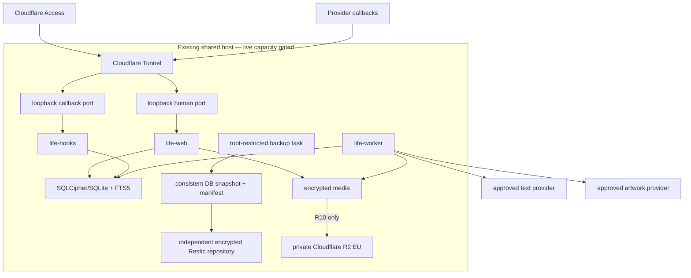

# Life in Days — Phase1 implementation plan

- **Date:** 2026-08-14
- **Owner:** Product Council — Technical Architect
- **Status:** Detailed shared architecture baseline; task-specific plans and council readiness still govern entry; implementation and deployment have not started
**Roadmap vocabulary:** Backlog · Next · In progress · Done

## 1. Purpose and evidence boundary

This plan turns the [global PRD](../product/PRODUCT-REQUIREMENTS.md), [UX specification](../design/UX-SPECIFICATION.md), v5 [HTML](../../prototypes/calendar-ui/index-v5.html), [JavaScript](../../prototypes/calendar-ui/app-v5.js), and [CSS](../../prototypes/calendar-ui/styles-v5.css), the [v5 feature audit](../audits/PROTOTYPE-V5-FEATURE-AUDIT.md), and [shared-host spike](../research/HETZNER-SHARED-HOST-DEPLOYMENT-SPIKE.md) into shared architecture input and roadmap work packages. It is not a substitute for a task-specific P0 Technical Plan or council decision.

The v5 HTML/JavaScript/CSS and screenshots are interaction evidence using fictional browser-memory fixtures. They are not application, persistence, integration, encryption, authentication, accessibility-conformance, backup, recovery, deployment, or production evidence.

Only the bounded planning artifacts explicitly linked in a `Done` row are complete. Every substantive task remains blocked until its six P0-prefixed task artifacts are approved at a reviewed revision and the manifest records `executionAllowed=true`; live-provider integration, host change, deployment, and launch retain their additional explicit gates.

### Source precedence

1. Direct owner decisions and corrections.
2. [Phase1 Roadmap Manifest](../project/PHASE1-ROADMAP-MANIFEST.json) for release, task, status, date, dependency, and roadmap metadata.
3. Stable `LID-*` requirements in the global PRD and canonical domain language.
4. UX behavior and accepted prototype decisions.
5. Council-reviewed release PRDs/PID as parent planning inputs, plus the task-specific P0 Product, Architecture, Design, QA, Delivery, and Council artifacts for entry decisions.
6. This shared plan, the deployment spike, and runbooks.

An architecture recommendation cannot weaken a product acceptance criterion. A failed proof gate reopens the decision; it does not silently change product behavior.

## 2. Release architecture

| Release | Dates | User-verifiable outcome | Architectural focus |
| --- | --- | --- | --- |
| P0 — Council Planning Baseline | 2026-08-14 to 2026-08-16 | Review detailed plans and evidence boundaries | Council artifacts, traceability, roadmap contract |
| R0 — Shared-Host Private Foundation | 2026-08-17 to 2026-08-28 | Open a synthetic private shell; prove backup/restore and safe shared-host coexistence | Host qualification, stack/DB/crypto ADRs, Compose, Access, recovery foundation |
| R1 — Manual Journal Archive | 2026-08-31 to 2026-09-18 | Upload a `.txt`/`.md` journal, revisit its day, export and restore it | Core domain, manual capture, calendar/day vertical slice |
| R2 — Telegram Photo Capture | 2026-09-21 to 2026-10-09 | Send a photo, receive durable acknowledgement, revisit it privately | Callback boundary, image validation/encryption, duplicates, date instructions |
| R3 — Retrieval and Date Integrity | 2026-10-12 to 2026-10-30 | Browse Calendar/Monthly Almanac, find a source, resolve uncertain dates | Retrieval, Needs Date Review, date/redating invariants, accessibility |
| R4 — Source History and Lifecycle Safety | 2026-11-02 to 2026-11-20 | Correct without overwriting, resolve conflict, Trash/restore, inspect history | Revisions, Corrections, conflicts, suppressions, lifecycle/export |
| R5 — Prospective VoiceNotes Sync | 2026-11-23 to 2026-12-11 | Prospectively import a qualifying synthetic/approved VoiceNotes journal and reconcile it | Contract spike, activation boundary, durable reconciliation, lifecycle |
| R6 — Generated Text Reflection | 2026-12-14 to 2027-01-08 | Generate and safely review title/summary/tags from approved journal text | Model qualification, text adapter, provenance, budget, protection/failures |
| R7 — Generated Artwork | 2027-01-11 to 2027-01-29 | Generate visibly labeled artwork from a Visual Brief without photo disclosure | Artwork evaluation, brief, manual/sweep jobs, versions/suppression |
| R8 — Operational Scale and Resilience | 2027-02-01 to 2027-02-19 | Inspect factual health, complete restore/export/security and failure drills | Recovery, observability, capacity, security/privacy/accessibility gates |
| R9 — Private Launch Acceptance and Stabilization | 2027-02-22 to 2027-03-12 | Owner performs the complete private workflow on an authorized deployment | RC, deploy/rollback, Recovery Ceremony, acceptance, stabilization |
| R10 — Conditional Object-store Transition | Trigger-based; no dates | Preserve all media while safely moving authority after a capacity trigger | Object-store dual-write/copy/reconcile/restore/cutover/observation/rollback |

R10 is intentionally date-free. It begins only when the PRD capacity trigger occurs and all migration prerequisites pass.

## 3. Architecture decisions

### 3.1 Accepted planning baseline

| Area | Baseline | Decision gate |
| --- | --- | --- |
| Application | TypeScript modular monolith; one immutable image, separate web/hooks/worker processes | ADR-001 and target runtime proof |
| Browser | Responsive React UI served from the human same-origin service | UX acceptance and browser matrix |
| HTTP | Schema-validated API and strict callback gateway | Auth, body-limit, cache, CSRF, callback contract tests |
| Database | SQLCipher/SQLite + FTS5 in WAL mode | ADR-002 hard gates in R0 |
| Database fallback | Private PostgreSQL service with no host port | Only if SQLCipher hard gate fails |
| Jobs | Database-backed durable queue, leases, outbox, idempotency | ADR-003 kill/retry/concurrency proof |
| Media | Exact Original + metadata-free derivatives, authenticated application encryption | ADR-004 plus codec/staging/privacy proof |
| Launch storage | Encrypted existing-root media with PRD watermarks | Live filesystem and capacity proof |
| Conditional storage | Private Cloudflare R2 EU jurisdiction, opaque keys, encrypted objects | R10 inventory/backup/restore/cutover proof |
| Human access | Cloudflare Access plus origin JWT validation | Live policy, MFA/session, negative tests |
| Callback access | Separate host/port/service and provider-specific authentication | Telegram contract; VoiceNotes spike |
| Recovery | Application-consistent snapshot and encrypted Restic repository independent of live host | Clean restore and Recovery Ceremony |
| Deployment | Dedicated Docker Compose project on the existing host | Sanitized capacity/collision/rehearsal gate |

The [Hetzner spike](../research/HETZNER-SHARED-HOST-DEPLOYMENT-SPIKE.md) contains the SQLCipher/PostgreSQL comparison and the live admission rules.

### 3.2 ADR set

| ADR | Decision | Required evidence |
| --- | --- | --- |
| ADR-001 | Runtime, framework, monorepo, image, Compose/systemd boundary | Target OS/arch/runtime proof; reproducible build; resource measurements |
| ADR-002 | SQLCipher/SQLite + FTS5 or PostgreSQL fallback | Encryption, compile options, concurrency, backup, restore, migration spike |
| ADR-003 | Durable queue/outbox/lease protocol | Kill/restart, stale lease, unknown external-effect, replay tests |
| ADR-004 | Database/media encryption, key hierarchy, rotation, tmpfs, swap rule | Test vectors, canary inspection, threat review, recovery-key proof |
| ADR-005 | Root media and conditional Cloudflare R2 storage/backup-source contract | Complete listing, hashes, interrupted migration, Restic restore |
| ADR-006 | Shared-host Compose, Tunnel, deploy and rollback | Collision, resource, alternate-version/controlled-downtime rehearsal |
| ADR-007 | Encrypted export passphrase and download lifecycle | No persistent passphrase, restart/partial cleanup, success definition |
| ADR-008 | Access JWT, callback trust separation, CSRF/cookie/cache policy | Negative/expiry/rotation/cache tests |

## 4. Runtime topology and coexistence



### Coexistence invariants

1. Compose project, networks, volumes, ports, secrets, timers, and log files are unique to Life in Days.
2. Human and callback services bind only to explicit loopback ports; no database port is published.
3. No service mounts the Docker socket, another application's volume, or a broad host path.
4. Web, hooks, and worker run non-root with a read-only root filesystem and only required writable mounts.
5. Image derivation concurrency is one. Backup, export, media derivation, and artwork generation cannot run as unbounded heavy jobs concurrently.
6. Container resource values are measured R0 outputs, not hard-coded assumptions about a 4 GB server.
7. Deployment commands are always scoped with `-p life-in-days`; no hostwide restart, prune, or cleanup is an application action.
8. System Health exposes resource pressure from durable evidence, while personal content and private topology remain absent.

## 5. Module and repository design

```text
apps/
  web/                 responsive browser UI
  api/                 human same-origin HTTP composition root
  hooks/               provider callback gateway composition root
  worker/              durable jobs and scheduled commands
packages/
  domain/              aggregates, value objects, invariants, state machines
  application/         commands, queries, transactions, ports, policies
  contracts/           HTTP/webhook/provider schemas and typed DTOs
  persistence/         migrations, SQLCipher repositories, FTS, online backup
  jobs/                queue, leases, outbox, schedules, attempt state
  media/               crypto envelopes, store ports, decoder/derivatives
  integrations/        Telegram, VoiceNotes, text/art, Cloudflare R2 adapters
  observability/       allowlisted events, health projections, retention
  design-system/       tokens, accessible primitives, page-state components
  test-fixtures/       fictional journals, images, webhooks, provider responses
infra/
  compose/             secret-free Compose definition and overrides
  cloudflare/          secret-free ingress/Access templates
  backup/              snapshot/Restic/restore verifier commands
  systemd/             scoped Compose and timer units
  runbooks/            deploy, rollback, recovery, capacity, credential rotation
tests/
  unit/ property/ contract/ integration/ e2e/ privacy/ accessibility/ recovery/
```

Module rules:

- Domain code imports no provider, HTTP, Docker, Cloudflare, filesystem, or database SDK type.
- Integration adapters never write domain tables directly; they call application commands.
- AI packages cannot import media, photo, Telegram payload, caption, EXIF, object-key, or signed-URL types.
- HTTP contracts and domain records are separate. Unknown input fields are rejected or stripped at the boundary according to an explicit schema.
- Every state change that crosses a database/external-effect boundary uses an outbox or resumable attempt record.

## 6. Data model

### 6.1 Core records

| Record | Essential fields | Invariants / security |
| --- | --- | --- |
| `journal_days` | ID, Journal Date, visibility, cover projection, timestamps | Unique `Asia/Kolkata` date; visible only with a live Source Item |
| `source_items` | ID, kind, nullable day ID, origin, Original Timestamp, opaque upstream identity, lifecycle | Origin/timestamp immutable; day null only in Needs Date Review |
| `source_revisions` | ID, source ID, sequence, content, keyed checksum, upstream status/time | Append-only; content is searchable only inside the opened SQLCipher database; no overwrite |
| `corrections` | ID, source ID, base revision ID, corrected content/date, created time, state | Owner-authored layer in SQLCipher; never upstream text |
| `uploaded_files` | ID, source ID, original filename, encrypted object ref, MIME, byte size, keyed checksum, envelope version | Exact `.txt`/`.md` bytes remain individually recoverable; filename lives only in SQLCipher/export |
| `daily_photos` | ID, source ID, media asset ID, caption/private description, order, cover flag | Fields live only in SQLCipher and are excluded from AI; one logical reference per accepted capture |
| `media_assets` | ID, keyed/plain checksum representation, sizes/dimensions/MIME, envelope version, backend/key | One encrypted byte sequence may have many photo references |
| `media_derivatives` | ID, asset ID, type, envelope, dimensions, hash, state | Metadata stripped; never replaces Original |
| `derived_artifacts` | ID, day ID, kind, active version ID, protected/stale/suppression state | Source truth remains separate |
| `derived_versions` | ID, artifact ID, source revision set/hash, provider/model, prompt/schema version, DB content or encrypted artifact ref, usage/cost/result | Append-only provenance; no raw provider request/response in operational logs |
| `artwork_attempts` | ID, trigger, brief version, eligibility/budget snapshot, effect state, error/refusal | Manual or 01:00 sweep; no hidden fallback |
| `suppressions` | ID, kind, opaque identity, created/removed time | Explicit Source or Artwork suppression only |
| `trash_entries` | ID, target type/ID, deletion time, purge due, state | Thirty-day live recovery; backups age independently |
| `date_review_items` | ID, source ID, reason class, proposed text, source timestamp, state | No Journal Day until owner selects valid non-future date |
| `webhook_receipts` | provider, opaque external identity, auth/result state, received time | Idempotency; no raw payload in logs |
| `jobs` | type, minimized SQLCipher-resident payload, dedupe key, state, attempts, lease, next run | Durable; lease owner/expiry; bounded retries |
| `external_attempts` | job ID, provider, prepared/sending/unknown/confirmed state, safe request ID | Unknown outcome is reconciled, never blindly replayed |
| `outbox` | event type, opaque aggregate ID, payload, delivery state | Commits with domain transaction |
| `integration_state` | integration, activation instant, cursor, completeness, last success/error | Activation immutable; incomplete enumeration never means deletion |
| `usage_ledger` | provider/model, request/attempt ID, predicted/actual cost, allocation, month, state | Budget reservation atomic before call |
| `exports` | ID, state, manifest hash, encrypted artifact ref, expiry/download result | Passphrase never persisted |
| `backup_evidence` | snapshot/check/restore IDs, safe scope, duration, result | Successful upload is not restore evidence |
| `storage_migrations` | asset ID, source/target state/hash, backup proof, authority, rollback | Per-object reversible ledger |
| `audit_events` | time, actor class, opaque target, action, result | Allowlists only; no content/secrets/private identifiers |

### 6.2 Encryption and search

- SQLCipher encrypts the complete database, including FTS tables, under a key supplied from a service-specific secret file. The key is not stored in the database, image, Compose file, logs, export, or backup manifest.
- The exact SQLCipher build must prove FTS5, encrypted WAL/journal/temp behavior, thread safety, and the selected crypto compatibility settings.
- FTS5 indexes only fields approved for deterministic local search. Query text stays in request memory and never enters URLs, ordinary logs, metrics, error reports, or browser storage.
- The PostgreSQL fallback is not authorized merely by starting a private database service. ADR-002 must separately prove copied-disk secrecy for rows, indexes, WAL, temporary work and backups while retaining the exact retrieval contract; it cannot inherit SQLCipher's whole-file encryption claim.
- Media uses authenticated, versioned per-object envelopes with unique nonces and opaque storage keys. Originals and derivatives are separately encrypted.
- The running host can decrypt content and is therefore trusted at runtime. This is not end-to-end encryption or zero knowledge.
- Database, media, Restic, and recovery/key-encryption domains use distinct keys derived or provisioned according to ADR-004.
- Rotation is versioned and resumable; a key change does not rewrite authentic source history semantically.

### 6.3 Transaction boundaries

| Operation | Atomic database work | External/resumable work |
| --- | --- | --- |
| Manual journal capture | Validate checksum/idempotency, source/revision/day/search/outbox commit | None after file is encrypted and durably placed |
| Telegram photo capture | Auth receipt, capture intent, encrypted object refs, source/photo/day/search/outbox commit | Telegram download before commit; acknowledgement after outbox delivery |
| Resolve date review | Attach source to day, recalc both day projections, search/stale/eligibility/outbox | None |
| Redate source | Old/new day membership, visibility, cover, search, staleness, suppressions | Cancel/reject stale long-running jobs by input hash |
| VoiceNotes reconcile | Completeness gate, source/revision/upstream status/cursor/outbox | Authoritative retrieval and pagination before commit |
| Generate text/art | Reserve budget and attempt; recheck input/config before call; append result version | Provider call with explicit unknown-outcome state |
| Delete/restore/purge | Trash/suppression/reference/day/search projections | Physical delete only after no live/Trash reference |
| Export | Freeze manifest input set and job state | Stream/decrypt/package/encrypt to temporary private artifact; cleanup on failure/expiry |
| Backup | Prepare consistent encrypted DB snapshot and inventory manifest | Restic snapshot/check/restore verification |

## 7. Interfaces

### 7.1 Human HTTP boundary

All routes require a valid Cloudflare Access assertion at origin. State changes also require same-origin checks, CSRF protection, schema/body limits, and optimistic concurrency where the user can act on stale state.

| Interface family | Representative capability | Requirements |
| --- | --- | --- |
| `/api/calendar`, `/api/almanac`, `/api/days/:date` | Calendar/Monthly Almanac/day queries without full-text leakage | `LID-REF-001`, `002`, `004` |
| `/api/search` POST | Body-only lexical/date/tag query; optional history flag | `LID-REF-003`, `LID-OPS-016` |
| `/api/uploads/journals` | Review/commit `.txt`/`.md` with deliberate date and idempotency | `LID-UP-001`–`003` |
| `/api/date-review/*` | List, preview, resolve preserved undated sources | `LID-TG-006`, `LID-VN-004` |
| `/api/sources/*` | Correct, redate, conflict resolution, history | `LID-SRC-001`–`004` |
| `/api/photos/*` | Gallery order, cover, private description, download, lifecycle | `LID-TG-007`, `009`, `010` |
| `/api/derived/*` | Review/protect/resume text; brief/art attempts and versions | `LID-AIT-*`, `LID-AIA-*` |
| `/api/trash`, `/api/suppressions` | Restore, permanent delete, allow re-import/generation | `LID-VN-007`, `LID-AIA-009`, `LID-OPS-010` |
| `/api/exports` | Review, create encrypted archive, one-time download state | `LID-OPS-013` |
| `/api/health` | Safe factual projections, no raw log stream | `LID-OPS-014`–`018` |

Personal responses use `Cache-Control: private, no-store`. Only content-hashed, content-free application assets may be cacheable.

### 7.2 Callback boundary

- Runs as `life-hooks` on a distinct loopback port and public hostname.
- Exposes only exact provider path + method combinations; every other request is 404/405.
- Enforces a small body limit and rate/concurrency bounds before parsing or fetching media.
- Telegram validates webhook secret, numeric sender ID, and private-chat ID before download.
- VoiceNotes authentication and identity contract cannot be implemented until the synthetic spike passes.
- Callback response bodies contain no journal/photo content, private identifiers, host details, or human session links except the approved authenticated management link in a post-commit Telegram message.
- Raw payloads never enter ordinary logs. Durable receipt state uses opaque identity and safe error classes.

### 7.3 Port/adaptor interfaces

| Port | Minimum contract |
| --- | --- |
| `MediaStore` | `putEncrypted`, `openCiphertext`, `head`, complete paginated `inventory`, `deleteIfUnreferenced`, `health` |
| `DatabaseBackup` | `createConsistentEncryptedSnapshot`, `verifyOpen`, `manifest` |
| `JobQueue` | `enqueueUnique`, `claimLease`, `heartbeat`, `complete`, `retry`, `deadLetter`, `recoverExpired` |
| `TelegramClient` | `getFile`, `sendSafeMessage`; no broad chat history |
| `VoiceNotesAuthority` | exact fetch/list/revision/tag/creation contract discovered by spike |
| `TextProvider` | typed approved configuration + allowlisted journal text input only |
| `ArtworkProvider` | typed approved configuration + Visual Brief only |
| `BudgetLedger` | `reserve`, `reconcile`, `release`, `blockReason`, monthly projection |
| `RecoveryRepository` | Restic command wrapper with scoped secret files and recorded exit/evidence |

## 8. Durable job design

### Job states

`queued → leased → running → succeeded | retryable | refused | budget-blocked | dead`

External effects add:

`prepared → sending → confirmed | known-failed | unknown-outcome`

An unknown outcome is reconciled using provider idempotency/request identity where available. It is never retried blindly.

### Job catalog

| Job | Trigger | Concurrency / idempotency |
| --- | --- | --- |
| Telegram download/derive | Accepted receipt | Media heavy semaphore; update/message/file identities |
| Telegram acknowledgement | Durable capture outbox | Exactly one safe acknowledgement per capture result |
| VoiceNotes reconcile | Webhook wake + schedule + manual health action | One per integration/cursor window; complete enumeration required |
| Search reindex repair | Committed source/derived lifecycle event | Per aggregate/version hash |
| Text quiet-period/final refresh | Source change + 01:00 schedule | Per day + source-revision set + config |
| Artwork manual request/sweep | Explicit confirmation + 01:00 eligibility | Per attempt/idempotency hash; no fallback |
| Trash purge | Due schedule | Per target/lifecycle version; media ref recheck |
| Export | Owner request | Per export ID; bounded one at a time |
| Backup/check/sample restore | systemd schedule | Hostwide Life in Days lock; no overlap with export/media-heavy job |
| Storage migration | R10 state machine | Per asset/source-target hash; reversible authority |
| Log retention/health projection | schedule/event | Safe schema only |

## 9. Feature architecture by release

### R0 — private foundation

- Target-host read-only qualification and coexistence budget.
- ADR-001–008 decisions and synthetic proofs.
- Reproducible image, Compose project, secret-file contract, loopback ports, health endpoints, schema migration command.
- SQLCipher/FTS/online-backup/queue kill-recovery proof or PostgreSQL fallback decision.
- Cloudflare Access/Tunnel templates and negative tests in a non-personal environment.
- Application/media encryption test vectors, tmpfs/staging/swap guard, synthetic root store.
- Restic repository integration, application-consistent snapshot, clean sample restore.

### R1 — manual journal archive

- Journal Day, Source Item, Source Revision, Uploaded Journal, checksum, day visibility, audit/outbox.
- `.txt`/`.md`, UTF-8, 1 MiB, deliberate date, review, duplicate/Add Anyway, durable commit.
- Minimum Calendar, Journal Day detail, authentic source labels, responsive states, and accessibility foundations.
- Complete restorable export of the implemented slice and backup/restore coverage.

### R2 — Telegram photo capture

- Callback secret/user/chat/group validation before download.
- Photo/document handling, decoded-type/size/pixel/dimension/animation limits, constrained libvips-compatible worker, HEIC/HEIF proof.
- Exact Original, derivative, global checksum dedup/reference lifecycle, album settling without invented completion event.
- Receipt-date and leading-date/caption grammar, invalid/future Needs Date Review, durable acknowledgement outbox.

### R3 — retrieval and date integrity

- Complete Calendar, cross-month Monthly Almanac, day detail/gallery, private description, match-reason Search and Include History.
- Needs Date Review queue and resolution preview.
- Atomic redating projections and stale-job rejection.
- Loading/error/session/interruption states; 320 px, zoom, keyboard, screen reader, reduced motion, contrast and browser evidence.

### R4 — source history and lifecycle

- Append-only revisions, Correction editor, accessible diff, exactly three conflict outcomes.
- Source-set binding, protected fields foundation, redating/history event stream.
- Trash/restore/permanent delete, media reference lifecycle, Source/Artwork Suppression management.
- Export/import round trip preserves revisions, Corrections, Trash, suppressions, and checksums.

### R5 — prospective VoiceNotes

- Synthetic contract spike before adapter freeze.
- Webhook as wake signal; authoritative retrieval; exact `life-in-days`; immutable Integration Activation.
- Missing creation time to Needs Date Review; replay-safe complete reconciliation; partial page abort.
- Upstream revisions/untag/deletion as status; local suppression prevents resurrection.

### R6 — generated text reflection

- Approved synthetic model evaluation and exact provider/model configuration.
- Allowlisted text-only request serializer, prompt-injection/factuality/schema gates, no fallback.
- 15-minute quiet period and 01:00 final refresh; title/80–140 word summary/3–7 unique tags/Visual Brief.
- Independent protection, replacement review, Resume automatic updates, failure/refusal/provenance/budget states.

### R7 — generated artwork

- Blind evaluation and exact configurations with manual-only flag for premium models.
- Read-only Visual Brief, 20-word manual generation, five-word warning, provider/model/cost/budget confirmation.
- 01:00 sweep, cover precedence, style/labeling, refusal/failure, versions, stale behavior, suppression.
- Privacy test proves no photo bytes/metadata/caption/description/identifier enters either AI path.

### R8 — operational scale and resilience

- Full export lifecycle ADR implementation and clean import validator.
- Restic retention/check/sample/full restore, capacity states, safe emergency media rejection.
- System Health, sanitized 30-day local logs, repeated-failure alerts, AI budget ledger.
- Threat review, dependency/SBOM/secret scan, failure injection, accessibility/browser regression and recovery rehearsal.

### R9 — private launch acceptance

- Immutable RC and complete requirement-to-code-test-evidence matrix.
- Authorized loopback deployment and Tunnel/Access/callback configuration.
- Deploy, compatible rollback, separate-path restore, session expiry, cache, dependency outage, disk pressure, and clean recovery rehearsals.
- Recovery Ceremony and owner scenario sign-off before prospective personal capture is enabled.
- Stabilization monitors sanitized state only; no personal content enters evidence artifacts.

### R10 — conditional object-store transition

- Private Cloudflare R2 EU jurisdiction, public development URL disabled, opaque keys and ciphertext only.
- Dual-write, complete paginated inventory, count/size/hash reconciliation, interrupted-list fail-closed.
- Application-consistent remote-to-Restic snapshot and B2 restore proof.
- Reversible pointer cutover, seven-day observed reads, rollback, then root eviction only after proof.

## 10. Canonical 58-task council roadmap seed

This plan adopts the canonical seed from the [Phase1 Roadmap Manifest](../project/PHASE1-ROADMAP-MANIFEST.json) without introducing architecture-only aliases. `AUD-001`, `PC-001`, and completed PRD/planning artifacts are `Done` only in the narrow evidence sense recorded by the manifest. `SPK-R0-001` is `In progress` because this research report exists while live-host experiments remain open. Every implementation task remains `Next` or `Backlog`; no application feature, deployment, restore, release, or launch is claimed complete.

### Canonical task-level roadmap seed

This table is rendered from the [Phase1 Roadmap Manifest](../project/PHASE1-ROADMAP-MANIFEST.json), the final authority for task status and metadata. The manifest retains the complete owner role, task type, priority, acceptance evidence, rollback/restore impact, GitHub fields, and per-requirement mapping.

| Task ID | Title | Status | Milestone | Proposed dates | Description | Requirement IDs | Dependencies | PRD/PID | Design artifacts |
| --- | --- | --- | --- | --- | --- | --- | --- | --- | --- |
| `AUD-001` | v5 Feature Audit | Done | P0 | 2026-08-14 | Classify every v5 interaction as strong, partial, missing, or outside implementation evidence. | N/A — planning evidence | None | [PRODUCT REQUIREMENTS](../product/PRODUCT-REQUIREMENTS.md) | [UX DESIGN REVIEW](../council/UX-DESIGN-REVIEW.md)<br>[UX SPECIFICATION](../design/UX-SPECIFICATION.md)<br>[index v5](../../prototypes/calendar-ui/index-v5.html) |
| `PC-001` | Integrated Council Planning Package | Done | P0 | 2026-08-14 to 2026-08-16 | Reconcile Product, Design, Architecture, and Project Management decisions into one delivery baseline. | N/A — planning evidence | `AUD-001` | [PRODUCT REQUIREMENTS](../product/PRODUCT-REQUIREMENTS.md) | [UX DESIGN REVIEW](../council/UX-DESIGN-REVIEW.md)<br>[UX SPECIFICATION](../design/UX-SPECIFICATION.md)<br>[index v5](../../prototypes/calendar-ui/index-v5.html) |
| `SPK-R0-001` | Shared-host Coexistence & Rollback Spike | In progress | R0 | 2026-08-17 to 2026-08-19 | Prove namespaced shared-host fit with synthetic data, explicit capacity assumptions, non-regression, restore, and rollback. | `LID-SCP-001`, `LID-OPS-001`, `LID-OPS-002`, `LID-OPS-003`, `LID-OPS-004`, `LID-OPS-008`, `LID-OPS-011`, `LID-OPS-012`, `LID-OPS-014`, `LID-OPS-016`, `LID-OPS-018` | `PC-001` | [PRD R0 SHARED HOST PRIVATE FOUNDATION](../product/releases/PRD-R0-SHARED-HOST-PRIVATE-FOUNDATION.md) | [UX DESIGN REVIEW](../council/UX-DESIGN-REVIEW.md)<br>[UX SPECIFICATION](../design/UX-SPECIFICATION.md) |
| `PRD-R0-001` | Private Foundation PRD | Done | R0 | 2026-08-17 to 2026-08-20 | Define the synthetic-only private foundation outcome and prohibit authentic memory ingestion before R0 acceptance. | `LID-SCP-001`, `LID-OPS-001`, `LID-OPS-002`, `LID-OPS-003`, `LID-OPS-004`, `LID-OPS-008`, `LID-OPS-011`, `LID-OPS-012`, `LID-OPS-014`, `LID-OPS-016`, `LID-OPS-018` | `PC-001` | [PRD R0 SHARED HOST PRIVATE FOUNDATION](../product/releases/PRD-R0-SHARED-HOST-PRIVATE-FOUNDATION.md) | [UX DESIGN REVIEW](../council/UX-DESIGN-REVIEW.md)<br>[UX SPECIFICATION](../design/UX-SPECIFICATION.md) |
| `UX-R0-001` | First-use/Access/Health States | Next | R0 | 2026-08-18 to 2026-08-21 | Design first use, access denial/expiry, System Health, synthetic recovery, failure, and rollback states. | `LID-SCP-001`, `LID-OPS-001`, `LID-OPS-012`, `LID-OPS-014`, `LID-OPS-018` | `PRD-R0-001`, `SPK-R0-001` | [PRD R0 SHARED HOST PRIVATE FOUNDATION](../product/releases/PRD-R0-SHARED-HOST-PRIVATE-FOUNDATION.md) | [UX DESIGN REVIEW](../council/UX-DESIGN-REVIEW.md)<br>[UX SPECIFICATION](../design/UX-SPECIFICATION.md) |
| `ARCH-R0-001` | Private Shell Architecture & Threat Baseline | Next | R0 | 2026-08-17 to 2026-08-21 | Freeze namespaced processes, loopback ingress, callback isolation, encryption, secrets, logging, backup, and recovery architecture. | `LID-SCP-001`, `LID-OPS-001`, `LID-OPS-002`, `LID-OPS-003`, `LID-OPS-004`, `LID-OPS-008`, `LID-OPS-011`, `LID-OPS-012`, `LID-OPS-014`, `LID-OPS-016`, `LID-OPS-018` | `PRD-R0-001`, `SPK-R0-001` | [PRD R0 SHARED HOST PRIVATE FOUNDATION](../product/releases/PRD-R0-SHARED-HOST-PRIVATE-FOUNDATION.md) | [UX DESIGN REVIEW](../council/UX-DESIGN-REVIEW.md)<br>[UX SPECIFICATION](../design/UX-SPECIFICATION.md) |
| `ENG-R0-001` | Deploy Synthetic Private Shell | Next | R0 | 2026-08-21 to 2026-08-26 | Build and deploy an authenticated synthetic shell with health evidence and no route or data path for real memories. | `LID-SCP-001`, `LID-OPS-001`, `LID-OPS-002`, `LID-OPS-003`, `LID-OPS-004`, `LID-OPS-008`, `LID-OPS-011`, `LID-OPS-012`, `LID-OPS-014`, `LID-OPS-016`, `LID-OPS-018` | `UX-R0-001`, `ARCH-R0-001` | [PRD R0 SHARED HOST PRIVATE FOUNDATION](../product/releases/PRD-R0-SHARED-HOST-PRIVATE-FOUNDATION.md) | [UX DESIGN REVIEW](../council/UX-DESIGN-REVIEW.md)<br>[UX SPECIFICATION](../design/UX-SPECIFICATION.md) |
| `REL-R0-001` | Restore/Rollback/Non-regression Acceptance | Next | R0 | 2026-08-27 to 2026-08-28 | Execute access, coexistence, encrypted synthetic restore, restart, rollback, and co-resident non-regression gates. | `LID-SCP-001`, `LID-OPS-001`, `LID-OPS-002`, `LID-OPS-003`, `LID-OPS-004`, `LID-OPS-008`, `LID-OPS-011`, `LID-OPS-012`, `LID-OPS-014`, `LID-OPS-016`, `LID-OPS-018` | `ENG-R0-001` | [PRD R0 SHARED HOST PRIVATE FOUNDATION](../product/releases/PRD-R0-SHARED-HOST-PRIVATE-FOUNDATION.md) | [UX DESIGN REVIEW](../council/UX-DESIGN-REVIEW.md)<br>[UX SPECIFICATION](../design/UX-SPECIFICATION.md) |
| `PRD-R1-001` | Manual Archive PRD | Done | R1 | 2026-08-31 to 2026-09-02 | Define the first memory-creating release with explicit-date text upload and authentic Calendar/Journal Day recall. | `LID-SCP-002`, `LID-SCP-003`, `LID-UP-001`, `LID-UP-002`, `LID-UP-003`, `LID-REF-001`, `LID-REF-004`, `LID-REF-005`, `LID-REF-006`, `LID-OPS-011`, `LID-OPS-018` | `PC-001` | [PRD R1 MANUAL JOURNAL ARCHIVE](../product/releases/PRD-R1-MANUAL-JOURNAL-ARCHIVE.md) | [UX DESIGN REVIEW](../council/UX-DESIGN-REVIEW.md)<br>[UX SPECIFICATION](../design/UX-SPECIFICATION.md)<br>[index v5](../../prototypes/calendar-ui/index-v5.html) |
| `UX-R1-001` | Calendar/Day/Upload Designs | Backlog | R1 | 2026-08-31 to 2026-09-04 | Finalize Calendar, Journal Day, upload, empty/loading/error, responsive, theme, and accessibility states. | `LID-SCP-002`, `LID-SCP-003`, `LID-UP-001`, `LID-UP-003`, `LID-REF-001`, `LID-REF-004`, `LID-REF-005`, `LID-REF-006` | `PRD-R1-001` | [PRD R1 MANUAL JOURNAL ARCHIVE](../product/releases/PRD-R1-MANUAL-JOURNAL-ARCHIVE.md) | [UX DESIGN REVIEW](../council/UX-DESIGN-REVIEW.md)<br>[UX SPECIFICATION](../design/UX-SPECIFICATION.md)<br>[index v5](../../prototypes/calendar-ui/index-v5.html) |
| `ARCH-R1-001` | Journal/Source/Encryption Schema | Backlog | R1 | 2026-08-31 to 2026-09-04 | Define Journal Day, immutable source file, checksum, encryption, index, backup, restore, and migration contracts. | `LID-SCP-002`, `LID-SCP-003`, `LID-UP-001`, `LID-UP-002`, `LID-UP-003`, `LID-OPS-011`, `LID-OPS-018` | `PRD-R1-001`, `REL-R0-001` | [PRD R1 MANUAL JOURNAL ARCHIVE](../product/releases/PRD-R1-MANUAL-JOURNAL-ARCHIVE.md) | [UX DESIGN REVIEW](../council/UX-DESIGN-REVIEW.md)<br>[UX SPECIFICATION](../design/UX-SPECIFICATION.md)<br>[index v5](../../prototypes/calendar-ui/index-v5.html) |
| `ENG-R1-001` | Manual Upload & Reflection Core | Backlog | R1 | 2026-09-03 to 2026-09-15 | Implement durable explicit-date text upload, duplicate override, Calendar, and authentic Journal Day display. | `LID-SCP-002`, `LID-SCP-003`, `LID-UP-001`, `LID-UP-002`, `LID-UP-003`, `LID-REF-001`, `LID-REF-004`, `LID-REF-005`, `LID-REF-006`, `LID-OPS-011`, `LID-OPS-018` | `UX-R1-001`, `ARCH-R1-001`, `REL-R0-001` | [PRD R1 MANUAL JOURNAL ARCHIVE](../product/releases/PRD-R1-MANUAL-JOURNAL-ARCHIVE.md) | [UX DESIGN REVIEW](../council/UX-DESIGN-REVIEW.md)<br>[UX SPECIFICATION](../design/UX-SPECIFICATION.md)<br>[index v5](../../prototypes/calendar-ui/index-v5.html) |
| `REL-R1-001` | First-memory Restore/Rollback Acceptance | Backlog | R1 | 2026-09-16 to 2026-09-18 | Verify one owner-approved source survives upload, restart, export, backup, restore, and rollback without time/date drift. | `LID-SCP-002`, `LID-SCP-003`, `LID-UP-001`, `LID-UP-002`, `LID-UP-003`, `LID-REF-001`, `LID-REF-004`, `LID-REF-005`, `LID-REF-006`, `LID-OPS-011`, `LID-OPS-018` | `ENG-R1-001` | [PRD R1 MANUAL JOURNAL ARCHIVE](../product/releases/PRD-R1-MANUAL-JOURNAL-ARCHIVE.md) | [UX DESIGN REVIEW](../council/UX-DESIGN-REVIEW.md)<br>[UX SPECIFICATION](../design/UX-SPECIFICATION.md)<br>[index v5](../../prototypes/calendar-ui/index-v5.html) |
| `PRD-R2-001` | Telegram Capture PRD | Done | R2 | 2026-09-21 to 2026-09-23 | Define authorized media forms, dating/review, durable acknowledgement, gallery, duplicate, caption, and privacy behavior. | `LID-TG-001`, `LID-TG-002`, `LID-TG-003`, `LID-TG-004`, `LID-TG-005`, `LID-TG-006`, `LID-TG-007`, `LID-TG-008`, `LID-TG-009`, `LID-TG-010`, `LID-OPS-005`, `LID-OPS-009`, `LID-OPS-011`, `LID-OPS-015`, `LID-OPS-018` | `PC-001` | [PRD R2 TELEGRAM PHOTO CAPTURE](../product/releases/PRD-R2-TELEGRAM-PHOTO-CAPTURE.md) | [UX DESIGN REVIEW](../council/UX-DESIGN-REVIEW.md)<br>[UX SPECIFICATION](../design/UX-SPECIFICATION.md)<br>[index v5](../../prototypes/calendar-ui/index-v5.html) |
| `UX-R2-001` | Telegram/Date Review/Gallery Designs | Backlog | R2 | 2026-09-21 to 2026-09-25 | Design companion messages, media/date failures, Needs Date Review, gallery, cover, duplicates, and media management. | `LID-TG-002`, `LID-TG-003`, `LID-TG-004`, `LID-TG-005`, `LID-TG-006`, `LID-TG-007`, `LID-TG-008`, `LID-TG-009`, `LID-OPS-015` | `PRD-R2-001` | [PRD R2 TELEGRAM PHOTO CAPTURE](../product/releases/PRD-R2-TELEGRAM-PHOTO-CAPTURE.md) | [UX DESIGN REVIEW](../council/UX-DESIGN-REVIEW.md)<br>[UX SPECIFICATION](../design/UX-SPECIFICATION.md)<br>[index v5](../../prototypes/calendar-ui/index-v5.html) |
| `ARCH-R2-001` | Media Pipeline & Asset Lifecycle | Backlog | R2 | 2026-09-21 to 2026-09-25 | Define callback authorization, bounded staging/decoding, ciphertext/derivative flow, media references, deduplication, and restore. | `LID-TG-001`, `LID-TG-002`, `LID-TG-003`, `LID-TG-004`, `LID-TG-005`, `LID-TG-006`, `LID-TG-007`, `LID-TG-008`, `LID-TG-009`, `LID-TG-010`, `LID-OPS-005`, `LID-OPS-009`, `LID-OPS-011`, `LID-OPS-015`, `LID-OPS-018` | `PRD-R2-001`, `REL-R1-001` | [PRD R2 TELEGRAM PHOTO CAPTURE](../product/releases/PRD-R2-TELEGRAM-PHOTO-CAPTURE.md) | [UX DESIGN REVIEW](../council/UX-DESIGN-REVIEW.md)<br>[UX SPECIFICATION](../design/UX-SPECIFICATION.md)<br>[index v5](../../prototypes/calendar-ui/index-v5.html) |
| `ENG-R2-001` | Telegram Authorization & Durable Capture | Backlog | R2 | 2026-09-24 to 2026-10-02 | Implement secret/sender/chat authorization, media validation, exact dating, review holding, and post-commit acknowledgement. | `LID-TG-001`, `LID-TG-002`, `LID-TG-003`, `LID-TG-004`, `LID-TG-005`, `LID-TG-006`, `LID-OPS-005`, `LID-OPS-011`, `LID-OPS-015`, `LID-OPS-018` | `UX-R2-001`, `ARCH-R2-001`, `REL-R1-001` | [PRD R2 TELEGRAM PHOTO CAPTURE](../product/releases/PRD-R2-TELEGRAM-PHOTO-CAPTURE.md) | [UX DESIGN REVIEW](../council/UX-DESIGN-REVIEW.md)<br>[UX SPECIFICATION](../design/UX-SPECIFICATION.md)<br>[index v5](../../prototypes/calendar-ui/index-v5.html) |
| `ENG-R2-002` | Gallery/Cover/Dedup/Derivatives | Backlog | R2 | 2026-09-28 to 2026-10-06 | Implement durable gallery order, real-photo cover, global checksum references, captions, byte-preserved Originals, and local metadata-free thumbnails. | `LID-TG-007`, `LID-TG-008`, `LID-TG-009`, `LID-TG-010`, `LID-OPS-009`, `LID-OPS-011`, `LID-OPS-018` | `ENG-R2-001` | [PRD R2 TELEGRAM PHOTO CAPTURE](../product/releases/PRD-R2-TELEGRAM-PHOTO-CAPTURE.md) | [UX DESIGN REVIEW](../council/UX-DESIGN-REVIEW.md)<br>[UX SPECIFICATION](../design/UX-SPECIFICATION.md)<br>[index v5](../../prototypes/calendar-ui/index-v5.html) |
| `REL-R2-001` | Media Privacy/Restore Acceptance | Backlog | R2 | 2026-10-07 to 2026-10-09 | Execute capture, invalid input/date, album, duplicate, cover, Original, AI-exclusion, media restore, and rollback fixtures. | `LID-TG-001`, `LID-TG-002`, `LID-TG-003`, `LID-TG-004`, `LID-TG-005`, `LID-TG-006`, `LID-TG-007`, `LID-TG-008`, `LID-TG-009`, `LID-TG-010`, `LID-OPS-005`, `LID-OPS-009`, `LID-OPS-011`, `LID-OPS-015`, `LID-OPS-018` | `ENG-R2-001`, `ENG-R2-002` | [PRD R2 TELEGRAM PHOTO CAPTURE](../product/releases/PRD-R2-TELEGRAM-PHOTO-CAPTURE.md) | [UX DESIGN REVIEW](../council/UX-DESIGN-REVIEW.md)<br>[UX SPECIFICATION](../design/UX-SPECIFICATION.md)<br>[index v5](../../prototypes/calendar-ui/index-v5.html) |
| `PRD-R3-001` | Retrieval & Date Integrity PRD | Done | R3 | 2026-10-12 to 2026-10-14 | Define the cross-month Monthly Almanac, exact retrieval, query privacy, Date Review, and atomic redating invariants. | `LID-SRC-003`, `LID-REF-002`, `LID-REF-003`, `LID-REF-006`, `LID-OPS-011`, `LID-OPS-018` | `PC-001` | [PRD R3 RETRIEVAL DATE INTEGRITY](../product/releases/PRD-R3-RETRIEVAL-DATE-INTEGRITY.md) | [UX DESIGN REVIEW](../council/UX-DESIGN-REVIEW.md)<br>[UX SPECIFICATION](../design/UX-SPECIFICATION.md)<br>[index v5](../../prototypes/calendar-ui/index-v5.html) |
| `UX-R3-001` | Almanac/Search/Date Review Designs | Backlog | R3 | 2026-10-12 to 2026-10-16 | Design the Monthly Almanac, search scope/results/history, Date Review, redating preview, interruption, and failure states. | `LID-SRC-003`, `LID-REF-002`, `LID-REF-003`, `LID-REF-006` | `PRD-R3-001` | [PRD R3 RETRIEVAL DATE INTEGRITY](../product/releases/PRD-R3-RETRIEVAL-DATE-INTEGRITY.md) | [UX DESIGN REVIEW](../council/UX-DESIGN-REVIEW.md)<br>[UX SPECIFICATION](../design/UX-SPECIFICATION.md)<br>[index v5](../../prototypes/calendar-ui/index-v5.html) |
| `ARCH-R3-001` | Search Index & Redating Transaction | Backlog | R3 | 2026-10-12 to 2026-10-16 | Define encrypted lexical indexes, query/log privacy, date-review storage, and one-transaction old/new-day redating. | `LID-SRC-003`, `LID-REF-002`, `LID-REF-003`, `LID-REF-006`, `LID-OPS-011`, `LID-OPS-018` | `PRD-R3-001`, `REL-R2-001` | [PRD R3 RETRIEVAL DATE INTEGRITY](../product/releases/PRD-R3-RETRIEVAL-DATE-INTEGRITY.md) | [UX DESIGN REVIEW](../council/UX-DESIGN-REVIEW.md)<br>[UX SPECIFICATION](../design/UX-SPECIFICATION.md)<br>[index v5](../../prototypes/calendar-ui/index-v5.html) |
| `ENG-R3-001` | Almanac/Search/Date Review/Redating | Backlog | R3 | 2026-10-15 to 2026-10-28 | Implement cross-month Almanac browsing, deterministic lexical/date/tag/caption retrieval, review resolution, and atomic redating. | `LID-SRC-003`, `LID-REF-002`, `LID-REF-003`, `LID-REF-006`, `LID-OPS-011`, `LID-OPS-018` | `UX-R3-001`, `ARCH-R3-001`, `REL-R2-001` | [PRD R3 RETRIEVAL DATE INTEGRITY](../product/releases/PRD-R3-RETRIEVAL-DATE-INTEGRITY.md) | [UX DESIGN REVIEW](../council/UX-DESIGN-REVIEW.md)<br>[UX SPECIFICATION](../design/UX-SPECIFICATION.md)<br>[index v5](../../prototypes/calendar-ui/index-v5.html) |
| `REL-R3-001` | Query Privacy & Date Atomicity Acceptance | Backlog | R3 | 2026-10-29 to 2026-10-30 | Verify exact results, opt-in history, zero query leakage, two-day atomicity, index recovery, restore, and rollback. | `LID-SRC-003`, `LID-REF-002`, `LID-REF-003`, `LID-REF-006`, `LID-OPS-011`, `LID-OPS-018` | `ENG-R3-001` | [PRD R3 RETRIEVAL DATE INTEGRITY](../product/releases/PRD-R3-RETRIEVAL-DATE-INTEGRITY.md) | [UX DESIGN REVIEW](../council/UX-DESIGN-REVIEW.md)<br>[UX SPECIFICATION](../design/UX-SPECIFICATION.md)<br>[index v5](../../prototypes/calendar-ui/index-v5.html) |
| `PRD-R4-001` | Lifecycle PRD | Done | R4 | 2026-11-02 to 2026-11-04 | Define Corrections, conflict choices, source binding, History, Trash, suppressions, confirmations, and complete export. | `LID-SCP-004`, `LID-SRC-001`, `LID-SRC-002`, `LID-SRC-004`, `LID-REF-007`, `LID-OPS-010`, `LID-OPS-011`, `LID-OPS-013`, `LID-OPS-018` | `PC-001` | [PRD R4 SOURCE HISTORY LIFECYCLE](../product/releases/PRD-R4-SOURCE-HISTORY-LIFECYCLE.md) | [UX DESIGN REVIEW](../council/UX-DESIGN-REVIEW.md)<br>[UX SPECIFICATION](../design/UX-SPECIFICATION.md) |
| `UX-R4-001` | Diff/History/Trash/Export Designs | Backlog | R4 | 2026-11-02 to 2026-11-06 | Design accessible diff, Correction, History, Trash, suppression, confirmation, and encrypted-export workflows. | `LID-SCP-004`, `LID-SRC-001`, `LID-SRC-002`, `LID-SRC-004`, `LID-REF-007`, `LID-OPS-010`, `LID-OPS-013` | `PRD-R4-001` | [PRD R4 SOURCE HISTORY LIFECYCLE](../product/releases/PRD-R4-SOURCE-HISTORY-LIFECYCLE.md) | [UX DESIGN REVIEW](../council/UX-DESIGN-REVIEW.md)<br>[UX SPECIFICATION](../design/UX-SPECIFICATION.md) |
| `ARCH-R4-001` | Revision/Suppression/Export Lifecycle | Backlog | R4 | 2026-11-02 to 2026-11-06 | Define immutable revisions/Corrections, active display binding, Trash/suppression state machine, passphrase handoff, export cleanup, and restore. | `LID-SCP-004`, `LID-SRC-001`, `LID-SRC-002`, `LID-SRC-004`, `LID-REF-007`, `LID-OPS-010`, `LID-OPS-011`, `LID-OPS-013`, `LID-OPS-018` | `PRD-R4-001`, `REL-R3-001` | [PRD R4 SOURCE HISTORY LIFECYCLE](../product/releases/PRD-R4-SOURCE-HISTORY-LIFECYCLE.md) | [UX DESIGN REVIEW](../council/UX-DESIGN-REVIEW.md)<br>[UX SPECIFICATION](../design/UX-SPECIFICATION.md) |
| `ENG-R4-001` | Corrections/Conflict/History | Backlog | R4 | 2026-11-05 to 2026-11-13 | Implement immutable Corrections, retained revisions, exactly three conflict outcomes, exact source-set binding, and inspectable History. | `LID-SCP-004`, `LID-SRC-001`, `LID-SRC-002`, `LID-SRC-004`, `LID-REF-007`, `LID-OPS-011`, `LID-OPS-018` | `UX-R4-001`, `ARCH-R4-001`, `REL-R3-001` | [PRD R4 SOURCE HISTORY LIFECYCLE](../product/releases/PRD-R4-SOURCE-HISTORY-LIFECYCLE.md) | [UX DESIGN REVIEW](../council/UX-DESIGN-REVIEW.md)<br>[UX SPECIFICATION](../design/UX-SPECIFICATION.md) |
| `ENG-R4-002` | Trash/Suppressions/Export | Backlog | R4 | 2026-11-09 to 2026-11-18 | Implement 30-day Trash, restoration/permanent deletion, suppressions, complete encrypted export, cleanup, and import validation. | `LID-SCP-004`, `LID-REF-007`, `LID-OPS-010`, `LID-OPS-011`, `LID-OPS-013`, `LID-OPS-018` | `ENG-R4-001` | [PRD R4 SOURCE HISTORY LIFECYCLE](../product/releases/PRD-R4-SOURCE-HISTORY-LIFECYCLE.md) | [UX DESIGN REVIEW](../council/UX-DESIGN-REVIEW.md)<br>[UX SPECIFICATION](../design/UX-SPECIFICATION.md) |
| `REL-R4-001` | Lifecycle/Export Restore Acceptance | Backlog | R4 | 2026-11-19 to 2026-11-20 | Verify conflict outcomes, deletion/restoration, day visibility, suppression, export completeness, import/restore, and rollback. | `LID-SCP-004`, `LID-SRC-001`, `LID-SRC-002`, `LID-SRC-004`, `LID-REF-007`, `LID-OPS-010`, `LID-OPS-011`, `LID-OPS-013`, `LID-OPS-018` | `ENG-R4-001`, `ENG-R4-002` | [PRD R4 SOURCE HISTORY LIFECYCLE](../product/releases/PRD-R4-SOURCE-HISTORY-LIFECYCLE.md) | [UX DESIGN REVIEW](../council/UX-DESIGN-REVIEW.md)<br>[UX SPECIFICATION](../design/UX-SPECIFICATION.md) |
| `SPK-R5-001` | VoiceNotes Synthetic Contract Spike | Backlog | R5 | 2026-11-23 to 2026-11-25 | Prove exact note/revision identity, unattended authorization, authoritative retrieval, tag/date/transcript, wakeups, reconciliation, and failure behavior using synthetic data. | `LID-VN-001`, `LID-VN-002`, `LID-VN-003`, `LID-VN-004`, `LID-VN-005` | `REL-R4-001` | [PRD R5 PROSPECTIVE VOICENOTES SYNC](../product/releases/PRD-R5-PROSPECTIVE-VOICENOTES-SYNC.md) | [UX DESIGN REVIEW](../council/UX-DESIGN-REVIEW.md)<br>[UX SPECIFICATION](../design/UX-SPECIFICATION.md) |
| `PRD-R5-001` | VoiceNotes PRD | Done | R5 | 2026-11-23 to 2026-11-27 | Define spike-gated prospective eligibility, activation, dating, reconciliation, revisions, suppression, and lifecycle behavior. | `LID-VN-001`, `LID-VN-002`, `LID-VN-003`, `LID-VN-004`, `LID-VN-005`, `LID-VN-006`, `LID-VN-007`, `LID-OPS-011`, `LID-OPS-015`, `LID-OPS-018` | `PC-001` | [PRD R5 PROSPECTIVE VOICENOTES SYNC](../product/releases/PRD-R5-PROSPECTIVE-VOICENOTES-SYNC.md) | [UX DESIGN REVIEW](../council/UX-DESIGN-REVIEW.md)<br>[UX SPECIFICATION](../design/UX-SPECIFICATION.md) |
| `UX-R5-001` | Integration/Reconciliation/Lifecycle Designs | Backlog | R5 | 2026-11-24 to 2026-11-27 | Design activation, integration health, Date Review, reconciliation, upstream revision/conflict, suppression, and re-import states. | `LID-VN-002`, `LID-VN-003`, `LID-VN-004`, `LID-VN-005`, `LID-VN-006`, `LID-VN-007`, `LID-OPS-015` | `PRD-R5-001`, `SPK-R5-001` | [PRD R5 PROSPECTIVE VOICENOTES SYNC](../product/releases/PRD-R5-PROSPECTIVE-VOICENOTES-SYNC.md) | [UX DESIGN REVIEW](../council/UX-DESIGN-REVIEW.md)<br>[UX SPECIFICATION](../design/UX-SPECIFICATION.md) |
| `ARCH-R5-001` | VoiceNotes Adapter & Reconciliation Contract | Backlog | R5 | 2026-11-24 to 2026-11-27 | Freeze the spike-proven adapter, opaque identities, authorization renewal, fail-closed paging, durable jobs, reconciliation, and restore design. | `LID-VN-001`, `LID-VN-002`, `LID-VN-003`, `LID-VN-004`, `LID-VN-005`, `LID-VN-006`, `LID-VN-007`, `LID-OPS-011`, `LID-OPS-015`, `LID-OPS-018` | `PRD-R5-001`, `SPK-R5-001`, `REL-R4-001` | [PRD R5 PROSPECTIVE VOICENOTES SYNC](../product/releases/PRD-R5-PROSPECTIVE-VOICENOTES-SYNC.md) | [UX DESIGN REVIEW](../council/UX-DESIGN-REVIEW.md)<br>[UX SPECIFICATION](../design/UX-SPECIFICATION.md) |
| `ENG-R5-001` | Prospective Import & Revisions | Backlog | R5 | 2026-11-26 to 2026-12-09 | Implement exact post-activation import, creation-time dating/review, replay-safe reconciliation, revisions, upstream status, suppression, and alerts. | `LID-VN-001`, `LID-VN-002`, `LID-VN-003`, `LID-VN-004`, `LID-VN-005`, `LID-VN-006`, `LID-VN-007`, `LID-OPS-011`, `LID-OPS-015`, `LID-OPS-018` | `UX-R5-001`, `ARCH-R5-001`, `REL-R4-001` | [PRD R5 PROSPECTIVE VOICENOTES SYNC](../product/releases/PRD-R5-PROSPECTIVE-VOICENOTES-SYNC.md) | [UX DESIGN REVIEW](../council/UX-DESIGN-REVIEW.md)<br>[UX SPECIFICATION](../design/UX-SPECIFICATION.md) |
| `REL-R5-001` | Replay/Suppression/Restore Acceptance | Backlog | R5 | 2026-12-10 to 2026-12-11 | Verify activation boundaries, missed/duplicate/out-of-order replay, revisions, suppression/re-import, integration failure isolation, restore, and rollback. | `LID-VN-001`, `LID-VN-002`, `LID-VN-003`, `LID-VN-004`, `LID-VN-005`, `LID-VN-006`, `LID-VN-007`, `LID-OPS-011`, `LID-OPS-015`, `LID-OPS-018` | `ENG-R5-001` | [PRD R5 PROSPECTIVE VOICENOTES SYNC](../product/releases/PRD-R5-PROSPECTIVE-VOICENOTES-SYNC.md) | [UX DESIGN REVIEW](../council/UX-DESIGN-REVIEW.md)<br>[UX SPECIFICATION](../design/UX-SPECIFICATION.md) |
| `EVAL-R6-001` | Text Model Evaluation | Backlog | R6 | 2026-12-14 to 2026-12-18 | Evaluate exact text provider/model snapshots against privacy, fidelity, schema, language, latency, and measured-cost hard gates. | `LID-AIT-001`, `LID-AIT-002`, `LID-AIT-003`, `LID-AIT-006`, `LID-AIT-007`, `LID-OPS-017` | `REL-R5-001` | [PRD R6 GENERATED TEXT REFLECTION](../product/releases/PRD-R6-GENERATED-TEXT-REFLECTION.md) | [UX DESIGN REVIEW](../council/UX-DESIGN-REVIEW.md)<br>[UX SPECIFICATION](../design/UX-SPECIFICATION.md)<br>[index v5](../../prototypes/calendar-ui/index-v5.html) |
| `PRD-R6-001` | Generated Text PRD | Done | R6 | 2026-12-14 to 2026-12-18 | Define evaluated optional text derivation, typed inputs, quiet/final refresh, protection, provenance, failures, and budgets. | `LID-AIT-001`, `LID-AIT-002`, `LID-AIT-003`, `LID-AIT-004`, `LID-AIT-005`, `LID-AIT-006`, `LID-AIT-007`, `LID-REF-006`, `LID-OPS-011`, `LID-OPS-017`, `LID-OPS-018` | `PC-001` | [PRD R6 GENERATED TEXT REFLECTION](../product/releases/PRD-R6-GENERATED-TEXT-REFLECTION.md) | [UX DESIGN REVIEW](../council/UX-DESIGN-REVIEW.md)<br>[UX SPECIFICATION](../design/UX-SPECIFICATION.md)<br>[index v5](../../prototypes/calendar-ui/index-v5.html) |
| `UX-R6-001` | Text/Provider/Budget States | Backlog | R6 | 2026-12-16 to 2026-12-22 | Design title/summary/tag/brief review, field protection, stale suggestions, provenance, provider health, budget, and failure states. | `LID-AIT-002`, `LID-AIT-003`, `LID-AIT-004`, `LID-AIT-005`, `LID-AIT-007`, `LID-REF-006`, `LID-OPS-017` | `PRD-R6-001`, `EVAL-R6-001` | [PRD R6 GENERATED TEXT REFLECTION](../product/releases/PRD-R6-GENERATED-TEXT-REFLECTION.md) | [UX DESIGN REVIEW](../council/UX-DESIGN-REVIEW.md)<br>[UX SPECIFICATION](../design/UX-SPECIFICATION.md)<br>[index v5](../../prototypes/calendar-ui/index-v5.html) |
| `ARCH-R6-001` | Text Adapter/Jobs/Budget/Provenance | Backlog | R6 | 2026-12-16 to 2026-12-22 | Define typed allowlist serialization, exact adapter configuration, source-race-safe jobs, independent protection, provenance, usage ledger, and restore. | `LID-AIT-001`, `LID-AIT-002`, `LID-AIT-003`, `LID-AIT-004`, `LID-AIT-005`, `LID-AIT-006`, `LID-AIT-007`, `LID-REF-006`, `LID-OPS-011`, `LID-OPS-017`, `LID-OPS-018` | `PRD-R6-001`, `EVAL-R6-001`, `REL-R5-001` | [PRD R6 GENERATED TEXT REFLECTION](../product/releases/PRD-R6-GENERATED-TEXT-REFLECTION.md) | [UX DESIGN REVIEW](../council/UX-DESIGN-REVIEW.md)<br>[UX SPECIFICATION](../design/UX-SPECIFICATION.md)<br>[index v5](../../prototypes/calendar-ui/index-v5.html) |
| `ENG-R6-001` | Text Derivation & Protected Fields | Backlog | R6 | 2026-12-21 to 2027-01-06 | Implement evaluated title/summary/tag/Visual Brief derivation, quiet/final refresh, field protection, version choice, provenance, and budget enforcement. | `LID-AIT-001`, `LID-AIT-002`, `LID-AIT-003`, `LID-AIT-004`, `LID-AIT-005`, `LID-AIT-006`, `LID-AIT-007`, `LID-REF-006`, `LID-OPS-011`, `LID-OPS-017`, `LID-OPS-018` | `UX-R6-001`, `ARCH-R6-001`, `REL-R5-001` | [PRD R6 GENERATED TEXT REFLECTION](../product/releases/PRD-R6-GENERATED-TEXT-REFLECTION.md) | [UX DESIGN REVIEW](../council/UX-DESIGN-REVIEW.md)<br>[UX SPECIFICATION](../design/UX-SPECIFICATION.md)<br>[index v5](../../prototypes/calendar-ui/index-v5.html) |
| `REL-R6-001` | Text Privacy/Quality/Restore Acceptance | Backlog | R6 | 2027-01-07 to 2027-01-08 | Verify hard-gate model quality, photo/caption exclusion, source races, protected fields, failures, monthly ceiling, derived restore, and rollback. | `LID-AIT-001`, `LID-AIT-002`, `LID-AIT-003`, `LID-AIT-004`, `LID-AIT-005`, `LID-AIT-006`, `LID-AIT-007`, `LID-REF-006`, `LID-OPS-011`, `LID-OPS-017`, `LID-OPS-018` | `ENG-R6-001` | [PRD R6 GENERATED TEXT REFLECTION](../product/releases/PRD-R6-GENERATED-TEXT-REFLECTION.md) | [UX DESIGN REVIEW](../council/UX-DESIGN-REVIEW.md)<br>[UX SPECIFICATION](../design/UX-SPECIFICATION.md)<br>[index v5](../../prototypes/calendar-ui/index-v5.html) |
| `EVAL-R7-001` | Artwork Model Evaluation | Backlog | R7 | 2027-01-11 to 2027-01-13 | Evaluate exact artwork provider/model configurations against non-photorealism, safety, quality, latency, cost, and automatic-sweep eligibility gates. | `LID-AIA-001`, `LID-AIA-003`, `LID-AIA-005`, `LID-AIA-006`, `LID-AIA-011`, `LID-OPS-017` | `REL-R6-001` | [PRD R7 GENERATED ARTWORK](../product/releases/PRD-R7-GENERATED-ARTWORK.md) | [UX DESIGN REVIEW](../council/UX-DESIGN-REVIEW.md)<br>[UX SPECIFICATION](../design/UX-SPECIFICATION.md)<br>[index v5](../../prototypes/calendar-ui/index-v5.html) |
| `PRD-R7-001` | Artwork PRD | Done | R7 | 2027-01-11 to 2027-01-13 | Define evaluated Visual Brief, manual/sweep generation, safety/failure, labeling, versions, cover precedence, suppression, and configuration. | `LID-AIA-001`, `LID-AIA-002`, `LID-AIA-003`, `LID-AIA-004`, `LID-AIA-005`, `LID-AIA-006`, `LID-AIA-007`, `LID-AIA-008`, `LID-AIA-009`, `LID-AIA-010`, `LID-AIA-011`, `LID-REF-006`, `LID-OPS-011`, `LID-OPS-017`, `LID-OPS-018` | `PC-001` | [PRD R7 GENERATED ARTWORK](../product/releases/PRD-R7-GENERATED-ARTWORK.md) | [UX DESIGN REVIEW](../council/UX-DESIGN-REVIEW.md)<br>[UX SPECIFICATION](../design/UX-SPECIFICATION.md)<br>[index v5](../../prototypes/calendar-ui/index-v5.html) |
| `UX-R7-001` | Artwork/Version/Suppression Designs | Backlog | R7 | 2027-01-12 to 2027-01-15 | Design preflight, meaningful-word, safety/failure, persistent label, versions, stale, suppression, and real-photo-cover states. | `LID-AIA-002`, `LID-AIA-003`, `LID-AIA-005`, `LID-AIA-006`, `LID-AIA-007`, `LID-AIA-008`, `LID-AIA-009`, `LID-AIA-010`, `LID-REF-006`, `LID-OPS-017` | `PRD-R7-001`, `EVAL-R7-001` | [PRD R7 GENERATED ARTWORK](../product/releases/PRD-R7-GENERATED-ARTWORK.md) | [UX DESIGN REVIEW](../council/UX-DESIGN-REVIEW.md)<br>[UX SPECIFICATION](../design/UX-SPECIFICATION.md)<br>[index v5](../../prototypes/calendar-ui/index-v5.html) |
| `ARCH-R7-001` | Artwork Adapter/Sweep/Budget/Provenance | Backlog | R7 | 2027-01-12 to 2027-01-15 | Define exact adapter/configuration, preflight, idempotent sweep, artifact lifecycle, provenance, budget reservation, suppression, and restore. | `LID-AIA-001`, `LID-AIA-002`, `LID-AIA-003`, `LID-AIA-004`, `LID-AIA-005`, `LID-AIA-006`, `LID-AIA-007`, `LID-AIA-008`, `LID-AIA-009`, `LID-AIA-010`, `LID-AIA-011`, `LID-REF-006`, `LID-OPS-011`, `LID-OPS-017`, `LID-OPS-018` | `PRD-R7-001`, `EVAL-R7-001`, `REL-R6-001` | [PRD R7 GENERATED ARTWORK](../product/releases/PRD-R7-GENERATED-ARTWORK.md) | [UX DESIGN REVIEW](../council/UX-DESIGN-REVIEW.md)<br>[UX SPECIFICATION](../design/UX-SPECIFICATION.md)<br>[index v5](../../prototypes/calendar-ui/index-v5.html) |
| `ENG-R7-001` | Manual & Sweep Artwork Lifecycle | Backlog | R7 | 2027-01-14 to 2027-01-27 | Implement evaluated explicit/sweep generation, versions, labeling, stale state, suppression, cover precedence, failures, and spend control. | `LID-AIA-001`, `LID-AIA-002`, `LID-AIA-003`, `LID-AIA-004`, `LID-AIA-005`, `LID-AIA-006`, `LID-AIA-007`, `LID-AIA-008`, `LID-AIA-009`, `LID-AIA-010`, `LID-AIA-011`, `LID-REF-006`, `LID-OPS-011`, `LID-OPS-017`, `LID-OPS-018` | `UX-R7-001`, `ARCH-R7-001`, `REL-R6-001` | [PRD R7 GENERATED ARTWORK](../product/releases/PRD-R7-GENERATED-ARTWORK.md) | [UX DESIGN REVIEW](../council/UX-DESIGN-REVIEW.md)<br>[UX SPECIFICATION](../design/UX-SPECIFICATION.md)<br>[index v5](../../prototypes/calendar-ui/index-v5.html) |
| `REL-R7-001` | Artwork Privacy/Cover/Restore Acceptance | Backlog | R7 | 2027-01-28 to 2027-01-29 | Verify privacy, evaluation gates, preflight, failures, versions, suppression, real-photo cover, budget, artifact restore, and rollback. | `LID-AIA-001`, `LID-AIA-002`, `LID-AIA-003`, `LID-AIA-004`, `LID-AIA-005`, `LID-AIA-006`, `LID-AIA-007`, `LID-AIA-008`, `LID-AIA-009`, `LID-AIA-010`, `LID-AIA-011`, `LID-REF-006`, `LID-OPS-011`, `LID-OPS-017`, `LID-OPS-018` | `ENG-R7-001` | [PRD R7 GENERATED ARTWORK](../product/releases/PRD-R7-GENERATED-ARTWORK.md) | [UX DESIGN REVIEW](../council/UX-DESIGN-REVIEW.md)<br>[UX SPECIFICATION](../design/UX-SPECIFICATION.md)<br>[index v5](../../prototypes/calendar-ui/index-v5.html) |
| `PRD-R8-001` | Resilience PRD | Done | R8 | 2027-02-01 to 2027-02-03 | Define measured capacity, safe degradation, health, alerts, failure isolation, integrated recovery, and hardening outcomes. | `LID-OPS-006`, `LID-OPS-011`, `LID-OPS-014`, `LID-OPS-018`, `LID-REF-006` | `PC-001` | [PRD R8 OPERATIONAL SCALE RESILIENCE](../product/releases/PRD-R8-OPERATIONAL-SCALE-RESILIENCE.md) | [UX DESIGN REVIEW](../council/UX-DESIGN-REVIEW.md)<br>[UX SPECIFICATION](../design/UX-SPECIFICATION.md) |
| `ARCH-R8-001` | Capacity/Health/Alert/Fault Hardening | Backlog | R8 | 2027-02-01 to 2027-02-05 | Harden measured watermarks, process/job supervision, durable health, alert transitions, dependency isolation, and recovery operations. | `LID-OPS-006`, `LID-OPS-011`, `LID-OPS-014`, `LID-OPS-018`, `LID-REF-006` | `PRD-R8-001`, `REL-R7-001` | [PRD R8 OPERATIONAL SCALE RESILIENCE](../product/releases/PRD-R8-OPERATIONAL-SCALE-RESILIENCE.md) | [UX DESIGN REVIEW](../council/UX-DESIGN-REVIEW.md)<br>[UX SPECIFICATION](../design/UX-SPECIFICATION.md) |
| `QA-R8-001` | Integrated Fault/Security/Browser/Accessibility Suite | Backlog | R8 | 2027-02-04 to 2027-02-17 | Execute integrated capacity, restart, dependency, privacy, security, browser, keyboard, screen-reader, zoom, theme, and restore tests. | `LID-SCP-001`, `LID-SCP-002`, `LID-SCP-003`, `LID-SCP-004`, `LID-TG-001`, `LID-TG-002`, `LID-TG-003`, `LID-TG-004`, `LID-TG-005`, `LID-TG-006`, `LID-TG-007`, `LID-TG-008`, `LID-TG-009`, `LID-TG-010`, `LID-VN-001`, `LID-VN-002`, `LID-VN-003`, `LID-VN-004`, `LID-VN-005`, `LID-VN-006`, `LID-VN-007`, `LID-UP-001`, `LID-UP-002`, `LID-UP-003`, `LID-SRC-001`, `LID-SRC-002`, `LID-SRC-003`, `LID-SRC-004`, `LID-REF-001`, `LID-REF-002`, `LID-REF-003`, `LID-REF-004`, `LID-REF-005`, `LID-REF-006`, `LID-REF-007`, `LID-AIT-001`, `LID-AIT-002`, `LID-AIT-003`, `LID-AIT-004`, `LID-AIT-005`, `LID-AIT-006`, `LID-AIT-007`, `LID-AIA-001`, `LID-AIA-002`, `LID-AIA-003`, `LID-AIA-004`, `LID-AIA-005`, `LID-AIA-006`, `LID-AIA-007`, `LID-AIA-008`, `LID-AIA-009`, `LID-AIA-010`, `LID-AIA-011`, `LID-OPS-001`, `LID-OPS-002`, `LID-OPS-003`, `LID-OPS-004`, `LID-OPS-005`, `LID-OPS-006`, `LID-OPS-007`, `LID-OPS-008`, `LID-OPS-009`, `LID-OPS-010`, `LID-OPS-011`, `LID-OPS-012`, `LID-OPS-013`, `LID-OPS-014`, `LID-OPS-015`, `LID-OPS-016`, `LID-OPS-017`, `LID-OPS-018` | `ARCH-R8-001`, `REL-R7-001` | [PRD R8 OPERATIONAL SCALE RESILIENCE](../product/releases/PRD-R8-OPERATIONAL-SCALE-RESILIENCE.md) | [UX DESIGN REVIEW](../council/UX-DESIGN-REVIEW.md)<br>[UX SPECIFICATION](../design/UX-SPECIFICATION.md) |
| `REL-R8-001` | Resilience Release Acceptance | Backlog | R8 | 2027-02-18 to 2027-02-19 | Accept the integrated operating envelope only after faults, alerts, capacity, backup/restore, rollback, and regressions pass. | `LID-SCP-001`, `LID-SCP-002`, `LID-SCP-003`, `LID-SCP-004`, `LID-TG-001`, `LID-TG-002`, `LID-TG-003`, `LID-TG-004`, `LID-TG-005`, `LID-TG-006`, `LID-TG-007`, `LID-TG-008`, `LID-TG-009`, `LID-TG-010`, `LID-VN-001`, `LID-VN-002`, `LID-VN-003`, `LID-VN-004`, `LID-VN-005`, `LID-VN-006`, `LID-VN-007`, `LID-UP-001`, `LID-UP-002`, `LID-UP-003`, `LID-SRC-001`, `LID-SRC-002`, `LID-SRC-003`, `LID-SRC-004`, `LID-REF-001`, `LID-REF-002`, `LID-REF-003`, `LID-REF-004`, `LID-REF-005`, `LID-REF-006`, `LID-REF-007`, `LID-AIT-001`, `LID-AIT-002`, `LID-AIT-003`, `LID-AIT-004`, `LID-AIT-005`, `LID-AIT-006`, `LID-AIT-007`, `LID-AIA-001`, `LID-AIA-002`, `LID-AIA-003`, `LID-AIA-004`, `LID-AIA-005`, `LID-AIA-006`, `LID-AIA-007`, `LID-AIA-008`, `LID-AIA-009`, `LID-AIA-010`, `LID-AIA-011`, `LID-OPS-001`, `LID-OPS-002`, `LID-OPS-003`, `LID-OPS-004`, `LID-OPS-005`, `LID-OPS-006`, `LID-OPS-007`, `LID-OPS-008`, `LID-OPS-009`, `LID-OPS-010`, `LID-OPS-011`, `LID-OPS-012`, `LID-OPS-013`, `LID-OPS-014`, `LID-OPS-015`, `LID-OPS-016`, `LID-OPS-017`, `LID-OPS-018` | `QA-R8-001` | [PRD R8 OPERATIONAL SCALE RESILIENCE](../product/releases/PRD-R8-OPERATIONAL-SCALE-RESILIENCE.md) | [UX DESIGN REVIEW](../council/UX-DESIGN-REVIEW.md)<br>[UX SPECIFICATION](../design/UX-SPECIFICATION.md) |
| `PRD-R9-001` | Launch Acceptance Plan | Done | R9 | 2027-02-22 to 2027-02-24 | Define the owner UAT, Recovery Ceremony, severity gate, observation window, explicit authority, go/no-go, and rollback plan with no feature growth. | `LID-SCP-001`, `LID-SCP-002`, `LID-SCP-003`, `LID-SCP-004`, `LID-TG-001`, `LID-TG-002`, `LID-TG-003`, `LID-TG-004`, `LID-TG-005`, `LID-TG-006`, `LID-TG-007`, `LID-TG-008`, `LID-TG-009`, `LID-TG-010`, `LID-VN-001`, `LID-VN-002`, `LID-VN-003`, `LID-VN-004`, `LID-VN-005`, `LID-VN-006`, `LID-VN-007`, `LID-UP-001`, `LID-UP-002`, `LID-UP-003`, `LID-SRC-001`, `LID-SRC-002`, `LID-SRC-003`, `LID-SRC-004`, `LID-REF-001`, `LID-REF-002`, `LID-REF-003`, `LID-REF-004`, `LID-REF-005`, `LID-REF-006`, `LID-REF-007`, `LID-AIT-001`, `LID-AIT-002`, `LID-AIT-003`, `LID-AIT-004`, `LID-AIT-005`, `LID-AIT-006`, `LID-AIT-007`, `LID-AIA-001`, `LID-AIA-002`, `LID-AIA-003`, `LID-AIA-004`, `LID-AIA-005`, `LID-AIA-006`, `LID-AIA-007`, `LID-AIA-008`, `LID-AIA-009`, `LID-AIA-010`, `LID-AIA-011`, `LID-OPS-001`, `LID-OPS-002`, `LID-OPS-003`, `LID-OPS-004`, `LID-OPS-005`, `LID-OPS-006`, `LID-OPS-007`, `LID-OPS-008`, `LID-OPS-009`, `LID-OPS-010`, `LID-OPS-011`, `LID-OPS-012`, `LID-OPS-013`, `LID-OPS-014`, `LID-OPS-015`, `LID-OPS-016`, `LID-OPS-017`, `LID-OPS-018` | `PC-001` | [PRD R9 PRIVATE LAUNCH ACCEPTANCE](../product/releases/PRD-R9-PRIVATE-LAUNCH-ACCEPTANCE.md) | [UX DESIGN REVIEW](../council/UX-DESIGN-REVIEW.md)<br>[UX SPECIFICATION](../design/UX-SPECIFICATION.md) |
| `QA-R9-001` | Owner UAT/Recovery Ceremony/Stabilization | Backlog | R9 | 2027-02-22 to 2027-03-10 | Execute complete owner journeys, full representative recovery, defect stabilization, accessibility, privacy, spend, capacity, and failure scenarios. | `LID-SCP-001`, `LID-SCP-002`, `LID-SCP-003`, `LID-SCP-004`, `LID-TG-001`, `LID-TG-002`, `LID-TG-003`, `LID-TG-004`, `LID-TG-005`, `LID-TG-006`, `LID-TG-007`, `LID-TG-008`, `LID-TG-009`, `LID-TG-010`, `LID-VN-001`, `LID-VN-002`, `LID-VN-003`, `LID-VN-004`, `LID-VN-005`, `LID-VN-006`, `LID-VN-007`, `LID-UP-001`, `LID-UP-002`, `LID-UP-003`, `LID-SRC-001`, `LID-SRC-002`, `LID-SRC-003`, `LID-SRC-004`, `LID-REF-001`, `LID-REF-002`, `LID-REF-003`, `LID-REF-004`, `LID-REF-005`, `LID-REF-006`, `LID-REF-007`, `LID-AIT-001`, `LID-AIT-002`, `LID-AIT-003`, `LID-AIT-004`, `LID-AIT-005`, `LID-AIT-006`, `LID-AIT-007`, `LID-AIA-001`, `LID-AIA-002`, `LID-AIA-003`, `LID-AIA-004`, `LID-AIA-005`, `LID-AIA-006`, `LID-AIA-007`, `LID-AIA-008`, `LID-AIA-009`, `LID-AIA-010`, `LID-AIA-011`, `LID-OPS-001`, `LID-OPS-002`, `LID-OPS-003`, `LID-OPS-004`, `LID-OPS-005`, `LID-OPS-006`, `LID-OPS-007`, `LID-OPS-008`, `LID-OPS-009`, `LID-OPS-010`, `LID-OPS-011`, `LID-OPS-012`, `LID-OPS-013`, `LID-OPS-014`, `LID-OPS-015`, `LID-OPS-016`, `LID-OPS-017`, `LID-OPS-018` | `PRD-R9-001`, `REL-R8-001` | [PRD R9 PRIVATE LAUNCH ACCEPTANCE](../product/releases/PRD-R9-PRIVATE-LAUNCH-ACCEPTANCE.md) | [UX DESIGN REVIEW](../council/UX-DESIGN-REVIEW.md)<br>[UX SPECIFICATION](../design/UX-SPECIFICATION.md) |
| `REL-R9-001` | Private Launch Go/No-go & Observation | Backlog | R9 | 2027-03-11 to 2027-03-12 | Record explicit owner authority, severity status, Recovery Ceremony, observation evidence, and go/no-go or rollback decision. | `LID-SCP-001`, `LID-SCP-002`, `LID-SCP-003`, `LID-SCP-004`, `LID-TG-001`, `LID-TG-002`, `LID-TG-003`, `LID-TG-004`, `LID-TG-005`, `LID-TG-006`, `LID-TG-007`, `LID-TG-008`, `LID-TG-009`, `LID-TG-010`, `LID-VN-001`, `LID-VN-002`, `LID-VN-003`, `LID-VN-004`, `LID-VN-005`, `LID-VN-006`, `LID-VN-007`, `LID-UP-001`, `LID-UP-002`, `LID-UP-003`, `LID-SRC-001`, `LID-SRC-002`, `LID-SRC-003`, `LID-SRC-004`, `LID-REF-001`, `LID-REF-002`, `LID-REF-003`, `LID-REF-004`, `LID-REF-005`, `LID-REF-006`, `LID-REF-007`, `LID-AIT-001`, `LID-AIT-002`, `LID-AIT-003`, `LID-AIT-004`, `LID-AIT-005`, `LID-AIT-006`, `LID-AIT-007`, `LID-AIA-001`, `LID-AIA-002`, `LID-AIA-003`, `LID-AIA-004`, `LID-AIA-005`, `LID-AIA-006`, `LID-AIA-007`, `LID-AIA-008`, `LID-AIA-009`, `LID-AIA-010`, `LID-AIA-011`, `LID-OPS-001`, `LID-OPS-002`, `LID-OPS-003`, `LID-OPS-004`, `LID-OPS-005`, `LID-OPS-006`, `LID-OPS-007`, `LID-OPS-008`, `LID-OPS-009`, `LID-OPS-010`, `LID-OPS-011`, `LID-OPS-012`, `LID-OPS-013`, `LID-OPS-014`, `LID-OPS-015`, `LID-OPS-016`, `LID-OPS-017`, `LID-OPS-018` | `QA-R9-001` | [PRD R9 PRIVATE LAUNCH ACCEPTANCE](../product/releases/PRD-R9-PRIVATE-LAUNCH-ACCEPTANCE.md) | [UX DESIGN REVIEW](../council/UX-DESIGN-REVIEW.md)<br>[UX SPECIFICATION](../design/UX-SPECIFICATION.md) |
| `PID-R10-001` | Object-store Transition PID | Done | R10 | No date — trigger required | Define the date-free capacity trigger, user-visible states, outcomes, non-goals, cutover, recovery, rollback, and owner acceptance boundary. | `LID-OPS-006`, `LID-OPS-007`, `LID-OPS-008`, `LID-OPS-011`, `LID-OPS-014`, `LID-OPS-018` | `PC-001` | [PID R10 OBJECT STORE TRANSITION](../product/releases/PID-R10-OBJECT-STORE-TRANSITION.md) | [UX DESIGN REVIEW](../council/UX-DESIGN-REVIEW.md)<br>[UX SPECIFICATION](../design/UX-SPECIFICATION.md) |
| `ARCH-R10-001` | Migration/Inventory/Backup/Rollback Runbook | Backlog | R10 | No date — trigger required | Define complete pagination/inventory, encrypted keys, dual-write/copy, reconciliation, remote backup/restore, reversible pointers, observation, and rollback. | `LID-OPS-006`, `LID-OPS-007`, `LID-OPS-008`, `LID-OPS-011`, `LID-OPS-014`, `LID-OPS-018` | `PID-R10-001`, `REL-R9-001` | [PID R10 OBJECT STORE TRANSITION](../product/releases/PID-R10-OBJECT-STORE-TRANSITION.md) | [UX DESIGN REVIEW](../council/UX-DESIGN-REVIEW.md)<br>[UX SPECIFICATION](../design/UX-SPECIFICATION.md) |
| `REL-R10-001` | Conditional Transition Acceptance | Backlog | R10 | No date — trigger required | After an approved trigger, execute and verify reversible object-store transition before retiring any local authoritative copy. | `LID-OPS-006`, `LID-OPS-007`, `LID-OPS-008`, `LID-OPS-011`, `LID-OPS-014`, `LID-OPS-018` | `ARCH-R10-001` | [PID R10 OBJECT STORE TRANSITION](../product/releases/PID-R10-OBJECT-STORE-TRANSITION.md) | [UX DESIGN REVIEW](../council/UX-DESIGN-REVIEW.md)<br>[UX SPECIFICATION](../design/UX-SPECIFICATION.md) |

### Architecture execution mapping

The canonical rows remain the scheduling and status authority. Architecture elaborates them as follows without creating new roadmap IDs:

| Canonical tasks | Architecture responsibility and required evidence |
| --- | --- |
| `SPK-R0-001`, `ARCH-R0-001` | Execute the sanitized host/collision/capacity probes in the [shared-host runbook](HETZNER-SHARED-HOST-RUNBOOK.md); prove SQLCipher/FTS/queue/backup/restore or approve PostgreSQL fallback; record threat, port, secret, cache and rollback decisions. |
| `ENG-R0-001`, `REL-R0-001` | Build only a synthetic shell; prove isolated Compose scope, Access/callback negative cases, restart, consistent backup, separate-path restore, rollback and co-resident non-regression before any personal memory. |
| `ARCH-R1-001`, `ENG-R1-001`, `REL-R1-001` | Deliver schema/encryption/source invariants, manual upload and reflection slice, then checksum/backup/restore/rollback evidence for the first approved text fixture. |
| `ARCH-R2-001`, `ENG-R2-001`, `ENG-R2-002`, `REL-R2-001` | Deliver the authorized bounded media pipeline and gallery lifecycle; prove idempotency, date/album/duplicate paths, no-photo-to-AI serialization, every media-shape restore and rollback. |
| `ARCH-R3-001`, `ENG-R3-001`, `REL-R3-001` | Deliver body-only retrieval and atomic redating; prove URL/log/cache privacy, known-result recall, midnight/future cases, two-day invariants, index rebuild, restore and rollback. |
| `ARCH-R4-001`, `ENG-R4-001`, `ENG-R4-002`, `REL-R4-001` | Deliver immutable revisions, Corrections, suppressions, Trash and complete export; prove every transition and a clean import/restore of current and historical shapes. |
| `SPK-R5-001`, `ARCH-R5-001`, `ENG-R5-001`, `REL-R5-001` | Gate on a synthetic provider contract; deliver prospective-only replay-safe reconciliation; prove no pre-activation import, partial-list fail-closed behavior, suppression, restore and rollback. |
| `EVAL-R6-001`, `ARCH-R6-001`, `ENG-R6-001`, `REL-R6-001` | Gate on an approved exact text-model configuration; deliver typed allowlists, durable attempts, protection and cost controls; prove fidelity, forbidden-field absence, restore and rollback. |
| `EVAL-R7-001`, `ARCH-R7-001`, `ENG-R7-001`, `REL-R7-001` | Gate on an approved exact artwork configuration; deliver Visual-Brief-only jobs, versions, suppression and cover precedence; prove privacy, safety, budget, restore and rollback. |
| `ARCH-R8-001`, `QA-R8-001`, `REL-R8-001` | Define measured watermarks and safe degradation; execute fault/security/browser/accessibility/backup/restore suites; accept only from measured evidence. |
| `QA-R9-001`, `REL-R9-001` | Execute owner UAT and Recovery Ceremony, severity disposition, deployment rollback readiness, controlled prospective-live entry and observation; add no new scope. |
| `PID-R10-001`, `ARCH-R10-001`, `REL-R10-001` | Remain date-free and unstarted until a documented watermark triggers entry; then require inventory, reconciliation, remote-backup source, restore, observed reads and reversible authority switch. |

### Task metadata and evidence rule

Change task metadata in the canonical manifest first and re-render downstream views; do not create replacement or architecture-only task IDs. GitHub Project fields must also carry the manifest's exact `LID-*` IDs, evidence link, and rollback/restore impact. A document, prototype, code branch, passing unit test, uploaded backup or deployment event is not by itself sufficient for implementation or release `Done`.

## 11. Security and privacy engineering

### Required controls

- Access JWT signature, issuer, audience, expiry and key rotation validation at origin.
- No public origin listener; no public bucket/object route; separate callback gateway.
- Secure same-origin cookie policy where needed, CSRF, Origin checks, CSP, frame denial, strict transport, referrer and permissions policies.
- Root-restricted service secret files, service-specific grants, rotation without rewriting source history, secret scanning and no secret values in docs/chat/evidence.
- Constrained image decoder, strict decoded format/size/pixel/dimension/animation rules, tmpfs only, crash cleanup, no unencrypted swap.
- SQLCipher and per-object authenticated encryption with versioned envelopes/test vectors/recovery.
- Allowlists for logs and AI serializers. Unique forbidden-field canaries must remain absent from provider bytes, logs, URLs, caches, exports and support evidence.
- Dependency lockfile, immutable digest, SBOM, vulnerability/license review and reproducible build.
- Destructive operations use consequence preview, explicit action, optimistic concurrency, audit and defined restoration/rollback.

### Threat-model subjects

Unauthorized browser/user; Access bypass; forged/replayed callback; malformed image; prompt injection; leaked credential; copied disk; running-host compromise; dependency/image compromise; cache/public object leak; disk exhaustion; partial backup/migration; lost key; operator error; other shared-host workload contention.

## 12. Backup, restore and export

### Application-consistent backup sequence

1. Quiesce or transactionally mark the backup boundary.
2. On the preferred branch, use the SQLCipher-compatible SQLite Online Backup path to create a verified encrypted snapshot; never `cp` the live DB/WAL pair. If ADR-002 selects PostgreSQL, replace this step with the approved consistent `pg_dump`/physical-backup contract, including roles, extensions, version compatibility, protected output and clean restore proof.
3. Emit a manifest of schema/application version, opaque object identities, ciphertext sizes/hashes, counts and relationships.
4. Back up the snapshot, encrypted source/files/media/artifacts, manifest and minimal secret-free rebuild configuration.
5. Record Restic snapshot result, repository check result, and safe metadata.
6. Restore a sample into a fresh temporary environment; open with recovery material; compare invariants/checksums and representative renderable source.
7. At scheduled full drill, rebuild the entire disposable stack and measure recovery time against the four-hour acceptance target without calling it an SLA.

Retention: 48 hourly, 30 daily, and 12 monthly snapshots, implemented with a reviewed Restic policy. Retention/prune and repository check do not replace restore testing.

### Export

The export job creates JSON, Markdown, browsable HTML, Originals, artwork, revisions, checksums and a manifest, with Trash and suppressions clearly separated. AES-256 ZIP with one-time passphrase is the default product contract. ADR-007 must prove passphrase handling, partial cleanup, restart behavior, expiry, one-time download semantics and internal restore validation before implementation.

## 13. Observability and failure isolation

Allowed operational fields are: time, opaque internal correlation ID, component, operation class, outcome, duration bucket, count/byte bucket, retry count, safe configuration ID, error class and software/schema version.

Forbidden fields include journal/source/derived text, titles, tags, captions, private filenames, Visual Briefs, prompts/responses, images, thumbnails, EXIF, provider identifiers tied to personal content, Access assertion/email, tokens, object keys, signed URLs, query text, private host identifiers and raw stack variables.

System Health derives from completed durable evidence and records exactly: `unknown`, `never run`, `success`, `delayed`, `failed`, or `blocked`. The UX label for `success` is `Healthy`; `recovery verified` is separate evidence/detail attached to a successful restore or ceremony result, never a seventh core state. Health includes capture, reconciliation, queue, capacity, AI budget/config health, backup/check/restore, export cleanup, schema/app version and Recovery Ceremony detail.

Failure isolation rules:

- AI failure never blocks authentic capture, browsing, correction, backup or export.
- Callback failure does not remove already captured sources.
- Worker pressure stops new heavy work before it makes the web read path unsafe.
- Storage emergency rejects new media clearly while preserving non-media operations named by the PRD.
- Search/index repair uses durable events; a stale index is visible, never presented as authoritative completeness.
- No external fallback provider is selected silently.

## 14. Test and evidence strategy

| Layer | Required proof |
| --- | --- |
| Domain unit/property/model | Dates, cover, visibility, revisions/Corrections, protection, eligibility, budgets, Trash/suppressions, arbitrary lifecycle sequences |
| Contract | HTTP/callback/provider/export schemas, payload limits, exact errors, unknown-field behavior |
| Persistence/integration | SQLCipher/FTS, migrations, WAL/leases/outbox, online backup, media crypto/store, provider fixtures |
| Application | Capture, redating, reconciliation, generation, lifecycle, export and backup end to end with synthetic data |
| Privacy/security | Auth denial, forged callbacks, canary serialization, log/URL/cache/export/client-bundle scan, malformed image, prompt injection |
| Browser/accessibility | 320 px, 200% text/400% page zoom, keyboard, focus, screen reader semantics, contrast, reduced motion, named browser versions |
| Recovery/migration | Upgrade/compatible rollback, forward-fix, separate-path restore, export round trip, Restic clean rebuild, object-store cutover/rollback |
| Failure/chaos | Kill web/worker mid-state, unknown provider outcome, disk pressure, partial listing, corrupt object, expired Access, provider outage |
| Coexistence | Existing workload baseline/soak, port/resource isolation, heavy-job schedule, worker stop/read-only degradation |

Every release evidence bundle must be synthetic and public-safe. Screenshots, logs, and reports contain no real journal/photo, prompt/response, credentials, private URLs, host identifiers, account details or derived descriptions of private photos.

## 15. Deployment, migration and rollback

### Release package

- Immutable image digest from one commit plus SBOM.
- Reviewed database migration and postcheck.
- Secret-free Compose/Tunnel/systemd templates.
- Static assets and API/worker/hooks from the same version.
- Runbook, rollback/forward-fix decision, expected schema version and evidence manifest.

### Deployment

1. Pass the shared-host preflight and restore gate.
2. Pull image and validate resolved configuration without changing the running stack.
3. Prepare an application-consistent predeploy snapshot and manifest.
4. Pause new job claims and use controlled private downtime if parallel old/new stacks exceed measured headroom.
5. Run migration precheck, apply the approved forward migration, and start the scoped stack.
6. Verify local health, Access, callback negatives, media, search, queue, budget, cache and schema.
7. Resume jobs; observe both the app and existing host workload.

### Rollback

- Compatible schema: switch to prior digest, verify, resume.
- Forward-only schema: reviewed forward fix; no improvised destructive downgrade.
- Corruption/incompatibility: freeze writes, restore into a separate location, verify, then cut over.
- Callback regression: disable only that route while preserving receipts/reconciliation.
- AI regression: disable exact configuration; no alternate provider fallback.
- Object-store issue: restore authority to the verified root copy while the migration ledger allows it.

Commands and stop conditions are in [HETZNER-SHARED-HOST-RUNBOOK](HETZNER-SHARED-HOST-RUNBOOK.md).

## 16. Technical readiness and Done

### Ready

A task is ready only when its requirement IDs, release PRD/PID, design link, data classification, state/error behavior, trust boundary, dependencies, migration, observability, capacity, rollback, fixtures and acceptance evidence are explicit.

### Done

A task is Done only when the named behavior works in the named environment; risk-appropriate tests pass; migrations/rollback/recovery are proven; System Health/runbook/traceability are updated; no forbidden data is present in evidence; no critical/high finding remains; and required Product, UX, Architecture, QA/Security and owner approvals are recorded.

`Code exists`, `prototype exists`, `CI passed`, `backup uploaded`, and `deployed` are each narrower claims and never sufficient by themselves.

## 17. Requirement traceability summary

The canonical manifest maps all 78 unique `LID-*` IDs currently present in the global PRD: 71 active requirements are assigned to release tasks and seven deferred requirements remain explicitly outside R0–R10 implementation. This is planning-traceability evidence, not behavior or test evidence.

| Requirement family | Architecture sections | Releases |
| --- | --- | --- |
| `LID-SCP-*` product/date/provenance | 5–7 | R1–R4 |
| `LID-TG-*` Telegram/media | 6–9 | R2–R4 |
| `LID-VN-*` VoiceNotes | 6–9 | R5 |
| `LID-UP-*`, `LID-SRC-*` upload/revisions/Corrections | 6–9 | R1, R3, R4 |
| `LID-REF-*` reflection/retrieval/accessibility | 7, 9, 14 | R1, R3, R4 |
| `LID-AIT-*` text AI | 6–9, 11–13 | R6 |
| `LID-AIA-*` artwork | 6–9, 11–13 | R7 |
| `LID-OPS-001`–`018` | 3–4, 6–8, 11–15 | R0, every release, R8–R10 |
| `LID-DEF-*` deferred boundaries | 1–2, 9 | Remain outside R0–R10 unless a new decision is approved |

Individual requirement rows remain authoritative in the [global PRD](../product/PRODUCT-REQUIREMENTS.md). Roadmap items created from section 10 should link the release-specific PRD/PID when published while retaining the exact `LID-*` IDs.
