# Life in Days prototype v5 — PRD feature audit

- **Audit date:** 2026-08-14
- **Prototype audited:** v5 on branch `prototype/calendar-ui-v5-settings`
- **PRD audited:** `docs/product/PRODUCT-REQUIREMENTS.md`, last edited 2026-08-13
- **Audit team:** Senior Product Manager agent, expert UI/UX Designer agent, technical prototype reviewer, and primary Codex agent
- **Evidence boundary:** Current-run local screenshots, static code inspection, the PRD, and the UX specification. No backend, integration, AI-provider, persistence, deployment, security, recovery, or production-readiness claim is made.

## Executive verdict

Prototype v5 is a strong visual prototype of the **reflection core**—Living Mosaic Calendar, Museum Margin, full Journal Day, Daily Photo gallery, Monthly Almanac, manual text upload, editable generated reflection, and source-grounded Settings. It is not yet a complete prototype of the MVP contract.

The PRD contains **78 stable requirements**. Against those requirements, v5 has:

| Coverage | Count | Share | Meaning |
| --- | ---: | ---: | --- |
| Fully represented or correctly excluded | 9 | 11.5% | The UI intent is substantially represented, or a deferred feature is correctly absent. This is not implementation evidence. |
| Partially represented | 38 | 48.7% | A relevant surface exists, but required behaviors, states, safeguards, or whole-requirement evidence are missing. |
| Placeholder only | 7 | 9.0% | A label or control exists, but the action ends in a generic toast or does not change the required domain state. |
| Completely missing | 10 | 12.8% | No representative route, screen, modal, or state exists. |
| Outside a frontend prototype's evidence scope | 12 | 15.4% | These require integration, backend, infrastructure, security, or executed evaluation evidence. |
| **Total** | **78** | **100%** | |

Therefore **57 requirements require additional prototype representation**: 38 partial, 7 placeholder-only, and 12 absent. Twelve more requirements require non-frontend implementation, integration, evaluation, security, or operational evidence. Only 9 are full at the level a UI prototype can establish; this does not mean those 9 are implemented.

The PRD also explicitly names 16 required design surfaces. V5 substantially represents 5, partially represents 5, and leaves 6 absent:

| Design-surface result | Surfaces |
| --- | --- |
| Substantially represented | Month calendar; Journal Day detail; gallery/cover controls; manual upload; Settings/static budget |
| Partial | Search; per-field generated-replacement review; artwork states/history; responsive behavior; accessibility annotations/evidence |
| Absent | Cross-month Timeline; Needs Date Review; real Correction diff/editor; Trash; Export; System Health |

## What v5 gets right and should preserve

1. **The default Calendar is calm and image-led.** Real-photo days and artwork-only days use image-only tiles, journal-only days remain readable, and empty dates stay visually quiet.
2. **Real-photo cover precedence is correctly centralized.** A real Daily Photo wins the Calendar Cover even when Generated Artwork exists.
3. **The Museum Margin is effective progressive disclosure.** Source type, title, date, counts, caption, and Original Timestamp live outside image pixels.
4. **Authentic and derived material are visually separated.** Daily Photos and source journals are distinct from the generated reflection and artwork.
5. **The oversized privacy block is solved.** A concise `Real photos never go to AI` cue links to a detailed AI-data-boundary explanation in Settings.
6. **Settings is honest about unqualified AI models and disconnected integrations.** It does not invent provider selections, credentials, IDs, or server state.
7. **Core accessibility scaffolding is good.** The calendar has roving keyboard focus, modals trap focus, a skip link exists, focus styles are visible, responsive navigation is defined, and reduced motion is supported.
8. **Deferred scope has not leaked into MVP.** There is no coaching, streaks, reminders, sharing, public links, semantic Q&A, historic auto-import, fuzzy VoiceNotes tag matching, or unsupported document ingestion.

## Launch-significant prototype gaps

These are the most important omissions or misleading partial implementations to close before treating the prototype as a complete representation of the PRD. **Critical** means a missing trust, privacy, data-safety, or core end-to-end state that blocks a faithful MVP walkthrough. **High** means a material usability or contract gap that should be addressed in the same completeness pass but does not by itself make the current synthetic walkthrough unsafe.

### 1. Needs Date Review is absent

- **Requirements:** `LID-TG-006`, `LID-VN-004`
- **Severity:** Critical
- **Current v5:** No route, queue, holding state, preview, proposed-date control, or resolution flow exists. The route allowlist contains only Calendar, Almanac, Search, and Settings.
- **Required prototype work:** Add a management queue for invalid/future Telegram dates and missing/untrusted VoiceNotes creation timestamps. It must preserve the recoverable item, explain why it is blocked, accept only a valid past Journal Date, preview the destination day and cover impact, and publish without changing Original Timestamp.

### 2. Search is incomplete and leaks the query into the URL

- **Requirements:** `LID-REF-003`, supported by `LID-TG-009`, `LID-OPS-008`, and `LID-OPS-016`
- **Severity:** Critical
- **Current v5:** Search covers title, summary, tags, and journal text, but not Photo Captions, dates, match reasons, source/revision identity, or the explicit **Include history** filter. Its initial state shows suggested queries and recent days instead of only explaining deterministic scope. It has no index-updating/error/retry states. Code inspection—not the screenshot—shows that the query is serialized into `?q=`, making sensitive terms eligible for browser history and request logging.
- **Required prototype work:** Keep query state out of the URL, as required by the UX contract; also prove that query strings are absent from access logs, analytics, referrers, and error telemetry. Add date and exact-tag behavior, Photo Caption search, why-it-matched snippets, source/field identity, an off-by-default Include History control, the exact no-AI/no-image-search scope, and initial/index-updating/error states.

### 3. First-use, connectivity, authorization-expired, and global error states are absent

- **Requirements:** Cross-cutting acceptance for `LID-SCP-001`, `LID-REF-001`, `LID-REF-006`, `LID-OPS-001`, and `LID-OPS-018`
- **Severity:** Critical
- **Current v5:** There is no first-use empty Calendar/readiness panel, loading/partial-load/month-load-error family, persistent Connection interrupted banner, unsaved Correction retry/warning, authorization-expired return, or consistent server-error state.
- **Required prototype work:** Add a global state shell before expanding feature routes. Preserve readable authentic content, identify freshness uncertainty, keep unsaved input in memory only, offer one safe next action, and ensure retries are idempotent.

### 4. History, Trash, Suppressions, Export, and System Health are toast-only

- **Requirements:** `LID-REF-007`, `LID-VN-007`, `LID-AIA-009`, `LID-OPS-010`–`LID-OPS-014`
- **Severity:** Critical
- **Current v5:** The destinations are visible in Settings and mobile More, but every one reports that it is outside v5. This gives navigation discoverability without representing any required decision or recovery state.
- **Required prototype work:** Build first-class surfaces for:

- History and provenance across source revisions, Corrections, generated versions, redating, and lifecycle events;
- Trash with 30-day expiry, restore, permanent deletion confirmation, and previews of cover/day visibility effects;
- Source and Artwork Suppressions with **Allow re-import** and **Allow generation**;
- encrypted export review, one-time passphrase, progress/failure, manifest/checksum, one-download/one-hour expiry, and unencrypted warning;
- System Health with integration, provider, storage, backup, restore, spend, and alert evidence;
- Recovery Ceremony checklist and blocking readiness result.

### 5. Correction, conflict, provenance, and redating actions do not perform their stated work

- **Requirements:** `LID-SRC-001`–`LID-SRC-004`, parts of `LID-SCP-002` and `LID-REF-007`
- **Severity:** Critical
- **Current v5:** **Show differences**, **Correct displayed text**, **Change Journal Date**, and provenance/history are placeholders. All three conflict choices simply clear one boolean regardless of the selected action.
- **Required prototype work:** Add immutable source-revision history, a Correction editor bound to a base revision, a side-by-side diff, and three materially different outcomes: keep the Correction, display newest upstream, or compose a new Correction from both. Redating must preview old/new Journal Days, covers, derived stale state, and artwork eligibility before committing atomically.

### 6. Recovery and capacity safety have no representative UI

- **Requirements:** `LID-OPS-006`, `LID-OPS-011`, `LID-OPS-012`, `LID-OPS-014`, `LID-OPS-017`, `LID-OPS-018`
- **Severity:** Critical
- **Current v5:** Settings shows a static monthly AI ceiling and a System Health link, but no current usage, storage thresholds, emergency media stop, backup snapshot/check/restore evidence, recovery drill, dependency health, or safe outage actions.
- **Required prototype work:** Represent the approved 7/8/9/10 GB media and 18/15/13/12 GB host-free thresholds; show warning, migration, and emergency-rejection states; distinguish snapshot, repository check, sample restore, and full recovery; expose spend/current allocation and blocked-generation states; and make the Recovery Ceremony an explicit launch gate.

### 7. AI text states and provenance are incomplete

- **Requirements:** `LID-AIT-003`–`LID-AIT-005`, `LID-AIT-007`
- **Severity:** Critical
- **Current v5:** The visual separation is good and Summary supports one stale-suggestion workflow, but Title and Tags do not independently support stale replacement review or Resume Automatic Updates. The tag editor accepts duplicate or fewer-than-three tags without inline validation. Fixture summaries are shorter than the required 80–140 words. There are no pending, validation, partial-output, timeout, rate-limit, provider, quota, refusal, source-race, retry, or exhausted states. Generation details are a placeholder.
- **Required prototype work:** Give Title, Summary, and Tags independent version/protection states; enforce 3–7 unique tags with inline validation; use contract-conforming fixtures; represent absent/generating/current/stale/failed/refused states; and expose safe attempt provenance without revealing journal text in logs.

### 8. Artwork generation skips the required trust confirmation

- **Requirements:** `LID-AIA-002`–`LID-AIA-007`, `LID-AIA-009`–`LID-AIA-011`
- **Severity:** Critical
- **Current v5:** Word thresholds, a sparse-text warning, waiting/completion simulation, stale labeling, and cover precedence are present. At 20+ words, however, generation begins immediately after the user's explicit action. There is no required preflight confirmation showing the read-only Visual Brief, selected provider/model, predicted cost/budget, and credential state. Safety refusal, transient failure, provider outage, budget block, history comparison, prior-version activation, and suppression are missing or placeholders.
- **Required prototype work:** Add the confirmation gate and full attempt-state family. Keep **Regenerate Visual Brief** separate from **Retry artwork**, make version selection real, and require **Allow generation** to remove Artwork Suppression.

### 9. Telegram capture behavior is largely unrepresented

- **Requirements:** `LID-TG-002`–`LID-TG-006`, `LID-TG-008`
- **Severity:** Critical
- **Current v5:** Settings accurately summarizes one private chat and server-only secret handling, and Daily Photos display captions/timestamps. It does not show the Telegram-side guidance or outcomes for ordinary compressed photos versus image documents, albums, leading-date captions, invalid formats, 20 MB rejection, durable acknowledgement, same-day duplicate, or cross-day duplicate warning.
- **Required prototype work:** Add a Telegram companion-flow artifact and web handoff states. The browser need not imitate Telegram, but the product prototype must show the exact messages, decisions, authenticated links, and corresponding destination states.

### 10. Authentication and encryption limitations are not represented

- **Requirements:** `LID-OPS-001`, `LID-OPS-004`
- **Severity:** Critical
- **Current v5:** Appearance & Site says Cloudflare Access is planned, but there are no unauthenticated, denied, MFA, session-expired, or reauthentication states. The UI also does not explain application-controlled encryption at rest, off-server recovery material, the running-server compromise boundary, or that this is not E2EE/zero knowledge.
- **Required prototype work:** Add honest access/session states and a concise security-boundary disclosure in Settings or System Health.

### 11. Monthly Almanac is not the required cross-month Timeline

- **Requirement:** `LID-REF-002`
- **Severity:** High / product decision needed
- **Current v5:** Almanac is an attractive selected-month reading mode. It cannot browse chronologically beyond one month and its chapters do not directly open the same full Journal Day route.
- **Required prototype work:** Either formally amend the PRD to make Monthly Almanac satisfy this intent, or add cross-month chronological grouping, stable day navigation, jump controls, and pagination/virtualization.

### 12. Manual upload needs the remaining failure and durability states

- **Requirements:** `LID-UP-001`–`LID-UP-003`
- **Severity:** High
- **Current v5:** Date/file validation, review, duplicate warning, saving, a working **Add duplicate anyway** decision, and an in-memory result are represented. The global flow visibly pre-fills the selected Journal Day or today instead of beginning with an unambiguous deliberate date choice. Duplicate detection compares decoded text rather than original-byte checksum. Original bytes, checksum, interrupted upload, retry, server failure, durable commit, duplicate provenance, and post-upload derived-state feedback are absent. The audit screenshot shows the in-day flow and does not evidence the global default; that finding comes from code inspection.
- **Required prototype work:** Require explicit date confirmation in the global flow; add detected-type/source/privacy information; model progress, interruption, retry, durable success, checksum-based duplicate decisions, and what happens to derived text/artwork after import.

### 13. Accessibility and responsive coverage need current-run evidence and UI fixes

- **Requirement:** `LID-REF-006`
- **Severity:** High
- **Current v5:** Code shows good keyboard, focus-visible, semantic, responsive, and reduced-motion intent, but this audit's screenshots are desktop-only and do not prove compact, zoom, or assistive-technology behavior. Missing items include an owner-authored private photo accessibility-description field, initial modal focus on the heading/first relevant control, reliable focus restoration for ordinary Upload/Photo Lightbox/sparse-art modals, and browser/zoom/contrast evidence. Pointer reorder is absent, although button alternatives exist. Several essential provenance labels render at 8–10 px despite the 13 px design-token floor.
- **Required prototype work:** Add the private description control; repair initial and return focus; raise functional metadata to the minimum type size; treat responsive/accessibility validation as an acceptance gate on every v6 slice; and capture/test 320/390 px, 200% text zoom, 400% page zoom, keyboard, screen reader, contrast, and reduced-motion states.

### 14. Calendar has an approved-design versus UX-spec conflict

- **Requirement:** `LID-REF-001`, with `UX-CAL-02`, `UX-CAL-05`, and `UX-CAL-08`
- **Severity:** High / Product Council decision needed
- **Current v5:** The later approved visual direction intentionally hides AI-cover, attention, and Today labels in Mosaic tiles and reveals provenance after selection. That conflicts with the current UX specification's persistent visible AI badge and distinct visible Today/attention treatments. A compact month/year chooser is also absent.
- **Required prototype work:** Do not reintroduce overlays without a decision. Record the user's approved progressive-disclosure direction as a formal spec amendment or revise the design; then add the month/year chooser and validate accessible status equivalence.

## Misleading or unsafe prototype behaviors to correct

These controls look more complete than their underlying interaction:

| Behavior | Current result | Why it matters |
| --- | --- | --- |
| Search | Query is written to `?q=` | Personal memory terms may enter browser history or request logs. |
| Conflict choice | Every option only clears `day.conflict` | The three high-stakes choices are not meaningfully different. |
| “Show differences” | Generic placeholder toast | The user cannot make an informed conflict decision. |
| “Change Journal Date” | Generic placeholder toast | No preview of two-day effects, cover changes, or stale artifacts. |
| Generated replacement | Mutable field is overwritten while toast claims history exists | No title/summary/tag version history is actually represented. |
| “View versions” / “View generation details” | Generic placeholder toast | Artwork and text provenance cannot be inspected. |
| “Retry image” | Toast only; state never changes | Recovery behavior is not evaluated. |
| Global journal upload | Defaults to today | It weakens the approved requirement to choose a date first. |
| Artwork generation at 20+ words | Queues immediately | Required brief/provider/cost/budget confirmation is skipped. |
| Newly uploaded day | Placeholder title/summary/tags coexist with “Unavailable” statuses | An absent derived state can be mistaken for generated output. |

## Full requirement coverage matrix

**Legend:** `Full` = representative UI intent or correct deliberate exclusion; `Partial` = relevant UI exists but the contract is incomplete; `Placeholder` = control/label only; `Missing` = no representative surface; `Outside UI` = requires non-frontend evidence.

### Product boundary and canonical record

| Requirement | Status | V5 audit |
| --- | --- | --- |
| LID-SCP-001 | Partial | Private single-user/no-sharing copy is explicit; access enforcement and denied/session states are absent. |
| LID-SCP-002 | Partial | Asia/Kolkata, en-IN, Monday-first, Original Timestamp, and backdating copy exist; redating and boundary invariants are not exercisable. |
| LID-SCP-003 | Partial | Authentic and derived material are visually separated; version/history/export relationships and separate entities are not represented. |
| LID-SCP-004 | Partial | Empty days are quiet; delete/restore-last-source behavior and retained-history access are missing. |

### Telegram photo capture

| Requirement | Status | V5 audit |
| --- | --- | --- |
| LID-TG-001 | Partial | Settings represents private-chat/server-secret boundaries; exact dual allowlist enforcement and forwarded-photo behavior are not shown. |
| LID-TG-002 | Missing | No guidance distinguishes ordinary compressed photos from image documents used for original quality. |
| LID-TG-003 | Missing | Backend validation needs integration evidence, but the required rejection and Needs Date Review user states have no companion artifact. |
| LID-TG-004 | Missing | Durability/idempotency need backend evidence, but acknowledgement, failure, and authenticated change-date-link states are also unrepresented. |
| LID-TG-005 | Partial | Captions and Original Timestamps display; caption date parsing, albums, invalid formats, and explicit Telegram backdating are absent. |
| LID-TG-006 | Missing | No Needs Date Review flow for invalid or future dates. |
| LID-TG-007 | Partial | Multiple-photo gallery, chronology controls, real-photo cover selection, and normal cover precedence work in memory; deterministic cover behavior after redating/Trash is not represented. |
| LID-TG-008 | Missing | No photo checksum duplicate flow for same-day “already imported” or cross-day warning. |
| LID-TG-009 | Partial | Captions display and stay out of AI disclosure; Search does not index captions. |
| LID-TG-010 | Outside UI | Exact Original preservation and local metadata-free derivatives are not provable with static SVG fixtures. |

### VoiceNotes journal capture

| Requirement | Status | V5 audit |
| --- | --- | --- |
| LID-VN-001 | Outside UI | Synthetic integration-spike qualification is external evidence. |
| LID-VN-002 | Outside UI | Webhook wake, MCP authority, retrieval, and idempotency are backend/integration work. |
| LID-VN-003 | Full | Exact read-only `life-in-days` tag, prospective Activation boundary, and no historical import are explicit. |
| LID-VN-004 | Missing | Missing/untrusted creation-time Needs Date Review is absent. |
| LID-VN-005 | Outside UI | Replay-safe reconciliation and partial-enumeration rules require backend evidence. |
| LID-VN-006 | Partial | Current/conflict fixtures exist; upstream untagged/deleted states and complete revision history do not. |
| LID-VN-007 | Placeholder | Suppressions is a destination only; no record, restore, permanent-delete, or Allow re-import flow exists. |

### Manual upload and source management

| Requirement | Status | V5 audit |
| --- | --- | --- |
| LID-UP-001 | Partial | `.txt`/`.md`, date, UTF-8, size/type/empty validation, review, and save simulation exist; global flow does not require an explicit first choice. |
| LID-UP-002 | Partial | Filename, date, text, and timestamp persist in memory; exact bytes, checksum, export, and restore do not. |
| LID-UP-003 | Partial | Duplicate warning and **Add duplicate anyway** work; matching is decoded text rather than checksum, and concurrency/idempotency are not represented. |
| LID-SRC-001 | Partial | Correction labels/actions exist; immutable base revision, author, editor, history, and removal flow are absent. |
| LID-SRC-002 | Partial | Three required choices and no-auto-merge copy exist; diff and distinct outcomes do not. |
| LID-SRC-003 | Placeholder | Change Journal Date is visible but toast-only. |
| LID-SRC-004 | Partial | Stale artwork label exists; exact source-set bindings, redating removal, and history are absent. |
| LID-UP-004 | Full | Unsupported Word/PDF/photo inputs and blank editor remain correctly excluded. |

### Reflection, browsing, and management

| Requirement | Status | V5 audit |
| --- | --- | --- |
| LID-REF-001 | Partial | The image-led grid, quiet empty states, cover precedence, and keyboard navigation are strong; month/year chooser is absent and the approved no-overlay direction conflicts with the written visible AI/Today/attention contract. |
| LID-REF-002 | Partial | Almanac is chronological within a month, not a cross-month Timeline. |
| LID-REF-003 | Partial | Lexical search and result navigation exist; captions, date/tag modes, match reason, history filter, and private query handling are missing. |
| LID-REF-004 | Partial | Rich day detail exists; history/provenance and exceptional states remain missing or placeholder. |
| LID-REF-005 | Partial | Warm/dark tokens, typography direction, immediate theme selection, and reduced-motion styling are represented; formal contrast and essential-text-size validation are incomplete. |
| LID-REF-006 | Partial | Strong baseline semantics/focus/responsiveness; private image descriptions and executed browser/zoom/a11y evidence are missing. |
| LID-REF-007 | Partial | Required actions are visible, but Correction, redating, deletion, restoration, suppression, export, and provider selection are incomplete. |

### AI text

| Requirement | Status | V5 audit |
| --- | --- | --- |
| LID-AIT-001 | Outside UI | Model bake-off and qualification are evaluation artifacts; v5 correctly invents no candidates. |
| LID-AIT-002 | Partial | Independent disabled provider controls and future-only/no-fallback copy exist; post-evaluation metadata, confirmation, health, retry, and provider-change states do not. |
| LID-AIT-003 | Partial | Title/summary/tags/Visual Brief render; summary length, validation, partial-output, and version-history contracts are incomplete. |
| LID-AIT-004 | Partial | Quiet-period/final-refresh copy and one stale fixture exist; waiting/final-refresh/source-race states do not. |
| LID-AIT-005 | Partial | Edit/protect works; stale replacement review and Resume Automatic Updates are Summary-only. |
| LID-AIT-006 | Partial | Text/art/photo lanes, retention caveat, credentials, and no-fallback disclosure are clear; serialization controls, configuration health, and executed privacy-contract evidence are non-frontend work. |
| LID-AIT-007 | Missing | No text-generation failure family, retry flow, or attempt provenance exists. |

### Generated artwork

| Requirement | Status | V5 audit |
| --- | --- | --- |
| LID-AIA-001 | Outside UI | Blind artwork evaluation is external evidence; model controls are truthfully disabled. |
| LID-AIA-002 | Partial | Read-only Visual Brief displays; regeneration/version/retry behavior is placeholder. |
| LID-AIA-003 | Partial | Word thresholds and sparse warning work; required brief/provider/cost/budget confirmation is absent. |
| LID-AIA-004 | Partial | 01:00 schedule is stated and a fixture records the sweep; eligibility/skips/failures/repair/restart states are absent. |
| LID-AIA-005 | Partial | Non-photorealistic fixtures and labels exist across key views; export/provenance behavior is incomplete. |
| LID-AIA-006 | Missing | No artwork safety-refusal state or explicit regenerate-brief-and-retry path exists. |
| LID-AIA-007 | Partial | Regeneration appends an in-memory version; compare/select/prior-version history is placeholder. |
| LID-AIA-008 | Full | Real photos always retain Calendar Cover precedence. |
| LID-AIA-009 | Placeholder | Artwork Trash/Suppressions destinations exist; no Artwork Suppression or Allow generation flow exists. |
| LID-AIA-010 | Partial | Stale art stays visible and labeled; source binding/redating/history effects are absent. |
| LID-AIA-011 | Partial | No free-form model entry; typed post-evaluation configuration, health, cost, lifecycle, and sweep metadata are absent. |

### Operations, privacy, recovery, and cost

| Requirement | Status | V5 audit |
| --- | --- | --- |
| LID-OPS-001 | Missing | No unauthenticated, denied, MFA, session-expired, or reauthentication states. |
| LID-OPS-002 | Outside UI | Callback routing, host/path isolation, rate limits, and logging enforcement are infrastructure scope. |
| LID-OPS-003 | Partial | No secrets or real identifiers are in the browser and credential state is display-only; runtime permissions, rotation, and secret scanning require non-frontend evidence. |
| LID-OPS-004 | Missing | No encryption-at-rest, recovery-key, server-compromise, or not-E2EE disclosure. |
| LID-OPS-005 | Outside UI | Memory staging, constrained decoder, swap, concurrency, and cleanup require implementation evidence. |
| LID-OPS-006 | Missing | No storage thresholds, emergency media stop, or non-media continuation state. |
| LID-OPS-007 | Outside UI | Media-store abstraction and R2 migration/cutover require architecture and operational evidence. |
| LID-OPS-008 | Outside UI | Authenticated decrypt/cache behavior is deployment scope; v5's search URL state conflicts with its privacy intent. |
| LID-OPS-009 | Outside UI | Media reference counting and physical deletion are backend lifecycle concerns. |
| LID-OPS-010 | Placeholder | Move to Trash is visible; 30-day state, restore, permanent delete, and effect preview are absent. |
| LID-OPS-011 | Placeholder | System Health is linked; snapshot/check/restore evidence and retention are absent. |
| LID-OPS-012 | Missing | Recovery Ceremony and its launch-blocking result are absent. |
| LID-OPS-013 | Placeholder | Export actions exist; content review, passphrase, progress, checksum, expiry, success, and failure do not. |
| LID-OPS-014 | Placeholder | System Health destination exists; status vocabulary and durable evidence cards do not. |
| LID-OPS-015 | Partial | No reminders/nudges leak into MVP; repeated-failure/recovery Telegram alerts are not represented. |
| LID-OPS-016 | Outside UI | Structured local log schema/retention require implementation evidence; sensitive query-in-URL must still be removed. |
| LID-OPS-017 | Partial | Fixed budget guardrails display; current spend, predicted request cost, block state, and rollover do not. |
| LID-OPS-018 | Partial | Prototype truthfulness and one media-failure state exist; complete dependency outage/safe-action matrix does not. |

### Correctly deferred scope

| Requirement | Status | V5 audit |
| --- | --- | --- |
| LID-DEF-001 | Full | No automatic historic import; Activation boundary is explicit. |
| LID-DEF-002 | Full | No coaching, reminders, streaks, reports, prompts, or On This Day. |
| LID-DEF-003 | Full | No semantic Q&A or AI search. |
| LID-DEF-004 | Full | No year mosaic, media wall, maps, native app, or offline-first feature. |
| LID-DEF-005 | Full | No PDF/Word/OCR/RAW ingestion or print-book claim. |
| LID-DEF-006 | Full | Only exact `life-in-days`; no fuzzy or additional VoiceNotes tag settings. |

## Current-run screen and interaction evidence

These screenshots were captured from the locally running v5 prototype during this audit. They document UI intent only. All captures are desktop/dark-theme evidence; compact, zoom, and assistive-technology behavior remains unverified in this audit.

### Step 1 — Default Living Mosaic Calendar

**Assessment:** Strong. Calm landing state, image-first month, and journal-only fallback are working design choices.

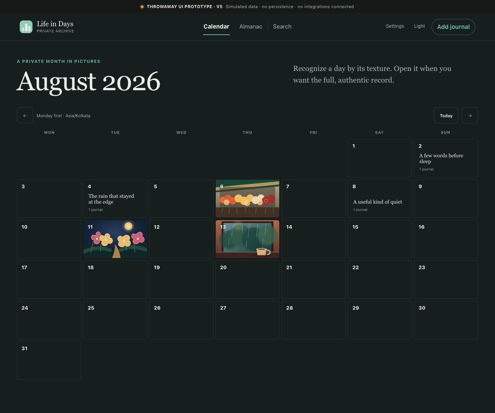

### Step 2 — Selected-day Museum Margin

**Assessment:** Strong. Provenance is revealed outside pixels and the Calendar remains useful. Keep this pattern.

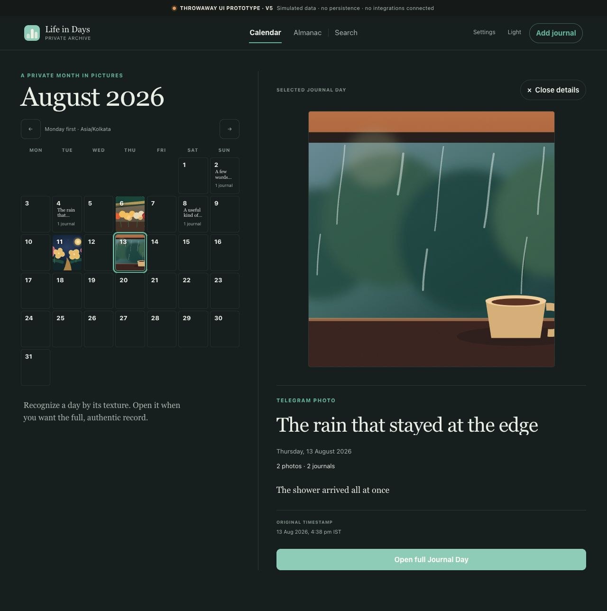

### Step 3 — Full Journal Day

**Assessment:** Partial. This viewport capture confirms the full-day route and top of Daily Photos. The broader reflection/source/action assessment comes from live DOM and code inspection; multiple visible management actions are placeholders.

### Step 4 — Monthly Almanac

**Assessment:** Partial. Immersive monthly reading works, but cross-month Timeline behavior is absent. This tall full-page evidence is best reviewed in the source file at native scale.

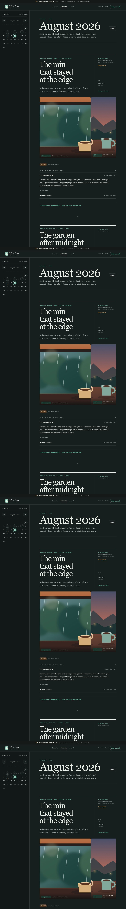

### Step 5 — Search results

**Assessment:** Critical gap. The visual layout is clear, but required search fields/history context are missing. The query-in-URL finding is code evidence rather than something the image itself can prove.

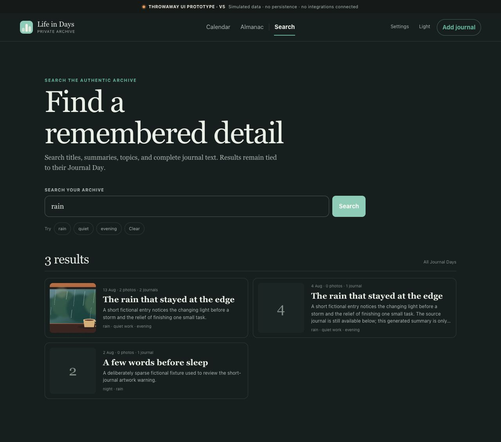

### Step 6 — Settings overview

**Assessment:** Strong information architecture, but related management entries are not real destinations.

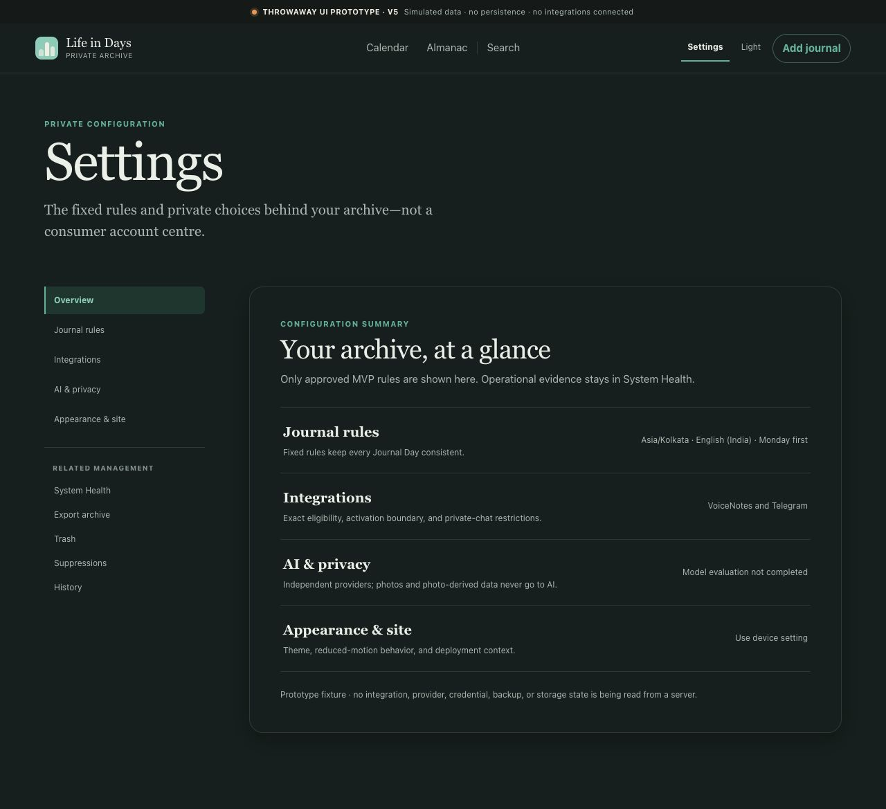

### Step 7 — VoiceNotes and Telegram boundaries

**Assessment:** Good truthful configuration summary. It does not replace the missing capture, error, reconciliation, and Needs Date Review flows.

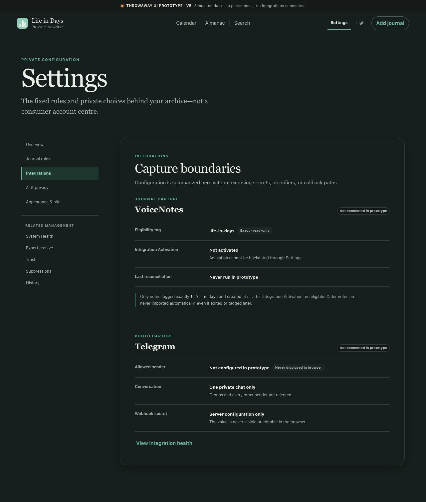

### Step 8 — AI and privacy settings

**Assessment:** Strong disclosure and honest pending-provider state. Missing active usage, provider health, post-evaluation selection confirmation, and failure states.

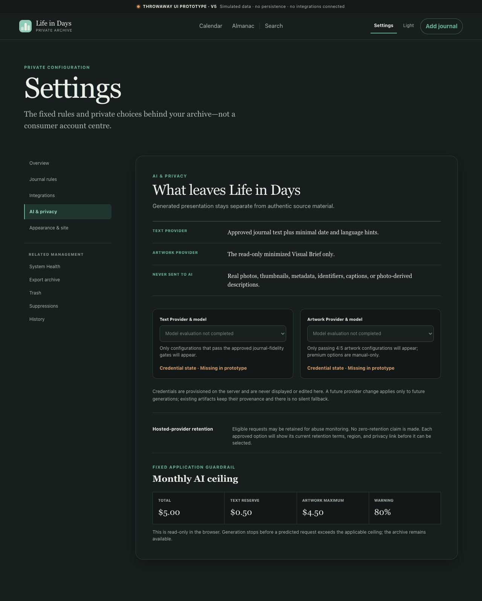

### Step 9 — Manual journal upload

**Assessment:** Partial. This shows the in-day intake, not the global flow. File/date intake and the simulation boundary are clear; durability, checksum, interruption/retry, and deliberate global-date choice remain incomplete.

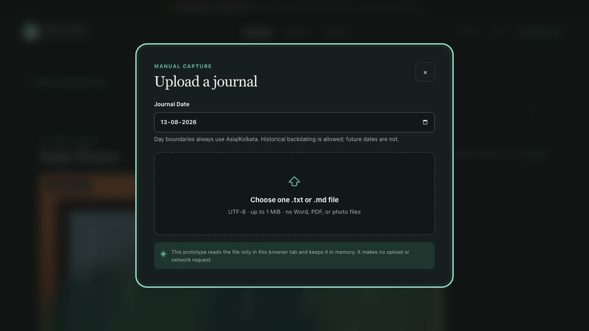

### Step 10 — Manage reflection

**Assessment:** Partial. Editing is less cluttered and Summary replacement review exists, but per-field stale/replacement parity and version history are missing.

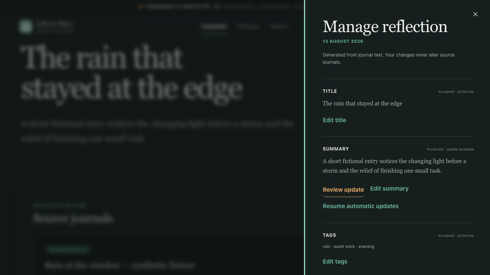

### Step 11 — System Health destination

**Assessment:** Missing. The only result is a toast explaining that the surface is outside v5.

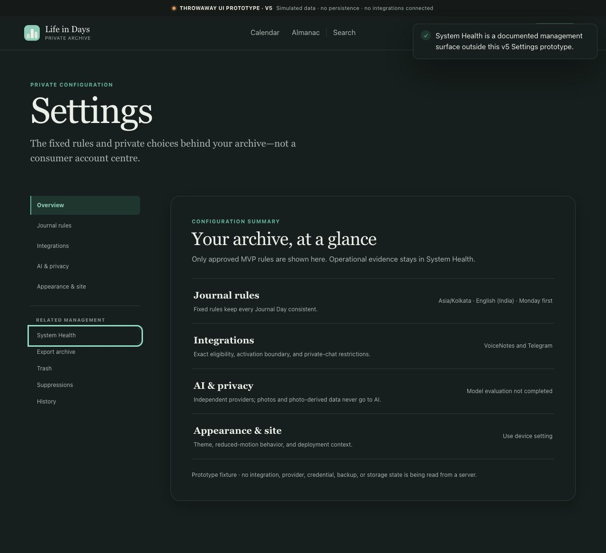

### Step 12 — Source revision conflict

**Assessment:** Visually promising but misleadingly shallow. The diff is a placeholder and all three actions collapse to the same boolean mutation.

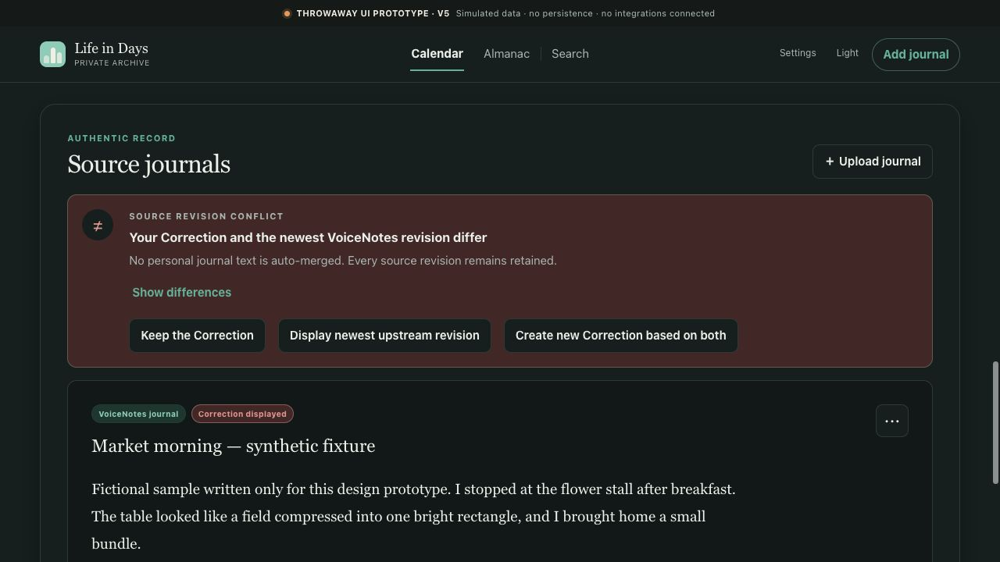

### Step 13 — Artwork generation at 20+ words

**Assessment:** Critical gap. Generation moves directly to Waiting instead of showing the required Visual Brief/provider/cost/budget confirmation.

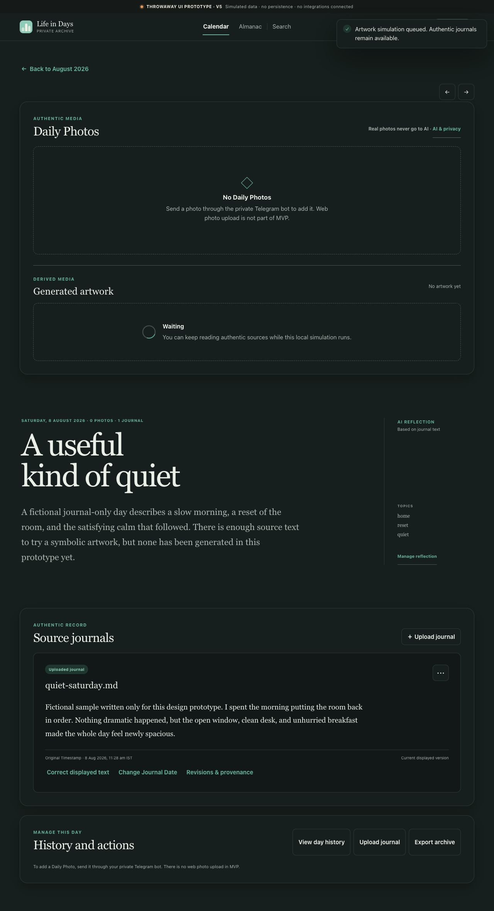

## Recommended v6 completeness sequence

1. **Immediate privacy hotfix and Product Council decisions** — remove search query state from the URL; resolve Timeline versus Almanac and Calendar status-label/spec conflicts before they alter more IA.
2. **First-use/session/connectivity state shell** — empty readiness, loading/partial-load/error, connection interrupted, unsaved changes, authorization expired, and idempotent retry.
3. **Telegram capture plus Needs Date Review as one slice** — compressed/original guidance, dates/albums, validation/rejection, durable acknowledgement, duplicates, item preservation, date preview, and publish.
4. **Full lexical search contract** — captions, explicit dates/tags, match reasons, source identity, Include History, scope explanation, updating, no-result, and error states.
5. **Source/lifecycle management suite** — Correction editor, diff, distinct conflict outcomes, atomic redating, History, Trash, and Suppressions.
6. **System Health and recovery suite** — storage thresholds, backup/check/restore evidence, Recovery Ceremony, provider/integration health, spend, and safe outage states.
7. **Export flow** — content review, encrypted default, one-time passphrase, manifest/checksums, progress, expiry, failure, and retry.
8. **AI trust states** — independent field protection, tag validation, contract-conforming outputs, generation/error provenance, artwork confirmation, refusal, budget block, history, selection, and suppression.
9. **Authentication and encryption disclosure** — denied/session-expired/reauthentication plus accurate not-E2EE boundary.

Responsive and accessibility validation is a cross-cutting acceptance gate on every sequence item, not a final cleanup step.

## Scope that must remain out of v6 MVP

Do not use this audit as permission to add coaching, prompts, streaks, reminders, weekly reports, sharing, public links, multi-user accounts, historical automatic import, fuzzy/additional VoiceNotes tags, a blank browser journal editor, PDF/Word/OCR ingestion, photo web upload, semantic/conversational/image search, year mosaic, media wall, maps, native apps, or offline-first behavior.

## Source evidence

- PRD requirements and required design surfaces: [`../product/PRODUCT-REQUIREMENTS.md`](../product/PRODUCT-REQUIREMENTS.md), especially requirements at lines 116–233, required artifacts around line 252, ideal flows around lines 310–325, and required state contracts around lines 359–366.
- UX screen/state requirements: [`../design/UX-SPECIFICATION.md`](../design/UX-SPECIFICATION.md), especially Calendar/Timeline/Search at lines 213–323, day/source/AI flows at lines 347–593, management at lines 595–818, readiness/access at lines 820–830, responsive/accessibility at lines 985–1053, privacy at lines 1055–1075, typography floor at lines 1102–1112, interruption states at lines 1169–1185, and deferrals at lines 1274–1293.
- V5 route and state inventory: [`../../prototypes/calendar-ui/app-v5.js`](../../prototypes/calendar-ui/app-v5.js), especially route allowlists at lines 211–240, Calendar/Almanac/Search/Settings at lines 398–833, detail and modal flows at lines 836–1200, URL serialization at lines 1239–1255, simulated mutations at lines 1360–1502, and placeholder handlers at lines 1524–1527 and 1682–1692. Essential metadata below the 13 px token floor appears in [`../../prototypes/calendar-ui/styles-v5.css`](../../prototypes/calendar-ui/styles-v5.css) around lines 1780–1845.
- V5 prototype boundary: [`../../prototypes/calendar-ui/README-v5.md`](../../prototypes/calendar-ui/README-v5.md).

## Audit conclusion

V5 successfully establishes the product's visual character and reflection experience. Its next version should not spend effort re-styling the Calendar. The highest return is to prototype the missing trust, correction, recovery, and failure paths with the same visual discipline. Those paths are where the PRD's promise of a **trustworthy memory archive** is either proven or broken.
