# Life in Days — Project Manager Council Review

- **Council seat:** Expert Project Manager
- **Review date:** 2026-08-14
- **Plan owner:** Project Manager
- **Planning timezone:** `Asia/Kolkata`
- **Canonical task source:** [Phase 1 Roadmap Manifest](../project/PHASE1-ROADMAP-MANIFEST.json)
- **Evidence boundary:** This review establishes a delivery-control system. It does not claim that application behavior, integrations, recovery, shared-host fit, deployment, or production use has been implemented or verified.

## 1. Delivery recommendation

Approve P0 and R0–R10 as the planning baseline, with these controls:

1. Keep one canonical set of 58 work packages across the Markdown plan, Excel workbook, repository issues, and live GitHub Project.
2. Treat all Start and Target dates as proposed planning estimates. Evidence gates, not calendar pressure, control release entry and exit.
3. Keep R0 synthetic-only. R1 is the first milestone allowed to process an owner-approved authentic-memory fixture.
4. Require independent rollback and an executed restore for every new persistent data shape before each release-acceptance task closes.
5. Keep R10 date-free until measured capacity watermarks trigger a separately approved transition.
6. Use exactly four status values: `Backlog`, `Next`, `In progress`, and `Done`.
7. Allow a planning task to be Done when its named artifact exists, while explicitly stating that this does not complete its implementation or release.
8. Do not automate issue close, merge, or deployment into `Done`; the named evidence and required approvals must be reconciled first.

## 2. Scope and source control

The [global PRD](../product/PRODUCT-REQUIREMENTS.md) remains the product contract. The [UX Specification](../design/UX-SPECIFICATION.md) remains the interaction contract. Prototype v5 is design evidence only. Release PRDs/PID, the [implementation plan](../architecture/PHASE1-IMPLEMENTATION-PLAN.md), and the [shared-host spike](../research/HETZNER-SHARED-HOST-DEPLOYMENT-SPIKE.md) decompose those sources without silently changing them.

The plan accounts for all 78 stable requirement IDs:

- 71 active requirements map to release, implementation, and regression tasks;
- `LID-UP-004` and the six `LID-DEF-*` requirements are explicitly deferred;
- deferred rows remain in traceability so their absence from delivery cannot be mistaken for accidental omission; and
- R9 adds no feature scope: it is the integrated owner-acceptance and stabilization gate.

## 3. Milestone baseline

| Milestone | Proposed window | Management purpose | Exit decision |
| --- | --- | --- | --- |
| P0 | 2026-08-14 to 2026-08-16 | Council baseline, traceability, workbook, and roadmap | Planning sources reconcile |
| R0 | 2026-08-17 to 2026-08-28 | Synthetic-only shared-host/private foundation | Coexistence, restore, rollback, and non-regression pass |
| R1 | 2026-08-31 to 2026-09-18 | First authentic manual journal archive | Owner fixture survives all recovery gates |
| R2 | 2026-09-21 to 2026-10-09 | Telegram photo capture and media lifecycle | Media privacy, durability, and restore pass |
| R3 | 2026-10-12 to 2026-10-30 | Retrieval and date integrity | Query privacy and atomic redating pass |
| R4 | 2026-11-02 to 2026-11-20 | Source history and lifecycle safety | Conflict, Trash, suppression, export/import pass |
| R5 | 2026-11-23 to 2026-12-11 | Prospective VoiceNotes sync | Synthetic contract and replay/recovery pass |
| R6 | 2026-12-14 to 2027-01-08 | Generated text reflection | Evaluation, privacy, fidelity, cost, and restore pass |
| R7 | 2027-01-11 to 2027-01-29 | Generated artwork | Evaluation, safety, cover, lifecycle, cost, and restore pass |
| R8 | 2027-02-01 to 2027-02-19 | Integrated scale and resilience | Fault, capacity, security, accessibility, and recovery pass |
| R9 | 2027-02-22 to 2027-03-12 | Owner acceptance and stabilization | Explicit go/no-go after Recovery Ceremony and observation |
| R10 | No date — trigger only | Conditional object-store transition | Trigger, reversible cutover, restore, observation, rollback pass |

The [detailed release plan](../project/PHASE1-RELEASE-PLAN.md) is authoritative for individual dates and dependencies.

## 4. Work-package structure

The 58 items are intentionally release-sized work packages rather than an undifferentiated feature list.

| Work type | Management expectation |
| --- | --- |
| Audit / planning | Establish a source-grounded decision or traceable plan; never counts as implementation evidence |
| Product definition | State the release outcome, exact requirement IDs, exclusions, entry/exit criteria, owner scenario, and no-go conditions |
| Design | Cover complete flows and states, responsive/accessibility behavior, privacy cues, and implementation handoff |
| Architecture / spike | Retire a named uncertainty and define trust, data, deployment, capacity, recovery, migration, and rollback contracts |
| Implementation | Produce merged behavior plus tests, migration evidence, deployment record, and no-regression proof |
| Evaluation | Use approved synthetic/blind fixtures and publish exact model/configuration and hard-gate results |
| Quality | Execute the declared functional, fault, privacy/security, browser, accessibility, and recovery matrix |
| Release acceptance | Reconcile owner evidence, restores, rollback, defects, observation, and explicit go/no-go |

Every GitHub item must contain ID, milestone, dates, description, exact `LID-*` IDs, dependencies, PRD/PID, design artifact, architecture reference, acceptance evidence, and rollback/restore impact.

## 5. Status policy

| Status | Entry rule | Exit rule |
| --- | --- | --- |
| Backlog | Scoped with an owner and milestone, but not selected for immediate execution | Entry dependency and evidence plan are ready, then Project Manager selects it as Next |
| Next | Dependencies are understood and the item is expected after the current active gate | Named owner starts real work with linked evidence, then moves it In progress |
| In progress | Work is active and the latest update identifies evidence, risk, and next gate | All task-specific evidence exists, or a blocker moves it back to Backlog with rationale |
| Done | Named evidence exists and required reviewers accept the task's scope | Reopened if evidence is invalidated; downstream completion is never inferred |

At publication, the canonical manifest intentionally separates completed planning artifacts from delivery:

- `Done`: the v5 audit, integrated council package, ten release PRDs, and the R10 PID;
- `In progress`: the R0 shared-host coexistence/rollback spike, because the research/runbook exists but sanitized live-host evidence does not;
- `Next`: R0 UX, architecture, synthetic-shell implementation, and release acceptance; and
- `Backlog`: later design, architecture, implementation, evaluation, QA, and release work.

No product release or implementation task is represented as Done by the planning package.

## 6. Critical path and dependency rules

```mermaid
flowchart LR
  P0["P0: Council baseline"] --> R0["R0: Synthetic private foundation"]
  R0 --> R1["R1: Manual archive"]
  R1 --> R2["R2: Telegram photos"]
  R2 --> R3["R3: Retrieval and dates"]
  R3 --> R4["R4: Lifecycle safety"]
  R4 --> S5["R5: VoiceNotes spike"]
  S5 --> R5["R5: Prospective sync"]
  R5 --> E6["R6: Text evaluation"]
  E6 --> R6["R6: Generated text"]
  R6 --> E7["R7: Artwork evaluation"]
  E7 --> R7["R7: Generated artwork"]
  R7 --> R8["R8: Resilience"]
  R8 --> R9["R9: Launch acceptance"]
  R9 -. "measured trigger only" .-> R10["R10: Object-store transition"]
```

Rules:

1. A future PRD may be drafted early, but delivery cannot bypass the preceding release-acceptance gate.
2. Task links permit progressive handoff: definition, design, architecture, and implementation preparation may overlap, but the dependent task cannot close or cross its evidence gate before the prerequisite is satisfied.
3. The R5 engineering item cannot start from assumptions; the synthetic VoiceNotes spike must pass.
4. R6 and R7 implementation cannot start until their evaluation item identifies an exact passing configuration.
5. R8 validates the integrated product and cannot be used to postpone feature-specific restore evidence from earlier releases.
6. R9 adds defects, retests, recovery, and observation only; new feature scope returns to Backlog.
7. R10 has neither Start nor Target date until entry evidence is approved.

## 7. Definition of Ready

An implementation, evaluation, QA, or acceptance item is Ready only when:

- the exact requirement IDs and release PRD/PID are linked;
- the independently meaningful user outcome and non-goals are explicit;
- all normal, empty, loading, failure, interruption, destructive, compact, and accessibility states are designed where applicable;
- input/output contracts, data classification, source/derived boundary, and trust boundary are explicit;
- dependencies and unresolved assumptions have an owner and stop condition;
- migrations, backup/restore, rollback, monitoring, and capacity impact are stated;
- test fixtures avoid personal content and secrets;
- acceptance evidence and reviewers are named; and
- the release entry gate is satisfied.

## 8. Definition of Done

A delivery item is Done only when the named behavior works in the named environment and:

1. risk-appropriate automated and manual tests pass;
2. privacy/security and accessibility checks pass where applicable;
3. migrations and rollback are exercised, not merely described;
4. every new persistent shape is included in an executed restore;
5. System Health, runbook, traceability, and issue evidence are updated;
6. personal content, prompts, credentials, tokens, and private infrastructure identifiers are absent from public evidence;
7. no unresolved critical/high release-blocking finding remains; and
8. required Product, Design, Architecture, QA/Security, Project, and owner approvals are recorded.

`Documented`, `coded`, `CI passed`, `deployed`, and `backup uploaded` are narrower evidence states and do not individually satisfy delivery Done.

## 9. Review cadence

| Cadence | Participants | Agenda | Required output |
| --- | --- | --- | --- |
| Twice weekly during R0–R2 | Project, Product, Design, Architecture, active implementer | Entry gates, active evidence, blockers, privacy/recovery risks, date forecast | Updated Project fields and issue note |
| Weekly after R2 | Product Council | Release progress, critical path, RAID, capacity, spend, defect trend | Status/forecast and decision record |
| Before each implementation start | Product, Design, Architecture, implementer | Definition of Ready | Ready decision or explicit gaps |
| Before each release | Full council plus owner | Acceptance, restores, rollback, defects, observation plan | Go/no-go/rollback record |
| Monthly | Project Manager and owner | Workbook/roadmap reconciliation, schedule assumptions, conditional triggers | Baseline update if approved |

## 10. RAID register

| ID | Type | Risk / assumption / dependency | Owner | Trigger or due point | Response |
| --- | --- | --- | --- | --- | --- |
| RAID-001 | Risk | Shared-host contention or namespace/routing collision harms an existing service | Technical Architect | R0 entry/exit | Synthetic-only live preflight, limits, non-regression, and rollback; block R1 on failure |
| RAID-002 | Assumption | SQLCipher/SQLite works in the target image with FTS5, WAL concurrency, backup, migration, and crash recovery | Technical Architect | R0 | Execute target-runtime proof; use PostgreSQL only if documented gates fail |
| RAID-003 | Dependency | Human and callback routing require approved Cloudflare configuration | Technical Architect / owner authority | R0 deploy | Prepare sanitized plan; do not mutate provider state without the scoped execution step |
| RAID-004 | Risk | Recovery is inferred from successful backup uploads | Project Manager | Every release | Require executed sampled restore for new shapes and full ceremony at R9 |
| RAID-005 | Dependency | VoiceNotes identity/auth/reconciliation behavior is partly unknown | Product Manager / Technical Architect | R5 entry | Synthetic contract spike; reopen product/architecture decision on material failure |
| RAID-006 | Risk | Real photos or derived photo data reach AI | Architecture / QA | R2, R6, R7 | Typed allowlists, no-photo contract tests, sanitized evidence, release block on any leakage |
| RAID-007 | Risk | Proposed dates become promises and gates are weakened | Project Manager | Weekly | Move dates before weakening privacy, recovery, accessibility, or evidence gates |
| RAID-008 | Risk | Small-host image work exhausts memory/disk | Technical Architect | R2 and R8 | Bounded staging/decoder, one heavy job, watermarks, backpressure, fault tests |
| RAID-009 | Risk | AI output is mistaken for authentic source | Product / Design / QA | R6 and R7 | Source/derived separation, persistent labels, provenance, protection, owner acceptance |
| RAID-010 | Risk | Object-store migration is scheduled without need or recovery proof | Project Manager | R10 | Keep dates blank; require measured trigger, inventory, dual-write, restore, observation, rollback |

## 11. Schedule and estimate control

The workbook and GitHub dates are schedule fields, not actual-start/actual-finish claims. A date change is controlled when:

- the issue records the changed assumption or gate;
- the Project Start/Target dates and workbook source manifest update together;
- dependent tasks are re-forecast;
- R10 remains blank unless its trigger is approved; and
- the council decision record captures any change to release sequence, privacy boundary, persistent data model, provider contract, or acceptance standard.

No buffer is hidden inside Done. Stabilization is explicit in R9, and defect work remains visible.

## 12. GitHub operating model

1. Repository issues are the durable task records and belong to exactly one P0/R0–R10 milestone.
2. The live Project is the visualization/control layer, not a substitute for requirements or evidence documents.
3. Issue titles begin with the stable task ID; descriptions contain repository links rather than local filesystem paths.
4. Project Start date, Target date, and Status mirror the manifest. PRD/PID, Design artifact, Requirements, Evidence, Owner role, and Priority are visible fields when supported.
5. Views include a Status board/table and an actual date-driven Roadmap. R10 appears in Backlog/table but has no timeline bar.
6. Closing a planning issue is allowed only for that planning artifact. Closing an implementation issue requires its Definition of Done.
7. Weekly reconciliation checks 58 manifest IDs, issue count, Project item count, status, milestone, dates, and links.

## 13. Immediate execution sequence

1. Complete P0 artifacts and publish the reviewed planning baseline.
2. Keep `SPK-R0-001` In progress until sanitized live-host measurements and coexistence evidence exist.
3. Finalize R0 UX/architecture artifacts and move only truly ready items into active work.
4. Build the synthetic private shell without admitting personal content.
5. Execute R0 access, non-regression, encrypted restore, restart, and rollback acceptance.
6. Re-plan R1 dates if any R0 gate fails; do not admit an authentic owner fixture early.

## 14. Project Manager conclusion

The plan is executable as a gated roadmap and preserves the private-product constraints. The main delivery risk is not missing feature scope; it is converting planning or backup evidence into a stronger readiness claim than the evidence supports. The four-lane status policy, exact task IDs, per-release restore/rollback items, synthetic R0, spike-gated integrations, and date-free R10 address that risk.

Approve this as the Project Management baseline subject to Product Council reconciliation in the [Council Decision Record](PHASE1-COUNCIL-DECISION-RECORD.md). Owner approval of each release remains future evidence.
