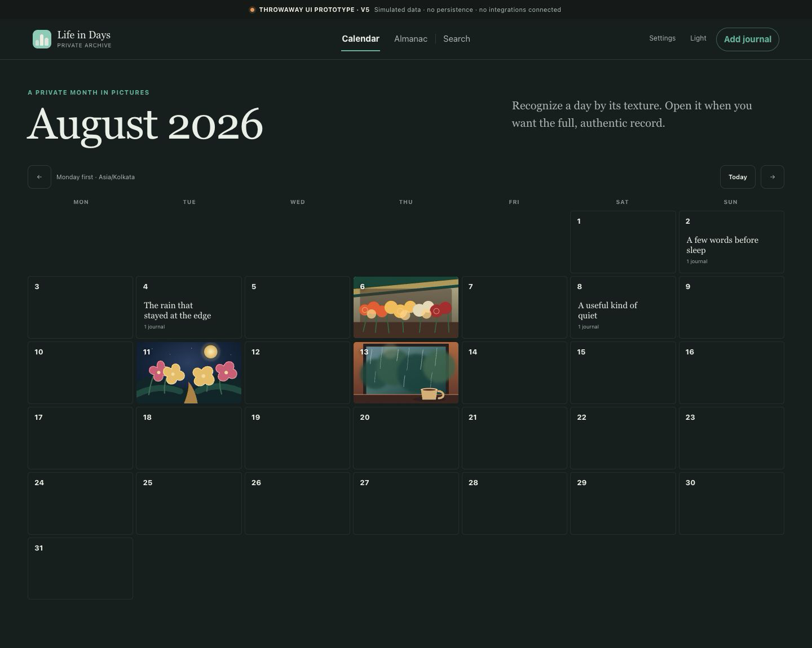
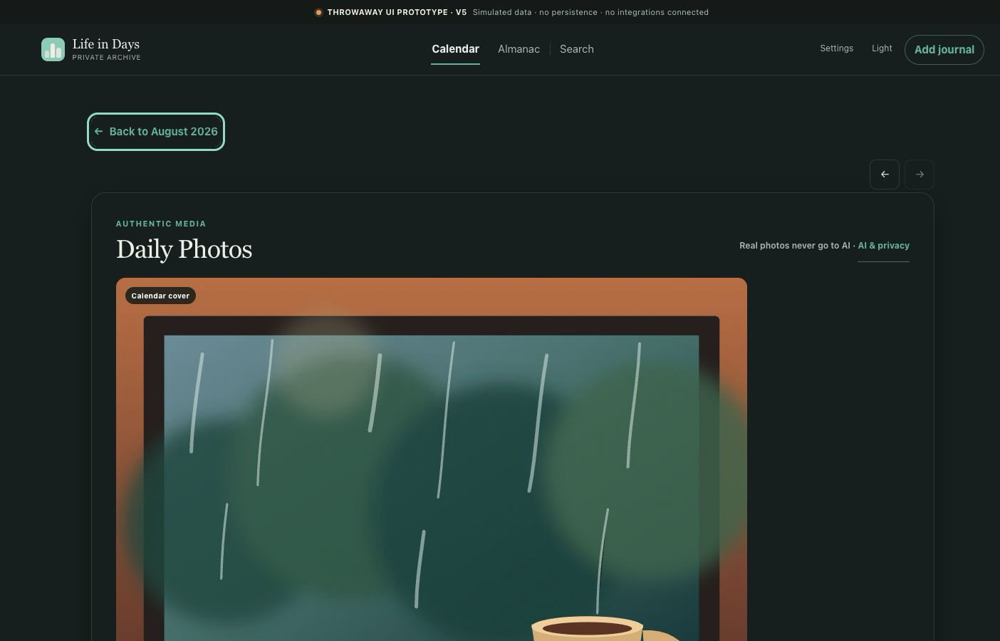
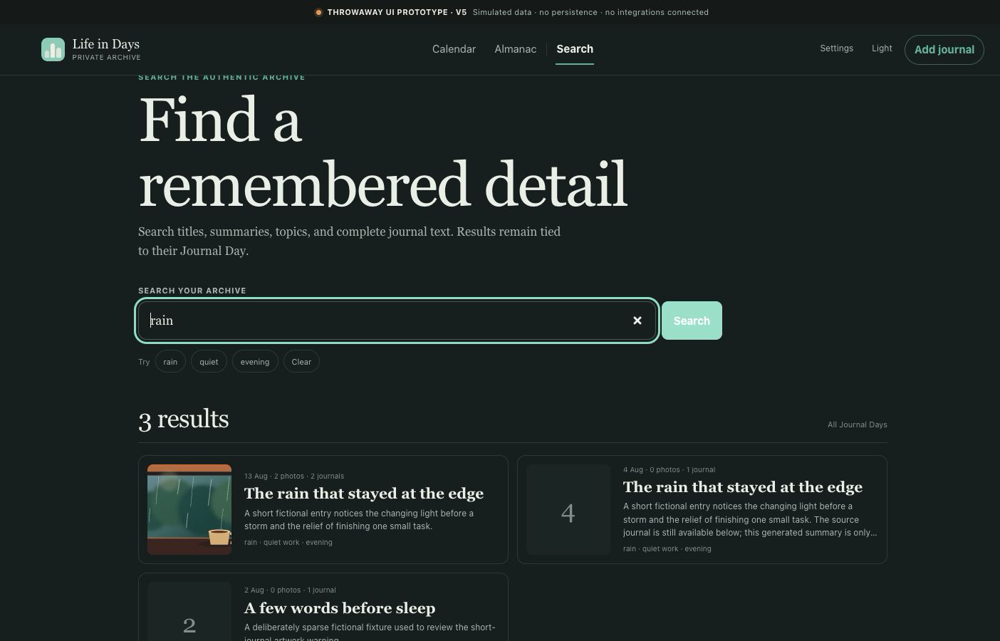
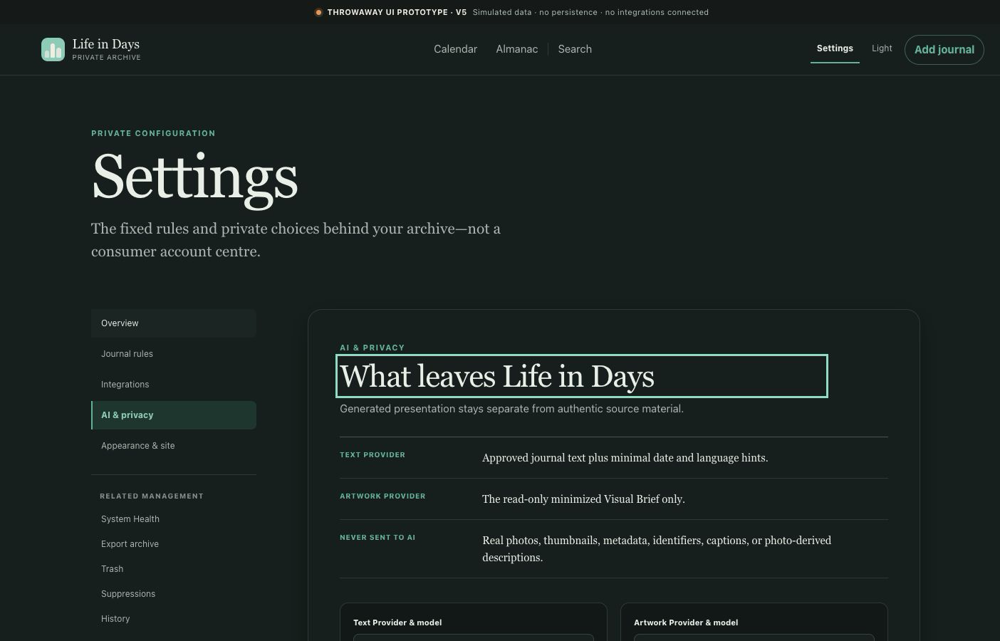
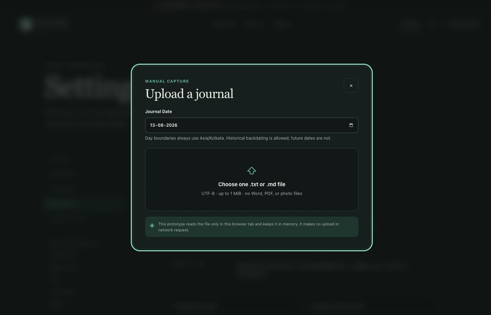
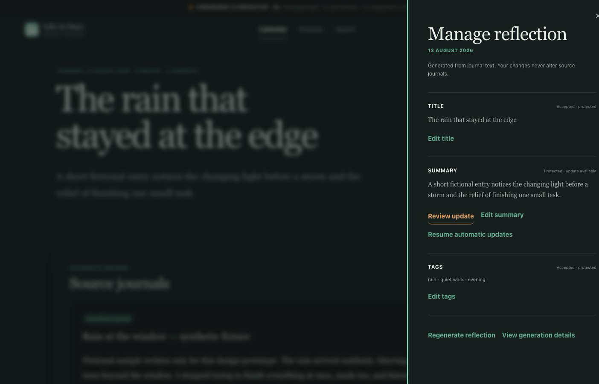
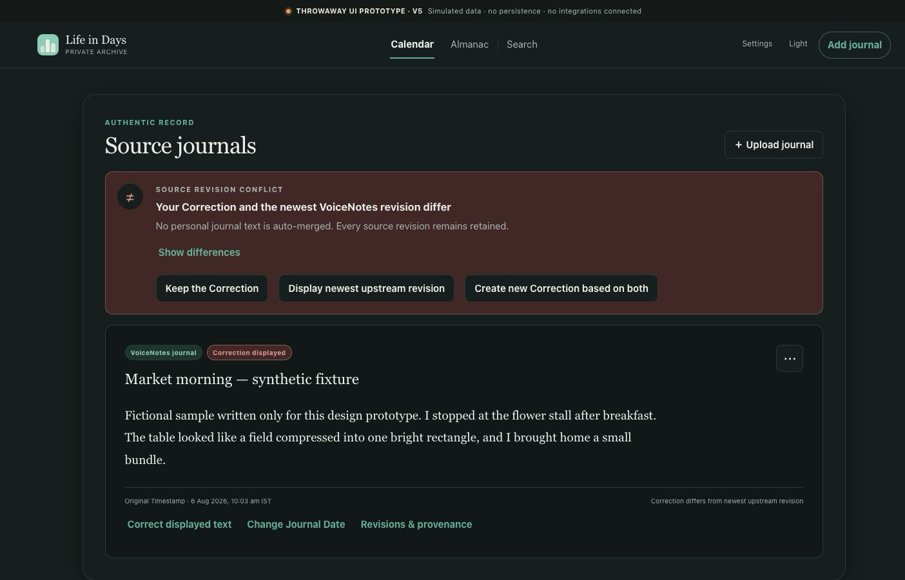
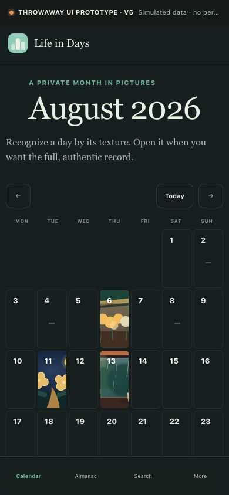
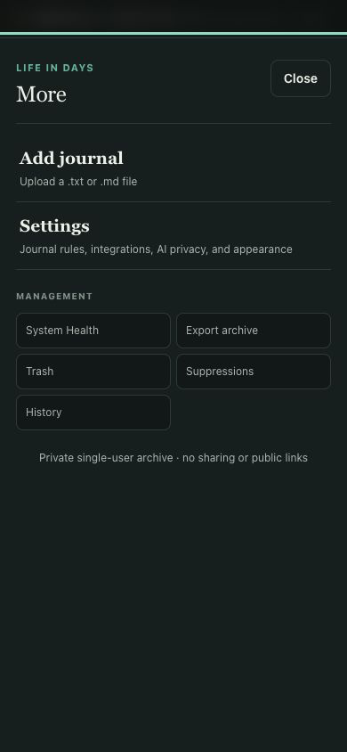

# Life in Days — Product Council UX Design Review

**Review date:** 14 August 2026 
**Council role:** UI/UX Design 
**Artifact status:** Design-planning evidence 
**Product status represented:** No implementation, integration, deployment, recovery, or launch claim

## Executive verdict

The v5 calendar prototype is a credible interaction-direction artifact for the reflective core: Calendar, Journal Day, manual upload, generated-field management, a source-conflict callout, basic lexical search, settings, themes, and compact reflow. It is not a product implementation. Its records are simulated in memory; durable saves, access control, integrations, jobs, backup, restore, export, operational state, and recovery are not evidenced.

The release plan should therefore preserve v5's calm archival language and source-versus-derived hierarchy, while completing each missing state immediately before the release that needs it. No implementation task may be marked Done because a corresponding v5 screen exists. A planning, definition, design, or audit task may be Done when its named artifact evidence exists, but that status never implies implementation, deployment, recovery, release, or launch completion.

The strongest sequencing recommendation is:

1. prove the private, recoverable synthetic shell in R0;
2. deliver durable manual journal value in R1;
3. add authentic photo capture in R2;
4. make retrieval and dates trustworthy in R3;
5. complete history and lifecycle safety in R4;
6. add prospective VoiceNotes only after its synthetic gate in R5;
7. add optional generated text and artwork in R6 and R7;
8. harden measured operations in R8;
9. complete private-launch acceptance in R9;
10. leave R10 undated until measured storage evidence triggers it.

## Audit sources and evidence boundary

| Source | Reviewed role | SHA-256 |
| --- | --- | --- |
| [Global PRD](../product/PRODUCT-REQUIREMENTS.md) | Product scope, 78 stable LID requirements, acceptance rules, non-goals, risks | Reviewed source snapshot: 513a5bc62cdccc0112d8876f6b75915782ce9a4c118f9a8207b1ef588f8edf5c. Linked public-safe Phase1 mirror at review time: 9f8ad449a8e3c8f5387a8deb32b1b51b5d8bd0252fd1e1647137e9b981d0aa35. |
| [UX specification](../design/UX-SPECIFICATION.md) | Normative interaction, state, content, responsive, accessibility, and privacy contract | 1076228160f253cf8d291c8c5884dfecb7bf8883e82b208f181776cf94c68b8e |
| [v5 prototype shell](../../prototypes/calendar-ui/index-v5.html) | DOM entry point and explicit throwaway-prototype disclosure | ced79f43c0e3b8916f029898a6469a8290aa90e9e45c28be7b612c177d4ca17d |
| [v5 prototype behavior](../../prototypes/calendar-ui/app-v5.js) | Clickable flows, mock state, navigation, keyboard behavior, and simulated outcomes | 3e99414a1c3f6cd71047dee6964a26fb502250e1b0061f153f935c397714383d |
| [v5 prototype presentation](../../prototypes/calendar-ui/styles-v5.css) | Visual hierarchy, themes, focus, responsive behavior, and reduced-motion rules | 64858881f2189d0e919da66e8d17687e17e06dcb8c2e5a4325f65420195b6cd1 |

Method: the sources above were read directly; the v5 prototype was exercised at wide and compact viewports using only synthetic fixture data. Screenshots below are evidence of prototype intent, not of implemented, tested, or deployed behavior. The complementary [v5 feature audit](../audits/PROTOTYPE-V5-FEATURE-AUDIT.md), [requirements traceability](../project/REQUIREMENTS-TRACEABILITY.md), and [implementation plan](../architecture/IMPLEMENTATION-PLAN.md) remain planning inputs.

## v5 visual evidence walk

### Reflective core

The Calendar and Journal Day establish the strongest reusable direction: image-first discovery, quiet empty dates, visibly separate authentic and generated regions, a real-photo cover, provenance language, and non-blocking management actions. This supports **LID-REF-001**, **LID-REF-004**, **LID-SCP-002**, **LID-SCP-003**, **LID-TG-007**, and **LID-AIA-008**, subject to durable and accessible implementation.

### Retrieval and privacy explanation

The prototype demonstrates a useful search-results hierarchy and clear no-photo-to-AI language. It does not yet satisfy **LID-REF-003** because Photo Captions, exact date and tag controls, Include history, field/source snippets, and query privacy are incomplete. Its current query-string behavior conflicts with **UX-NAV-03**, **UX-SEARCH-05**, and **UX-PRIV-04**.

### Capture, management, and conflict intent

These screens are credible flow intent for **LID-UP-001**, **LID-AIT-005**, and **LID-SRC-002**. They do not evidence durable upload, duplicate handling, complete accessible differences, Correction editing, audit events, or persistence of the three conflict outcomes.

### Responsive intent

The compact design preserves the seven-column Calendar and moves secondary actions into a More surface. It is a useful basis for **LID-REF-006**, **UX-RESP-01**, and **UX-RESP-02**, but requires measured target size, 200% text zoom, 400% page zoom, orientation, safe-area, and supported-browser evidence.

Additional evidence: [selected day](ux-review/02-selected-day.png), [Almanac](ux-review/04-almanac.png), and [all review captures](ux-review/).

## v5 flow and state inventory

| Surface or flow | What v5 demonstrates | Evidence class | Missing before product acceptance | Requirement trace |
| --- | --- | --- | --- | --- |
| Calendar landing | Monday-first image-led month, quiet empty cells, Today, month movement, theme control | Strong visual and interaction intent | Server-backed current month, loading/empty/error/degraded states, exact URL/privacy behavior, durable cover updates | **LID-REF-001**, **LID-SCP-002**, **UX-CAL-01–11** |
| Selected-day margin | Selected date, concise metadata, route into day detail | Strong visual intent | Exact browser Back restoration, reload/deep-link behavior, empty-day upload behavior | **UX-NAV-01–03**, **UX-CAL-08–09** |
| Journal Day | Real-photo gallery, generated artwork region, generated reflection, authentic source journals, provenance and actions | Strong hierarchy intent | Photo Captions, complete provenance/history, durable actions, all pending/failure/stale/Trash states | **LID-REF-004**, **LID-SCP-003**, **UX-DAY-01–22** |
| Almanac | Monthly book-like browsing alternate | v5-only concept | It does not satisfy required Timeline behavior; decide whether to retain after Timeline is complete | **LID-REF-002**, **UX-TIME-01–06** |
| Search | Basic lexical query over some visible fixture fields and grouped results | Partial behavior intent | Photo Captions, exact date/tag filters, Include history, highlighted field/source snippets, no query in URL/logs/title | **LID-REF-003**, **UX-SEARCH-01–09** |
| Settings | Journal/integration, AI/privacy, and appearance categories | Partial content and IA intent | Readiness, credential health, evaluated-only options, budget states, integration activation/reconciliation, factual health | **LID-AIT-002**, **LID-OPS-014**, **UX-SET-01–11** |
| Manual upload | Choose/review/date/duplicate-looking step and simulated success | Strong happy-path intent | Real validation, duplicate decision, interruption, unsaved close, durable commit, reload, error and rollback | **LID-UP-001–003**, **UX-UPLOAD-01–06** |
| Generated-field management | Edit/review/accept/protect/resume actions | Strong intent for core choices | Per-field versions, accessible diff, stale source hash, provider failure, durable save, audit history | **LID-AIT-003–007**, **UX-REVIEW-01–05** |
| Source conflict | Persistent attention state and the required three choices | Partial intent | Complete accessible diff, new-Correction workspace, unsaved warning, deterministic persisted outcomes and events | **LID-SRC-001–002**, **UX-CONFLICT-01–05** |
| Artwork | Manual action, sparse-source explanation, generated region, visible separation from photos | Partial intent | Provider/budget preflight, Visual Brief history, safety/refusal/error, versions, suppression, stale and sweep states | **LID-AIA-002–011**, **UX-ART-01–17** |
| Compact reflow | Seven-column Calendar, condensed navigation, modal presentation | Useful responsive intent | Full core-flow audit at 320 px, zoom, landscape, safe area, touch size, screen reader, all supported browsers | **LID-REF-006**, **UX-RESP-01–07**, **UX-A11Y-01–17** |
| Keyboard and motion | Skip link, visible focus styling, calendar key handlers, modal focus trap, reduced-motion CSS | Code-level design intent only | Manual and automated accessibility evidence across every state; no claim of WCAG conformance yet | **LID-REF-005–006**, **UX-A11Y-01–17** |
| Persistence and integrations | Prominent disclosure that data is simulated and not persistent | Explicitly absent | All database, media, access, integration, job, backup, restore, export, observability, and deployment behavior | **LID-OPS-001–018** |

## UX contract that must survive implementation

1. **The archive is private and single-user.** No Share, Publish, Invite, public link, anonymous route, social reaction, profile complexity, coach persona, streak, or reminder may appear. **LID-SCP-001**, **LID-DEF-002**, **UX-PRIN-04**, **UX-PRIN-06**, **UX-NAV-04**.
2. **Authentic source truth and generated presentation stay separate.** Source type, Original Timestamp, Journal Date, displayed version, revision state, and generated provenance remain distinguishable. **LID-SCP-002–003**, **UX-PRIN-01**, **UX-GEN-01–03**.
3. **A real photo always wins the Calendar Cover.** Generated Artwork is cover-eligible only when no live Daily Photo exists and remains visibly labeled as AI artwork everywhere. **LID-TG-007**, **LID-AIA-005**, **LID-AIA-008**, **UX-PRIN-02**, **UX-CAL-04–05**.
4. **Dates are trustworthy.** Journal Dates use fixed Asia/Kolkata day boundaries and en-IN presentation; Original Timestamps remain immutable; future dates never silently enter the Calendar. **LID-SCP-002**, **UX-GEN-11–14**.
5. **Visible success means durable success.** Upload, capture, redating, deletion, restore, export, and generated-artifact success appear only after the complete server operation is confirmed. **LID-TG-004**, **UX-GEN-04**, **UX-GEN-07**.
6. **Asynchronous state is named and scoped.** Use Waiting, In progress, Complete, Needs attention, Blocked, or Unavailable; keep authentic reading and unrelated navigation available when an optional process fails. **LID-OPS-018**, **UX-GEN-05–06**, **UX-STATE-01–08**.
7. **History is never rewritten for convenience.** Corrections, Source Revisions, redating, generated versions, Trash, and suppressions remain auditable and reversible where the product contract permits. **LID-SRC-001–004**, **LID-OPS-009–010**, **UX-HIST-01–07**.
8. **Personal text is never auto-merged.** A competing Correction and upstream revision exposes a complete comparison and exactly three substantive outcomes: keep the Correction, display newest upstream revision, or create a new Correction based on both. **LID-SRC-002**, **UX-CONFLICT-01–05**.
9. **Search is deterministic and private.** It is lexical/date/tag retrieval, not conversational or semantic; queries and personal snippets stay out of URLs, titles, telemetry, referrers, and logs. **LID-REF-003**, **LID-DEF-003**, **UX-SEARCH-01–09**, **UX-NAV-03**.
10. **AI is optional, explicit, and failure-isolated.** Source reading, correction, capture, search, export, backup, and recovery remain useful when providers are absent, blocked, or failed. There is no silent provider fallback. **LID-AIT-002**, **LID-AIT-007**, **LID-AIA-006**, **LID-OPS-017–018**.
11. **Real photos and photo-derived data never go to AI.** Text generation receives only the approved journal-text contract; artwork receives only the minimized read-only Visual Brief. **LID-TG-009–010**, **LID-AIT-006**, **LID-AIA-002**, **UX-PRIN-10**.
12. **Operational truth is evidence-based.** Captured, processed, generated, backed up, restore verified, healthy, and recoverable are distinct facts. No green or reassuring claim may be inferred from a job start or backup upload. **LID-OPS-011–014**, **UX-PRIN-03**, **UX-HEALTH-02–03**.
13. **Blank browser composition remains out of MVP.** An empty Calendar cell may only launch the approved file-upload path; it never creates an empty journal editor. **LID-UP-004**, **UX-CAL-09**.
14. **Navigation preserves context without leaking content.** Browser Back restores month, filters, history state, loaded boundary, and scroll where practical, while page titles and routes remain generic. **UX-NAV-01–03**.

## Accessibility and privacy requirements

### Accessibility release gate

- Meet WCAG 2.2 AA in supported current desktop and mobile browsers; conformance is demonstrated, not inferred from CSS. **LID-REF-005–006**, **UX-A11Y-01–17**.
- Use semantic landmarks, one clear h1, logical headings, a skip link, accessible Calendar grid semantics, and programmatic authentic/generated region labels. **UX-A11Y-01–04**.
- Make every action keyboard operable. Pointer drag must have button or menu alternatives. Preserve logical focus through modal, save, pagination, queue resolution, and rerender states. **UX-A11Y-05–08**.
- Meet at least 24-by-24 CSS-pixel targets, preferring 44-by-44 for primary compact controls; verify focus and UI boundaries at 3:1, normal text at 4.5:1, and large text at 3:1. **UX-A11Y-09–10**.
- Never use color alone for selected, error, conflict, stale, Trash, or AI state. **UX-A11Y-11**.
- Keep all core tasks usable at 200% text zoom and 400% page zoom, at 320 CSS pixels, in portrait and landscape, in both themes, and with reduced motion. **UX-RESP-01–07**, **UX-A11Y-12–14**.
- A complete text comparison must remain understandable in document order to a screen-reader user, with additions and removals labeled. **UX-A11Y-16**.
- Owner-authored private photo descriptions, when present, remain local/exported metadata and are never generated or sent to AI. **LID-REF-006**.

### Privacy release gate

- Personal HTML, APIs, media, downloads, search, and export are private and no-store; no design may rely on a browser or offline cache. **LID-OPS-008**, **UX-PRIV-03**.
- Journal text, captions, filenames, photos, provider responses, prompts, credentials, private identifiers, and signed locations stay out of page titles, URLs, notifications, analytics, crash reports, and general logs. **LID-OPS-003**, **LID-OPS-016**, **UX-PRIV-04**.
- There is no remember-journal-text feature. Unsaved Correction text may exist only in open-page memory with a close/reload warning. **UX-PRIV-05**.
- Original and export downloads require explicit action and consequence copy because content leaves the protected surface. **UX-PRIV-06**.
- Access denied, expired session, callback rejection, and provider failure use generic copy that does not reveal account, allowlist, secret, route, or content details. **LID-SCP-001**, **LID-TG-001**, **LID-OPS-001–003**, **UX-PRIV-07–08**.
- Settings state exactly what crosses each selected AI boundary without claiming end-to-end encryption, zero knowledge, universal zero retention, a specific processing country, high availability, or unmeasured recovery. **LID-AIT-006**, **LID-AIA-002**, **UX-PRIN-09–10**, **UX-PRIV-01–02**.

## Milestone-specific UX slices

The following grouping uses the canonical Product Council schedule. Each slice ends in independently verifiable user value. Dates are planning ranges; evidence gates, not the calendar, control completion.

### P0 — Council Planning Baseline

**Dates:** 14–16 August 2026. 
**User value:** The council can distinguish requirements, design intent, missing design, and implementation evidence before work reaches the roadmap. 
**Evidence:** This review, the v5 audit, source hashes, the 58-task link map, and cross-document traceability. 
**v5 position:** Audited design evidence only. No implementation claim. 
**Requirement scope:** N/A for behavior change; this slice governs traceability for all stable LID requirements.

### R0 — Shared-Host Private Foundation

**Dates:** 17–28 August 2026. 
**Independently verifiable value:** Using synthetic content only, the owner can reach a private shell, understand access/readiness/health states, observe a measured backup and separate restore result, and see a demonstrated rollback without affecting a co-resident workload. 
**Acceptance focus:** access denied and expiry; private no-store shell; calm first-use state; separate integration, backup, and recovery readiness; truthful degraded/offline copy; keyboard and compact access; no real memories admitted. 
**Requirements:** **LID-SCP-001**, **LID-REF-005**, **LID-REF-006**, **LID-OPS-001**, **LID-OPS-002**, **LID-OPS-003**, **LID-OPS-004**, **LID-OPS-005**, **LID-OPS-008**, **LID-OPS-011**, **LID-OPS-014**, **LID-OPS-016**, **LID-OPS-018**. 
**Design evidence:** v5 supplies visual language and a generic private-archive cue. Access, first use, System Health, recovery, degraded, failure, and rollback states require new design. See [UX first-use](../design/UX-SPECIFICATION.md#22-first-use-and-integration-readiness-experience), [System Health](../design/UX-SPECIFICATION.md#20-system-health), and [privacy](../design/UX-SPECIFICATION.md#27-privacy-cues-and-browser-behavior).

### R1 — Manual Journal Archive

**Dates:** 31 August–18 September 2026. 
**Independently verifiable value:** The owner can add a supported journal file to an explicit date, receive success only after durable storage, revisit it through Calendar and Journal Day after reload, and restore the original file and source record from backup. 
**Acceptance focus:** global and day-specific upload; file/date/encoding/size validation; duplicate Add Anyway; fixed-timezone date semantics; authentic source labeling; quiet empty archive; Calendar and Journal Day keyboard/compact behavior; load/error/interruption; back and reload continuity. 
**Requirements:** **LID-SCP-002**, **LID-SCP-003**, **LID-SCP-004**, **LID-UP-001**, **LID-UP-002**, **LID-UP-003**, **LID-REF-001**, **LID-REF-004**, **LID-REF-005**, **LID-REF-006**, **LID-OPS-004**, **LID-OPS-008**, **LID-OPS-011**, **LID-OPS-018**. 
**Design evidence:** v5 strongly supports Calendar, Journal Day, upload review, and compact direction. Durable, duplicate, reload, failure, empty, first-memory, and restore states require new design. See [Calendar evidence](ux-review/01-calendar-landing.png), [Journal Day evidence](ux-review/03-full-journal-day.png), [upload evidence](ux-review/07-upload-journal.png), [Calendar contract](../design/UX-SPECIFICATION.md#6-calendar-experience), and [upload contract](../design/UX-SPECIFICATION.md#10-manual-journal-upload).

### R2 — Telegram Photo Capture

**Dates:** 21 September–9 October 2026. 
**Independently verifiable value:** The configured owner can send a supported photo, receive acknowledgement only after durable encrypted capture, revisit it in a privacy-safe gallery, control its real-photo cover, resolve duplicates, and restore the original and metadata. 
**Acceptance focus:** generic rejection of unauthorized contexts; content-based validation; caption date grammar; durable acknowledgement; invalid/future date preservation; album behavior; same-day and cross-day duplicate choices; caption display/search; gallery reorder/cover; local derivative; no-photo-to-AI proof. 
**Requirements:** **LID-SCP-002**, **LID-SCP-003**, **LID-TG-001**, **LID-TG-002**, **LID-TG-003**, **LID-TG-004**, **LID-TG-005**, **LID-TG-006**, **LID-TG-007**, **LID-TG-008**, **LID-TG-009**, **LID-TG-010**, **LID-REF-001**, **LID-REF-004**, **LID-REF-006**, **LID-OPS-004**, **LID-OPS-005**, **LID-OPS-006**, **LID-OPS-008**, **LID-OPS-009**, **LID-OPS-011**, **LID-OPS-016**, **LID-OPS-018**. 
**Design evidence:** v5 supports gallery, provenance, cover selection, and original download direction. Bot conversation, media validation, durable acknowledgement, duplicate choices, Photo Caption, media group, and Needs Date Review require new design. See [Journal Day evidence](ux-review/03-full-journal-day.png), [Telegram contract](../design/UX-SPECIFICATION.md#18-telegram-bot-capture-and-duplicate-handling), and [Date Review contract](../design/UX-SPECIFICATION.md#11-needs-date-review).

### R3 — Retrieval and Date Integrity

**Dates:** 12–30 October 2026. 
**Independently verifiable value:** The owner can find a memory predictably across Calendar, Timeline, journal text, generated fields, Photo Captions, dates, tags, and optionally labeled history, then correct an uncertain or wrong Journal Date without losing Original Timestamp or corrupting either day. 
**Acceptance focus:** real Timeline; lexical/date/tag search; Include history off by default; field/source snippets; no query leakage; Needs Date Review; atomic redating preview and failure; cover, visibility, search, and stale-state recalculation. 
**Requirements:** **LID-SCP-002**, **LID-SCP-004**, **LID-TG-006**, **LID-TG-009**, **LID-VN-004**, **LID-SRC-003**, **LID-SRC-004**, **LID-REF-002**, **LID-REF-003**, **LID-REF-006**, **LID-OPS-016**. 
**Design evidence:** v5 offers partial lexical search and Change Journal Date entry points. Timeline, exact filters, Include history, Date Review, complete redating preview, failure, and query privacy require new design. Almanac is not Timeline evidence. See [search evidence](ux-review/05-search-results.png), [Timeline contract](../design/UX-SPECIFICATION.md#7-timeline-experience), [Search contract](../design/UX-SPECIFICATION.md#8-search-experience), and [Date Review contract](../design/UX-SPECIFICATION.md#11-needs-date-review).

### R4 — Source History and Lifecycle Safety

**Dates:** 2–20 November 2026. 
**Independently verifiable value:** The owner can correct text without rewriting evidence, resolve a competing upstream revision deliberately, inspect provenance, move and restore content safely, preserve re-import/generation intent, and produce a validated portable archive. 
**Acceptance focus:** complete accessible diff; exactly three conflict outcomes; unsaved Correction warning; history at source/derived/day/global levels; 30-day Trash; permanent-delete consequence copy; Source and Artwork Suppressions; encrypted export by default; expiry, partial failure, and round-trip validation. 
**Requirements:** **LID-SCP-004**, **LID-SRC-001**, **LID-SRC-002**, **LID-SRC-003**, **LID-SRC-004**, **LID-VN-006**, **LID-VN-007**, **LID-REF-003**, **LID-REF-004**, **LID-REF-007**, **LID-AIA-009**, **LID-OPS-009**, **LID-OPS-010**, **LID-OPS-013**. 
**Design evidence:** v5 partially supports the conflict callout, three action labels, Correction/reflection management entry points, and generic history/export links. Complete diff, editors, history, Trash, suppressions, export lifecycle, and round-trip states require new design. See [conflict evidence](ux-review/11-source-conflict.png), [conflict contract](../design/UX-SPECIFICATION.md#15-source-revision-and-correction-conflicts), [history contract](../design/UX-SPECIFICATION.md#16-history-and-provenance), [Trash contract](../design/UX-SPECIFICATION.md#17-trash-and-suppressions), and [export contract](../design/UX-SPECIFICATION.md#21-export-experience).

### R5 — Prospective VoiceNotes Sync

**Dates:** 23 November–11 December 2026. 
**Independently verifiable value:** After a passing synthetic spike and explicit activation, one eligible post-activation note can arrive, reconcile idempotently, preserve revisions, route uncertain dates to review, and remain locally retained through upstream change without importing historical notes. 
**Acceptance focus:** synthetic identity/auth/retrieval/reconciliation gate; exact tag and activation disclosure; no historical import; authoritative retrieval; missing date review; revision and upstream status; suppression; visible failure/recovery; conflict resolution. 
**Requirements:** **LID-VN-001**, **LID-VN-002**, **LID-VN-003**, **LID-VN-004**, **LID-VN-005**, **LID-VN-006**, **LID-VN-007**, **LID-SRC-001**, **LID-SRC-002**, **LID-OPS-002**, **LID-OPS-015**, **LID-OPS-018**. 
**Design evidence:** v5 provides only settings placement, a Voice Journal label, and a conflict-direction fixture. Activation, consent/readiness, reconcile, upstream status, date uncertainty, failure, and suppression require new design. See [settings evidence](ux-review/06-settings-ai-privacy.png), [conflict evidence](ux-review/11-source-conflict.png), [eligible-journal flow](../design/UX-SPECIFICATION.md#flow-a--eligible-voicenotes-journal-arrives), and [integration settings](../design/UX-SPECIFICATION.md#191-journal-and-integrations).

### R6 — Generated Text Reflection

**Dates:** 14 December 2026–8 January 2027. 
**Independently verifiable value:** With an evaluated and explicitly selected Text Provider, the owner can receive clearly labeled title, summary, tags, and Visual Brief; edit or protect each visible field independently; review later suggestions; and continue using authentic sources through every provider failure. 
**Acceptance focus:** evaluation gate; provider confirmation; quiet-period/final refresh; structured validation; source-hash race; per-field protection; accessible comparison; provenance; privacy serializer; cost/credential/safety/failure states; no fallback; durable restore. 
**Requirements:** **LID-SCP-003**, **LID-REF-004**, **LID-REF-005**, **LID-REF-006**, **LID-AIT-001**, **LID-AIT-002**, **LID-AIT-003**, **LID-AIT-004**, **LID-AIT-005**, **LID-AIT-006**, **LID-AIT-007**, **LID-OPS-003**, **LID-OPS-016**, **LID-OPS-017**, **LID-OPS-018**. 
**Design evidence:** v5 strongly supports generated-field hierarchy and the manage/protect/review direction. Provider selection, field-level accessible differences, pending/stale/source-race, complete failure taxonomy, measured cost, provenance, and restore require new design. See [reflection evidence](ux-review/08-manage-reflection.png), [derived-field review contract](../design/UX-SPECIFICATION.md#13-derived-field-review-and-protection), and [AI settings contract](../design/UX-SPECIFICATION.md#192-ai-providers).

### R7 — Generated Artwork

**Dates:** 11–29 January 2027. 
**Independently verifiable value:** With an evaluated and selected Artwork Provider, the owner can deliberately create a labeled symbolic image from the read-only Visual Brief, understand preflight cost/safety/source conditions, preserve every version, select an earlier version, and trust that a real photo remains the cover. 
**Acceptance focus:** evaluation gate; meaningful-word thresholds; sparse warning; provider/model/cost confirmation; Visual Brief-only serialization; safety/refusal/error; version history; active selection; stale state; suppression; sweep visibility; real-photo precedence; restore. 
**Requirements:** **LID-SCP-003**, **LID-REF-004**, **LID-REF-005**, **LID-REF-006**, **LID-AIT-003**, **LID-AIT-006**, **LID-AIA-001**, **LID-AIA-002**, **LID-AIA-003**, **LID-AIA-004**, **LID-AIA-005**, **LID-AIA-006**, **LID-AIA-007**, **LID-AIA-008**, **LID-AIA-009**, **LID-AIA-010**, **LID-AIA-011**, **LID-OPS-003**, **LID-OPS-016**, **LID-OPS-017**, **LID-OPS-018**. 
**Design evidence:** v5 supplies artwork placement, a manual CTA, a sparse-source message, real-photo hierarchy, and labeling direction. Preflight confirmation, Visual Brief history, safety/failure, versions, stale, suppression, sweep, and budget states require new design. See [Journal Day evidence](ux-review/03-full-journal-day.png), [Artwork contract](../design/UX-SPECIFICATION.md#14-artwork-experience), and [System Health](../design/UX-SPECIFICATION.md#20-system-health).

### R8 — Operational Scale and Resilience

**Dates:** 1–19 February 2027. 
**Independently verifiable value:** The owner can understand measured capture, reconciliation, provider, spend, storage, backup, and restore state; authentic archive tasks remain available through bounded dependency failures; the supported browser/accessibility matrix and recovery routines are evidenced. 
**Acceptance focus:** factual System Health; backup versus restore; capacity watermarks and emergency behavior; sanitized diagnostics; operational alerts only; restart and dependency failure; rollback; browser matrix; keyboard, screen reader, zoom, contrast, themes, reduced motion, and compact/landscape validation. 
**Requirements:** **LID-REF-005**, **LID-REF-006**, **LID-OPS-005**, **LID-OPS-006**, **LID-OPS-011**, **LID-OPS-014**, **LID-OPS-015**, **LID-OPS-016**, **LID-OPS-017**, **LID-OPS-018**. 
**Design evidence:** v5 has theme, focus, reduced-motion, compact, and placeholder health links only. Complete health, capacity, recovery, degraded, alert, and accessibility evidence is new. See [System Health contract](../design/UX-SPECIFICATION.md#20-system-health), [responsive contract](../design/UX-SPECIFICATION.md#25-responsive-behavior), [accessibility contract](../design/UX-SPECIFICATION.md#26-accessibility-contract), and [failure states](../design/UX-SPECIFICATION.md#30-loading-error-interruption-and-offline-ish-states).

### R9 — Private Launch Acceptance and Stabilization

**Dates:** 22 February–12 March 2027. 
**Independently verifiable value:** The owner completes representative capture, browse, retrieve, correct, lifecycle, export, health, and recovery tasks without assistance; launch proceeds only after measured recovery, privacy, accessibility, and rollback evidence passes. 
**Acceptance focus:** owner walkthrough; supported-browser/accessibility matrix; real first-use and session behavior; Recovery Ceremony; representative restore/decrypt/render; live observation; defect closure; explicit go/no-go and rollback decision; no feature expansion. 
**Requirements:** **LID-SCP-001**, **LID-SCP-002**, **LID-SCP-003**, **LID-SCP-004**; **LID-TG-001**, **LID-TG-002**, **LID-TG-003**, **LID-TG-004**, **LID-TG-005**, **LID-TG-006**, **LID-TG-007**, **LID-TG-008**, **LID-TG-009**, **LID-TG-010**; **LID-VN-001**, **LID-VN-002**, **LID-VN-003**, **LID-VN-004**, **LID-VN-005**, **LID-VN-006**, **LID-VN-007**; **LID-UP-001**, **LID-UP-002**, **LID-UP-003**; **LID-SRC-001**, **LID-SRC-002**, **LID-SRC-003**, **LID-SRC-004**; **LID-REF-001**, **LID-REF-002**, **LID-REF-003**, **LID-REF-004**, **LID-REF-005**, **LID-REF-006**, **LID-REF-007**; **LID-AIT-001**, **LID-AIT-002**, **LID-AIT-003**, **LID-AIT-004**, **LID-AIT-005**, **LID-AIT-006**, **LID-AIT-007**; **LID-AIA-001**, **LID-AIA-002**, **LID-AIA-003**, **LID-AIA-004**, **LID-AIA-005**, **LID-AIA-006**, **LID-AIA-007**, **LID-AIA-008**, **LID-AIA-009**, **LID-AIA-010**, **LID-AIA-011**; **LID-OPS-001**, **LID-OPS-002**, **LID-OPS-003**, **LID-OPS-004**, **LID-OPS-005**, **LID-OPS-006**, **LID-OPS-007**, **LID-OPS-008**, **LID-OPS-009**, **LID-OPS-010**, **LID-OPS-011**, **LID-OPS-012**, **LID-OPS-013**, **LID-OPS-014**, **LID-OPS-015**, **LID-OPS-016**, **LID-OPS-017**, and **LID-OPS-018**. Evidence ownership remains in [requirements traceability](../project/REQUIREMENTS-TRACEABILITY.md). 
**Design evidence:** new acceptance evidence. v5 may supply task orientation but cannot satisfy launch acceptance. See [validation plan](../design/UX-SPECIFICATION.md#31-usability-and-accessibility-validation-plan), [UX acceptance summary](../design/UX-SPECIFICATION.md#35-ux-acceptance-summary), and [validation protocol](#ux-acceptance-and-validation-protocol).

### R10 — Conditional Object-Store Transition

**Dates:** No dates until the approved measured trigger is met. 
**Independently verifiable value:** During a triggered transition, the owner sees truthful storage and migration state while capture/read/recovery behavior remains explicit; complete inventory, restore, reversible cutover, observation, and rollback evidence exist before completion. 
**Acceptance focus:** no pre-scheduling; measured trigger; progress and blocked/error states; complete inventory; dual-write/copy; hash/count reconciliation; remote-source backup/restore; reversible pointer change; observation; safe local eviction only after proof. 
**Requirements:** **LID-OPS-006**, **LID-OPS-007**, **LID-OPS-008**, **LID-OPS-009**, **LID-OPS-011**, **LID-OPS-014**, **LID-OPS-018**. 
**Design evidence:** entirely new apart from generic Settings placement. See [System Health contract](../design/UX-SPECIFICATION.md#20-system-health) and [loading/error contract](../design/UX-SPECIFICATION.md#30-loading-error-interruption-and-offline-ish-states).

## Release task design-link map

The canonical roadmap metadata is [PHASE1-ROADMAP-MANIFEST.json](../project/PHASE1-ROADMAP-MANIFEST.json). This design trace repeats its 58 task IDs, titles, status lanes, milestone, task dates, descriptions, and exact requirement IDs so reviewers can validate the design relationship without creating a second authority. If fields drift, the manifest wins and this review must be reconciled.

Manifest validation on 14 August 2026: 58 tasks; milestones P0 and R0–R10; status counts 40 Backlog, 4 Next, 1 In progress, and 13 Done. Every Done row is a completed planning/definition artifact; no engineering, QA, release, deployment, recovery, or launch task is Done. R10 execution dates remain blank.

| Task and canonical title | Status | Milestone | Start | Target | Canonical description | Requirement IDs | Required design links | Evidence classification and remaining design |
| --- | --- | --- | --- | --- | --- | --- | --- | --- |
| **AUD-001 — v5 Feature Audit** | Done | P0 | 2026-08-14 | 2026-08-14 | Classify every v5 interaction as strong, partial, missing, or outside implementation evidence. | N/A — planning evidence; no behavior change | [v5 feature audit](../audits/PROTOTYPE-V5-FEATURE-AUDIT.md), [v5 inventory](#v5-flow-and-state-inventory) | v5 evidence reviewed; Done means audit evidence only. |
| **PC-001 — Integrated Council Planning Package** | Done | P0 | 2026-08-14 | 2026-08-16 | Reconcile Product, Design, Architecture, and Project Management decisions into one delivery baseline. | N/A — planning evidence; no behavior change | [this UX review](#executive-verdict), [UX contract](#ux-contract-that-must-survive-implementation) | New council synthesis; no implementation Done claim. |
| **SPK-R0-001 — Shared-host Coexistence & Rollback Spike** | In progress | R0 | 2026-08-17 | 2026-08-19 | Prove namespaced shared-host fit with synthetic data, explicit capacity assumptions, non-regression, restore, and rollback. | LID-SCP-001, LID-OPS-001, LID-OPS-002, LID-OPS-003, LID-OPS-004, LID-OPS-008, LID-OPS-011, LID-OPS-012, LID-OPS-014, LID-OPS-016, LID-OPS-018 | [R0 slice](#release-r0), [first-use contract](../design/UX-SPECIFICATION.md#22-first-use-and-integration-readiness-experience), [health contract](../design/UX-SPECIFICATION.md#20-system-health) | New design states; v5 visual language only. |
| **PRD-R0-001 — Private Foundation PRD** | Done | R0 | 2026-08-17 | 2026-08-20 | Define the synthetic-only private foundation outcome and prohibit authentic memory ingestion before R0 acceptance. | LID-SCP-001, LID-OPS-001, LID-OPS-002, LID-OPS-003, LID-OPS-004, LID-OPS-008, LID-OPS-011, LID-OPS-012, LID-OPS-014, LID-OPS-016, LID-OPS-018 | [R0 slice](#release-r0), [privacy contract](#accessibility-and-privacy-requirements) | New release definition; no v5 functional evidence. |
| **UX-R0-001 — First-use/Access/Health States** | Next | R0 | 2026-08-18 | 2026-08-21 | Design first use, access denial/expiry, System Health, synthetic recovery, failure, and rollback states. | LID-SCP-001, LID-OPS-001, LID-OPS-012, LID-OPS-014, LID-OPS-018 | [R0 slice](#release-r0), [health contract](../design/UX-SPECIFICATION.md#20-system-health), [failure contract](../design/UX-SPECIFICATION.md#30-loading-error-interruption-and-offline-ish-states) | New design required; v5 supplies shell aesthetics only. |
| **ARCH-R0-001 — Private Shell Architecture & Threat Baseline** | Next | R0 | 2026-08-17 | 2026-08-21 | Freeze namespaced processes, loopback ingress, callback isolation, encryption, secrets, logging, backup, and recovery architecture. | LID-SCP-001, LID-OPS-001, LID-OPS-002, LID-OPS-003, LID-OPS-004, LID-OPS-008, LID-OPS-011, LID-OPS-012, LID-OPS-014, LID-OPS-016, LID-OPS-018 | [R0 slice](#release-r0), [durable state contract](#ux-contract-that-must-survive-implementation) | New architecture constrained by UX truth vocabulary. |
| **ENG-R0-001 — Deploy Synthetic Private Shell** | Next | R0 | 2026-08-21 | 2026-08-26 | Build and deploy an authenticated synthetic shell with health evidence and no route or data path for real memories. | LID-SCP-001, LID-OPS-001, LID-OPS-002, LID-OPS-003, LID-OPS-004, LID-OPS-008, LID-OPS-011, LID-OPS-012, LID-OPS-014, LID-OPS-016, LID-OPS-018 | [R0 slice](#release-r0), [accessibility/privacy gate](#accessibility-and-privacy-requirements) | New implementation; v5 is styling reference only. |
| **REL-R0-001 — Restore/Rollback/Non-regression Acceptance** | Next | R0 | 2026-08-27 | 2026-08-28 | Execute access, coexistence, encrypted synthetic restore, restart, rollback, and co-resident non-regression gates. | LID-SCP-001, LID-OPS-001, LID-OPS-002, LID-OPS-003, LID-OPS-004, LID-OPS-008, LID-OPS-011, LID-OPS-012, LID-OPS-014, LID-OPS-016, LID-OPS-018 | [R0 slice](#release-r0), [validation protocol](#ux-acceptance-and-validation-protocol) | New evidence required; prototype cannot satisfy release Done. |
| **PRD-R1-001 — Manual Archive PRD** | Done | R1 | 2026-08-31 | 2026-09-02 | Define the first memory-creating release with explicit-date text upload and authentic Calendar/Journal Day recall. | LID-SCP-002, LID-SCP-003, LID-UP-001, LID-UP-002, LID-UP-003, LID-REF-001, LID-REF-004, LID-REF-005, LID-REF-006, LID-OPS-011, LID-OPS-018 | [R1 slice](#release-r1), [Calendar contract](../design/UX-SPECIFICATION.md#6-calendar-experience), [upload contract](../design/UX-SPECIFICATION.md#10-manual-journal-upload) | v5-backed intent plus new durable/error requirements. |
| **UX-R1-001 — Calendar/Day/Upload Designs** | Backlog | R1 | 2026-08-31 | 2026-09-04 | Finalize Calendar, Journal Day, upload, empty/loading/error, responsive, theme, and accessibility states. | LID-SCP-002, LID-SCP-003, LID-UP-001, LID-UP-003, LID-REF-001, LID-REF-004, LID-REF-005, LID-REF-006 | [R1 slice](#release-r1), [Calendar evidence](ux-review/01-calendar-landing.png), [upload evidence](ux-review/07-upload-journal.png) | Strong v5 happy path; new first-use, duplicate, durable, failure, reload states. |
| **ARCH-R1-001 — Journal/Source/Encryption Schema** | Backlog | R1 | 2026-08-31 | 2026-09-04 | Define Journal Day, immutable source file, checksum, encryption, index, backup, restore, and migration contracts. | LID-SCP-002, LID-SCP-003, LID-UP-001, LID-UP-002, LID-UP-003, LID-OPS-011, LID-OPS-018 | [R1 slice](#release-r1), [durable state contract](#ux-contract-that-must-survive-implementation) | New architecture; must preserve v5 source hierarchy. |
| **ENG-R1-001 — Manual Upload & Reflection Core** | Backlog | R1 | 2026-09-03 | 2026-09-15 | Implement durable explicit-date text upload, duplicate override, Calendar, and authentic Journal Day display. | LID-SCP-002, LID-SCP-003, LID-UP-001, LID-UP-002, LID-UP-003, LID-REF-001, LID-REF-004, LID-REF-005, LID-REF-006, LID-OPS-011, LID-OPS-018 | [R1 slice](#release-r1), [Journal Day evidence](ux-review/03-full-journal-day.png), [responsive evidence](ux-review/09-compact-calendar.png) | v5-backed interaction; server and all negative states new. |
| **REL-R1-001 — First-memory Restore/Rollback Acceptance** | Backlog | R1 | 2026-09-16 | 2026-09-18 | Verify one owner-approved source survives upload, restart, export, backup, restore, and rollback without time/date drift. | LID-SCP-002, LID-SCP-003, LID-UP-001, LID-UP-002, LID-UP-003, LID-REF-001, LID-REF-004, LID-REF-005, LID-REF-006, LID-OPS-011, LID-OPS-018 | [R1 slice](#release-r1), [validation protocol](#ux-acceptance-and-validation-protocol) | New durable/restore evidence required. |
| **PRD-R2-001 — Telegram Capture PRD** | Done | R2 | 2026-09-21 | 2026-09-23 | Define authorized media forms, dating/review, durable acknowledgement, gallery, duplicate, caption, and privacy behavior. | LID-TG-001, LID-TG-002, LID-TG-003, LID-TG-004, LID-TG-005, LID-TG-006, LID-TG-007, LID-TG-008, LID-TG-009, LID-TG-010, LID-OPS-005, LID-OPS-009, LID-OPS-011, LID-OPS-015, LID-OPS-018 | [R2 slice](#release-r2), [Telegram contract](../design/UX-SPECIFICATION.md#18-telegram-bot-capture-and-duplicate-handling) | Gallery intent exists; companion capture contract is new. |
| **UX-R2-001 — Telegram/Date Review/Gallery Designs** | Backlog | R2 | 2026-09-21 | 2026-09-25 | Design companion messages, media/date failures, Needs Date Review, gallery, cover, duplicates, and media management. | LID-TG-002, LID-TG-003, LID-TG-004, LID-TG-005, LID-TG-006, LID-TG-007, LID-TG-008, LID-TG-009, LID-OPS-015 | [R2 slice](#release-r2), [gallery evidence](ux-review/03-full-journal-day.png), [Date Review contract](../design/UX-SPECIFICATION.md#11-needs-date-review) | Partial v5 gallery evidence; most capture states new. |
| **ARCH-R2-001 — Media Pipeline & Asset Lifecycle** | Backlog | R2 | 2026-09-21 | 2026-09-25 | Define callback authorization, bounded staging/decoding, ciphertext/derivative flow, media references, deduplication, and restore. | LID-TG-001, LID-TG-002, LID-TG-003, LID-TG-004, LID-TG-005, LID-TG-006, LID-TG-007, LID-TG-008, LID-TG-009, LID-TG-010, LID-OPS-005, LID-OPS-009, LID-OPS-011, LID-OPS-015, LID-OPS-018 | [R2 slice](#release-r2), [privacy gate](#accessibility-and-privacy-requirements) | New architecture; v5 does not evidence media handling. |
| **ENG-R2-001 — Telegram Authorization & Durable Capture** | Backlog | R2 | 2026-09-24 | 2026-10-02 | Implement secret/sender/chat authorization, media validation, exact dating, review holding, and post-commit acknowledgement. | LID-TG-001, LID-TG-002, LID-TG-003, LID-TG-004, LID-TG-005, LID-TG-006, LID-OPS-005, LID-OPS-011, LID-OPS-015, LID-OPS-018 | [R2 slice](#release-r2), [Telegram contract](../design/UX-SPECIFICATION.md#18-telegram-bot-capture-and-duplicate-handling) | New capture implementation and companion UX. |
| **ENG-R2-002 — Gallery/Cover/Dedup/Derivatives** | Backlog | R2 | 2026-09-28 | 2026-10-06 | Implement durable gallery order, real-photo cover, global checksum references, captions, byte-preserved Originals, and local metadata-free thumbnails. | LID-TG-007, LID-TG-008, LID-TG-009, LID-TG-010, LID-OPS-009, LID-OPS-011, LID-OPS-018 | [R2 slice](#release-r2), [Journal Day evidence](ux-review/03-full-journal-day.png), [UX contract](#ux-contract-that-must-survive-implementation) | v5-backed gallery direction; duplicate/caption/error states new. |
| **REL-R2-001 — Media Privacy/Restore Acceptance** | Backlog | R2 | 2026-10-07 | 2026-10-09 | Execute capture, invalid input/date, album, duplicate, cover, Original, AI-exclusion, media restore, and rollback fixtures. | LID-TG-001, LID-TG-002, LID-TG-003, LID-TG-004, LID-TG-005, LID-TG-006, LID-TG-007, LID-TG-008, LID-TG-009, LID-TG-010, LID-OPS-005, LID-OPS-009, LID-OPS-011, LID-OPS-015, LID-OPS-018 | [R2 slice](#release-r2), [validation protocol](#ux-acceptance-and-validation-protocol) | New privacy, restore, and release evidence required. |
| **PRD-R3-001 — Retrieval & Date Integrity PRD** | Done | R3 | 2026-10-12 | 2026-10-14 | Define cross-month Timeline, exact retrieval, query privacy, Date Review, and atomic redating invariants. | LID-SRC-003, LID-REF-002, LID-REF-003, LID-REF-006, LID-OPS-011, LID-OPS-018 | [R3 slice](#release-r3), [Search contract](../design/UX-SPECIFICATION.md#8-search-experience) | v5 search direction partial; integrity contract new. |
| **UX-R3-001 — Timeline/Search/Date Review Designs** | Backlog | R3 | 2026-10-12 | 2026-10-16 | Design Timeline, search scope/results/history, Date Review, redating preview, interruption, and failure states. | LID-SRC-003, LID-REF-002, LID-REF-003, LID-REF-006 | [R3 slice](#release-r3), [search evidence](ux-review/05-search-results.png), [Date Review contract](../design/UX-SPECIFICATION.md#11-needs-date-review) | Partial v5 search; Timeline and date flows new. |
| **ARCH-R3-001 — Search Index & Redating Transaction** | Backlog | R3 | 2026-10-12 | 2026-10-16 | Define encrypted lexical indexes, query/log privacy, date-review storage, and one-transaction old/new-day redating. | LID-SRC-003, LID-REF-002, LID-REF-003, LID-REF-006, LID-OPS-011, LID-OPS-018 | [R3 slice](#release-r3), [search/privacy contract](#ux-contract-that-must-survive-implementation) | New architecture constrained by visible truth and privacy states. |
| **ENG-R3-001 — Timeline/Search/Date Review/Redating** | Backlog | R3 | 2026-10-15 | 2026-10-28 | Implement cross-month browsing, deterministic lexical/date/tag/caption retrieval, review resolution, and atomic redating. | LID-SRC-003, LID-REF-002, LID-REF-003, LID-REF-006, LID-OPS-011, LID-OPS-018 | [R3 slice](#release-r3), [Timeline contract](../design/UX-SPECIFICATION.md#7-timeline-experience), [Search contract](../design/UX-SPECIFICATION.md#8-search-experience) | Basic v5 search only; most implementation and states new. |
| **REL-R3-001 — Query Privacy & Date Atomicity Acceptance** | Backlog | R3 | 2026-10-29 | 2026-10-30 | Verify exact results, opt-in history, zero query leakage, two-day atomicity, index recovery, restore, and rollback. | LID-SRC-003, LID-REF-002, LID-REF-003, LID-REF-006, LID-OPS-011, LID-OPS-018 | [R3 slice](#release-r3), [validation protocol](#ux-acceptance-and-validation-protocol) | New integrity and release evidence required. |
| **PRD-R4-001 — Lifecycle PRD** | Done | R4 | 2026-11-02 | 2026-11-04 | Define Corrections, conflict choices, source binding, History, Trash, suppressions, confirmations, and complete export. | LID-SCP-004, LID-SRC-001, LID-SRC-002, LID-SRC-004, LID-REF-007, LID-OPS-010, LID-OPS-011, LID-OPS-013, LID-OPS-018 | [R4 slice](#release-r4), [lifecycle contracts](../design/UX-SPECIFICATION.md#15-source-revision-and-correction-conflicts) | v5 partial conflict intent; full lifecycle new. |
| **UX-R4-001 — Diff/History/Trash/Export Designs** | Backlog | R4 | 2026-11-02 | 2026-11-06 | Design accessible diff, Correction, History, Trash, suppression, confirmation, and encrypted-export workflows. | LID-SCP-004, LID-SRC-001, LID-SRC-002, LID-SRC-004, LID-REF-007, LID-OPS-010, LID-OPS-013 | [R4 slice](#release-r4), [conflict evidence](ux-review/11-source-conflict.png), [Trash contract](../design/UX-SPECIFICATION.md#17-trash-and-suppressions) | Partial v5 actions; complete workflows new. |
| **ARCH-R4-001 — Revision/Suppression/Export Lifecycle** | Backlog | R4 | 2026-11-02 | 2026-11-06 | Define immutable revisions/Corrections, active display binding, Trash/suppression state machine, passphrase handoff, export cleanup, and restore. | LID-SCP-004, LID-SRC-001, LID-SRC-002, LID-SRC-004, LID-REF-007, LID-OPS-010, LID-OPS-011, LID-OPS-013, LID-OPS-018 | [R4 slice](#release-r4), [history contract](../design/UX-SPECIFICATION.md#16-history-and-provenance), [export contract](../design/UX-SPECIFICATION.md#21-export-experience) | New architecture; must uphold exactly-three conflict outcomes. |
| **ENG-R4-001 — Corrections/Conflict/History** | Backlog | R4 | 2026-11-05 | 2026-11-13 | Implement immutable Corrections, retained revisions, exactly three conflict outcomes, exact source-set binding, and inspectable History. | LID-SCP-004, LID-SRC-001, LID-SRC-002, LID-SRC-004, LID-REF-007, LID-OPS-011, LID-OPS-018 | [R4 slice](#release-r4), [conflict evidence](ux-review/11-source-conflict.png), [accessibility gate](#accessibility-and-privacy-requirements) | v5 action labels only; durable/editor/diff behavior new. |
| **ENG-R4-002 — Trash/Suppressions/Export** | Backlog | R4 | 2026-11-09 | 2026-11-18 | Implement 30-day Trash, restoration/permanent deletion, suppressions, complete encrypted export, cleanup, and import validation. | LID-SCP-004, LID-REF-007, LID-OPS-010, LID-OPS-011, LID-OPS-013, LID-OPS-018 | [R4 slice](#release-r4), [Trash contract](../design/UX-SPECIFICATION.md#17-trash-and-suppressions), [export contract](../design/UX-SPECIFICATION.md#21-export-experience) | New design and implementation; v5 has placeholder links only. |
| **REL-R4-001 — Lifecycle/Export Restore Acceptance** | Backlog | R4 | 2026-11-19 | 2026-11-20 | Verify conflict outcomes, deletion/restoration, day visibility, suppression, export completeness, import/restore, and rollback. | LID-SCP-004, LID-SRC-001, LID-SRC-002, LID-SRC-004, LID-REF-007, LID-OPS-010, LID-OPS-011, LID-OPS-013, LID-OPS-018 | [R4 slice](#release-r4), [validation protocol](#ux-acceptance-and-validation-protocol) | New lifecycle/restore evidence required. |
| **SPK-R5-001 — VoiceNotes Synthetic Contract Spike** | Backlog | R5 | 2026-11-23 | 2026-11-25 | Prove exact note/revision identity, unattended authorization, authoritative retrieval, tag/date/transcript, wakeups, reconciliation, and failure behavior using synthetic data. | LID-VN-001, LID-VN-002, LID-VN-003, LID-VN-004, LID-VN-005 | [R5 slice](#release-r5), [unresolved gates](../design/UX-SPECIFICATION.md#32-unresolved-technical-gates-that-constrain-ux) | New synthetic evidence; v5 is not integration proof. |
| **PRD-R5-001 — VoiceNotes PRD** | Done | R5 | 2026-11-23 | 2026-11-27 | Define spike-gated prospective eligibility, activation, dating, reconciliation, revisions, suppression, and lifecycle behavior. | LID-VN-001, LID-VN-002, LID-VN-003, LID-VN-004, LID-VN-005, LID-VN-006, LID-VN-007, LID-OPS-011, LID-OPS-015, LID-OPS-018 | [R5 slice](#release-r5), [eligible-journal flow](../design/UX-SPECIFICATION.md#flow-a--eligible-voicenotes-journal-arrives) | New bounded PRD; settings direction only in v5. |
| **UX-R5-001 — Integration/Reconciliation/Lifecycle Designs** | Backlog | R5 | 2026-11-24 | 2026-11-27 | Design activation, integration health, Date Review, reconciliation, upstream revision/conflict, suppression, and re-import states. | LID-VN-002, LID-VN-003, LID-VN-004, LID-VN-005, LID-VN-006, LID-VN-007, LID-OPS-015 | [R5 slice](#release-r5), [settings evidence](ux-review/06-settings-ai-privacy.png), [conflict evidence](ux-review/11-source-conflict.png) | Partial v5 settings/conflict; integration states new. |
| **ARCH-R5-001 — VoiceNotes Adapter & Reconciliation Contract** | Backlog | R5 | 2026-11-24 | 2026-11-27 | Freeze the spike-proven adapter, opaque identities, authorization renewal, fail-closed paging, durable jobs, reconciliation, and restore design. | LID-VN-001, LID-VN-002, LID-VN-003, LID-VN-004, LID-VN-005, LID-VN-006, LID-VN-007, LID-OPS-011, LID-OPS-015, LID-OPS-018 | [R5 slice](#release-r5), [state contract](#ux-contract-that-must-survive-implementation) | New architecture; spike findings may change it. |
| **ENG-R5-001 — Prospective Import & Revisions** | Backlog | R5 | 2026-11-26 | 2026-12-09 | Implement exact post-activation import, creation-time dating/review, replay-safe reconciliation, revisions, upstream status, suppression, and alerts. | LID-VN-001, LID-VN-002, LID-VN-003, LID-VN-004, LID-VN-005, LID-VN-006, LID-VN-007, LID-OPS-011, LID-OPS-015, LID-OPS-018 | [R5 slice](#release-r5), [integration settings](../design/UX-SPECIFICATION.md#191-journal-and-integrations), [health contract](../design/UX-SPECIFICATION.md#20-system-health) | New integration behavior; v5 source labels are visual intent only. |
| **REL-R5-001 — Replay/Suppression/Restore Acceptance** | Backlog | R5 | 2026-12-10 | 2026-12-11 | Verify activation boundaries, missed/duplicate/out-of-order replay, revisions, suppression/re-import, integration failure isolation, restore, and rollback. | LID-VN-001, LID-VN-002, LID-VN-003, LID-VN-004, LID-VN-005, LID-VN-006, LID-VN-007, LID-OPS-011, LID-OPS-015, LID-OPS-018 | [R5 slice](#release-r5), [validation protocol](#ux-acceptance-and-validation-protocol) | New integration and recovery evidence required. |
| **EVAL-R6-001 — Text Model Evaluation** | Backlog | R6 | 2026-12-14 | 2026-12-18 | Evaluate exact text provider/model snapshots against privacy, fidelity, schema, language, latency, and measured-cost hard gates. | LID-AIT-001, LID-AIT-002, LID-AIT-003, LID-AIT-006, LID-AIT-007, LID-OPS-017 | [R6 slice](#release-r6), [AI settings contract](../design/UX-SPECIFICATION.md#192-ai-providers) | New evaluation evidence; v5 model labels are not approval. |
| **PRD-R6-001 — Generated Text PRD** | Done | R6 | 2026-12-14 | 2026-12-18 | Define evaluated optional text derivation, typed inputs, quiet/final refresh, protection, provenance, failures, and budgets. | LID-AIT-001, LID-AIT-002, LID-AIT-003, LID-AIT-004, LID-AIT-005, LID-AIT-006, LID-AIT-007, LID-REF-006, LID-OPS-011, LID-OPS-017, LID-OPS-018 | [R6 slice](#release-r6), [derived-field contract](../design/UX-SPECIFICATION.md#13-derived-field-review-and-protection) | v5-backed reflection intent plus new model/failure contract. |
| **UX-R6-001 — Text/Provider/Budget States** | Backlog | R6 | 2026-12-16 | 2026-12-22 | Design title/summary/tag/brief review, field protection, stale suggestions, provenance, provider health, budget, and failure states. | LID-AIT-002, LID-AIT-003, LID-AIT-004, LID-AIT-005, LID-AIT-007, LID-REF-006, LID-OPS-017 | [R6 slice](#release-r6), [reflection evidence](ux-review/08-manage-reflection.png), [AI settings evidence](ux-review/06-settings-ai-privacy.png) | Strong v5 core intent; complete state system new. |
| **ARCH-R6-001 — Text Adapter/Jobs/Budget/Provenance** | Backlog | R6 | 2026-12-16 | 2026-12-22 | Define typed allowlist serialization, exact adapter configuration, source-race-safe jobs, independent protection, provenance, usage ledger, and restore. | LID-AIT-001, LID-AIT-002, LID-AIT-003, LID-AIT-004, LID-AIT-005, LID-AIT-006, LID-AIT-007, LID-REF-006, LID-OPS-011, LID-OPS-017, LID-OPS-018 | [R6 slice](#release-r6), [privacy gate](#accessibility-and-privacy-requirements) | New architecture; no provider request is evidenced by v5. |
| **ENG-R6-001 — Text Derivation & Protected Fields** | Backlog | R6 | 2026-12-21 | 2027-01-06 | Implement evaluated title/summary/tag/Visual Brief derivation, quiet/final refresh, field protection, version choice, provenance, and budget enforcement. | LID-AIT-001, LID-AIT-002, LID-AIT-003, LID-AIT-004, LID-AIT-005, LID-AIT-006, LID-AIT-007, LID-REF-006, LID-OPS-011, LID-OPS-017, LID-OPS-018 | [R6 slice](#release-r6), [derived-field contract](../design/UX-SPECIFICATION.md#13-derived-field-review-and-protection) | v5-backed interactions; service, persistence, and negative states new. |
| **REL-R6-001 — Text Privacy/Quality/Restore Acceptance** | Backlog | R6 | 2027-01-07 | 2027-01-08 | Verify hard-gate model quality, photo/caption exclusion, source races, protected fields, failures, monthly ceiling, derived restore, and rollback. | LID-AIT-001, LID-AIT-002, LID-AIT-003, LID-AIT-004, LID-AIT-005, LID-AIT-006, LID-AIT-007, LID-REF-006, LID-OPS-011, LID-OPS-017, LID-OPS-018 | [R6 slice](#release-r6), [validation protocol](#ux-acceptance-and-validation-protocol) | New privacy and release evidence required. |
| **EVAL-R7-001 — Artwork Model Evaluation** | Backlog | R7 | 2027-01-11 | 2027-01-13 | Evaluate exact artwork provider/model configurations against non-photorealism, safety, quality, latency, cost, and automatic-sweep eligibility gates. | LID-AIA-001, LID-AIA-003, LID-AIA-005, LID-AIA-006, LID-AIA-011, LID-OPS-017 | [R7 slice](#release-r7), [Artwork contract](../design/UX-SPECIFICATION.md#14-artwork-experience) | New evaluation evidence; v5 art is synthetic fixture only. |
| **PRD-R7-001 — Artwork PRD** | Done | R7 | 2027-01-11 | 2027-01-13 | Define evaluated Visual Brief, manual/sweep generation, safety/failure, labeling, versions, cover precedence, suppression, and configuration. | LID-AIA-001, LID-AIA-002, LID-AIA-003, LID-AIA-004, LID-AIA-005, LID-AIA-006, LID-AIA-007, LID-AIA-008, LID-AIA-009, LID-AIA-010, LID-AIA-011, LID-REF-006, LID-OPS-011, LID-OPS-017, LID-OPS-018 | [R7 slice](#release-r7), [Artwork contract](../design/UX-SPECIFICATION.md#14-artwork-experience) | Partial v5 direction plus new version/safety/budget contract. |
| **UX-R7-001 — Artwork/Version/Suppression Designs** | Backlog | R7 | 2027-01-12 | 2027-01-15 | Design preflight, meaningful-word, safety/failure, persistent label, versions, stale, suppression, and real-photo-cover states. | LID-AIA-002, LID-AIA-003, LID-AIA-005, LID-AIA-006, LID-AIA-007, LID-AIA-008, LID-AIA-009, LID-AIA-010, LID-REF-006, LID-OPS-017 | [R7 slice](#release-r7), [Journal Day evidence](ux-review/03-full-journal-day.png), [Artwork contract](../design/UX-SPECIFICATION.md#14-artwork-experience) | Partial v5 CTA/placement; complete flow new. |
| **ARCH-R7-001 — Artwork Adapter/Sweep/Budget/Provenance** | Backlog | R7 | 2027-01-12 | 2027-01-15 | Define exact adapter/configuration, preflight, idempotent sweep, artifact lifecycle, provenance, budget reservation, suppression, and restore. | LID-AIA-001, LID-AIA-002, LID-AIA-003, LID-AIA-004, LID-AIA-005, LID-AIA-006, LID-AIA-007, LID-AIA-008, LID-AIA-009, LID-AIA-010, LID-AIA-011, LID-REF-006, LID-OPS-011, LID-OPS-017, LID-OPS-018 | [R7 slice](#release-r7), [privacy gate](#accessibility-and-privacy-requirements) | New architecture; v5 is not request/storage evidence. |
| **ENG-R7-001 — Manual & Sweep Artwork Lifecycle** | Backlog | R7 | 2027-01-14 | 2027-01-27 | Implement evaluated explicit/sweep generation, versions, labeling, stale state, suppression, cover precedence, failures, and spend control. | LID-AIA-001, LID-AIA-002, LID-AIA-003, LID-AIA-004, LID-AIA-005, LID-AIA-006, LID-AIA-007, LID-AIA-008, LID-AIA-009, LID-AIA-010, LID-AIA-011, LID-REF-006, LID-OPS-011, LID-OPS-017, LID-OPS-018 | [R7 slice](#release-r7), [Artwork contract](../design/UX-SPECIFICATION.md#14-artwork-experience) | Partial v5 UI intent; all durable/provider behavior new. |
| **REL-R7-001 — Artwork Privacy/Cover/Restore Acceptance** | Backlog | R7 | 2027-01-28 | 2027-01-29 | Verify privacy, evaluation gates, preflight, failures, versions, suppression, real-photo cover, budget, artifact restore, and rollback. | LID-AIA-001, LID-AIA-002, LID-AIA-003, LID-AIA-004, LID-AIA-005, LID-AIA-006, LID-AIA-007, LID-AIA-008, LID-AIA-009, LID-AIA-010, LID-AIA-011, LID-REF-006, LID-OPS-011, LID-OPS-017, LID-OPS-018 | [R7 slice](#release-r7), [validation protocol](#ux-acceptance-and-validation-protocol) | New privacy, restore, and release evidence required. |
| **PRD-R8-001 — Resilience PRD** | Done | R8 | 2027-02-01 | 2027-02-03 | Define measured capacity, safe degradation, health, alerts, failure isolation, integrated recovery, and hardening outcomes. | LID-OPS-006, LID-OPS-011, LID-OPS-014, LID-OPS-018, LID-REF-006 | [R8 slice](#release-r8), [health contract](../design/UX-SPECIFICATION.md#20-system-health) | New release definition; v5 has placeholders only. |
| **ARCH-R8-001 — Capacity/Health/Alert/Fault Hardening** | Backlog | R8 | 2027-02-01 | 2027-02-05 | Harden measured watermarks, process/job supervision, durable health, alert transitions, dependency isolation, and recovery operations. | LID-OPS-006, LID-OPS-011, LID-OPS-014, LID-OPS-018, LID-REF-006 | [R8 slice](#release-r8), [failure contract](../design/UX-SPECIFICATION.md#30-loading-error-interruption-and-offline-ish-states) | New architecture and state projections. |
| **QA-R8-001 — Integrated Fault/Security/Browser/Accessibility Suite** | Backlog | R8 | 2027-02-04 | 2027-02-17 | Execute integrated capacity, restart, dependency, privacy, security, browser, keyboard, screen-reader, zoom, theme, and restore tests. | LID-SCP-001, LID-SCP-002, LID-SCP-003, LID-SCP-004, LID-TG-001, LID-TG-002, LID-TG-003, LID-TG-004, LID-TG-005, LID-TG-006, LID-TG-007, LID-TG-008, LID-TG-009, LID-TG-010, LID-VN-001, LID-VN-002, LID-VN-003, LID-VN-004, LID-VN-005, LID-VN-006, LID-VN-007, LID-UP-001, LID-UP-002, LID-UP-003, LID-SRC-001, LID-SRC-002, LID-SRC-003, LID-SRC-004, LID-REF-001, LID-REF-002, LID-REF-003, LID-REF-004, LID-REF-005, LID-REF-006, LID-REF-007, LID-AIT-001, LID-AIT-002, LID-AIT-003, LID-AIT-004, LID-AIT-005, LID-AIT-006, LID-AIT-007, LID-AIA-001, LID-AIA-002, LID-AIA-003, LID-AIA-004, LID-AIA-005, LID-AIA-006, LID-AIA-007, LID-AIA-008, LID-AIA-009, LID-AIA-010, LID-AIA-011, LID-OPS-001, LID-OPS-002, LID-OPS-003, LID-OPS-004, LID-OPS-005, LID-OPS-006, LID-OPS-007, LID-OPS-008, LID-OPS-009, LID-OPS-010, LID-OPS-011, LID-OPS-012, LID-OPS-013, LID-OPS-014, LID-OPS-015, LID-OPS-016, LID-OPS-017, LID-OPS-018 | [R8 slice](#release-r8), [accessibility gate](#accessibility-and-privacy-requirements), [validation protocol](#ux-acceptance-and-validation-protocol) | New measured QA evidence; screenshots alone do not pass. |
| **REL-R8-001 — Resilience Release Acceptance** | Backlog | R8 | 2027-02-18 | 2027-02-19 | Accept the integrated operating envelope only after faults, alerts, capacity, backup/restore, rollback, and regressions pass. | LID-SCP-001, LID-SCP-002, LID-SCP-003, LID-SCP-004, LID-TG-001, LID-TG-002, LID-TG-003, LID-TG-004, LID-TG-005, LID-TG-006, LID-TG-007, LID-TG-008, LID-TG-009, LID-TG-010, LID-VN-001, LID-VN-002, LID-VN-003, LID-VN-004, LID-VN-005, LID-VN-006, LID-VN-007, LID-UP-001, LID-UP-002, LID-UP-003, LID-SRC-001, LID-SRC-002, LID-SRC-003, LID-SRC-004, LID-REF-001, LID-REF-002, LID-REF-003, LID-REF-004, LID-REF-005, LID-REF-006, LID-REF-007, LID-AIT-001, LID-AIT-002, LID-AIT-003, LID-AIT-004, LID-AIT-005, LID-AIT-006, LID-AIT-007, LID-AIA-001, LID-AIA-002, LID-AIA-003, LID-AIA-004, LID-AIA-005, LID-AIA-006, LID-AIA-007, LID-AIA-008, LID-AIA-009, LID-AIA-010, LID-AIA-011, LID-OPS-001, LID-OPS-002, LID-OPS-003, LID-OPS-004, LID-OPS-005, LID-OPS-006, LID-OPS-007, LID-OPS-008, LID-OPS-009, LID-OPS-010, LID-OPS-011, LID-OPS-012, LID-OPS-013, LID-OPS-014, LID-OPS-015, LID-OPS-016, LID-OPS-017, LID-OPS-018 | [R8 slice](#release-r8), [validation protocol](#ux-acceptance-and-validation-protocol) | New operational and release evidence required. |
| **PRD-R9-001 — Launch Acceptance Plan** | Done | R9 | 2027-02-22 | 2027-02-24 | Define the owner UAT, Recovery Ceremony, severity gate, observation window, explicit authority, go/no-go, and rollback plan with no feature growth. | LID-SCP-001, LID-SCP-002, LID-SCP-003, LID-SCP-004, LID-TG-001, LID-TG-002, LID-TG-003, LID-TG-004, LID-TG-005, LID-TG-006, LID-TG-007, LID-TG-008, LID-TG-009, LID-TG-010, LID-VN-001, LID-VN-002, LID-VN-003, LID-VN-004, LID-VN-005, LID-VN-006, LID-VN-007, LID-UP-001, LID-UP-002, LID-UP-003, LID-SRC-001, LID-SRC-002, LID-SRC-003, LID-SRC-004, LID-REF-001, LID-REF-002, LID-REF-003, LID-REF-004, LID-REF-005, LID-REF-006, LID-REF-007, LID-AIT-001, LID-AIT-002, LID-AIT-003, LID-AIT-004, LID-AIT-005, LID-AIT-006, LID-AIT-007, LID-AIA-001, LID-AIA-002, LID-AIA-003, LID-AIA-004, LID-AIA-005, LID-AIA-006, LID-AIA-007, LID-AIA-008, LID-AIA-009, LID-AIA-010, LID-AIA-011, LID-OPS-001, LID-OPS-002, LID-OPS-003, LID-OPS-004, LID-OPS-005, LID-OPS-006, LID-OPS-007, LID-OPS-008, LID-OPS-009, LID-OPS-010, LID-OPS-011, LID-OPS-012, LID-OPS-013, LID-OPS-014, LID-OPS-015, LID-OPS-016, LID-OPS-017, LID-OPS-018 | [R9 slice](#release-r9), [UX acceptance summary](../design/UX-SPECIFICATION.md#35-ux-acceptance-summary) | New acceptance plan; v5 is orientation only. |
| **QA-R9-001 — Owner UAT/Recovery Ceremony/Stabilization** | Backlog | R9 | 2027-02-22 | 2027-03-10 | Execute complete owner journeys, full representative recovery, defect stabilization, accessibility, privacy, spend, capacity, and failure scenarios. | LID-SCP-001, LID-SCP-002, LID-SCP-003, LID-SCP-004, LID-TG-001, LID-TG-002, LID-TG-003, LID-TG-004, LID-TG-005, LID-TG-006, LID-TG-007, LID-TG-008, LID-TG-009, LID-TG-010, LID-VN-001, LID-VN-002, LID-VN-003, LID-VN-004, LID-VN-005, LID-VN-006, LID-VN-007, LID-UP-001, LID-UP-002, LID-UP-003, LID-SRC-001, LID-SRC-002, LID-SRC-003, LID-SRC-004, LID-REF-001, LID-REF-002, LID-REF-003, LID-REF-004, LID-REF-005, LID-REF-006, LID-REF-007, LID-AIT-001, LID-AIT-002, LID-AIT-003, LID-AIT-004, LID-AIT-005, LID-AIT-006, LID-AIT-007, LID-AIA-001, LID-AIA-002, LID-AIA-003, LID-AIA-004, LID-AIA-005, LID-AIA-006, LID-AIA-007, LID-AIA-008, LID-AIA-009, LID-AIA-010, LID-AIA-011, LID-OPS-001, LID-OPS-002, LID-OPS-003, LID-OPS-004, LID-OPS-005, LID-OPS-006, LID-OPS-007, LID-OPS-008, LID-OPS-009, LID-OPS-010, LID-OPS-011, LID-OPS-012, LID-OPS-013, LID-OPS-014, LID-OPS-015, LID-OPS-016, LID-OPS-017, LID-OPS-018 | [R9 slice](#release-r9), [validation protocol](#ux-acceptance-and-validation-protocol), [validation plan](../design/UX-SPECIFICATION.md#31-usability-and-accessibility-validation-plan) | New launch evidence; prototype evidence cannot pass. |
| **REL-R9-001 — Private Launch Go/No-go & Observation** | Backlog | R9 | 2027-03-11 | 2027-03-12 | Record explicit owner authority, severity status, Recovery Ceremony, observation evidence, and go/no-go or rollback decision. | LID-SCP-001, LID-SCP-002, LID-SCP-003, LID-SCP-004, LID-TG-001, LID-TG-002, LID-TG-003, LID-TG-004, LID-TG-005, LID-TG-006, LID-TG-007, LID-TG-008, LID-TG-009, LID-TG-010, LID-VN-001, LID-VN-002, LID-VN-003, LID-VN-004, LID-VN-005, LID-VN-006, LID-VN-007, LID-UP-001, LID-UP-002, LID-UP-003, LID-SRC-001, LID-SRC-002, LID-SRC-003, LID-SRC-004, LID-REF-001, LID-REF-002, LID-REF-003, LID-REF-004, LID-REF-005, LID-REF-006, LID-REF-007, LID-AIT-001, LID-AIT-002, LID-AIT-003, LID-AIT-004, LID-AIT-005, LID-AIT-006, LID-AIT-007, LID-AIA-001, LID-AIA-002, LID-AIA-003, LID-AIA-004, LID-AIA-005, LID-AIA-006, LID-AIA-007, LID-AIA-008, LID-AIA-009, LID-AIA-010, LID-AIA-011, LID-OPS-001, LID-OPS-002, LID-OPS-003, LID-OPS-004, LID-OPS-005, LID-OPS-006, LID-OPS-007, LID-OPS-008, LID-OPS-009, LID-OPS-010, LID-OPS-011, LID-OPS-012, LID-OPS-013, LID-OPS-014, LID-OPS-015, LID-OPS-016, LID-OPS-017, LID-OPS-018 | [R9 slice](#release-r9), [veto constraints](#veto-level-sequencing-constraints) | New owner/council evidence required. |
| **PID-R10-001 — Object-store Transition PID** | Done | R10 | — | — | Define the date-free capacity trigger, user-visible states, outcomes, non-goals, cutover, recovery, rollback, and owner acceptance boundary. | LID-OPS-006, LID-OPS-007, LID-OPS-008, LID-OPS-011, LID-OPS-014, LID-OPS-018 | [R10 slice](#release-r10), [health contract](../design/UX-SPECIFICATION.md#20-system-health) | Entirely new conditional design; must remain unscheduled. |
| **ARCH-R10-001 — Migration/Inventory/Backup/Rollback Runbook** | Backlog | R10 | — | — | Define complete pagination/inventory, encrypted keys, dual-write/copy, reconciliation, remote backup/restore, reversible pointers, observation, and rollback. | LID-OPS-006, LID-OPS-007, LID-OPS-008, LID-OPS-011, LID-OPS-014, LID-OPS-018 | [R10 slice](#release-r10), [loading/error contract](../design/UX-SPECIFICATION.md#30-loading-error-interruption-and-offline-ish-states) | New architecture and migration-state design. |
| **REL-R10-001 — Conditional Transition Acceptance** | Backlog | R10 | — | — | After an approved trigger, execute and verify reversible object-store transition before retiring any local authoritative copy. | LID-OPS-006, LID-OPS-007, LID-OPS-008, LID-OPS-011, LID-OPS-014, LID-OPS-018 | [R10 slice](#release-r10), [validation protocol](#ux-acceptance-and-validation-protocol) | New migration evidence required; no prototype or planning-only Done claim. |

## Gaps between v5 and the full contract

| Gap | Why it matters | Required release | Disposition |
| --- | --- | --- | --- |
| Access, expiry, denial, and first-use readiness absent | Personal content cannot be exposed before the private boundary and honest readiness state exist | R0 | New design and synthetic validation; release blocker |
| System Health is a placeholder | Backup, restore, capacity, provider, job, and degraded truth would otherwise be invisible or misleading | R0 baseline; complete R8 | New design; factual evidence model required |
| Prototype outcomes are in-memory | Toasts and changed fixture state can look durable when nothing survives reload | R1 onward | Replace every durable action with server-confirmed state and interruption handling |
| Timeline absent; Almanac is not equivalent | Required chronological retrieval and focus-stable pagination are unproven | R3 | New Timeline design; Almanac may remain optional only after Timeline |
| Search scope and privacy incomplete | Missing captions/filters/history and personal query in URL violate retrieval/privacy contracts | R3 | Redesign query state and results; v5 route behavior must not ship |
| Needs Date Review absent | Invalid, future, or untrusted dates need safe holding rather than silent fallback or loss | R2/R3 | New queue, preview, resolution, error, and recovery design |
| Redating is only an entry point | Cover, visibility, search, stale state, and two-day transaction effects are not explained | R3 | New preview, confirmation, progress, success, and atomic-failure states |
| Conflict diff/editor incomplete | Three labels without complete accessible comparison and deterministic save can still rewrite meaning | R4 | New complete diff, editor, unsaved warning, event, and outcome design |
| History, Trash, suppressions, and export are placeholders | Recovery and deletion intent cannot be trusted without complete lifecycle UX | R4 | New lifecycle and export designs; round-trip evidence |
| Bot companion and duplicate states absent | Capture acknowledgements/rejections are part of the trust contract and must not overclaim durability | R2 | New private-safe message catalog and web handoff |
| Integration activation/reconciliation incomplete | Prospective-only scope, uncertain dates, missed events, and upstream status are not visible | R5 | New readiness, status, conflict, failure, and suppression design after spike |
| Generated-text negative states incomplete | Protection and provenance can fail silently under source race, invalid schema, budget, or provider outage | R6 | Extend v5 management into full state model |
| Artwork lifecycle incomplete | A CTA alone cannot express privacy preflight, safety, versions, stale state, suppression, sweep, or cost | R7 | New complete artwork flow |
| Accessibility is plausible but unverified | CSS and keyboard handlers do not establish WCAG or supported-browser conformance | Every release; harden R8/R9 | Measured manual and automated evidence |
| Backup, restore, rollback, and migration state absent | Operational claims could exceed evidence and expose memories to avoidable loss | R0, every data release, R8–R10 | New factual status and ceremony designs |

## UX acceptance and validation protocol

### Per-slice protocol

1. **Traceability review before design sign-off.** Enumerate exact LID and UX IDs, user-visible states, failure classes, privacy boundary, persistent data shapes, rollback, restore impact, and deferred scope. A release-specific PRD/PID and UX artifact must agree.
2. **Scenario model.** Produce public-safe synthetic fixtures for first use, happy path, empty, duplicate, invalid, interrupted, blocked, failed, stale, historical, Trash, restored, and degraded states applicable to the slice. No personal journal or photo is used in design or test artifacts.
3. **Interaction review.** Verify entry, exit, cancel, Back, refresh, deep link, focus return, concurrent action scope, unsaved warning, durable success, and recovery path. Record every user-observable state, not just screens.
4. **Accessibility review.** Run keyboard-only completion; visible focus; semantic/accessible-name inspection; restrained live-region behavior; screen-reader walkthrough; contrast measurement; target-size measurement; 320-pixel reflow; 200% text zoom; 400% page zoom; portrait/landscape; reduced motion; light/dark.
5. **Privacy review.** Inspect page title, URL, referrer behavior, rendered notifications, network request schema, client storage, logs, analytics/dependency inventory, media locations, downloads, and screenshots for prohibited content. Verify no photo or photo-derived field can enter AI requests.
6. **Durability and interruption review.** Exercise refresh, Back, duplicate submission, request retry, server restart, dependency failure, partial failure, stale completion, and rollback. A success message is accepted only after the named durable state exists.
7. **Recovery review.** Restore every new data shape introduced by the slice, including source originals, metadata, versions, selections, lifecycle intent, and audit state. Backup upload and restore proof are recorded separately.
8. **Owner-value walkthrough.** The owner completes the release's independently verifiable outcome without coaching. Confusion, trust failures, and inaccessible tasks receive defect/change IDs; they are not dismissed as prototype limitations.

### Required evidence record

Each validation record includes release and task ID, artifact/build revision, synthetic fixture identifier and hash, date/time, browser and viewport, theme/motion/assistive-technology condition, step result, privacy inspection result, durable/restore evidence links, known limitations, defect IDs, reviewer, and owner disposition. Records contain no personal content, credentials, private account details, raw provider responses, or service secrets.

### UX acceptance criteria common to every release

- The release's owner-value sentence is completed end to end with synthetic data, and with real owner data only after the release explicitly permits it.
- Every applicable contract item and exact requirement is Passed, Blocked, or Deferred with an approved reason; nothing is silently omitted.
- Authentic and generated states remain programmatically and visually distinguishable.
- No durable action reports success early and no failure destroys or hides an authentic source.
- All affected core tasks pass the accessibility and privacy gates above.
- Loading, empty, blocked, error, interruption, retry, and recovery are explicit and action-scoped.
- Source, date, revision, lifecycle, provider, cost, backup, and restore claims match durable evidence.
- Release rollback and restore preserve the prior usable state and every required source/lifecycle record.
- A design/prototype link may satisfy design readiness; only implemented test, restore, deployment/observation, and owner evidence may satisfy an implementation or release Done state.

## Explicit design-debt deferrals

These deferrals are allowed only if they do not weaken the contracts above.

| Deferred design work | Earliest revisit | Boundary that remains now |
| --- | --- | --- |
| Refine Almanac as a secondary book-like view | After R3 | It is not a substitute for required Timeline; Calendar, Timeline, Search, and Journal Day take priority |
| Empty-cell shortcut into dated upload | After R1 core upload | Empty cells remain quiet and never create blank browser journals |
| Decorative transition and micro-motion polish | R8 or later | Reduced-motion and immediate understandable state change ship first |
| Additional theme flourish, custom type, or illustration decoration | R8 or later | System fonts, measured contrast, readable provenance, and privacy-safe asset delivery remain |
| Historical VoiceNotes import | New post-MVP decision | Prospective exact-tag activation remains fixed; no hidden enumeration/import |
| Blank browser composition and PDF/Word/OCR journal intake | New post-MVP decision | Only approved text-file upload is offered |
| Semantic/conversational search and journal Q&A | New privacy/AI decision | R3 search remains deterministic lexical/date/tag and sends no query/corpus to AI |
| Year mosaic, media wall, map, location, On This Day, native app, and offline sync | New post-MVP decision | No location collection or offline personal-content cache is introduced |
| Coaching, prompts, diagnosis, streaks, reminders, weekly reports, or social behavior | New product/privacy decision | The archive stays observational, private, and non-coercive |
| Arbitrary provider/model entry and premium automatic sweep | Not an MVP option | Only evaluated typed configurations appear; no silent fallback |

The following are not design debt and cannot be deferred past their named release: access/session states, durable success/error/interruption, Timeline, query privacy, Date Review, redating preview, accessible conflict diff, History, Trash, suppressions, export lifecycle, integration activation/reconciliation, AI failure/provenance, artwork privacy/version/safety, System Health truth, accessibility evidence, Recovery Ceremony, or migration rollback.

## Veto-level sequencing constraints

1. **R0 before real content.** R1 is blocked until the synthetic private shell, no-store behavior, backup/restore distinction, co-resident non-regression, and rollback have evidence. Real memories must not be used to prove R0.
2. **Durable source before reflective polish.** Calendar and Journal Day may not present capture success until source bytes/records, Journal Date, Original Timestamp, and provenance commit as one accepted operation.
3. **Photo privacy before R2 capture.** Authorization, bounded decode, durable encrypted capture, local derivative, and structural photo-to-AI denial must exist before successful bot acknowledgement.
4. **Date correction is atomic.** Needs Date Review and redating must update day visibility, cover, search, stale state, and both affected days together; no partial success or receipt-time fallback.
5. **Lifecycle safety before prospective sync.** R4 Correction/history/Trash/suppression behavior must exist before R5 reconciliation can introduce upstream revision and resurrection risk.
6. **Synthetic integration gate before R5 enablement.** A material failure in identity, authorization, authoritative retrieval, activation, or reconciliation reopens the affected decision; it is not patched with invented behavior.
7. **Evaluated provider and privacy serializer before R6.** No model label in v5 authorizes selection. Protected fields never overwrite; provider failure cannot block authentic reading.
8. **Visual-Brief-only boundary before R7.** Artwork may not receive raw journals, photos, captions, identifiers, or photo-derived data. Real photos always retain cover precedence.
9. **Measured operations before launch.** R9 is blocked until supported-browser/accessibility, privacy, security, per-shape restore, recovery-key ceremony, owner usability, observation, and rollback evidence pass.
10. **R10 remains undated.** No task receives start or target dates until approved measured watermarks trigger the transition. Cutover is blocked on complete inventory, restore proof, reversible migration, observation, and rollback.
11. **Prototype evidence never closes implementation.** A v5-backed row may become design-ready; it cannot become engineering, release, deployment, recovery, or launch Done without the named non-prototype evidence.

## Council recommendation

Approve the R0–R10 sequence and the 58-task design-link map as the UX planning baseline. Use v5 as the visual and interaction reference for R1, partial R2/R3/R4, R6, and partial R7. Create new release-specific designs for R0, most of R2–R5, the negative and provenance states in R6/R7, all operational states in R8, acceptance evidence in R9, and every migration state in R10.

The UI/UX Designer should close each release's named gaps before its implementation task becomes Next. The Product and Architecture reviewers should veto any task whose design implies a success, privacy, durability, recovery, or readiness claim stronger than its evidence.
