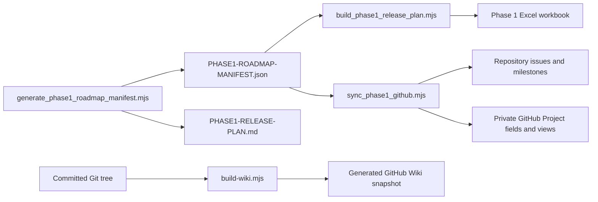

# Life in Days Phase 1 — AI agent resource index

Generated: **2026-08-14 15:10:39 IST (UTC+05:30)**

Filename timestamp: `2026-08-14-15-10-39-IST`

Source snapshot: [`8affbc19d165821cdc8bb5c175f848a485565454`](https://github.com/arunpr614/Life-Reflection/commit/8affbc19d165821cdc8bb5c175f848a485565454)

Purpose: give a newly started AI agent one safe, comprehensive entry point for understanding the product, authority model, requirements, design, architecture, delivery plan, prototype evidence, GitHub control surfaces, tooling, and every tracked repository resource.

> [!IMPORTANT]
> This is an orientation and navigation artifact, not a new product decision. Direct Product Owner instructions and the authority order below supersede summaries in this file. Live GitHub state can change after the timestamp; re-query it before making a status-sensitive decision.

## 1. Fast orientation

| Question | Answer |
| --- | --- |
| What is this? | A proposed private, single-user visual memory archive for VoiceNotes text, Telegram photos, and manual text uploads, organized into calendar-based Journal Days. |
| What exists? | Product, UX, architecture, release, research, governance, traceability, roadmap, workbook, Wiki, and fictional static-prototype artifacts. |
| What does not exist? | No working application, deployed service, live integration, durable persistence, verified authentication, backup/recovery system, or production acceptance. |
| Canonical delivery source | [Phase 1 Roadmap Manifest](PHASE1-ROADMAP-MANIFEST.json) |
| Governing product contract | [Product Requirements Document](../product/PRODUCT-REQUIREMENTS.md) |
| Governing UX contract | [UX Specification](../design/UX-SPECIFICATION.md) |
| Current Phase 1 decision authority | [Phase 1 Council Decision Record](../council/PHASE1-COUNCIL-DECISION-RECORD.md) |
| Current technical plan | [Phase 1 Implementation Plan](../architecture/PHASE1-IMPLEMENTATION-PLAN.md) |
| Current human delivery view | [Phase 1 Release Plan](PHASE1-RELEASE-PLAN.md) |
| Live control surface | [Life Reflection GitHub Project](https://github.com/users/arunpr614/projects/1) — private; authenticated access required |
| Latest frozen static prototype | `v10 Resilient Application Shell`; the Phase 1 council baseline intentionally reviewed v5 |
| Current active work | `SPK-R0-001 Shared-host Coexistence & Rollback Spike` is In progress; sanitized live-host proof remains outstanding |
| Repository license | None selected. Public visibility does not grant reuse rights. |

### Snapshot counts

| Measure | Base snapshot | Meaning |
| --- | --- | --- |
| Git-tracked files | 254 | Before adding this index |
| Candidate files including this index | 255 | 90 Markdown plus 165 non-Markdown resources |
| Markdown sources | 89 base / 90 with this index | Canonical source documents mirrored by the generated Wiki |
| Non-Markdown resources | 165 | 117 images, static-prototype code, JSON, workbook, tooling, and repository support files |
| Repository size | Approximately 26.45 MiB | Audited tracked-tree size before this index |
| Requirements | 78 | 71 active and 7 explicitly deferred |
| Release milestones | 12 | P0 and R0–R10 |
| Canonical delivery items | 58 | Repository issues #2–#59 |
| Status | 40 Backlog / 4 Next / 1 In progress / 13 Done | Done is evidence-specific; it is not synonymous with implemented or deployed |
| Prototype roadmap | v6–v35 separate track | Do not merge its PVA statuses with the 58-item Phase 1 delivery roadmap |

## 2. AI agent boot sequence

1. **Repository status and evidence boundary:** [README.md](../../README.md)
2. **Navigation and source precedence:** [docs/INDEX.md](../INDEX.md)
3. **Canonical vocabulary:** [CONTEXT.md](../../CONTEXT.md)
4. **Governing product requirements:** [docs/product/PRODUCT-REQUIREMENTS.md](../product/PRODUCT-REQUIREMENTS.md)
5. **Governing interaction and accessibility contract:** [docs/design/UX-SPECIFICATION.md](../design/UX-SPECIFICATION.md)
6. **Current Phase 1 reconciled decisions:** [docs/council/PHASE1-COUNCIL-DECISION-RECORD.md](../council/PHASE1-COUNCIL-DECISION-RECORD.md)
7. **Frozen council input hashes:** [docs/council/PHASE1-SOURCE-BASELINE.md](../council/PHASE1-SOURCE-BASELINE.md)
8. **Applicable release PRD or PID:** [docs/product/releases/README.md](../product/releases/README.md)
9. **Current technical implementation plan:** [docs/architecture/PHASE1-IMPLEMENTATION-PLAN.md](../architecture/PHASE1-IMPLEMENTATION-PLAN.md)
10. **Machine-readable delivery truth:** [docs/project/PHASE1-ROADMAP-MANIFEST.json](PHASE1-ROADMAP-MANIFEST.json)
11. **Human-readable delivery plan:** [docs/project/PHASE1-RELEASE-PLAN.md](PHASE1-RELEASE-PLAN.md)
12. **Requirement-by-requirement coverage:** [docs/project/REQUIREMENTS-TRACEABILITY.md](REQUIREMENTS-TRACEABILITY.md)
13. **Live GitHub synchronization contract:** [docs/project/PHASE1-GITHUB-PROJECT-SYNC.md](PHASE1-GITHUB-PROJECT-SYNC.md)
14. **Contribution, security, and publication guardrails:** [CONTRIBUTING.md](../../CONTRIBUTING.md)
15. **Security rules:** [SECURITY.md](../../SECURITY.md)
16. **Public-snapshot boundary:** [PUBLICATION.md](../../PUBLICATION.md)
17. **Append-only project chronology:** [RUNNING_LOG.md](../../RUNNING_LOG.md)

For R0/shared-host work, then read the Hetzner spike and runbook. For UI work, then read the prototype completeness tracker and the exact version-specific guide, handoff, council record, and QA record.

## 3. Authority and conflict resolution

| Precedence | Authority | Use |
| --- | --- | --- |
| 1 | Direct Product Owner decisions and corrections | Highest authority. Do not reinterpret or broaden them. |
| 2 | [Global PRD](../product/PRODUCT-REQUIREMENTS.md) | Product behavior, requirement IDs, priorities, acceptance intent, scope, and non-goals. |
| 3 | [UX Specification](../design/UX-SPECIFICATION.md) | Interaction, content, responsive, accessibility, and state behavior, subject to the PRD. |
| 4 | [Phase 1 Council Decision Record](../council/PHASE1-COUNCIL-DECISION-RECORD.md) | Current release decomposition and planning reconciliation that does not alter the PRD. |
| 5 | Applicable release PRD/PID, Phase 1 Implementation Plan, and Roadmap Manifest | Discipline-specific delivery, technical, status, date, and traceability authority. |
| 6 | Discovery requirements, domain language, research, and historical G0/G1 artifacts | Provenance and evidence; later confirmed decisions win. |

If two authoritative sources still conflict, stop and record the conflict in the Council Decision Record and affected manifest task. Do not silently choose the easier interpretation.

## 4. Non-negotiable operating and privacy contract

- Treat planning, prototype representation, implementation, validation, deployment, and production acceptance as different evidence states.
- The 13 Done roadmap items are completed planning or definition artifacts. No engineering, QA, or release-acceptance implementation item is Done.
- Use fictional repository content only. Never add real journals, real photos, identifiers, credentials, private URLs, provider responses, or photo-derived descriptions.
- Real photos, thumbnails, EXIF, Telegram identifiers, and descriptions derived from real photos never enter AI requests.
- The product remains private and single-user. MVP excludes sharing, public links, reminders, AI coaching, and historical VoiceNotes import.
- Journal Dates use fixed Asia/Kolkata time while original source timestamps remain immutable.
- Do not execute host, DNS, Cloudflare, provider, credential, paid-evaluation, deployment, backup, restore, or recovery mutations without explicit authorization.
- V6–v10 prototype artifacts are frozen exact-hash evidence. Start new UI work at v11 unless an explicit decision authorizes invalidating a frozen version.
- RUNNING_LOG.md is append-only.
- Do not expose local absolute paths, temporary task identifiers, GitHub Project node IDs, or credentials in public artifacts.

## 5. GitHub resources

| Resource | Link | Access and purpose |
| --- | --- | --- |
| Repository | [arunpr614/Life-Reflection](https://github.com/arunpr614/Life-Reflection) | Public canonical publication surface |
| Main branch | [main](https://github.com/arunpr614/Life-Reflection/tree/main) | Public; default branch |
| Audited base commit | [8affbc19d165](https://github.com/arunpr614/Life-Reflection/commit/8affbc19d165821cdc8bb5c175f848a485565454) | Public snapshot used to generate this index |
| Canonical Phase 1 issues | [58 issue query](https://github.com/arunpr614/Life-Reflection/issues?q=is%3Aissue+label%3Aphase1) | Public; issues #2–#59 |
| Backlog query | [status:backlog](https://github.com/arunpr614/Life-Reflection/issues?q=is%3Aissue+label%3Astatus%3Abacklog) | Public; 40 at audit time |
| Next query | [status:next](https://github.com/arunpr614/Life-Reflection/issues?q=is%3Aissue+label%3Astatus%3Anext) | Public; 4 at audit time |
| In-progress query | [status:in-progress](https://github.com/arunpr614/Life-Reflection/issues?q=is%3Aissue+label%3Astatus%3Ain-progress) | Public; 1 at audit time |
| Done query | [status:done](https://github.com/arunpr614/Life-Reflection/issues?q=is%3Aissue+label%3Astatus%3Adone) | Public; 13 evidence-backed planning/definition items at audit time |
| Milestones | [P0 and R0–R10](https://github.com/arunpr614/Life-Reflection/milestones?state=open) | Public; 12 open milestones |
| Labels | [Repository labels](https://github.com/arunpr614/Life-Reflection/labels) | Public; 19 roadmap-managed labels plus defaults/accessibility |
| Pull requests | [Pull requests](https://github.com/arunpr614/Life-Reflection/pulls?q=is%3Apr) | Public publication history |
| Actions | [Prototype syntax workflow](https://github.com/arunpr614/Life-Reflection/actions/workflows/prototype-syntax.yml) | Public; JavaScript parsing only |
| Private Project | [Life Reflection Project #1](https://github.com/users/arunpr614/projects/1) | Private; owner-authenticated access required |
| Status board | [Phase 1 Status](https://github.com/users/arunpr614/projects/1/views/4) | Private board; issue-only filter; grouped by Status |
| Roadmap | [Phase 1 Roadmap](https://github.com/users/arunpr614/projects/1/views/5) | Private roadmap; issue-only filter; grouped by Milestone |
| Wiki | [Wiki Home](https://github.com/arunpr614/Life-Reflection/wiki) | Public generated reading surface; Git sources remain authoritative |
| Wiki documentation index | [Documentation Index](https://github.com/arunpr614/Life-Reflection/wiki/Documentation-Index) | Public navigation |
| Wiki page audit | [Page Audit](https://github.com/arunpr614/Life-Reflection/wiki/Page-Audit) | Public one-to-one source mapping and fingerprints |
| Wiki asset catalog | [Asset Catalog](https://github.com/arunpr614/Life-Reflection/wiki/Asset-Catalog) | Public inventory of non-Markdown resources |
| Security policy | [Security policy](https://github.com/arunpr614/Life-Reflection/security/policy) | Public reporting rules |
| Private vulnerability reporting | [Report privately](https://github.com/arunpr614/Life-Reflection/security/advisories/new) | Requires GitHub authentication |
| Manifest blob | [PHASE1-ROADMAP-MANIFEST.json](https://github.com/arunpr614/Life-Reflection/blob/main/docs/project/PHASE1-ROADMAP-MANIFEST.json) | Human/browser view |
| Manifest raw | [Raw manifest](https://raw.githubusercontent.com/arunpr614/Life-Reflection/main/docs/project/PHASE1-ROADMAP-MANIFEST.json) | Machine-readable current main |
| Issue map | [PHASE1-GITHUB-ISSUES.json](https://github.com/arunpr614/Life-Reflection/blob/main/docs/project/PHASE1-GITHUB-ISSUES.json) | Stable task ID to issue URL/state projection |
| Workbook | [Phase 1 Excel plan](https://github.com/arunpr614/Life-Reflection/blob/main/outputs/phase1/Life-in-Days-Phase1-Release-Plan.xlsx) | Generated seven-sheet review artifact |

The repository and Wiki are public. The GitHub Project and both Project views are private; anonymous requests return 404. At the audited snapshot the Project held 58 canonical issues plus publication pull-request records and zero drafts. Raw item count may grow as new pull requests are auto-added, but both canonical views use `is:issue` and continue to select the 58 delivery issues.

### GitHub repository controls

| Control | Audited state |
| --- | --- |
| Issues / Projects / Wiki | Enabled |
| Discussions | Disabled |
| Secret scanning | Enabled |
| Secret-scanning push protection | Enabled |
| Private vulnerability reporting | Enabled |
| Dependabot security updates | Disabled |
| Rulesets / main branch protection | None at audit time |
| Homepage / declared license | None |
| Latest audited main workflow | [Successful run](https://github.com/arunpr614/Life-Reflection/actions/runs/31787671213) |

### Roadmap-managed labels

| Group | Labels |
| --- | --- |
| Scope | `phase1`, `roadmap` |
| Status | `status:backlog`, `status:next`, `status:in-progress`, `status:done` |
| Priority | `priority:high`, `priority:medium`, `priority:low` |
| Type | `type:audit`, `type:planning`, `type:spike`, `type:product-definition`, `type:design`, `type:architecture`, `type:implementation`, `type:evaluation`, `type:quality`, `type:release-acceptance` |

## 6. GitHub Project model

| View | Layout | Filter | Grouping | Expected content |
| --- | --- | --- | --- | --- |
| [Phase 1 Status](https://github.com/users/arunpr614/projects/1/views/4) | Board | `repo:arunpr614/Life-Reflection is:issue` | Status columns | Exactly 58 canonical issues |
| [Phase 1 Roadmap](https://github.com/users/arunpr614/projects/1/views/5) | Roadmap | `repo:arunpr614/Life-Reflection is:issue` | Milestone rows; Start/Target date bars | Exactly 58 canonical issues |

| Field | Canonical meaning |
| --- | --- |
| Title | Repository issue title prefixed by the stable task ID |
| Status | Backlog, Next, In progress, or Done from the manifest |
| Milestone | P0 or R0–R10 |
| Start date / Target date | Proposed Asia/Kolkata planning window; blank for trigger-gated R10 |
| Priority | High, Medium, or Low |
| PRD / PID | Applicable product contract link |
| Design artifact | Applicable UX/design evidence links |
| Requirement IDs | Exact global PRD requirement identifiers |
| Evidence | Named evidence required to support the task state |
| Owner role | Accountable role, not necessarily a GitHub assignee |
| Task summary | Concise task description |
| Repository issue state | Done items are closed; all other lanes remain open |

Initial-spike draft items PVA-001 through PVA-008 and the template Monthly roadmap, Quarterly roadmap, and Backlog views were explicitly removed. PVA identifiers still appear legitimately in the separate historical prototype-completeness program.

## 7. Milestone and release index

| Milestone | Release | Window | Items | Status mix | PRD/PID | Outcome |
| --- | --- | --- | --- | --- | --- | --- |
| [P0](https://github.com/arunpr614/Life-Reflection/milestone/1) | Council Planning Baseline | 2026-08-14 → 2026-08-16 | 2 | 2 Done | [PRODUCT-REQUIREMENTS](../product/PRODUCT-REQUIREMENTS.md) | A source-grounded, reviewable Product Council package and one canonical delivery manifest. |
| [R0](https://github.com/arunpr614/Life-Reflection/milestone/2) | Shared-Host Private Foundation | 2026-08-17 → 2026-08-28 | 6 | 4 Next, 1 In progress, 1 Done | [PRD-R0-SHARED-HOST-PRIVATE-FOUNDATION](../product/releases/PRD-R0-SHARED-HOST-PRIVATE-FOUNDATION.md) | A synthetic-only private shell can coexist with current services, recover, upgrade, and roll back. |
| [R1](https://github.com/arunpr614/Life-Reflection/milestone/3) | Manual Journal Archive | 2026-08-31 → 2026-09-18 | 5 | 4 Backlog, 1 Done | [PRD-R1-MANUAL-JOURNAL-ARCHIVE](../product/releases/PRD-R1-MANUAL-JOURNAL-ARCHIVE.md) | First memory-creating release: explicit-date text upload, Calendar, and Journal Day recall. |
| [R2](https://github.com/arunpr614/Life-Reflection/milestone/4) | Telegram Photo Capture | 2026-09-21 → 2026-10-09 | 6 | 5 Backlog, 1 Done | [PRD-R2-TELEGRAM-PHOTO-CAPTURE](../product/releases/PRD-R2-TELEGRAM-PHOTO-CAPTURE.md) | Authorized durable photo capture with review-safe dating, gallery, cover, duplicates, and privacy-safe derivatives. |
| [R3](https://github.com/arunpr614/Life-Reflection/milestone/5) | Retrieval and Date Integrity | 2026-10-12 → 2026-10-30 | 5 | 4 Backlog, 1 Done | [PRD-R3-RETRIEVAL-DATE-INTEGRITY](../product/releases/PRD-R3-RETRIEVAL-DATE-INTEGRITY.md) | Cross-month browsing, deterministic search, Needs Date Review, and atomic source redating. |
| [R4](https://github.com/arunpr614/Life-Reflection/milestone/6) | Source History and Lifecycle Safety | 2026-11-02 → 2026-11-20 | 6 | 5 Backlog, 1 Done | [PRD-R4-SOURCE-HISTORY-LIFECYCLE](../product/releases/PRD-R4-SOURCE-HISTORY-LIFECYCLE.md) | Corrections, upstream conflicts, History, Trash, suppressions, and complete restorable export. |
| [R5](https://github.com/arunpr614/Life-Reflection/milestone/7) | Prospective VoiceNotes Sync | 2026-11-23 → 2026-12-11 | 6 | 5 Backlog, 1 Done | [PRD-R5-PROSPECTIVE-VOICENOTES-SYNC](../product/releases/PRD-R5-PROSPECTIVE-VOICENOTES-SYNC.md) | Spike-proven, prospective-only VoiceNotes retrieval and replay-safe reconciliation. |
| [R6](https://github.com/arunpr614/Life-Reflection/milestone/8) | Generated Text Reflection | 2026-12-14 → 2027-01-08 | 6 | 5 Backlog, 1 Done | [PRD-R6-GENERATED-TEXT-REFLECTION](../product/releases/PRD-R6-GENERATED-TEXT-REFLECTION.md) | Optional evaluated titles, summaries, tags, and Visual Briefs with protection, provenance, and budget enforcement. |
| [R7](https://github.com/arunpr614/Life-Reflection/milestone/9) | Generated Artwork | 2027-01-11 → 2027-01-29 | 6 | 5 Backlog, 1 Done | [PRD-R7-GENERATED-ARTWORK](../product/releases/PRD-R7-GENERATED-ARTWORK.md) | Optional evaluated symbolic artwork with explicit preflight, versions, suppression, and real-photo cover precedence. |
| [R8](https://github.com/arunpr614/Life-Reflection/milestone/10) | Operational Scale and Resilience | 2027-02-01 → 2027-02-19 | 4 | 3 Backlog, 1 Done | [PRD-R8-OPERATIONAL-SCALE-RESILIENCE](../product/releases/PRD-R8-OPERATIONAL-SCALE-RESILIENCE.md) | The integrated archive degrades safely under dependency, capacity, restart, and job failures. |
| [R9](https://github.com/arunpr614/Life-Reflection/milestone/11) | Private Launch Acceptance and Stabilization | 2027-02-22 → 2027-03-12 | 3 | 2 Backlog, 1 Done | [PRD-R9-PRIVATE-LAUNCH-ACCEPTANCE](../product/releases/PRD-R9-PRIVATE-LAUNCH-ACCEPTANCE.md) | The complete private archive is owner-accepted for routine personal use and stabilized without new scope. |
| [R10](https://github.com/arunpr614/Life-Reflection/milestone/12) | Conditional Object-store Transition | Trigger-gated; intentionally undated | 3 | 2 Backlog, 1 Done | [PID-R10-OBJECT-STORE-TRANSITION](../product/releases/PID-R10-OBJECT-STORE-TRANSITION.md) | Live encrypted media moves only after approved local-capacity watermarks trigger a reversible transition. |

All dates are planning estimates. Release entry/exit evidence—not the calendar alone—controls progression. R10 stays undated until approved storage watermarks trigger a reversible transition.

## 8. Complete 58-item delivery index

This table is navigation, not a replacement for issue bodies or the manifest. Exact dependencies, all requirement IDs, acceptance evidence, rollback/restore impact, and Done semantics live in the manifest and corresponding issue.

| Task / purpose | Issue | Status | Milestone | Schedule | Priority | Owner role | Requirements | PRD/PID | Design / architecture |
| --- | --- | --- | --- | --- | --- | --- | --- | --- | --- |
| `AUD-001` v5 Feature Audit<br><sub>Classify every v5 interaction as strong, partial, missing, or outside implementation evidence.</sub> | [#2](https://github.com/arunpr614/Life-Reflection/issues/2) | Done | P0 | 2026-08-14 → 2026-08-14 | High | Product Manager + UI/UX Designer | Planning/audit scope | [PRODUCT-REQUIREMENTS](../product/PRODUCT-REQUIREMENTS.md) | [UX-DESIGN-REVIEW](../council/UX-DESIGN-REVIEW.md)<br>[UX-SPECIFICATION](../design/UX-SPECIFICATION.md)<br>[index-v5](../../prototypes/calendar-ui/index-v5.html)<br>[PHASE1-IMPLEMENTATION-PLAN](../architecture/PHASE1-IMPLEMENTATION-PLAN.md) |
| `PC-001` Integrated Council Planning Package<br><sub>Reconcile Product, Design, Architecture, and Project Management decisions into one delivery baseline.</sub> | [#3](https://github.com/arunpr614/Life-Reflection/issues/3) | Done | P0 | 2026-08-14 → 2026-08-16 | High | Project Manager | Planning/audit scope | [PRODUCT-REQUIREMENTS](../product/PRODUCT-REQUIREMENTS.md) | [UX-DESIGN-REVIEW](../council/UX-DESIGN-REVIEW.md)<br>[UX-SPECIFICATION](../design/UX-SPECIFICATION.md)<br>[index-v5](../../prototypes/calendar-ui/index-v5.html)<br>[PHASE1-IMPLEMENTATION-PLAN](../architecture/PHASE1-IMPLEMENTATION-PLAN.md) |
| `SPK-R0-001` Shared-host Coexistence & Rollback Spike<br><sub>Prove namespaced shared-host fit with synthetic data, explicit capacity assumptions, non-regression, restore, and rollback.</sub> | [#4](https://github.com/arunpr614/Life-Reflection/issues/4) | In progress | R0 | 2026-08-17 → 2026-08-19 | High | Technical Architect | 11 IDs | [PRD-R0-SHARED-HOST-PRIVATE-FOUNDATION](../product/releases/PRD-R0-SHARED-HOST-PRIVATE-FOUNDATION.md) | [UX-DESIGN-REVIEW](../council/UX-DESIGN-REVIEW.md)<br>[UX-SPECIFICATION](../design/UX-SPECIFICATION.md)<br>[PHASE1-IMPLEMENTATION-PLAN](../architecture/PHASE1-IMPLEMENTATION-PLAN.md) |
| `PRD-R0-001` Private Foundation PRD<br><sub>Define the synthetic-only private foundation outcome and prohibit authentic memory ingestion before R0 acceptance.</sub> | [#5](https://github.com/arunpr614/Life-Reflection/issues/5) | Done | R0 | 2026-08-17 → 2026-08-20 | High | Product Manager | 11 IDs | [PRD-R0-SHARED-HOST-PRIVATE-FOUNDATION](../product/releases/PRD-R0-SHARED-HOST-PRIVATE-FOUNDATION.md) | [UX-DESIGN-REVIEW](../council/UX-DESIGN-REVIEW.md)<br>[UX-SPECIFICATION](../design/UX-SPECIFICATION.md)<br>[PHASE1-IMPLEMENTATION-PLAN](../architecture/PHASE1-IMPLEMENTATION-PLAN.md) |
| `UX-R0-001` First-use/Access/Health States<br><sub>Design first use, access denial/expiry, System Health, synthetic recovery, failure, and rollback states.</sub> | [#6](https://github.com/arunpr614/Life-Reflection/issues/6) | Next | R0 | 2026-08-18 → 2026-08-21 | High | UI/UX Designer | 5 IDs | [PRD-R0-SHARED-HOST-PRIVATE-FOUNDATION](../product/releases/PRD-R0-SHARED-HOST-PRIVATE-FOUNDATION.md) | [UX-DESIGN-REVIEW](../council/UX-DESIGN-REVIEW.md)<br>[UX-SPECIFICATION](../design/UX-SPECIFICATION.md)<br>[PHASE1-IMPLEMENTATION-PLAN](../architecture/PHASE1-IMPLEMENTATION-PLAN.md) |
| `ARCH-R0-001` Private Shell Architecture & Threat Baseline<br><sub>Freeze namespaced processes, loopback ingress, callback isolation, encryption, secrets, logging, backup, and recovery architecture.</sub> | [#7](https://github.com/arunpr614/Life-Reflection/issues/7) | Next | R0 | 2026-08-17 → 2026-08-21 | High | Technical Architect | 11 IDs | [PRD-R0-SHARED-HOST-PRIVATE-FOUNDATION](../product/releases/PRD-R0-SHARED-HOST-PRIVATE-FOUNDATION.md) | [UX-DESIGN-REVIEW](../council/UX-DESIGN-REVIEW.md)<br>[UX-SPECIFICATION](../design/UX-SPECIFICATION.md)<br>[PHASE1-IMPLEMENTATION-PLAN](../architecture/PHASE1-IMPLEMENTATION-PLAN.md) |
| `ENG-R0-001` Deploy Synthetic Private Shell<br><sub>Build and deploy an authenticated synthetic shell with health evidence and no route or data path for real memories.</sub> | [#8](https://github.com/arunpr614/Life-Reflection/issues/8) | Next | R0 | 2026-08-21 → 2026-08-26 | High | Engineering | 11 IDs | [PRD-R0-SHARED-HOST-PRIVATE-FOUNDATION](../product/releases/PRD-R0-SHARED-HOST-PRIVATE-FOUNDATION.md) | [UX-DESIGN-REVIEW](../council/UX-DESIGN-REVIEW.md)<br>[UX-SPECIFICATION](../design/UX-SPECIFICATION.md)<br>[PHASE1-IMPLEMENTATION-PLAN](../architecture/PHASE1-IMPLEMENTATION-PLAN.md) |
| `REL-R0-001` Restore/Rollback/Non-regression Acceptance<br><sub>Execute access, coexistence, encrypted synthetic restore, restart, rollback, and co-resident non-regression gates.</sub> | [#9](https://github.com/arunpr614/Life-Reflection/issues/9) | Next | R0 | 2026-08-27 → 2026-08-28 | High | Project Manager | 11 IDs | [PRD-R0-SHARED-HOST-PRIVATE-FOUNDATION](../product/releases/PRD-R0-SHARED-HOST-PRIVATE-FOUNDATION.md) | [UX-DESIGN-REVIEW](../council/UX-DESIGN-REVIEW.md)<br>[UX-SPECIFICATION](../design/UX-SPECIFICATION.md)<br>[PHASE1-IMPLEMENTATION-PLAN](../architecture/PHASE1-IMPLEMENTATION-PLAN.md) |
| `PRD-R1-001` Manual Archive PRD<br><sub>Define the first memory-creating release with explicit-date text upload and authentic Calendar/Journal Day recall.</sub> | [#10](https://github.com/arunpr614/Life-Reflection/issues/10) | Done | R1 | 2026-08-31 → 2026-09-02 | High | Product Manager | 11 IDs | [PRD-R1-MANUAL-JOURNAL-ARCHIVE](../product/releases/PRD-R1-MANUAL-JOURNAL-ARCHIVE.md) | [UX-DESIGN-REVIEW](../council/UX-DESIGN-REVIEW.md)<br>[UX-SPECIFICATION](../design/UX-SPECIFICATION.md)<br>[index-v5](../../prototypes/calendar-ui/index-v5.html)<br>[PHASE1-IMPLEMENTATION-PLAN](../architecture/PHASE1-IMPLEMENTATION-PLAN.md) |
| `UX-R1-001` Calendar/Day/Upload Designs<br><sub>Finalize Calendar, Journal Day, upload, empty/loading/error, responsive, theme, and accessibility states.</sub> | [#11](https://github.com/arunpr614/Life-Reflection/issues/11) | Backlog | R1 | 2026-08-31 → 2026-09-04 | High | UI/UX Designer | 8 IDs | [PRD-R1-MANUAL-JOURNAL-ARCHIVE](../product/releases/PRD-R1-MANUAL-JOURNAL-ARCHIVE.md) | [UX-DESIGN-REVIEW](../council/UX-DESIGN-REVIEW.md)<br>[UX-SPECIFICATION](../design/UX-SPECIFICATION.md)<br>[index-v5](../../prototypes/calendar-ui/index-v5.html)<br>[PHASE1-IMPLEMENTATION-PLAN](../architecture/PHASE1-IMPLEMENTATION-PLAN.md) |
| `ARCH-R1-001` Journal/Source/Encryption Schema<br><sub>Define Journal Day, immutable source file, checksum, encryption, index, backup, restore, and migration contracts.</sub> | [#12](https://github.com/arunpr614/Life-Reflection/issues/12) | Backlog | R1 | 2026-08-31 → 2026-09-04 | High | Technical Architect | 7 IDs | [PRD-R1-MANUAL-JOURNAL-ARCHIVE](../product/releases/PRD-R1-MANUAL-JOURNAL-ARCHIVE.md) | [UX-DESIGN-REVIEW](../council/UX-DESIGN-REVIEW.md)<br>[UX-SPECIFICATION](../design/UX-SPECIFICATION.md)<br>[index-v5](../../prototypes/calendar-ui/index-v5.html)<br>[PHASE1-IMPLEMENTATION-PLAN](../architecture/PHASE1-IMPLEMENTATION-PLAN.md) |
| `ENG-R1-001` Manual Upload & Reflection Core<br><sub>Implement durable explicit-date text upload, duplicate override, Calendar, and authentic Journal Day display.</sub> | [#13](https://github.com/arunpr614/Life-Reflection/issues/13) | Backlog | R1 | 2026-09-03 → 2026-09-15 | High | Engineering | 11 IDs | [PRD-R1-MANUAL-JOURNAL-ARCHIVE](../product/releases/PRD-R1-MANUAL-JOURNAL-ARCHIVE.md) | [UX-DESIGN-REVIEW](../council/UX-DESIGN-REVIEW.md)<br>[UX-SPECIFICATION](../design/UX-SPECIFICATION.md)<br>[index-v5](../../prototypes/calendar-ui/index-v5.html)<br>[PHASE1-IMPLEMENTATION-PLAN](../architecture/PHASE1-IMPLEMENTATION-PLAN.md) |
| `REL-R1-001` First-memory Restore/Rollback Acceptance<br><sub>Verify one owner-approved source survives upload, restart, export, backup, restore, and rollback without time/date drift.</sub> | [#14](https://github.com/arunpr614/Life-Reflection/issues/14) | Backlog | R1 | 2026-09-16 → 2026-09-18 | High | Project Manager | 11 IDs | [PRD-R1-MANUAL-JOURNAL-ARCHIVE](../product/releases/PRD-R1-MANUAL-JOURNAL-ARCHIVE.md) | [UX-DESIGN-REVIEW](../council/UX-DESIGN-REVIEW.md)<br>[UX-SPECIFICATION](../design/UX-SPECIFICATION.md)<br>[index-v5](../../prototypes/calendar-ui/index-v5.html)<br>[PHASE1-IMPLEMENTATION-PLAN](../architecture/PHASE1-IMPLEMENTATION-PLAN.md) |
| `PRD-R2-001` Telegram Capture PRD<br><sub>Define authorized media forms, dating/review, durable acknowledgement, gallery, duplicate, caption, and privacy behavior.</sub> | [#15](https://github.com/arunpr614/Life-Reflection/issues/15) | Done | R2 | 2026-09-21 → 2026-09-23 | High | Product Manager | 15 IDs | [PRD-R2-TELEGRAM-PHOTO-CAPTURE](../product/releases/PRD-R2-TELEGRAM-PHOTO-CAPTURE.md) | [UX-DESIGN-REVIEW](../council/UX-DESIGN-REVIEW.md)<br>[UX-SPECIFICATION](../design/UX-SPECIFICATION.md)<br>[index-v5](../../prototypes/calendar-ui/index-v5.html)<br>[PHASE1-IMPLEMENTATION-PLAN](../architecture/PHASE1-IMPLEMENTATION-PLAN.md) |
| `UX-R2-001` Telegram/Date Review/Gallery Designs<br><sub>Design companion messages, media/date failures, Needs Date Review, gallery, cover, duplicates, and media management.</sub> | [#16](https://github.com/arunpr614/Life-Reflection/issues/16) | Backlog | R2 | 2026-09-21 → 2026-09-25 | High | UI/UX Designer | 9 IDs | [PRD-R2-TELEGRAM-PHOTO-CAPTURE](../product/releases/PRD-R2-TELEGRAM-PHOTO-CAPTURE.md) | [UX-DESIGN-REVIEW](../council/UX-DESIGN-REVIEW.md)<br>[UX-SPECIFICATION](../design/UX-SPECIFICATION.md)<br>[index-v5](../../prototypes/calendar-ui/index-v5.html)<br>[PHASE1-IMPLEMENTATION-PLAN](../architecture/PHASE1-IMPLEMENTATION-PLAN.md) |
| `ARCH-R2-001` Media Pipeline & Asset Lifecycle<br><sub>Define callback authorization, bounded staging/decoding, ciphertext/derivative flow, media references, deduplication, and restore.</sub> | [#17](https://github.com/arunpr614/Life-Reflection/issues/17) | Backlog | R2 | 2026-09-21 → 2026-09-25 | High | Technical Architect | 15 IDs | [PRD-R2-TELEGRAM-PHOTO-CAPTURE](../product/releases/PRD-R2-TELEGRAM-PHOTO-CAPTURE.md) | [UX-DESIGN-REVIEW](../council/UX-DESIGN-REVIEW.md)<br>[UX-SPECIFICATION](../design/UX-SPECIFICATION.md)<br>[index-v5](../../prototypes/calendar-ui/index-v5.html)<br>[PHASE1-IMPLEMENTATION-PLAN](../architecture/PHASE1-IMPLEMENTATION-PLAN.md) |
| `ENG-R2-001` Telegram Authorization & Durable Capture<br><sub>Implement secret/sender/chat authorization, media validation, exact dating, review holding, and post-commit acknowledgement.</sub> | [#18](https://github.com/arunpr614/Life-Reflection/issues/18) | Backlog | R2 | 2026-09-24 → 2026-10-02 | High | Engineering | 10 IDs | [PRD-R2-TELEGRAM-PHOTO-CAPTURE](../product/releases/PRD-R2-TELEGRAM-PHOTO-CAPTURE.md) | [UX-DESIGN-REVIEW](../council/UX-DESIGN-REVIEW.md)<br>[UX-SPECIFICATION](../design/UX-SPECIFICATION.md)<br>[index-v5](../../prototypes/calendar-ui/index-v5.html)<br>[PHASE1-IMPLEMENTATION-PLAN](../architecture/PHASE1-IMPLEMENTATION-PLAN.md) |
| `ENG-R2-002` Gallery/Cover/Dedup/Derivatives<br><sub>Implement durable gallery order, real-photo cover, global checksum references, captions, byte-preserved Originals, and local metadata-free thumbnails.</sub> | [#19](https://github.com/arunpr614/Life-Reflection/issues/19) | Backlog | R2 | 2026-09-28 → 2026-10-06 | High | Engineering | 7 IDs | [PRD-R2-TELEGRAM-PHOTO-CAPTURE](../product/releases/PRD-R2-TELEGRAM-PHOTO-CAPTURE.md) | [UX-DESIGN-REVIEW](../council/UX-DESIGN-REVIEW.md)<br>[UX-SPECIFICATION](../design/UX-SPECIFICATION.md)<br>[index-v5](../../prototypes/calendar-ui/index-v5.html)<br>[PHASE1-IMPLEMENTATION-PLAN](../architecture/PHASE1-IMPLEMENTATION-PLAN.md) |
| `REL-R2-001` Media Privacy/Restore Acceptance<br><sub>Execute capture, invalid input/date, album, duplicate, cover, Original, AI-exclusion, media restore, and rollback fixtures.</sub> | [#20](https://github.com/arunpr614/Life-Reflection/issues/20) | Backlog | R2 | 2026-10-07 → 2026-10-09 | High | Project Manager | 15 IDs | [PRD-R2-TELEGRAM-PHOTO-CAPTURE](../product/releases/PRD-R2-TELEGRAM-PHOTO-CAPTURE.md) | [UX-DESIGN-REVIEW](../council/UX-DESIGN-REVIEW.md)<br>[UX-SPECIFICATION](../design/UX-SPECIFICATION.md)<br>[index-v5](../../prototypes/calendar-ui/index-v5.html)<br>[PHASE1-IMPLEMENTATION-PLAN](../architecture/PHASE1-IMPLEMENTATION-PLAN.md) |
| `PRD-R3-001` Retrieval & Date Integrity PRD<br><sub>Define cross-month Timeline, exact retrieval, query privacy, Date Review, and atomic redating invariants.</sub> | [#21](https://github.com/arunpr614/Life-Reflection/issues/21) | Done | R3 | 2026-10-12 → 2026-10-14 | High | Product Manager | 6 IDs | [PRD-R3-RETRIEVAL-DATE-INTEGRITY](../product/releases/PRD-R3-RETRIEVAL-DATE-INTEGRITY.md) | [UX-DESIGN-REVIEW](../council/UX-DESIGN-REVIEW.md)<br>[UX-SPECIFICATION](../design/UX-SPECIFICATION.md)<br>[index-v5](../../prototypes/calendar-ui/index-v5.html)<br>[PHASE1-IMPLEMENTATION-PLAN](../architecture/PHASE1-IMPLEMENTATION-PLAN.md) |
| `UX-R3-001` Timeline/Search/Date Review Designs<br><sub>Design Timeline, search scope/results/history, Date Review, redating preview, interruption, and failure states.</sub> | [#22](https://github.com/arunpr614/Life-Reflection/issues/22) | Backlog | R3 | 2026-10-12 → 2026-10-16 | High | UI/UX Designer | 4 IDs | [PRD-R3-RETRIEVAL-DATE-INTEGRITY](../product/releases/PRD-R3-RETRIEVAL-DATE-INTEGRITY.md) | [UX-DESIGN-REVIEW](../council/UX-DESIGN-REVIEW.md)<br>[UX-SPECIFICATION](../design/UX-SPECIFICATION.md)<br>[index-v5](../../prototypes/calendar-ui/index-v5.html)<br>[PHASE1-IMPLEMENTATION-PLAN](../architecture/PHASE1-IMPLEMENTATION-PLAN.md) |
| `ARCH-R3-001` Search Index & Redating Transaction<br><sub>Define encrypted lexical indexes, query/log privacy, date-review storage, and one-transaction old/new-day redating.</sub> | [#23](https://github.com/arunpr614/Life-Reflection/issues/23) | Backlog | R3 | 2026-10-12 → 2026-10-16 | High | Technical Architect | 6 IDs | [PRD-R3-RETRIEVAL-DATE-INTEGRITY](../product/releases/PRD-R3-RETRIEVAL-DATE-INTEGRITY.md) | [UX-DESIGN-REVIEW](../council/UX-DESIGN-REVIEW.md)<br>[UX-SPECIFICATION](../design/UX-SPECIFICATION.md)<br>[index-v5](../../prototypes/calendar-ui/index-v5.html)<br>[PHASE1-IMPLEMENTATION-PLAN](../architecture/PHASE1-IMPLEMENTATION-PLAN.md) |
| `ENG-R3-001` Timeline/Search/Date Review/Redating<br><sub>Implement cross-month browsing, deterministic lexical/date/tag/caption retrieval, review resolution, and atomic redating.</sub> | [#24](https://github.com/arunpr614/Life-Reflection/issues/24) | Backlog | R3 | 2026-10-15 → 2026-10-28 | High | Engineering | 6 IDs | [PRD-R3-RETRIEVAL-DATE-INTEGRITY](../product/releases/PRD-R3-RETRIEVAL-DATE-INTEGRITY.md) | [UX-DESIGN-REVIEW](../council/UX-DESIGN-REVIEW.md)<br>[UX-SPECIFICATION](../design/UX-SPECIFICATION.md)<br>[index-v5](../../prototypes/calendar-ui/index-v5.html)<br>[PHASE1-IMPLEMENTATION-PLAN](../architecture/PHASE1-IMPLEMENTATION-PLAN.md) |
| `REL-R3-001` Query Privacy & Date Atomicity Acceptance<br><sub>Verify exact results, opt-in history, zero query leakage, two-day atomicity, index recovery, restore, and rollback.</sub> | [#25](https://github.com/arunpr614/Life-Reflection/issues/25) | Backlog | R3 | 2026-10-29 → 2026-10-30 | High | Project Manager | 6 IDs | [PRD-R3-RETRIEVAL-DATE-INTEGRITY](../product/releases/PRD-R3-RETRIEVAL-DATE-INTEGRITY.md) | [UX-DESIGN-REVIEW](../council/UX-DESIGN-REVIEW.md)<br>[UX-SPECIFICATION](../design/UX-SPECIFICATION.md)<br>[index-v5](../../prototypes/calendar-ui/index-v5.html)<br>[PHASE1-IMPLEMENTATION-PLAN](../architecture/PHASE1-IMPLEMENTATION-PLAN.md) |
| `PRD-R4-001` Lifecycle PRD<br><sub>Define Corrections, conflict choices, source binding, History, Trash, suppressions, confirmations, and complete export.</sub> | [#26](https://github.com/arunpr614/Life-Reflection/issues/26) | Done | R4 | 2026-11-02 → 2026-11-04 | High | Product Manager | 9 IDs | [PRD-R4-SOURCE-HISTORY-LIFECYCLE](../product/releases/PRD-R4-SOURCE-HISTORY-LIFECYCLE.md) | [UX-DESIGN-REVIEW](../council/UX-DESIGN-REVIEW.md)<br>[UX-SPECIFICATION](../design/UX-SPECIFICATION.md)<br>[PHASE1-IMPLEMENTATION-PLAN](../architecture/PHASE1-IMPLEMENTATION-PLAN.md) |
| `UX-R4-001` Diff/History/Trash/Export Designs<br><sub>Design accessible diff, Correction, History, Trash, suppression, confirmation, and encrypted-export workflows.</sub> | [#27](https://github.com/arunpr614/Life-Reflection/issues/27) | Backlog | R4 | 2026-11-02 → 2026-11-06 | High | UI/UX Designer | 7 IDs | [PRD-R4-SOURCE-HISTORY-LIFECYCLE](../product/releases/PRD-R4-SOURCE-HISTORY-LIFECYCLE.md) | [UX-DESIGN-REVIEW](../council/UX-DESIGN-REVIEW.md)<br>[UX-SPECIFICATION](../design/UX-SPECIFICATION.md)<br>[PHASE1-IMPLEMENTATION-PLAN](../architecture/PHASE1-IMPLEMENTATION-PLAN.md) |
| `ARCH-R4-001` Revision/Suppression/Export Lifecycle<br><sub>Define immutable revisions/Corrections, active display binding, Trash/suppression state machine, passphrase handoff, export cleanup, and restore.</sub> | [#28](https://github.com/arunpr614/Life-Reflection/issues/28) | Backlog | R4 | 2026-11-02 → 2026-11-06 | High | Technical Architect | 9 IDs | [PRD-R4-SOURCE-HISTORY-LIFECYCLE](../product/releases/PRD-R4-SOURCE-HISTORY-LIFECYCLE.md) | [UX-DESIGN-REVIEW](../council/UX-DESIGN-REVIEW.md)<br>[UX-SPECIFICATION](../design/UX-SPECIFICATION.md)<br>[PHASE1-IMPLEMENTATION-PLAN](../architecture/PHASE1-IMPLEMENTATION-PLAN.md) |
| `ENG-R4-001` Corrections/Conflict/History<br><sub>Implement immutable Corrections, retained revisions, exactly three conflict outcomes, exact source-set binding, and inspectable History.</sub> | [#29](https://github.com/arunpr614/Life-Reflection/issues/29) | Backlog | R4 | 2026-11-05 → 2026-11-13 | High | Engineering | 7 IDs | [PRD-R4-SOURCE-HISTORY-LIFECYCLE](../product/releases/PRD-R4-SOURCE-HISTORY-LIFECYCLE.md) | [UX-DESIGN-REVIEW](../council/UX-DESIGN-REVIEW.md)<br>[UX-SPECIFICATION](../design/UX-SPECIFICATION.md)<br>[PHASE1-IMPLEMENTATION-PLAN](../architecture/PHASE1-IMPLEMENTATION-PLAN.md) |
| `ENG-R4-002` Trash/Suppressions/Export<br><sub>Implement 30-day Trash, restoration/permanent deletion, suppressions, complete encrypted export, cleanup, and import validation.</sub> | [#30](https://github.com/arunpr614/Life-Reflection/issues/30) | Backlog | R4 | 2026-11-09 → 2026-11-18 | High | Engineering | 6 IDs | [PRD-R4-SOURCE-HISTORY-LIFECYCLE](../product/releases/PRD-R4-SOURCE-HISTORY-LIFECYCLE.md) | [UX-DESIGN-REVIEW](../council/UX-DESIGN-REVIEW.md)<br>[UX-SPECIFICATION](../design/UX-SPECIFICATION.md)<br>[PHASE1-IMPLEMENTATION-PLAN](../architecture/PHASE1-IMPLEMENTATION-PLAN.md) |
| `REL-R4-001` Lifecycle/Export Restore Acceptance<br><sub>Verify conflict outcomes, deletion/restoration, day visibility, suppression, export completeness, import/restore, and rollback.</sub> | [#31](https://github.com/arunpr614/Life-Reflection/issues/31) | Backlog | R4 | 2026-11-19 → 2026-11-20 | High | Project Manager | 9 IDs | [PRD-R4-SOURCE-HISTORY-LIFECYCLE](../product/releases/PRD-R4-SOURCE-HISTORY-LIFECYCLE.md) | [UX-DESIGN-REVIEW](../council/UX-DESIGN-REVIEW.md)<br>[UX-SPECIFICATION](../design/UX-SPECIFICATION.md)<br>[PHASE1-IMPLEMENTATION-PLAN](../architecture/PHASE1-IMPLEMENTATION-PLAN.md) |
| `SPK-R5-001` VoiceNotes Synthetic Contract Spike<br><sub>Prove exact note/revision identity, unattended authorization, authoritative retrieval, tag/date/transcript, wakeups, reconciliation, and failure behavior using synthetic data.</sub> | [#32](https://github.com/arunpr614/Life-Reflection/issues/32) | Backlog | R5 | 2026-11-23 → 2026-11-25 | High | Technical Architect | 5 IDs | [PRD-R5-PROSPECTIVE-VOICENOTES-SYNC](../product/releases/PRD-R5-PROSPECTIVE-VOICENOTES-SYNC.md) | [UX-DESIGN-REVIEW](../council/UX-DESIGN-REVIEW.md)<br>[UX-SPECIFICATION](../design/UX-SPECIFICATION.md)<br>[PHASE1-IMPLEMENTATION-PLAN](../architecture/PHASE1-IMPLEMENTATION-PLAN.md) |
| `PRD-R5-001` VoiceNotes PRD<br><sub>Define spike-gated prospective eligibility, activation, dating, reconciliation, revisions, suppression, and lifecycle behavior.</sub> | [#33](https://github.com/arunpr614/Life-Reflection/issues/33) | Done | R5 | 2026-11-23 → 2026-11-27 | High | Product Manager | 10 IDs | [PRD-R5-PROSPECTIVE-VOICENOTES-SYNC](../product/releases/PRD-R5-PROSPECTIVE-VOICENOTES-SYNC.md) | [UX-DESIGN-REVIEW](../council/UX-DESIGN-REVIEW.md)<br>[UX-SPECIFICATION](../design/UX-SPECIFICATION.md)<br>[PHASE1-IMPLEMENTATION-PLAN](../architecture/PHASE1-IMPLEMENTATION-PLAN.md) |
| `UX-R5-001` Integration/Reconciliation/Lifecycle Designs<br><sub>Design activation, integration health, Date Review, reconciliation, upstream revision/conflict, suppression, and re-import states.</sub> | [#34](https://github.com/arunpr614/Life-Reflection/issues/34) | Backlog | R5 | 2026-11-24 → 2026-11-27 | High | UI/UX Designer | 7 IDs | [PRD-R5-PROSPECTIVE-VOICENOTES-SYNC](../product/releases/PRD-R5-PROSPECTIVE-VOICENOTES-SYNC.md) | [UX-DESIGN-REVIEW](../council/UX-DESIGN-REVIEW.md)<br>[UX-SPECIFICATION](../design/UX-SPECIFICATION.md)<br>[PHASE1-IMPLEMENTATION-PLAN](../architecture/PHASE1-IMPLEMENTATION-PLAN.md) |
| `ARCH-R5-001` VoiceNotes Adapter & Reconciliation Contract<br><sub>Freeze the spike-proven adapter, opaque identities, authorization renewal, fail-closed paging, durable jobs, reconciliation, and restore design.</sub> | [#35](https://github.com/arunpr614/Life-Reflection/issues/35) | Backlog | R5 | 2026-11-24 → 2026-11-27 | High | Technical Architect | 10 IDs | [PRD-R5-PROSPECTIVE-VOICENOTES-SYNC](../product/releases/PRD-R5-PROSPECTIVE-VOICENOTES-SYNC.md) | [UX-DESIGN-REVIEW](../council/UX-DESIGN-REVIEW.md)<br>[UX-SPECIFICATION](../design/UX-SPECIFICATION.md)<br>[PHASE1-IMPLEMENTATION-PLAN](../architecture/PHASE1-IMPLEMENTATION-PLAN.md) |
| `ENG-R5-001` Prospective Import & Revisions<br><sub>Implement exact post-activation import, creation-time dating/review, replay-safe reconciliation, revisions, upstream status, suppression, and alerts.</sub> | [#36](https://github.com/arunpr614/Life-Reflection/issues/36) | Backlog | R5 | 2026-11-26 → 2026-12-09 | High | Engineering | 10 IDs | [PRD-R5-PROSPECTIVE-VOICENOTES-SYNC](../product/releases/PRD-R5-PROSPECTIVE-VOICENOTES-SYNC.md) | [UX-DESIGN-REVIEW](../council/UX-DESIGN-REVIEW.md)<br>[UX-SPECIFICATION](../design/UX-SPECIFICATION.md)<br>[PHASE1-IMPLEMENTATION-PLAN](../architecture/PHASE1-IMPLEMENTATION-PLAN.md) |
| `REL-R5-001` Replay/Suppression/Restore Acceptance<br><sub>Verify activation boundaries, missed/duplicate/out-of-order replay, revisions, suppression/re-import, integration failure isolation, restore, and rollback.</sub> | [#37](https://github.com/arunpr614/Life-Reflection/issues/37) | Backlog | R5 | 2026-12-10 → 2026-12-11 | High | Project Manager | 10 IDs | [PRD-R5-PROSPECTIVE-VOICENOTES-SYNC](../product/releases/PRD-R5-PROSPECTIVE-VOICENOTES-SYNC.md) | [UX-DESIGN-REVIEW](../council/UX-DESIGN-REVIEW.md)<br>[UX-SPECIFICATION](../design/UX-SPECIFICATION.md)<br>[PHASE1-IMPLEMENTATION-PLAN](../architecture/PHASE1-IMPLEMENTATION-PLAN.md) |
| `EVAL-R6-001` Text Model Evaluation<br><sub>Evaluate exact text provider/model snapshots against privacy, fidelity, schema, language, latency, and measured-cost hard gates.</sub> | [#38](https://github.com/arunpr614/Life-Reflection/issues/38) | Backlog | R6 | 2026-12-14 → 2026-12-18 | Medium | Product Manager + Technical Architect | 6 IDs | [PRD-R6-GENERATED-TEXT-REFLECTION](../product/releases/PRD-R6-GENERATED-TEXT-REFLECTION.md) | [UX-DESIGN-REVIEW](../council/UX-DESIGN-REVIEW.md)<br>[UX-SPECIFICATION](../design/UX-SPECIFICATION.md)<br>[index-v5](../../prototypes/calendar-ui/index-v5.html)<br>[PHASE1-IMPLEMENTATION-PLAN](../architecture/PHASE1-IMPLEMENTATION-PLAN.md) |
| `PRD-R6-001` Generated Text PRD<br><sub>Define evaluated optional text derivation, typed inputs, quiet/final refresh, protection, provenance, failures, and budgets.</sub> | [#39](https://github.com/arunpr614/Life-Reflection/issues/39) | Done | R6 | 2026-12-14 → 2026-12-18 | Medium | Product Manager | 11 IDs | [PRD-R6-GENERATED-TEXT-REFLECTION](../product/releases/PRD-R6-GENERATED-TEXT-REFLECTION.md) | [UX-DESIGN-REVIEW](../council/UX-DESIGN-REVIEW.md)<br>[UX-SPECIFICATION](../design/UX-SPECIFICATION.md)<br>[index-v5](../../prototypes/calendar-ui/index-v5.html)<br>[PHASE1-IMPLEMENTATION-PLAN](../architecture/PHASE1-IMPLEMENTATION-PLAN.md) |
| `UX-R6-001` Text/Provider/Budget States<br><sub>Design title/summary/tag/brief review, field protection, stale suggestions, provenance, provider health, budget, and failure states.</sub> | [#40](https://github.com/arunpr614/Life-Reflection/issues/40) | Backlog | R6 | 2026-12-16 → 2026-12-22 | Medium | UI/UX Designer | 7 IDs | [PRD-R6-GENERATED-TEXT-REFLECTION](../product/releases/PRD-R6-GENERATED-TEXT-REFLECTION.md) | [UX-DESIGN-REVIEW](../council/UX-DESIGN-REVIEW.md)<br>[UX-SPECIFICATION](../design/UX-SPECIFICATION.md)<br>[index-v5](../../prototypes/calendar-ui/index-v5.html)<br>[PHASE1-IMPLEMENTATION-PLAN](../architecture/PHASE1-IMPLEMENTATION-PLAN.md) |
| `ARCH-R6-001` Text Adapter/Jobs/Budget/Provenance<br><sub>Define typed allowlist serialization, exact adapter configuration, source-race-safe jobs, independent protection, provenance, usage ledger, and restore.</sub> | [#41](https://github.com/arunpr614/Life-Reflection/issues/41) | Backlog | R6 | 2026-12-16 → 2026-12-22 | Medium | Technical Architect | 11 IDs | [PRD-R6-GENERATED-TEXT-REFLECTION](../product/releases/PRD-R6-GENERATED-TEXT-REFLECTION.md) | [UX-DESIGN-REVIEW](../council/UX-DESIGN-REVIEW.md)<br>[UX-SPECIFICATION](../design/UX-SPECIFICATION.md)<br>[index-v5](../../prototypes/calendar-ui/index-v5.html)<br>[PHASE1-IMPLEMENTATION-PLAN](../architecture/PHASE1-IMPLEMENTATION-PLAN.md) |
| `ENG-R6-001` Text Derivation & Protected Fields<br><sub>Implement evaluated title/summary/tag/Visual Brief derivation, quiet/final refresh, field protection, version choice, provenance, and budget enforcement.</sub> | [#42](https://github.com/arunpr614/Life-Reflection/issues/42) | Backlog | R6 | 2026-12-21 → 2027-01-06 | Medium | Engineering | 11 IDs | [PRD-R6-GENERATED-TEXT-REFLECTION](../product/releases/PRD-R6-GENERATED-TEXT-REFLECTION.md) | [UX-DESIGN-REVIEW](../council/UX-DESIGN-REVIEW.md)<br>[UX-SPECIFICATION](../design/UX-SPECIFICATION.md)<br>[index-v5](../../prototypes/calendar-ui/index-v5.html)<br>[PHASE1-IMPLEMENTATION-PLAN](../architecture/PHASE1-IMPLEMENTATION-PLAN.md) |
| `REL-R6-001` Text Privacy/Quality/Restore Acceptance<br><sub>Verify hard-gate model quality, photo/caption exclusion, source races, protected fields, failures, monthly ceiling, derived restore, and rollback.</sub> | [#43](https://github.com/arunpr614/Life-Reflection/issues/43) | Backlog | R6 | 2027-01-07 → 2027-01-08 | Medium | Project Manager | 11 IDs | [PRD-R6-GENERATED-TEXT-REFLECTION](../product/releases/PRD-R6-GENERATED-TEXT-REFLECTION.md) | [UX-DESIGN-REVIEW](../council/UX-DESIGN-REVIEW.md)<br>[UX-SPECIFICATION](../design/UX-SPECIFICATION.md)<br>[index-v5](../../prototypes/calendar-ui/index-v5.html)<br>[PHASE1-IMPLEMENTATION-PLAN](../architecture/PHASE1-IMPLEMENTATION-PLAN.md) |
| `EVAL-R7-001` Artwork Model Evaluation<br><sub>Evaluate exact artwork provider/model configurations against non-photorealism, safety, quality, latency, cost, and automatic-sweep eligibility gates.</sub> | [#44](https://github.com/arunpr614/Life-Reflection/issues/44) | Backlog | R7 | 2027-01-11 → 2027-01-13 | Medium | Product Manager + Technical Architect | 6 IDs | [PRD-R7-GENERATED-ARTWORK](../product/releases/PRD-R7-GENERATED-ARTWORK.md) | [UX-DESIGN-REVIEW](../council/UX-DESIGN-REVIEW.md)<br>[UX-SPECIFICATION](../design/UX-SPECIFICATION.md)<br>[index-v5](../../prototypes/calendar-ui/index-v5.html)<br>[PHASE1-IMPLEMENTATION-PLAN](../architecture/PHASE1-IMPLEMENTATION-PLAN.md) |
| `PRD-R7-001` Artwork PRD<br><sub>Define evaluated Visual Brief, manual/sweep generation, safety/failure, labeling, versions, cover precedence, suppression, and configuration.</sub> | [#45](https://github.com/arunpr614/Life-Reflection/issues/45) | Done | R7 | 2027-01-11 → 2027-01-13 | Medium | Product Manager | 15 IDs | [PRD-R7-GENERATED-ARTWORK](../product/releases/PRD-R7-GENERATED-ARTWORK.md) | [UX-DESIGN-REVIEW](../council/UX-DESIGN-REVIEW.md)<br>[UX-SPECIFICATION](../design/UX-SPECIFICATION.md)<br>[index-v5](../../prototypes/calendar-ui/index-v5.html)<br>[PHASE1-IMPLEMENTATION-PLAN](../architecture/PHASE1-IMPLEMENTATION-PLAN.md) |
| `UX-R7-001` Artwork/Version/Suppression Designs<br><sub>Design preflight, meaningful-word, safety/failure, persistent label, versions, stale, suppression, and real-photo-cover states.</sub> | [#46](https://github.com/arunpr614/Life-Reflection/issues/46) | Backlog | R7 | 2027-01-12 → 2027-01-15 | Medium | UI/UX Designer | 10 IDs | [PRD-R7-GENERATED-ARTWORK](../product/releases/PRD-R7-GENERATED-ARTWORK.md) | [UX-DESIGN-REVIEW](../council/UX-DESIGN-REVIEW.md)<br>[UX-SPECIFICATION](../design/UX-SPECIFICATION.md)<br>[index-v5](../../prototypes/calendar-ui/index-v5.html)<br>[PHASE1-IMPLEMENTATION-PLAN](../architecture/PHASE1-IMPLEMENTATION-PLAN.md) |
| `ARCH-R7-001` Artwork Adapter/Sweep/Budget/Provenance<br><sub>Define exact adapter/configuration, preflight, idempotent sweep, artifact lifecycle, provenance, budget reservation, suppression, and restore.</sub> | [#47](https://github.com/arunpr614/Life-Reflection/issues/47) | Backlog | R7 | 2027-01-12 → 2027-01-15 | Medium | Technical Architect | 15 IDs | [PRD-R7-GENERATED-ARTWORK](../product/releases/PRD-R7-GENERATED-ARTWORK.md) | [UX-DESIGN-REVIEW](../council/UX-DESIGN-REVIEW.md)<br>[UX-SPECIFICATION](../design/UX-SPECIFICATION.md)<br>[index-v5](../../prototypes/calendar-ui/index-v5.html)<br>[PHASE1-IMPLEMENTATION-PLAN](../architecture/PHASE1-IMPLEMENTATION-PLAN.md) |
| `ENG-R7-001` Manual & Sweep Artwork Lifecycle<br><sub>Implement evaluated explicit/sweep generation, versions, labeling, stale state, suppression, cover precedence, failures, and spend control.</sub> | [#48](https://github.com/arunpr614/Life-Reflection/issues/48) | Backlog | R7 | 2027-01-14 → 2027-01-27 | Medium | Engineering | 15 IDs | [PRD-R7-GENERATED-ARTWORK](../product/releases/PRD-R7-GENERATED-ARTWORK.md) | [UX-DESIGN-REVIEW](../council/UX-DESIGN-REVIEW.md)<br>[UX-SPECIFICATION](../design/UX-SPECIFICATION.md)<br>[index-v5](../../prototypes/calendar-ui/index-v5.html)<br>[PHASE1-IMPLEMENTATION-PLAN](../architecture/PHASE1-IMPLEMENTATION-PLAN.md) |
| `REL-R7-001` Artwork Privacy/Cover/Restore Acceptance<br><sub>Verify privacy, evaluation gates, preflight, failures, versions, suppression, real-photo cover, budget, artifact restore, and rollback.</sub> | [#49](https://github.com/arunpr614/Life-Reflection/issues/49) | Backlog | R7 | 2027-01-28 → 2027-01-29 | Medium | Project Manager | 15 IDs | [PRD-R7-GENERATED-ARTWORK](../product/releases/PRD-R7-GENERATED-ARTWORK.md) | [UX-DESIGN-REVIEW](../council/UX-DESIGN-REVIEW.md)<br>[UX-SPECIFICATION](../design/UX-SPECIFICATION.md)<br>[index-v5](../../prototypes/calendar-ui/index-v5.html)<br>[PHASE1-IMPLEMENTATION-PLAN](../architecture/PHASE1-IMPLEMENTATION-PLAN.md) |
| `PRD-R8-001` Resilience PRD<br><sub>Define measured capacity, safe degradation, health, alerts, failure isolation, integrated recovery, and hardening outcomes.</sub> | [#50](https://github.com/arunpr614/Life-Reflection/issues/50) | Done | R8 | 2027-02-01 → 2027-02-03 | High | Product Manager | 5 IDs | [PRD-R8-OPERATIONAL-SCALE-RESILIENCE](../product/releases/PRD-R8-OPERATIONAL-SCALE-RESILIENCE.md) | [UX-DESIGN-REVIEW](../council/UX-DESIGN-REVIEW.md)<br>[UX-SPECIFICATION](../design/UX-SPECIFICATION.md)<br>[PHASE1-IMPLEMENTATION-PLAN](../architecture/PHASE1-IMPLEMENTATION-PLAN.md) |
| `ARCH-R8-001` Capacity/Health/Alert/Fault Hardening<br><sub>Harden measured watermarks, process/job supervision, durable health, alert transitions, dependency isolation, and recovery operations.</sub> | [#51](https://github.com/arunpr614/Life-Reflection/issues/51) | Backlog | R8 | 2027-02-01 → 2027-02-05 | High | Technical Architect | 5 IDs | [PRD-R8-OPERATIONAL-SCALE-RESILIENCE](../product/releases/PRD-R8-OPERATIONAL-SCALE-RESILIENCE.md) | [UX-DESIGN-REVIEW](../council/UX-DESIGN-REVIEW.md)<br>[UX-SPECIFICATION](../design/UX-SPECIFICATION.md)<br>[PHASE1-IMPLEMENTATION-PLAN](../architecture/PHASE1-IMPLEMENTATION-PLAN.md) |
| `QA-R8-001` Integrated Fault/Security/Browser/Accessibility Suite<br><sub>Execute integrated capacity, restart, dependency, privacy, security, browser, keyboard, screen-reader, zoom, theme, and restore tests.</sub> | [#52](https://github.com/arunpr614/Life-Reflection/issues/52) | Backlog | R8 | 2027-02-04 → 2027-02-17 | High | Project Manager + QA | 71 IDs | [PRD-R8-OPERATIONAL-SCALE-RESILIENCE](../product/releases/PRD-R8-OPERATIONAL-SCALE-RESILIENCE.md) | [UX-DESIGN-REVIEW](../council/UX-DESIGN-REVIEW.md)<br>[UX-SPECIFICATION](../design/UX-SPECIFICATION.md)<br>[PHASE1-IMPLEMENTATION-PLAN](../architecture/PHASE1-IMPLEMENTATION-PLAN.md) |
| `REL-R8-001` Resilience Release Acceptance<br><sub>Accept the integrated operating envelope only after faults, alerts, capacity, backup/restore, rollback, and regressions pass.</sub> | [#53](https://github.com/arunpr614/Life-Reflection/issues/53) | Backlog | R8 | 2027-02-18 → 2027-02-19 | High | Project Manager | 71 IDs | [PRD-R8-OPERATIONAL-SCALE-RESILIENCE](../product/releases/PRD-R8-OPERATIONAL-SCALE-RESILIENCE.md) | [UX-DESIGN-REVIEW](../council/UX-DESIGN-REVIEW.md)<br>[UX-SPECIFICATION](../design/UX-SPECIFICATION.md)<br>[PHASE1-IMPLEMENTATION-PLAN](../architecture/PHASE1-IMPLEMENTATION-PLAN.md) |
| `PRD-R9-001` Launch Acceptance Plan<br><sub>Define the owner UAT, Recovery Ceremony, severity gate, observation window, explicit authority, go/no-go, and rollback plan with no feature growth.</sub> | [#54](https://github.com/arunpr614/Life-Reflection/issues/54) | Done | R9 | 2027-02-22 → 2027-02-24 | High | Product Manager | 71 IDs | [PRD-R9-PRIVATE-LAUNCH-ACCEPTANCE](../product/releases/PRD-R9-PRIVATE-LAUNCH-ACCEPTANCE.md) | [UX-DESIGN-REVIEW](../council/UX-DESIGN-REVIEW.md)<br>[UX-SPECIFICATION](../design/UX-SPECIFICATION.md)<br>[PHASE1-IMPLEMENTATION-PLAN](../architecture/PHASE1-IMPLEMENTATION-PLAN.md) |
| `QA-R9-001` Owner UAT/Recovery Ceremony/Stabilization<br><sub>Execute complete owner journeys, full representative recovery, defect stabilization, accessibility, privacy, spend, capacity, and failure scenarios.</sub> | [#55](https://github.com/arunpr614/Life-Reflection/issues/55) | Backlog | R9 | 2027-02-22 → 2027-03-10 | High | Project Manager + QA | 71 IDs | [PRD-R9-PRIVATE-LAUNCH-ACCEPTANCE](../product/releases/PRD-R9-PRIVATE-LAUNCH-ACCEPTANCE.md) | [UX-DESIGN-REVIEW](../council/UX-DESIGN-REVIEW.md)<br>[UX-SPECIFICATION](../design/UX-SPECIFICATION.md)<br>[PHASE1-IMPLEMENTATION-PLAN](../architecture/PHASE1-IMPLEMENTATION-PLAN.md) |
| `REL-R9-001` Private Launch Go/No-go & Observation<br><sub>Record explicit owner authority, severity status, Recovery Ceremony, observation evidence, and go/no-go or rollback decision.</sub> | [#56](https://github.com/arunpr614/Life-Reflection/issues/56) | Backlog | R9 | 2027-03-11 → 2027-03-12 | High | Project Manager | 71 IDs | [PRD-R9-PRIVATE-LAUNCH-ACCEPTANCE](../product/releases/PRD-R9-PRIVATE-LAUNCH-ACCEPTANCE.md) | [UX-DESIGN-REVIEW](../council/UX-DESIGN-REVIEW.md)<br>[UX-SPECIFICATION](../design/UX-SPECIFICATION.md)<br>[PHASE1-IMPLEMENTATION-PLAN](../architecture/PHASE1-IMPLEMENTATION-PLAN.md) |
| `PID-R10-001` Object-store Transition PID<br><sub>Define the date-free capacity trigger, user-visible states, outcomes, non-goals, cutover, recovery, rollback, and owner acceptance boundary.</sub> | [#57](https://github.com/arunpr614/Life-Reflection/issues/57) | Done | R10 | Trigger-gated | Medium | Product Manager | 6 IDs | [PID-R10-OBJECT-STORE-TRANSITION](../product/releases/PID-R10-OBJECT-STORE-TRANSITION.md) | [UX-DESIGN-REVIEW](../council/UX-DESIGN-REVIEW.md)<br>[UX-SPECIFICATION](../design/UX-SPECIFICATION.md)<br>[PHASE1-IMPLEMENTATION-PLAN](../architecture/PHASE1-IMPLEMENTATION-PLAN.md) |
| `ARCH-R10-001` Migration/Inventory/Backup/Rollback Runbook<br><sub>Define complete pagination/inventory, encrypted keys, dual-write/copy, reconciliation, remote backup/restore, reversible pointers, observation, and rollback.</sub> | [#58](https://github.com/arunpr614/Life-Reflection/issues/58) | Backlog | R10 | Trigger-gated | Medium | Technical Architect | 6 IDs | [PID-R10-OBJECT-STORE-TRANSITION](../product/releases/PID-R10-OBJECT-STORE-TRANSITION.md) | [UX-DESIGN-REVIEW](../council/UX-DESIGN-REVIEW.md)<br>[UX-SPECIFICATION](../design/UX-SPECIFICATION.md)<br>[PHASE1-IMPLEMENTATION-PLAN](../architecture/PHASE1-IMPLEMENTATION-PLAN.md) |
| `REL-R10-001` Conditional Transition Acceptance<br><sub>After an approved trigger, execute and verify reversible object-store transition before retiring any local authoritative copy.</sub> | [#59](https://github.com/arunpr614/Life-Reflection/issues/59) | Backlog | R10 | Trigger-gated | Medium | Project Manager | 6 IDs | [PID-R10-OBJECT-STORE-TRANSITION](../product/releases/PID-R10-OBJECT-STORE-TRANSITION.md) | [UX-DESIGN-REVIEW](../council/UX-DESIGN-REVIEW.md)<br>[UX-SPECIFICATION](../design/UX-SPECIFICATION.md)<br>[PHASE1-IMPLEMENTATION-PLAN](../architecture/PHASE1-IMPLEMENTATION-PLAN.md) |

## 9. Product, design, architecture, governance, and delivery resources

| Area | Primary resource | Use it for |
| --- | --- | --- |
| Project orientation | [README.md](../../README.md) | Current state, primary links, repository map, privacy and evidence boundary |
| Complete navigation | [docs/INDEX.md](../INDEX.md) | Existing canonical document index and reading paths |
| Domain language | [CONTEXT.md](../../CONTEXT.md) | Journal Day, Journal Date, Source Item, Daily Photo, Original Timestamp, Correction, Derived Artifact |
| Governing product contract | [docs/product/PRODUCT-REQUIREMENTS.md](../product/PRODUCT-REQUIREMENTS.md) | 78 prioritized requirements, acceptance behavior, risks, data handling, and non-goals |
| Release contracts | [docs/product/releases/README.md](../product/releases/README.md) | R0–R9 PRDs and date-free R10 PID |
| Governing UX contract | [docs/design/UX-SPECIFICATION.md](../design/UX-SPECIFICATION.md) | Information architecture, screens, flows, states, responsive behavior, accessibility, content |
| Phase 1 council authority | [docs/council/PHASE1-COUNCIL-DECISION-RECORD.md](../council/PHASE1-COUNCIL-DECISION-RECORD.md) | Reconciled release, UX, architecture, and delivery decisions |
| Council source baseline | [docs/council/PHASE1-SOURCE-BASELINE.md](../council/PHASE1-SOURCE-BASELINE.md) | Exact frozen inputs and hashes |
| Product review | [docs/council/PRODUCT-MANAGER-REVIEW.md](../council/PRODUCT-MANAGER-REVIEW.md) | Release decomposition and requirement assignment |
| UX review | [docs/council/UX-DESIGN-REVIEW.md](../council/UX-DESIGN-REVIEW.md) | v5 inspection, design gaps, screenshots, veto gates, and task traceability |
| Project review | [docs/council/PROJECT-MANAGER-REVIEW.md](../council/PROJECT-MANAGER-REVIEW.md) | Critical path, lane policy, readiness/done rules, RAID, cadence |
| Current implementation plan | [docs/architecture/PHASE1-IMPLEMENTATION-PLAN.md](../architecture/PHASE1-IMPLEMENTATION-PLAN.md) | Domain, persistence, security, integrations, shared-host plan, testing, recovery, rollback |
| Shared-host research | [docs/research/HETZNER-SHARED-HOST-DEPLOYMENT-SPIKE.md](../research/HETZNER-SHARED-HOST-DEPLOYMENT-SPIKE.md) | Coexistence topology, SQLCipher/SQLite gates, PostgreSQL fallback, live preflight |
| Shared-host runbook | [docs/architecture/HETZNER-SHARED-HOST-RUNBOOK.md](../architecture/HETZNER-SHARED-HOST-RUNBOOK.md) | Sanitized stop conditions and proposed execution/rollback sequence |
| Roadmap research | [docs/research/GITHUB-PROJECTS-ROADMAP-RESEARCH.md](../research/GITHUB-PROJECTS-ROADMAP-RESEARCH.md) | GitHub Project/Roadmap capabilities, APIs, limits, and automation |
| Historical roadmap pilot | [docs/spikes/LIFE-IN-DAYS-GITHUB-ROADMAP-DESIGN.md](../spikes/LIFE-IN-DAYS-GITHUB-ROADMAP-DESIGN.md) | Superseded reversible eight-item pilot design |
| Canonical task source | [docs/project/PHASE1-ROADMAP-MANIFEST.json](PHASE1-ROADMAP-MANIFEST.json) | 58 task identities, status, dates, links, requirements, evidence |
| Human release plan | [docs/project/PHASE1-RELEASE-PLAN.md](PHASE1-RELEASE-PLAN.md) | Generated milestone/task projection |
| Issue map | [docs/project/PHASE1-GITHUB-ISSUES.json](PHASE1-GITHUB-ISSUES.json) | Stable task IDs to live issue URLs and states |
| GitHub sync runbook | [docs/project/PHASE1-GITHUB-PROJECT-SYNC.md](PHASE1-GITHUB-PROJECT-SYNC.md) | Dry-run-first synchronization and recovery contract |
| Traceability | [docs/project/REQUIREMENTS-TRACEABILITY.md](REQUIREMENTS-TRACEABILITY.md) | Requirement navigation across Product, UX, Architecture, Delivery, and verification |
| Review workbook | [outputs/phase1/Life-in-Days-Phase1-Release-Plan.xlsx](../../outputs/phase1/Life-in-Days-Phase1-Release-Plan.xlsx) | Seven-sheet generated release-plan workbook |
| Prototype feature audit | [docs/audits/PROTOTYPE-V5-FEATURE-AUDIT.md](../audits/PROTOTYPE-V5-FEATURE-AUDIT.md) | v5 coverage classification against all 78 requirements |
| Prototype roadmap | [docs/project/PROTOTYPE-COMPLETENESS-TRACKER.md](PROTOTYPE-COMPLETENESS-TRACKER.md) | Separate v6–v35 UI representation track |
| Latest prototype guide | [prototypes/calendar-ui/README-v10.md](../../prototypes/calendar-ui/README-v10.md) | How to run and interpret v10 |
| Latest prototype handoff | [docs/prototypes/CALENDAR-UI-PROTOTYPE-v10.md](../prototypes/CALENDAR-UI-PROTOTYPE-v10.md) | v10 feature/evidence boundary |
| Latest prototype council | [docs/prototypes/v10/COUNCIL-v10.md](../prototypes/v10/COUNCIL-v10.md) | Approved v10 synthetic interaction contract |
| Latest prototype QA | [design-qa-v10.md](../../design-qa-v10.md) | Exact-hash independent v10 QA evidence |
| Discovery decisions | [docs/discovery/REQUIREMENTS.md](../discovery/REQUIREMENTS.md) | Detailed interview decisions and historical frontier |
| Discovery research | [docs/discovery/RESEARCH.md](../discovery/RESEARCH.md) | Product/integration research and unknowns |
| Text-model evaluation | [docs/discovery/AI-TEXT-MODEL-EVALUATION.md](../discovery/AI-TEXT-MODEL-EVALUATION.md) | Synthetic evaluation protocol; no model qualification |
| Artwork-model evaluation | [docs/discovery/AI-ARTWORK-MODEL-EVALUATION.md](../discovery/AI-ARTWORK-MODEL-EVALUATION.md) | Synthetic evaluation protocol; no model qualification |
| Media storage evaluation | [docs/discovery/MEDIA-STORAGE-EVALUATION.md](../discovery/MEDIA-STORAGE-EVALUATION.md) | Cost/privacy/operations comparison; no provisioning evidence |
| Security | [SECURITY.md](../../SECURITY.md) | Private reporting and sensitive-content rules |
| Contribution rules | [CONTRIBUTING.md](../../CONTRIBUTING.md) | Synthetic data, frozen prototypes, status language, validation |
| Publication provenance | [PUBLICATION.md](../../PUBLICATION.md) | Public snapshot scope and exclusions |
| Running log | [RUNNING_LOG.md](../../RUNNING_LOG.md) | Append-only historical chronology |

## 10. Release PRD/PID index

| Milestone | Release | Product contract | Interpretation |
| --- | --- | --- | --- |
| P0 | Council Planning Baseline | [docs/product/PRODUCT-REQUIREMENTS.md](../product/PRODUCT-REQUIREMENTS.md) | Global governing PRD |
| R0 | Shared-Host Private Foundation | [docs/product/releases/PRD-R0-SHARED-HOST-PRIVATE-FOUNDATION.md](../product/releases/PRD-R0-SHARED-HOST-PRIVATE-FOUNDATION.md) | Release planning draft |
| R1 | Manual Journal Archive | [docs/product/releases/PRD-R1-MANUAL-JOURNAL-ARCHIVE.md](../product/releases/PRD-R1-MANUAL-JOURNAL-ARCHIVE.md) | Release planning draft |
| R2 | Telegram Photo Capture | [docs/product/releases/PRD-R2-TELEGRAM-PHOTO-CAPTURE.md](../product/releases/PRD-R2-TELEGRAM-PHOTO-CAPTURE.md) | Release planning draft |
| R3 | Retrieval and Date Integrity | [docs/product/releases/PRD-R3-RETRIEVAL-DATE-INTEGRITY.md](../product/releases/PRD-R3-RETRIEVAL-DATE-INTEGRITY.md) | Release planning draft |
| R4 | Source History and Lifecycle Safety | [docs/product/releases/PRD-R4-SOURCE-HISTORY-LIFECYCLE.md](../product/releases/PRD-R4-SOURCE-HISTORY-LIFECYCLE.md) | Release planning draft |
| R5 | Prospective VoiceNotes Sync | [docs/product/releases/PRD-R5-PROSPECTIVE-VOICENOTES-SYNC.md](../product/releases/PRD-R5-PROSPECTIVE-VOICENOTES-SYNC.md) | Release planning draft |
| R6 | Generated Text Reflection | [docs/product/releases/PRD-R6-GENERATED-TEXT-REFLECTION.md](../product/releases/PRD-R6-GENERATED-TEXT-REFLECTION.md) | Release planning draft |
| R7 | Generated Artwork | [docs/product/releases/PRD-R7-GENERATED-ARTWORK.md](../product/releases/PRD-R7-GENERATED-ARTWORK.md) | Release planning draft |
| R8 | Operational Scale and Resilience | [docs/product/releases/PRD-R8-OPERATIONAL-SCALE-RESILIENCE.md](../product/releases/PRD-R8-OPERATIONAL-SCALE-RESILIENCE.md) | Release planning draft |
| R9 | Private Launch Acceptance and Stabilization | [docs/product/releases/PRD-R9-PRIVATE-LAUNCH-ACCEPTANCE.md](../product/releases/PRD-R9-PRIVATE-LAUNCH-ACCEPTANCE.md) | Release planning draft |
| R10 | Conditional Object-store Transition | [docs/product/releases/PID-R10-OBJECT-STORE-TRANSITION.md](../product/releases/PID-R10-OBJECT-STORE-TRANSITION.md) | Conditional, trigger-gated PID |

## 11. Prototype program

| Track | Authority and current interpretation |
| --- | --- |
| Phase 1 council design baseline | Prototype v5 is the intentionally frozen input inspected by the Phase 1 council. Do not silently substitute v10. |
| Latest frozen prototype | v10 Resilient Application Shell; fictional browser-memory interaction evidence only. |
| Next version | v11 Needs Date Review is the next queued prototype slice. |
| PVA identifier meaning | PVA-001–PVA-008 remain valid historical prototype work-package IDs in documents even though their disposable GitHub Project draft copies were deleted. |
| Frozen artifacts | V6–v10 source, guides, councils, handoffs, screenshots, and QA evidence are exact-hash records. Byte changes invalidate their dispositions. |
| Root route | The prototype server root is historical v1. Use the explicit index-v10.html route for the latest frozen version. |

Prototype parsing commands:

```sh
cd prototypes/calendar-ui
npm run check:v10
npm run prototype
```

Then open `http://127.0.0.1:4173/index-v10.html?view=calendar&month=2026-08`. These commands do not prove accessibility, security, integration, persistence, deployment, or production readiness.

## 12. Tooling and generated-artifact flow



| Tool | Default behavior | Important boundary |
| --- | --- | --- |
| [tools/generate_phase1_roadmap_manifest.mjs](../../tools/generate_phase1_roadmap_manifest.mjs) | Regenerates the canonical manifest and Markdown release plan | Change task identity, dates, releases, and mappings through this source; do not edit only a projection |
| [tools/build_phase1_release_plan.mjs](../../tools/build_phase1_release_plan.mjs) | Builds the seven-sheet workbook | Canonical public output is outputs/phase1; ignored task-scoped duplicates are local only |
| [tools/sync_phase1_github.mjs](../../tools/sync_phase1_github.mjs) | Dry-run by default | Apply/project-only/issues-only/close-done modes mutate GitHub and require explicit authority |
| [tools/build-wiki.mjs](../../tools/build-wiki.mjs) | Builds a full Wiki snapshot into an empty output directory | Does not publish by itself; page content is pinned to a Git commit |
| [prototypes/calendar-ui/serve.mjs](../../prototypes/calendar-ui/serve.mjs) | Runs a dependency-free local static server | Prototype only; normally port 4173 |

Safe read-only planning preview:

```sh
node tools/sync_phase1_github.mjs
```

Do not add `--apply`, `--close-done`, `--project-only`, or `--issues-only` unless the requested GitHub mutation is explicitly authorized and a fresh preflight passes.

## 13. Historical and staleness cautions

| Resource or condition | Caution |
| --- | --- |
| [docs/project/PROJECT-TRACKER.md](PROJECT-TRACKER.md) | Historical 211-task G0/G1 inventory. Do not use it as the live 58-item Phase 1 status source. |
| [docs/project/PROTOTYPE-COMPLETENESS-TRACKER.md](PROTOTYPE-COMPLETENESS-TRACKER.md) | Separate UI representation program, not the implementation roadmap. |
| [docs/discovery/SHARED-UNDERSTANDING.md](../discovery/SHARED-UNDERSTANDING.md) | Historical discovery artifact with old G1 language; current Phase 1 authority is later. |
| [docs/discovery/WORKTREE.md](../discovery/WORKTREE.md) | Historical provenance; do not assume its branch/path reflects the current worktree. |
| [docs/architecture/IMPLEMENTATION-PLAN.md](../architecture/IMPLEMENTATION-PLAN.md) | Earlier technical baseline; use the Phase 1 Implementation Plan for current work. |
| [docs/spikes/LIFE-IN-DAYS-GITHUB-ROADMAP-DESIGN.md](../spikes/LIFE-IN-DAYS-GITHUB-ROADMAP-DESIGN.md) | Historical eight-item pilot; the 58-task manifest now governs. |
| [tools/build-wiki.mjs](../../tools/build-wiki.mjs) | Its generated Home narrative contains historical G1/current-state wording. Use Git-tracked current docs and the Wiki Page Audit for authority. |
| External research and API behavior | Time-sensitive. Refresh against first-party sources before current implementation or spending decisions. |
| GitHub Project raw item count | Can drift when publication PRs auto-add. Canonical issue-only views and manifest count are the delivery invariant. |
| Public repository | No open-source license. Do not infer permission to reuse content. |

## 14. Integrity fingerprints for the audited base

| Artifact | SHA-256 |
| --- | --- |
| [docs/project/PHASE1-ROADMAP-MANIFEST.json](PHASE1-ROADMAP-MANIFEST.json) | `2d4b0e2675d06226601ed3b5c88f079722a86af5a0ef9d517dea724fe284e419` |
| [docs/project/PHASE1-GITHUB-ISSUES.json](PHASE1-GITHUB-ISSUES.json) | `1ecde0ccb8d89d5ee4dd46d522a93333e6c0465e80192dfaa274033555546a44` |
| [docs/project/PHASE1-RELEASE-PLAN.md](PHASE1-RELEASE-PLAN.md) | `b844e9426bc48910baf5c13905ea79ffa68d88a3e8a6d731ccd25b7c66fa46a7` |
| [outputs/phase1/Life-in-Days-Phase1-Release-Plan.xlsx](../../outputs/phase1/Life-in-Days-Phase1-Release-Plan.xlsx) | `c3b61a7e7199b9384d10645b5d58981be58700197fcc0d0b88e456315be60382` |

These fingerprints identify the audited base snapshot. Any intentional regeneration can change them; validate cross-artifact parity instead of treating an old hash as permanently canonical.

## 15. How an AI agent should update the project

1. Resolve the request against direct owner instructions and the authority order.
2. Identify the stable requirement IDs and affected release/task IDs before editing.
3. Change the true source artifact, not only a generated projection.
4. Preserve unrelated working-tree changes and frozen prototype versions.
5. Run relevant syntax, link, manifest, workbook, and whitespace checks in proportion to the change.
6. Use the GitHub sync tool in dry-run mode first; apply only with explicit mutation authority.
7. After an authorized live sync, reconcile all 58 issue bodies, labels, milestones, Project fields, dates, and saved-view filters.
8. Regenerate the Wiki from a committed revision and require Page Audit coverage for every Markdown source.
9. Append a factual entry to RUNNING_LOG.md when the work changes the project record.
10. State exactly what remains unimplemented, untested, undeployed, or unverified.

## 16. Complete tracked resource inventory

The base commit contains 254 tracked files. The list below adds this index itself, producing a 255-file publication candidate. Links are repository-relative so they work locally and on GitHub. Generated/ignored task-scoped output directories are intentionally excluded.

<details>
<summary><strong>Repository root</strong> — 17 files</summary>

- [.gitignore](../../.gitignore)
- [CONTEXT.md](../../CONTEXT.md)
- [CONTRIBUTING.md](../../CONTRIBUTING.md)
- [design-qa-v2.md](../../design-qa-v2.md)
- [design-qa-v3.md](../../design-qa-v3.md)
- [design-qa-v4.md](../../design-qa-v4.md)
- [design-qa-v5.md](../../design-qa-v5.md)
- [design-qa-v6.md](../../design-qa-v6.md)
- [design-qa-v7.md](../../design-qa-v7.md)
- [design-qa-v8.md](../../design-qa-v8.md)
- [design-qa-v9.md](../../design-qa-v9.md)
- [design-qa-v10.md](../../design-qa-v10.md)
- [design-qa.md](../../design-qa.md)
- [PUBLICATION.md](../../PUBLICATION.md)
- [README.md](../../README.md)
- [RUNNING_LOG.md](../../RUNNING_LOG.md)
- [SECURITY.md](../../SECURITY.md)

</details>

<details>
<summary><strong>.github/</strong> — 3 files</summary>

- [.github/CODEOWNERS](../../.github/CODEOWNERS)
- [.github/pull_request_template.md](../../.github/pull_request_template.md)
- [.github/workflows/prototype-syntax.yml](../../.github/workflows/prototype-syntax.yml)

</details>

<details>
<summary><strong>docs/</strong> — 1 file</summary>

- [docs/INDEX.md](../INDEX.md)

</details>

<details>
<summary><strong>docs/architecture/</strong> — 3 files</summary>

- [docs/architecture/HETZNER-SHARED-HOST-RUNBOOK.md](../architecture/HETZNER-SHARED-HOST-RUNBOOK.md)
- [docs/architecture/IMPLEMENTATION-PLAN.md](../architecture/IMPLEMENTATION-PLAN.md)
- [docs/architecture/PHASE1-IMPLEMENTATION-PLAN.md](../architecture/PHASE1-IMPLEMENTATION-PLAN.md)

</details>

<details>
<summary><strong>docs/audits/</strong> — 14 files</summary>

- [docs/audits/PROTOTYPE-V5-FEATURE-AUDIT.md](../audits/PROTOTYPE-V5-FEATURE-AUDIT.md)
- [docs/audits/v5-feature-audit/01-calendar-landing.jpg](../audits/v5-feature-audit/01-calendar-landing.jpg)
- [docs/audits/v5-feature-audit/02-selected-day.jpg](../audits/v5-feature-audit/02-selected-day.jpg)
- [docs/audits/v5-feature-audit/03-full-journal-day.jpg](../audits/v5-feature-audit/03-full-journal-day.jpg)
- [docs/audits/v5-feature-audit/04-almanac.jpg](../audits/v5-feature-audit/04-almanac.jpg)
- [docs/audits/v5-feature-audit/05-search.jpg](../audits/v5-feature-audit/05-search.jpg)
- [docs/audits/v5-feature-audit/06-settings-overview.jpg](../audits/v5-feature-audit/06-settings-overview.jpg)
- [docs/audits/v5-feature-audit/07-settings-integrations.jpg](../audits/v5-feature-audit/07-settings-integrations.jpg)
- [docs/audits/v5-feature-audit/08-settings-ai-privacy.jpg](../audits/v5-feature-audit/08-settings-ai-privacy.jpg)
- [docs/audits/v5-feature-audit/09-upload-journal.jpg](../audits/v5-feature-audit/09-upload-journal.jpg)
- [docs/audits/v5-feature-audit/10-manage-reflection.jpg](../audits/v5-feature-audit/10-manage-reflection.jpg)
- [docs/audits/v5-feature-audit/11-system-health-placeholder.jpg](../audits/v5-feature-audit/11-system-health-placeholder.jpg)
- [docs/audits/v5-feature-audit/12-source-conflict.jpg](../audits/v5-feature-audit/12-source-conflict.jpg)
- [docs/audits/v5-feature-audit/13-artwork-generation.jpg](../audits/v5-feature-audit/13-artwork-generation.jpg)

</details>

<details>
<summary><strong>docs/council/</strong> — 23 files</summary>

- [docs/council/agents/PROJECT-MANAGER.md](../council/agents/PROJECT-MANAGER.md)
- [docs/council/agents/SENIOR-PRODUCT-MANAGER.md](../council/agents/SENIOR-PRODUCT-MANAGER.md)
- [docs/council/agents/TECHNICAL-ARCHITECT.md](../council/agents/TECHNICAL-ARCHITECT.md)
- [docs/council/agents/UI-UX-DESIGN-LEAD.md](../council/agents/UI-UX-DESIGN-LEAD.md)
- [docs/council/COUNCIL-REVIEW.md](../council/COUNCIL-REVIEW.md)
- [docs/council/PHASE1-COUNCIL-DECISION-RECORD.md](../council/PHASE1-COUNCIL-DECISION-RECORD.md)
- [docs/council/PHASE1-SOURCE-BASELINE.md](../council/PHASE1-SOURCE-BASELINE.md)
- [docs/council/PRODUCT-COUNCIL-CHARTER.md](../council/PRODUCT-COUNCIL-CHARTER.md)
- [docs/council/PRODUCT-COUNCIL.md](../council/PRODUCT-COUNCIL.md)
- [docs/council/PRODUCT-MANAGER-REVIEW.md](../council/PRODUCT-MANAGER-REVIEW.md)
- [docs/council/PROJECT-MANAGER-REVIEW.md](../council/PROJECT-MANAGER-REVIEW.md)
- [docs/council/UX-DESIGN-REVIEW.md](../council/UX-DESIGN-REVIEW.md)
- [docs/council/ux-review/01-calendar-landing.png](../council/ux-review/01-calendar-landing.png)
- [docs/council/ux-review/02-selected-day.png](../council/ux-review/02-selected-day.png)
- [docs/council/ux-review/03-full-journal-day.png](../council/ux-review/03-full-journal-day.png)
- [docs/council/ux-review/04-almanac.png](../council/ux-review/04-almanac.png)
- [docs/council/ux-review/05-search-results.png](../council/ux-review/05-search-results.png)
- [docs/council/ux-review/06-settings-ai-privacy.png](../council/ux-review/06-settings-ai-privacy.png)
- [docs/council/ux-review/07-upload-journal.png](../council/ux-review/07-upload-journal.png)
- [docs/council/ux-review/08-manage-reflection.png](../council/ux-review/08-manage-reflection.png)
- [docs/council/ux-review/09-compact-calendar.png](../council/ux-review/09-compact-calendar.png)
- [docs/council/ux-review/10-compact-more.png](../council/ux-review/10-compact-more.png)
- [docs/council/ux-review/11-source-conflict.png](../council/ux-review/11-source-conflict.png)

</details>

<details>
<summary><strong>docs/design/</strong> — 1 file</summary>

- [docs/design/UX-SPECIFICATION.md](../design/UX-SPECIFICATION.md)

</details>

<details>
<summary><strong>docs/discovery/</strong> — 8 files</summary>

- [docs/discovery/AI-ARTWORK-MODEL-EVALUATION.md](../discovery/AI-ARTWORK-MODEL-EVALUATION.md)
- [docs/discovery/AI-TEXT-MODEL-EVALUATION.md](../discovery/AI-TEXT-MODEL-EVALUATION.md)
- [docs/discovery/INITIAL-BRIEF.md](../discovery/INITIAL-BRIEF.md)
- [docs/discovery/MEDIA-STORAGE-EVALUATION.md](../discovery/MEDIA-STORAGE-EVALUATION.md)
- [docs/discovery/REQUIREMENTS.md](../discovery/REQUIREMENTS.md)
- [docs/discovery/RESEARCH.md](../discovery/RESEARCH.md)
- [docs/discovery/SHARED-UNDERSTANDING.md](../discovery/SHARED-UNDERSTANDING.md)
- [docs/discovery/WORKTREE.md](../discovery/WORKTREE.md)

</details>

<details>
<summary><strong>docs/product/</strong> — 13 files</summary>

- [docs/product/PRODUCT-REQUIREMENTS.md](../product/PRODUCT-REQUIREMENTS.md)
- [docs/product/releases/PID-R10-OBJECT-STORE-TRANSITION.md](../product/releases/PID-R10-OBJECT-STORE-TRANSITION.md)
- [docs/product/releases/PRD-R0-SHARED-HOST-PRIVATE-FOUNDATION.md](../product/releases/PRD-R0-SHARED-HOST-PRIVATE-FOUNDATION.md)
- [docs/product/releases/PRD-R1-MANUAL-JOURNAL-ARCHIVE.md](../product/releases/PRD-R1-MANUAL-JOURNAL-ARCHIVE.md)
- [docs/product/releases/PRD-R2-TELEGRAM-PHOTO-CAPTURE.md](../product/releases/PRD-R2-TELEGRAM-PHOTO-CAPTURE.md)
- [docs/product/releases/PRD-R3-RETRIEVAL-DATE-INTEGRITY.md](../product/releases/PRD-R3-RETRIEVAL-DATE-INTEGRITY.md)
- [docs/product/releases/PRD-R4-SOURCE-HISTORY-LIFECYCLE.md](../product/releases/PRD-R4-SOURCE-HISTORY-LIFECYCLE.md)
- [docs/product/releases/PRD-R5-PROSPECTIVE-VOICENOTES-SYNC.md](../product/releases/PRD-R5-PROSPECTIVE-VOICENOTES-SYNC.md)
- [docs/product/releases/PRD-R6-GENERATED-TEXT-REFLECTION.md](../product/releases/PRD-R6-GENERATED-TEXT-REFLECTION.md)
- [docs/product/releases/PRD-R7-GENERATED-ARTWORK.md](../product/releases/PRD-R7-GENERATED-ARTWORK.md)
- [docs/product/releases/PRD-R8-OPERATIONAL-SCALE-RESILIENCE.md](../product/releases/PRD-R8-OPERATIONAL-SCALE-RESILIENCE.md)
- [docs/product/releases/PRD-R9-PRIVATE-LAUNCH-ACCEPTANCE.md](../product/releases/PRD-R9-PRIVATE-LAUNCH-ACCEPTANCE.md)
- [docs/product/releases/README.md](../product/releases/README.md)

</details>

<details>
<summary><strong>docs/project/</strong> — 8 files</summary>

- [docs/project/AI-AGENT-RESOURCE-INDEX-2026-08-14-15-10-39-IST.md](AI-AGENT-RESOURCE-INDEX-2026-08-14-15-10-39-IST.md)
- [docs/project/PHASE1-GITHUB-ISSUES.json](PHASE1-GITHUB-ISSUES.json)
- [docs/project/PHASE1-GITHUB-PROJECT-SYNC.md](PHASE1-GITHUB-PROJECT-SYNC.md)
- [docs/project/PHASE1-RELEASE-PLAN.md](PHASE1-RELEASE-PLAN.md)
- [docs/project/PHASE1-ROADMAP-MANIFEST.json](PHASE1-ROADMAP-MANIFEST.json)
- [docs/project/PROJECT-TRACKER.md](PROJECT-TRACKER.md)
- [docs/project/PROTOTYPE-COMPLETENESS-TRACKER.md](PROTOTYPE-COMPLETENESS-TRACKER.md)
- [docs/project/REQUIREMENTS-TRACEABILITY.md](REQUIREMENTS-TRACEABILITY.md)

</details>

<details>
<summary><strong>docs/prototypes/</strong> — 102 files</summary>

- [docs/prototypes/CALENDAR-UI-PROTOTYPE-v2.md](../prototypes/CALENDAR-UI-PROTOTYPE-v2.md)
- [docs/prototypes/CALENDAR-UI-PROTOTYPE-v3.md](../prototypes/CALENDAR-UI-PROTOTYPE-v3.md)
- [docs/prototypes/CALENDAR-UI-PROTOTYPE-v4.md](../prototypes/CALENDAR-UI-PROTOTYPE-v4.md)
- [docs/prototypes/CALENDAR-UI-PROTOTYPE-v5.md](../prototypes/CALENDAR-UI-PROTOTYPE-v5.md)
- [docs/prototypes/CALENDAR-UI-PROTOTYPE-v6.md](../prototypes/CALENDAR-UI-PROTOTYPE-v6.md)
- [docs/prototypes/CALENDAR-UI-PROTOTYPE-v7.md](../prototypes/CALENDAR-UI-PROTOTYPE-v7.md)
- [docs/prototypes/CALENDAR-UI-PROTOTYPE-v8.md](../prototypes/CALENDAR-UI-PROTOTYPE-v8.md)
- [docs/prototypes/CALENDAR-UI-PROTOTYPE-v9.md](../prototypes/CALENDAR-UI-PROTOTYPE-v9.md)
- [docs/prototypes/CALENDAR-UI-PROTOTYPE-v10.md](../prototypes/CALENDAR-UI-PROTOTYPE-v10.md)
- [docs/prototypes/CALENDAR-UI-PROTOTYPE.md](../prototypes/CALENDAR-UI-PROTOTYPE.md)
- [docs/prototypes/v2/archive-desk-v2.png](../prototypes/v2/archive-desk-v2.png)
- [docs/prototypes/v2/living-mosaic-v2.png](../prototypes/v2/living-mosaic-v2.png)
- [docs/prototypes/v2/manage-reflection-v2.png](../prototypes/v2/manage-reflection-v2.png)
- [docs/prototypes/v2/margin-companion-v2-design-qa-comparison.png](../prototypes/v2/margin-companion-v2-design-qa-comparison.png)
- [docs/prototypes/v2/monthly-almanac-v2.png](../prototypes/v2/monthly-almanac-v2.png)
- [docs/prototypes/v2/option-2-margin-companion-v2-reference.png](../prototypes/v2/option-2-margin-companion-v2-reference.png)
- [docs/prototypes/v2/reflection-mobile-v2.png](../prototypes/v2/reflection-mobile-v2.png)
- [docs/prototypes/v2/reflection-update-v2.png](../prototypes/v2/reflection-update-v2.png)
- [docs/prototypes/v3/artwork-warning-v3.png](../prototypes/v3/artwork-warning-v3.png)
- [docs/prototypes/v3/generated-artwork-v3.png](../prototypes/v3/generated-artwork-v3.png)
- [docs/prototypes/v3/living-mosaic-day-v3.png](../prototypes/v3/living-mosaic-day-v3.png)
- [docs/prototypes/v3/living-mosaic-landing-v3.png](../prototypes/v3/living-mosaic-landing-v3.png)
- [docs/prototypes/v3/living-mosaic-mobile-v3.png](../prototypes/v3/living-mosaic-mobile-v3.png)
- [docs/prototypes/v3/manage-reflection-v3.png](../prototypes/v3/manage-reflection-v3.png)
- [docs/prototypes/v3/monthly-almanac-collapsed-v3.png](../prototypes/v3/monthly-almanac-collapsed-v3.png)
- [docs/prototypes/v3/monthly-almanac-expanded-v3.png](../prototypes/v3/monthly-almanac-expanded-v3.png)
- [docs/prototypes/v3/monthly-almanac-mobile-drawer-v3.png](../prototypes/v3/monthly-almanac-mobile-drawer-v3.png)
- [docs/prototypes/v3/monthly-almanac-mobile-v3.png](../prototypes/v3/monthly-almanac-mobile-v3.png)
- [docs/prototypes/v3/reflection-update-v3.png](../prototypes/v3/reflection-update-v3.png)
- [docs/prototypes/v3/search-results-v3.png](../prototypes/v3/search-results-v3.png)
- [docs/prototypes/v3/unified-calendar-almanac-v3-design-qa-comparison.png](../prototypes/v3/unified-calendar-almanac-v3-design-qa-comparison.png)
- [docs/prototypes/v3/upload-journal-v3.png](../prototypes/v3/upload-journal-v3.png)
- [docs/prototypes/v4/living-mosaic-detail-mobile-v4.png](../prototypes/v4/living-mosaic-detail-mobile-v4.png)
- [docs/prototypes/v4/living-mosaic-detail-tablet-v4.png](../prototypes/v4/living-mosaic-detail-tablet-v4.png)
- [docs/prototypes/v4/living-mosaic-landing-v4-design-qa-comparison.png](../prototypes/v4/living-mosaic-landing-v4-design-qa-comparison.png)
- [docs/prototypes/v4/living-mosaic-landing-v4.png](../prototypes/v4/living-mosaic-landing-v4.png)
- [docs/prototypes/v4/living-mosaic-museum-margin-v4-design-qa-comparison.png](../prototypes/v4/living-mosaic-museum-margin-v4-design-qa-comparison.png)
- [docs/prototypes/v4/living-mosaic-museum-margin-v4.png](../prototypes/v4/living-mosaic-museum-margin-v4.png)
- [docs/prototypes/v5/journal-day-privacy-note-v5.png](../prototypes/v5/journal-day-privacy-note-v5.png)
- [docs/prototypes/v5/privacy-density-comparison-v5.png](../prototypes/v5/privacy-density-comparison-v5.png)
- [docs/prototypes/v5/privacy-reference-v4-normalized.png](../prototypes/v5/privacy-reference-v4-normalized.png)
- [docs/prototypes/v5/privacy-result-v5-normalized.png](../prototypes/v5/privacy-result-v5-normalized.png)
- [docs/prototypes/v5/settings-ai-privacy-v5.png](../prototypes/v5/settings-ai-privacy-v5.png)
- [docs/prototypes/v5/settings-appearance-mobile-v5.png](../prototypes/v5/settings-appearance-mobile-v5.png)
- [docs/prototypes/v5/settings-integrations-v5.png](../prototypes/v5/settings-integrations-v5.png)
- [docs/prototypes/v5/settings-more-mobile-v5.png](../prototypes/v5/settings-more-mobile-v5.png)
- [docs/prototypes/v5/settings-overview-v5.png](../prototypes/v5/settings-overview-v5.png)
- [docs/prototypes/v6/COUNCIL-v6.md](../prototypes/v6/COUNCIL-v6.md)
- [docs/prototypes/v6/search-landing-desktop-full-v6.jpg](../prototypes/v6/search-landing-desktop-full-v6.jpg)
- [docs/prototypes/v6/search-landing-desktop-v6.jpg](../prototypes/v6/search-landing-desktop-v6.jpg)
- [docs/prototypes/v6/search-landing-mobile-390-full-v6.jpg](../prototypes/v6/search-landing-mobile-390-full-v6.jpg)
- [docs/prototypes/v6/search-landing-mobile-390-v6.jpg](../prototypes/v6/search-landing-mobile-390-v6.jpg)
- [docs/prototypes/v6/search-results-rain-desktop-v6.jpg](../prototypes/v6/search-results-rain-desktop-v6.jpg)
- [docs/prototypes/v7/calendar-empty-month-dark-320-v7.png](../prototypes/v7/calendar-empty-month-dark-320-v7.png)
- [docs/prototypes/v7/calendar-landing-dark-390-v7.png](../prototypes/v7/calendar-landing-dark-390-v7.png)
- [docs/prototypes/v7/calendar-landing-light-1280-v7.png](../prototypes/v7/calendar-landing-light-1280-v7.png)
- [docs/prototypes/v7/calendar-selected-artwork-dark-1280-v7.png](../prototypes/v7/calendar-selected-artwork-dark-1280-v7.png)
- [docs/prototypes/v7/calendar-selected-drawer-dark-960-v7.png](../prototypes/v7/calendar-selected-drawer-dark-960-v7.png)
- [docs/prototypes/v7/calendar-selected-today-dark-1280-v7.png](../prototypes/v7/calendar-selected-today-dark-1280-v7.png)
- [docs/prototypes/v7/COUNCIL-v7.md](../prototypes/v7/COUNCIL-v7.md)
- [docs/prototypes/v7/month-chooser-dark-320-v7.png](../prototypes/v7/month-chooser-dark-320-v7.png)
- [docs/prototypes/v7/month-chooser-dark-1280-v7.png](../prototypes/v7/month-chooser-dark-1280-v7.png)
- [docs/prototypes/v8/01-almanac-landing-dark-v8.png](../prototypes/v8/01-almanac-landing-dark-v8.png)
- [docs/prototypes/v8/01-almanac-landing-light-v8.png](../prototypes/v8/01-almanac-landing-light-v8.png)
- [docs/prototypes/v8/02-almanac-cross-month-dark-v8.png](../prototypes/v8/02-almanac-cross-month-dark-v8.png)
- [docs/prototypes/v8/02-almanac-cross-month-light-current-v8.png](../prototypes/v8/02-almanac-cross-month-light-current-v8.png)
- [docs/prototypes/v8/03-almanac-jump-dark-v8.png](../prototypes/v8/03-almanac-jump-dark-v8.png)
- [docs/prototypes/v8/04-almanac-mobile-dark-v8.png](../prototypes/v8/04-almanac-mobile-dark-v8.png)
- [docs/prototypes/v8/05-almanac-mobile-index-dark-v8.png](../prototypes/v8/05-almanac-mobile-index-dark-v8.png)
- [docs/prototypes/v8/06-almanac-cross-month-light-v8.png](../prototypes/v8/06-almanac-cross-month-light-v8.png)
- [docs/prototypes/v8/07-almanac-full-day-light-v8.png](../prototypes/v8/07-almanac-full-day-light-v8.png)
- [docs/prototypes/v8/COUNCIL-v8.md](../prototypes/v8/COUNCIL-v8.md)
- [docs/prototypes/v9/01-first-use-desktop-light-v9.jpg](../prototypes/v9/01-first-use-desktop-light-v9.jpg)
- [docs/prototypes/v9/02-first-use-desktop-dark-v9.jpg](../prototypes/v9/02-first-use-desktop-dark-v9.jpg)
- [docs/prototypes/v9/03-configured-unverified-v9.jpg](../prototypes/v9/03-configured-unverified-v9.jpg)
- [docs/prototypes/v9/04-ai-unavailable-v9.jpg](../prototypes/v9/04-ai-unavailable-v9.jpg)
- [docs/prototypes/v9/05-backup-requirements-v9.jpg](../prototypes/v9/05-backup-requirements-v9.jpg)
- [docs/prototypes/v9/06-recovery-ceremony-v9.jpg](../prototypes/v9/06-recovery-ceremony-v9.jpg)
- [docs/prototypes/v9/07-first-use-960-v9.jpg](../prototypes/v9/07-first-use-960-v9.jpg)
- [docs/prototypes/v9/08-first-use-390-v9.jpg](../prototypes/v9/08-first-use-390-v9.jpg)
- [docs/prototypes/v9/09-first-use-320-v9.jpg](../prototypes/v9/09-first-use-320-v9.jpg)
- [docs/prototypes/v9/10-readiness-320-v9.jpg](../prototypes/v9/10-readiness-320-v9.jpg)
- [docs/prototypes/v9/11-populated-regression-v9.jpg](../prototypes/v9/11-populated-regression-v9.jpg)
- [docs/prototypes/v9/COUNCIL-v9.md](../prototypes/v9/COUNCIL-v9.md)
- [docs/prototypes/v10/01-1440x900-populated-calendar-connection-light.png](../prototypes/v10/01-1440x900-populated-calendar-connection-light.png)
- [docs/prototypes/v10/02-1440x900-populated-calendar-connection-dark.png](../prototypes/v10/02-1440x900-populated-calendar-connection-dark.png)
- [docs/prototypes/v10/03-1280x720-total-loading-skeleton-light.png](../prototypes/v10/03-1280x720-total-loading-skeleton-light.png)
- [docs/prototypes/v10/04-1280x720-total-loading-skeleton-dark.png](../prototypes/v10/04-1280x720-total-loading-skeleton-dark.png)
- [docs/prototypes/v10/05-960x900-month-error-august-settled.png](../prototypes/v10/05-960x900-month-error-august-settled.png)
- [docs/prototypes/v10/06-700x900-settled-content-server-failure.png](../prototypes/v10/06-700x900-settled-content-server-failure.png)
- [docs/prototypes/v10/07-390x844-session-ended-gate.png](../prototypes/v10/07-390x844-session-ended-gate.png)
- [docs/prototypes/v10/08-390x844-reauth-boundary.png](../prototypes/v10/08-390x844-reauth-boundary.png)
- [docs/prototypes/v10/08b-390x844-post-return-first-use-calendar.png](../prototypes/v10/08b-390x844-post-return-first-use-calendar.png)
- [docs/prototypes/v10/09-320x568-connection-unsaved-correction.png](../prototypes/v10/09-320x568-connection-unsaved-correction.png)
- [docs/prototypes/v10/09b-320x568-unsaved-correction-editor-top.png](../prototypes/v10/09b-320x568-unsaved-correction-editor-top.png)
- [docs/prototypes/v10/10-320x568-unsaved-correction-leave-confirm.png](../prototypes/v10/10-320x568-unsaved-correction-leave-confirm.png)
- [docs/prototypes/v10/11-320x568-media-failure-museum-margin.png](../prototypes/v10/11-320x568-media-failure-museum-margin.png)
- [docs/prototypes/v10/12-568x320-correction-save-failure.png](../prototypes/v10/12-568x320-correction-save-failure.png)
- [docs/prototypes/v10/13-700x900-media-retry-pending.png](../prototypes/v10/13-700x900-media-retry-pending.png)
- [docs/prototypes/v10/14-700x900-media-retry-success.png](../prototypes/v10/14-700x900-media-retry-success.png)
- [docs/prototypes/v10/15-700x900-media-retry-failure.png](../prototypes/v10/15-700x900-media-retry-failure.png)
- [docs/prototypes/v10/COUNCIL-v10.md](../prototypes/v10/COUNCIL-v10.md)

</details>

<details>
<summary><strong>docs/research/</strong> — 2 files</summary>

- [docs/research/GITHUB-PROJECTS-ROADMAP-RESEARCH.md](../research/GITHUB-PROJECTS-ROADMAP-RESEARCH.md)
- [docs/research/HETZNER-SHARED-HOST-DEPLOYMENT-SPIKE.md](../research/HETZNER-SHARED-HOST-DEPLOYMENT-SPIKE.md)

</details>

<details>
<summary><strong>docs/spikes/</strong> — 1 file</summary>

- [docs/spikes/LIFE-IN-DAYS-GITHUB-ROADMAP-DESIGN.md](../spikes/LIFE-IN-DAYS-GITHUB-ROADMAP-DESIGN.md)

</details>

<details>
<summary><strong>outputs/</strong> — 1 file</summary>

- [outputs/phase1/Life-in-Days-Phase1-Release-Plan.xlsx](../../outputs/phase1/Life-in-Days-Phase1-Release-Plan.xlsx)

</details>

<details>
<summary><strong>prototypes/calendar-ui/</strong> — 54 files</summary>

- [prototypes/calendar-ui/app-v2.js](../../prototypes/calendar-ui/app-v2.js)
- [prototypes/calendar-ui/app-v3.js](../../prototypes/calendar-ui/app-v3.js)
- [prototypes/calendar-ui/app-v4.js](../../prototypes/calendar-ui/app-v4.js)
- [prototypes/calendar-ui/app-v5.js](../../prototypes/calendar-ui/app-v5.js)
- [prototypes/calendar-ui/app-v6.js](../../prototypes/calendar-ui/app-v6.js)
- [prototypes/calendar-ui/app-v7.js](../../prototypes/calendar-ui/app-v7.js)
- [prototypes/calendar-ui/app-v8.js](../../prototypes/calendar-ui/app-v8.js)
- [prototypes/calendar-ui/app-v9.js](../../prototypes/calendar-ui/app-v9.js)
- [prototypes/calendar-ui/app-v10.js](../../prototypes/calendar-ui/app-v10.js)
- [prototypes/calendar-ui/app.js](../../prototypes/calendar-ui/app.js)
- [prototypes/calendar-ui/assets/art-golden-path.svg](../../prototypes/calendar-ui/assets/art-golden-path.svg)
- [prototypes/calendar-ui/assets/art-night-bloom.svg](../../prototypes/calendar-ui/assets/art-night-bloom.svg)
- [prototypes/calendar-ui/assets/art-rain-ribbons.svg](../../prototypes/calendar-ui/assets/art-rain-ribbons.svg)
- [prototypes/calendar-ui/assets/photo-balcony-cups.svg](../../prototypes/calendar-ui/assets/photo-balcony-cups.svg)
- [prototypes/calendar-ui/assets/photo-market-flowers.svg](../../prototypes/calendar-ui/assets/photo-market-flowers.svg)
- [prototypes/calendar-ui/assets/photo-rain-window.svg](../../prototypes/calendar-ui/assets/photo-rain-window.svg)
- [prototypes/calendar-ui/index-v2.html](../../prototypes/calendar-ui/index-v2.html)
- [prototypes/calendar-ui/index-v3.html](../../prototypes/calendar-ui/index-v3.html)
- [prototypes/calendar-ui/index-v4.html](../../prototypes/calendar-ui/index-v4.html)
- [prototypes/calendar-ui/index-v5.html](../../prototypes/calendar-ui/index-v5.html)
- [prototypes/calendar-ui/index-v6.html](../../prototypes/calendar-ui/index-v6.html)
- [prototypes/calendar-ui/index-v7.html](../../prototypes/calendar-ui/index-v7.html)
- [prototypes/calendar-ui/index-v8.html](../../prototypes/calendar-ui/index-v8.html)
- [prototypes/calendar-ui/index-v9.html](../../prototypes/calendar-ui/index-v9.html)
- [prototypes/calendar-ui/index-v10.html](../../prototypes/calendar-ui/index-v10.html)
- [prototypes/calendar-ui/index.html](../../prototypes/calendar-ui/index.html)
- [prototypes/calendar-ui/package.json](../../prototypes/calendar-ui/package.json)
- [prototypes/calendar-ui/README-v2.md](../../prototypes/calendar-ui/README-v2.md)
- [prototypes/calendar-ui/README-v3.md](../../prototypes/calendar-ui/README-v3.md)
- [prototypes/calendar-ui/README-v4.md](../../prototypes/calendar-ui/README-v4.md)
- [prototypes/calendar-ui/README-v5.md](../../prototypes/calendar-ui/README-v5.md)
- [prototypes/calendar-ui/README-v6.md](../../prototypes/calendar-ui/README-v6.md)
- [prototypes/calendar-ui/README-v7.md](../../prototypes/calendar-ui/README-v7.md)
- [prototypes/calendar-ui/README-v8.md](../../prototypes/calendar-ui/README-v8.md)
- [prototypes/calendar-ui/README-v9.md](../../prototypes/calendar-ui/README-v9.md)
- [prototypes/calendar-ui/README-v10.md](../../prototypes/calendar-ui/README-v10.md)
- [prototypes/calendar-ui/README.md](../../prototypes/calendar-ui/README.md)
- [prototypes/calendar-ui/serve.mjs](../../prototypes/calendar-ui/serve.mjs)
- [prototypes/calendar-ui/styles-v2.css](../../prototypes/calendar-ui/styles-v2.css)
- [prototypes/calendar-ui/styles-v3.css](../../prototypes/calendar-ui/styles-v3.css)
- [prototypes/calendar-ui/styles-v4.css](../../prototypes/calendar-ui/styles-v4.css)
- [prototypes/calendar-ui/styles-v5.css](../../prototypes/calendar-ui/styles-v5.css)
- [prototypes/calendar-ui/styles-v6.css](../../prototypes/calendar-ui/styles-v6.css)
- [prototypes/calendar-ui/styles-v7.css](../../prototypes/calendar-ui/styles-v7.css)
- [prototypes/calendar-ui/styles-v8-almanac.css](../../prototypes/calendar-ui/styles-v8-almanac.css)
- [prototypes/calendar-ui/styles-v8.css](../../prototypes/calendar-ui/styles-v8.css)
- [prototypes/calendar-ui/styles-v9-almanac.css](../../prototypes/calendar-ui/styles-v9-almanac.css)
- [prototypes/calendar-ui/styles-v9-readiness.css](../../prototypes/calendar-ui/styles-v9-readiness.css)
- [prototypes/calendar-ui/styles-v9.css](../../prototypes/calendar-ui/styles-v9.css)
- [prototypes/calendar-ui/styles-v10-almanac.css](../../prototypes/calendar-ui/styles-v10-almanac.css)
- [prototypes/calendar-ui/styles-v10-readiness.css](../../prototypes/calendar-ui/styles-v10-readiness.css)
- [prototypes/calendar-ui/styles-v10-resilience.css](../../prototypes/calendar-ui/styles-v10-resilience.css)
- [prototypes/calendar-ui/styles-v10.css](../../prototypes/calendar-ui/styles-v10.css)
- [prototypes/calendar-ui/styles.css](../../prototypes/calendar-ui/styles.css)

</details>

<details>
<summary><strong>tools/</strong> — 4 files</summary>

- [tools/build_phase1_release_plan.mjs](../../tools/build_phase1_release_plan.mjs)
- [tools/build-wiki.mjs](../../tools/build-wiki.mjs)
- [tools/generate_phase1_roadmap_manifest.mjs](../../tools/generate_phase1_roadmap_manifest.mjs)
- [tools/sync_phase1_github.mjs](../../tools/sync_phase1_github.mjs)

</details>

## 17. Freshness and maintenance

This file is a timestamped snapshot. For current state:

1. Read the current `main` versions of the manifest, release plan, issue map, and Council Decision Record.
2. Re-query GitHub Issues, milestones, Project views, and workflow results.
3. Consult the Wiki Page Audit for the currently published source commit and mapping count.
4. Create a new timestamped index rather than silently rewriting the historical timestamp in this filename.

End of index.
