# Life in Days — project tracker

Updated: 2026-08-13
Owner: Product Council, coordinated by the Project Manager
Product owner and final decision-maker: Arun
Current phase: planning baseline; implementation is not authorized
Current blocking gate: G1, pending Arun's explicit confirmation of the [proposed shared understanding](../discovery/SHARED-UNDERSTANDING.md). G0 is complete; that planning approval authorizes no implementation or external mutation.

This is the execution system for the Life in Days MVP. It converts the approved discovery record into milestones, epics, tasks, evidence gates, and operating controls. The canonical product intent remains in [REQUIREMENTS.md](../discovery/REQUIREMENTS.md) and the canonical terminology remains in [CONTEXT.md](../../CONTEXT.md). If this tracker and those sources differ, the confirmed requirements and domain language take precedence until the discrepancy is resolved through change control.

No calendar dates or effort estimates are assigned here. Sequencing is expressed through milestone gates and stable task dependencies. A task is never considered complete because code exists; its stated acceptance evidence must also exist and be reviewed.

## Status legend

| Status | Meaning |
| --- | --- |
| **Complete** | The outcome and required evidence exist and are linked or named. |
| **In progress** | Work is actively underway and has an accountable owner. |
| **Blocked** | Work cannot proceed until a named dependency, decision, credential, or gate is resolved. |
| **Not started** | Authorized planning item with no implementation work claimed. |
| **Conditional** | Work is required only when its stated trigger occurs. |
| **Deferred** | Explicitly outside MVP; retained in the governed backlog. |
| **Cancelled** | Removed by an approved change record; rationale and superseding decision are required. |

Task owner names are roles, not staffing claims: **PO** (Arun), **PM**, **Product**, **UX**, **Architect**, **Backend**, **Frontend**, **Platform/SRE**, **Security/Privacy**, **AI Evaluation**, and **QA/Accessibility**.

## Scope and governance gates

| Gate | Decision required | Entry evidence | Exit evidence and approver | Status |
| --- | --- | --- | --- | --- |
| **G0 — Planning baseline** | Council artifacts faithfully cover the approved discovery record. | Discovery requirements, research, model reports, storage report, and glossary exist. | PRD, implementation plan, UX direction, architecture recommendations, traceability matrix, and tracker passed the recorded cross-document council review with no open P0/P1 planning gap. | **Complete** |
| **G1 — Shared understanding** | The proposed product understanding is confirmed without hidden assumptions. | [Proposed shared understanding](../discovery/SHARED-UNDERSTANDING.md) and [requirements](../discovery/REQUIREMENTS.md). | Arun explicitly confirms the shared understanding. This confirmation authorizes only the next approved planning/evaluation steps; deployment remains separately gated. | **Blocked** |
| **G2 — Architecture baseline** | The deployment shape, data model, encryption/key design, trust boundaries, job model, and rollback approach are acceptable. | G1; architecture questions and threat model prepared. | Reviewed architecture record and required ADRs, including the no-additional-cost encryption/key design; PO accepts material trade-offs. | Not started |
| **G3 — Risk-retiring evaluations** | VoiceNotes assumptions and candidate AI models are proven or the affected decision branch is reopened. | G1; synthetic test data; budget-limited credentials supplied through an approved secret path. | VoiceNotes spike report; signed text and artwork scorecards; passing provider/model selections or explicit PO reconsideration. | Not started |
| **G4 — Build readiness** | The team has implementable, testable slices with privacy controls and no unresolved critical dependency. | G2 and applicable G3 results; PRD and implementation plan baselined. | Ready backlog, acceptance criteria, test strategy, development environment, and traceability matrix reviewed by Product, Architecture, UX, Security/Privacy, and QA. | Not started |
| **G5 — Feature complete** | Every MVP capability works end to end in a non-production environment. | Core, capture, reflection, AI, lifecycle, and operations epics meet their exit criteria. | Full requirements traceability; no open severity-1/2 defects; all excluded/deferred behavior remains absent or disabled. | Not started |
| **G6 — Release candidate** | The candidate is private, recoverable, operable, accessible, and safe to expose only to Arun. | G5; security, privacy, accessibility, browser, fault, backup, restore, budget, and capacity tests complete. | Release evidence pack and PO acceptance; production secrets and deployment are still not implied. | Not started |
| **G7 — Production readiness** | Production infrastructure and callbacks may be configured. | Explicit deployment authorization; G6; credential plan; rollback plan. | Access policy, DNS/tunnel, machine callbacks, origin hardening, monitoring, backups, and rollback smoke tests pass. | Not started |
| **G8 — Recovery Ceremony and go/no-go** | The archive is recoverable without relying on the live server. | G7; two recovery-key copies prepared; representative encrypted archive. | Password-manager copy, independent sealed offline copy, and successful restore/decrypt evidence; final PO go decision. | Not started |
| **G9 — Private launch accepted** | Life in Days may be used as Arun's live prospective archive. | G8; acceptance checklist complete. | First real capture is durably stored, backed up, retrievable, and reflected correctly; stabilization owner accepts operations. | Not started |

Rules:

- G1 blocks paid evaluation execution, application implementation, provider configuration, secret collection, and deployment.
- Credentials are requested only when a confirmed, approved step needs them and only through the secrets path defined at G2.
- A failed VoiceNotes or AI hard gate reopens that decision branch; it is never bypassed by an undocumented fallback.
- G7 requires fresh deployment authorization even after implementation and evaluations are complete.
- G8 is a launch blocker, not a post-launch clean-up task.

## Milestones and deliverables

| Milestone | Outcome | Primary deliverables | Entry / exit relationship | Status |
| --- | --- | --- | --- | --- |
| **M0 — Council planning baseline** | One coherent, traceable execution baseline. | Detailed PRD, UX specification, implementation plan, tracker, 78-row traceability matrix, role charters, and council review record. | Starts from completed discovery; exited through G0 on 2026-08-13. | **Complete** |
| **M1 — Confirmed architecture baseline** | Product scope and hard-to-reverse technical choices are explicitly accepted. | Shared-understanding confirmation, system/data diagrams, threat model, ADRs, test strategy. | G1 then G2. | Blocked by G1 |
| **M2 — Integration and model qualification** | Unknown external behavior and model choices are resolved with synthetic evidence. | VoiceNotes spike; text evaluation; artwork evaluation; provider dropdown decision. | G1 required; exits through G3. | Not started |
| **M3 — Trustworthy archive foundation** | The canonical data model, private media pipeline, encryption, jobs, and source provenance work locally. | Database schema, storage abstraction, encrypted media store, lifecycle primitives, internal APIs. | G2 and relevant G3 outcomes; contributes to G4. | Not started |
| **M4 — Capture complete** | Telegram photos, VoiceNotes journals, and manual journal files arrive durably and idempotently. | Telegram integration, VoiceNotes reconciliation, upload flows, Needs Date Review. | M3; exits when capture epics pass. | Not started |
| **M5 — Reflection experience complete** | Arun can revisit, understand, search, and manage Journal Days across supported devices. | Calendar, timeline, Journal Day detail, galleries, search, Corrections, conflict and Trash flows. | M3 and M4. | Not started |
| **M6 — Derived intelligence complete** | Text artifacts and artwork are trustworthy, controllable, budgeted, and visibly distinct from sources. | Provider adapters, derivation jobs, field protection, manual artwork, Artwork Sweep, provenance UI. | M2, M3, and source flows. | Not started |
| **M7 — Resilience and privacy complete** | Export, backup, restore, security, privacy, health, accessibility, and operational controls are proven. | Restic/B2 recovery, export/restore, privacy tests, health view, runbooks, accessibility evidence. | M3–M6; contributes to G6. | Not started |
| **M8 — Private release candidate** | A full candidate passes requirements, browser, failure, security, and recovery testing. | Traceability matrix, regression results, threat review, PO acceptance evidence. | G5 then G6. | Not started |
| **M9 — Authorized private launch** | The application is available privately at `life.arunp.in` and callbacks at `life-hooks.arunp.in`. | Hetzner service, Cloudflare Access, DNS/tunnel, callbacks, production checks, Recovery Ceremony. | G7 then G8 and G9. | Not started |
| **M10 — Stabilized operation** | The first live period demonstrates reliable capture, recovery, spend, and capacity controls. | Operational review, incident/defect closure, first sampled restore, baseline metrics. | Follows G9. | Not started |
| **M11 — Object-store scale transition** | Live media moves safely from the root disk to private R2 EU before capacity becomes unsafe. | R2 backend, dual-write, reconciled migration, R2-to-Restic recovery proof, reversible cutover. | Conditional on approved watermarks; may occur before or after M9 depending on actual use. | Conditional |

## Epic summary

| Epic | Objective | Exit criteria | Milestones |
| --- | --- | --- | --- |
| **E01 GOV — Product governance and council artifacts** | Maintain one approved scope and evidence trail. | G0/G1 resolved; artifacts agree; change control active. | M0–M1 |
| **E02 ARC — Architecture and delivery foundation** | Establish reversible architecture, environments, data boundaries, and jobs. | G2 artifacts reviewed; critical choices have ADRs and rollback plans. | M1–M3 |
| **E03 SEC — Identity, access, secrets, and application security** | Ensure only Arun and authenticated machine callbacks can reach private data. | Threat controls and negative tests pass; no secret or public route exposure. | M1, M7–M9 |
| **E04 PRV — Encryption and privacy boundaries** | Protect copied storage and minimize every processor disclosure. | Application-controlled encryption, key recovery, staging, and serialization controls pass. | M1, M3, M7 |
| **E05 DOM — Journal model and provenance** | Preserve authentic sources and auditable derivations across dates and versions. | Model invariants and atomic transitions pass. | M3 |
| **E06 MED — Private media pipeline and root storage** | Preserve exact photo bytes and serve privacy-safe derivatives without data loss. | Validated encrypted capture/read/delete/capacity flows pass. | M3–M4 |
| **E07 TEL — Telegram photo capture** | Accept durable photos only from the configured private account and chat. | Capture, dating, duplicate, acknowledgement, and rejection scenarios pass. | M4 |
| **E08 VNO — VoiceNotes ingestion and reconciliation** | Import only eligible post-activation exact-tag journals while retaining revision truth. | Spike passes; webhook/reconciliation lifecycle is replay-safe and observable. | M2, M4 |
| **E09 UPL — Manual journal upload** | Support date-aware `.txt`/`.md` ingestion without becoming a new writing app. | File, duplicate, date, and source-preservation tests pass. | M4–M5 |
| **E10 AIQ — AI evaluation and provider qualification** | Select only models that pass approved fidelity, privacy, contract, reliability, and cost gates. | Signed scorecards and approved dropdown configuration exist within the one-time cap. | M2 |
| **E11 TXT — Text-derived artifacts** | Generate editable, versioned, factual titles, summaries, tags, and Visual Briefs. | Quiet-period/final-refresh, protection, provenance, and failure behavior pass. | M6 |
| **E12 ART — Generated artwork** | Create optional symbolic artwork without exposing photos or confusing it with memory evidence. | Manual/sweep triggers, budgets, versions, labeling, safety, and cover rules pass. | M6 |
| **E13 REF — Calendar, timeline, and Journal Day reflection** | Deliver a beautiful image-led reflection experience on mobile and desktop. | All four primary surfaces and management paths satisfy product acceptance. | M5 |
| **E14 SRH — Exact search** | Provide deterministic retrieval across current text, dates, tags, and captions. | Index/update/history behavior and relevant result states pass. | M5 |
| **E15 LFC — Corrections, revisions, Trash, and suppressions** | Make change and deletion explicit, recoverable, and non-destructive to source truth. | Conflicts, redating, Trash, purge, suppression, and restoration tests pass. | M3, M5–M7 |
| **E16 EXP — Portable export and restore** | Produce a complete private package that can reconstruct allowed state and deletion intent. | Encrypted export round-trip succeeds; temporary artifact lifecycle is proven. | M7 |
| **E17 BKP — Backup, restore, and disaster recovery** | Recover independently from server, disk, database, or live-store loss. | Retention, verification, sampled restore, and full drill evidence exist. | M7–M10 |
| **E18 OPS — Health, logs, budgets, capacity, and alerts** | Make failures visible without leaking personal content or interrupting the archive unnecessarily. | System Health, spend/storage controls, sanitized logs, and alert policies pass. | M6–M10 |
| **E19 UXD — Design system, responsive behavior, and accessibility** | Make the archive calm, legible, and usable across supported browsers and access modes. | Reviewed flows and WCAG/browser evidence meet the approved target. | M0, M5, M7 |
| **E20 QAE — Quality engineering and release evidence** | Prove every requirement and failure mode with repeatable evidence. | Traceability is complete; regression and launch suites pass without critical defects. | M1–M9 |
| **E21 DEP — Hetzner, Cloudflare, callbacks, and private launch** | Deploy only after authorization, with private human access and isolated machine routes. | Production checks, rollback, and Recovery Ceremony pass. | M8–M9 |
| **E22 R2M — Conditional R2 migration** | Move live ciphertext to R2 EU without losing recoverability or revealing media. | Reconciled, fail-closed, reversible cutover and recovery proof pass. | M11 |
| **E23 RUN — Stabilization and recurring operation** | Sustain trustworthy service after private launch. | Cadence established; early defects closed; first operational evidence reviewed. | M10 |

## Detailed execution backlog

### E01 GOV — Product governance and council artifacts

Objective: preserve approved product intent, surface unresolved decisions, and make every implementation claim traceable.
Exit criteria: G0 and G1 are resolved, all council artifacts agree on MVP/deferred boundaries, and every later change follows the approved process.

| ID | Task / outcome | Owner | Depends on | Status | Acceptance / evidence | Milestone |
| --- | --- | --- | --- | --- | --- | --- |
| GOV-001 | Preserve the original product request without overwriting later decisions. | Product | — | Complete | [Initial brief](../discovery/INITIAL-BRIEF.md) exists and is explicitly non-canonical where later decisions supersede it. | M0 |
| GOV-002 | Research product inspiration, VoiceNotes, Telegram, hosting, authentication, AI, backup, and trust boundaries. | Product / Architect | GOV-001 | Complete | [Research report](../discovery/RESEARCH.md) separates documented, observed, proposed, and unknown claims. | M0 |
| GOV-003 | Record the complete approved requirements frontier and explicit deferrals. | Product | GOV-002 | Complete | [Requirements](../discovery/REQUIREMENTS.md) include decisions 1–65 and report no unresolved product preference. | M0 |
| GOV-004 | Define the text-model market scan and synthetic fidelity protocol. | AI Evaluation | GOV-003 | Complete | [Text evaluation report](../discovery/AI-TEXT-MODEL-EVALUATION.md) contains candidates, hard gates, rubric, privacy, cost, and production contract. | M0 |
| GOV-005 | Define the artwork-model market scan and blind visual protocol. | AI Evaluation / UX | GOV-003 | Complete | [Artwork evaluation report](../discovery/AI-ARTWORK-MODEL-EVALUATION.md) contains hard gates, two-stage blind test, budget, and selection rules. | M0 |
| GOV-006 | Decide the cost-aware live-media and recovery-store direction. | Architect / Platform/SRE | GOV-003 | Complete | [Media storage report](../discovery/MEDIA-STORAGE-EVALUATION.md) records root-to-R2 and independent B2 recovery direction and thresholds. | M0 |
| GOV-007 | Prepare a concise shared-understanding statement for owner confirmation. | Product | GOV-003–006 | Complete | [Proposed shared understanding](../discovery/SHARED-UNDERSTANDING.md) covers promise, trust model, capture, reflection, AI, privacy, recovery, operations, and deferrals. | M0 |
| GOV-008 | Obtain Arun's explicit shared-understanding confirmation. | PO | GOV-007 | **Blocked** | Written confirmation exists; its scope is recorded without interpreting it as deployment authorization. | M1 |
| GOV-009 | Produce and council-review the detailed PRD. | Product / Council | GOV-003, GOV-007 | **Complete** | [Product Requirements](../product/PRODUCT-REQUIREMENTS.md) defines 78 stable requirements with priorities, acceptance behavior, edge cases, risks, and non-goals; [council review](../council/COUNCIL-REVIEW.md) records Product approval and closed discrepancies. | M0 |
| GOV-010 | Produce and council-review the implementation plan. | Architect / Council | GOV-003, GOV-006 | **Complete** | [Implementation Plan](../architecture/IMPLEMENTATION-PLAN.md) sequences architecture, slices, migrations, tests, secrets, deployment, rollback, and evidence gates without authorizing execution; Architecture approved it in the [council review](../council/COUNCIL-REVIEW.md). | M0 |
| GOV-011 | Establish this stable-ID project tracker. | PM | GOV-003–007 | Complete | This file contains milestones, epics, tasks, dependencies, evidence, registers, release controls, and backlog. | M0 |
| GOV-012 | Run the final cross-artifact Product Council review. | PM / Council | GOV-009–011 | **Complete** | [Council Review](../council/COUNCIL-REVIEW.md) records Product, UX, Architecture, Project, and chair approval with no unresolved P0/P1 planning contradiction. | M0 |

### E02 ARC — Architecture and delivery foundation

Objective: select the simplest architecture that preserves the archive's trust, privacy, and recovery properties.
Exit criteria: reviewed diagrams and ADRs cover the application boundary, data model, encryption, jobs, storage, integrations, deploy/rollback, and failure modes.

| ID | Task / outcome | Owner | Depends on | Status | Acceptance / evidence | Milestone |
| --- | --- | --- | --- | --- | --- | --- |
| ARC-001 | Translate confirmed requirements into system context, container, data-flow, and trust-boundary diagrams. | Architect | GOV-008 | Not started | Diagrams name browser, origin, Cloudflare, Telegram, VoiceNotes, AI providers, root/R2, B2, and recovery-key boundaries. | M1 |
| ARC-002 | Select and record the application/runtime, database, job scheduler, and deployment shape. | Architect | ARC-001 | Not started | ADR compares viable options against 2 CPU/3.7 GiB host constraints, simplicity, encryption, backup, and rollback. | M1 |
| ARC-003 | Define the canonical database schema and migration contract. | Architect / Backend | ARC-001 | Not started | A reviewed entity/relationship model, constraints, indexes, revision rules, data dictionary, schema-version policy, and forward/rollback test strategy exist; implementation and executable migration evidence remain in `DOM-001`–`DOM-009` and deployment tasks. | M3 |
| ARC-004 | Define durable commands/jobs for webhooks, reconciliation, derivation, Trash purge, export, backup, and scheduled sweeps. | Architect / Backend | ARC-002, ARC-003 | Not started | Job states, idempotency keys, leases, retries, concurrency, cancellation, stale-result rules, and external-attempt `prepared`/`sending`/`unknown_outcome`/`confirmed` handling are documented and testable; ambiguous AI calls are never blindly replayed and retain conservative spend reservation. | M3 |
| ARC-005 | Record the no-additional-subscription encryption/key architecture and storage abstraction ADR. | Architect / Security/Privacy | GOV-008, ARC-001, PRV-001 | Not started | ADR covers data/database/media encryption, runtime keys, recovery material, rotation/versioning, filesystem/R2, limitations, and an executable application-consistent R2-to-Restic backup source that fails closed on partial inventory/read. | M1 |
| ARC-006 | Define human routes, machine callback routes, internal APIs, authorization, and cache boundaries. | Architect / Security/Privacy | ARC-001, SEC-001 | Not started | Route inventory proves `life.arunp.in` and `life-hooks.arunp.in` separation and identifies auth, rate-limit, payload, and cache policy per route. | M1 |
| ARC-007 | Define environment/configuration, database/media migration, deploy, rollback, and disaster-rebuild contracts. | Architect / Platform/SRE | ARC-002, ARC-005 | Not started | Development/test/production boundaries, config schema, reversible release steps, restore-first rebuild, and rollback evidence are documented. | M1 |
| ARC-008 | Hold architecture review and close or accept material risks before build readiness. | Council / PO | ARC-001–007, SEC-001 | Not started | Review record maps decisions to requirements and threat model; PO explicitly accepts any residual high-impact trade-off. | M1 |
| ARC-009 | Record and prove the encrypted-export passphrase and download-lifecycle ADR. | Architect / Security/Privacy / Backend | ARC-004–005 | Not started | ADR defines non-persistent passphrase handoff, non-resumable/restart behavior, partial cleanup, single-download concurrency, and the exact server-observable success event without weakening the one-time-passphrase rule. | M1 |

### E03 SEC — Identity, access, secrets, and application security

Objective: permit one authenticated human identity and narrowly authenticated machine callbacks while eliminating public journal routes and credential leakage.
Exit criteria: threat-model controls, least privilege, headers/cache, rate limits, negative authorization tests, and secret scans pass.

| ID | Task / outcome | Owner | Depends on | Status | Acceptance / evidence | Milestone |
| --- | --- | --- | --- | --- | --- | --- |
| SEC-001 | Produce the threat model and privacy data-flow inventory. | Security/Privacy / Architect | GOV-008, ARC-001 | Not started | Assets, processors, entry points, trust boundaries, threats, mitigations, residual risks, and test owners are recorded. | M1 |
| SEC-002 | Configure the human authentication design around Cloudflare Access only. | Platform/SRE / Security/Privacy | ARC-006 | Not started | Exact account-member allow policy, exact Arun identity, MFA prerequisite, seven-day session, and no application password store are specified. | M7 |
| SEC-003 | Validate signed Cloudflare Access assertions at the origin. | Backend / Security/Privacy | SEC-002 | Not started | Missing, expired, wrong-audience, wrong-issuer, forged, or unauthorized assertions fail closed on every human route. | M7 |
| SEC-004 | Isolate and authenticate machine callbacks. | Backend / Platform/SRE | ARC-006 | Not started | Only opaque Telegram/VoiceNotes callback paths exist at `life-hooks.arunp.in`; no human or media route is served there. | M7 |
| SEC-005 | Define the secret inventory, runtime-only delivery path, permissions, rotation, and revocation procedure. | Security/Privacy / Platform/SRE | ARC-005, GOV-008 | Not started | Bot, webhook, VoiceNotes, AI, B2, R2, encryption, export, and session secrets have owner, scope, location, rotation, and recovery rules; none are in Git/database/export. | M1 |
| SEC-006 | Apply least privilege to every workload identity and external credential. | Platform/SRE / Security/Privacy | SEC-005 | Not started | Provider project/bucket/endpoint permissions are the minimum verified set; application cannot access Restic credentials; test evidence captures denials. | M7 |
| SEC-007 | Implement origin and browser protections. | Backend / Frontend | ARC-006, SEC-001 | Not started | Secure cookies, CSRF controls, CSP, frame/referrer/type protections, request/body limits, same-origin APIs, and `private, no-store` policies pass review. | M7 |
| SEC-008 | Implement edge/origin rate limits and abuse-safe failure behavior. | Platform/SRE / Backend | SEC-004, TEL-002, VNO-008 | Not started | Unauthorized and malformed callbacks are rejected without content leakage; legitimate retries remain idempotent; rate-limit settings and tests are documented. | M7 |
| SEC-009 | Add dependency, secret, configuration, and static security checks to the release evidence. | Security/Privacy / QA | ARC-002, SEC-005 | Not started | Repository/artefact scans, dependency review, production-config checks, and false-positive disposition are repeatable and show no unresolved critical finding. | M8 |

### E04 PRV — Encryption and privacy boundaries

Objective: protect copied live/backup storage and ensure only the minimum approved personal text crosses a processor boundary.
Exit criteria: encryption/key recovery, plaintext staging, provider payload allowlists, and processor disclosures pass review and tests.

| ID | Task / outcome | Owner | Depends on | Status | Acceptance / evidence | Milestone |
| --- | --- | --- | --- | --- | --- | --- |
| PRV-001 | Define encryption invariants and select authenticated, versioned application-level encryption. | Architect / Security/Privacy | GOV-008, SEC-001 | Not started | ADR identifies algorithms/libraries, nonce/envelope rules, authenticated metadata, data key hierarchy, key IDs, rotation, and failure behavior without claiming E2EE/zero knowledge. | M1 |
| PRV-002 | Implement secure runtime key loading, permissions, versioning, and startup health checks. | Backend / Platform/SRE | PRV-001, SEC-005 | Not started | Service-only access, absent/invalid key fail-closed behavior, rotation compatibility, redaction, and backup/export exclusions pass tests. | M3 |
| PRV-003 | Encrypt database-held personal journal data and derived content according to the approved ADR. | Backend | PRV-001, ARC-003 | Not started | Copied database/storage does not expose journal text; search/processing works only through authorized runtime decryption; migrations and recovery are proven. | M3 |
| PRV-004 | Encrypt every Original, thumbnail, artwork, and uploaded source file before durable storage. | Backend | PRV-001, MED-001 | Not started | Ciphertext/authentication, per-object nonce, key version, length/hash verification, corruption detection, and streaming decrypt tests pass. | M3 |
| PRV-005 | Define and enforce the host-level bounded-staging and no-unencrypted-swap contract. | Platform/SRE / Backend | PRV-001, ARC-002 | Not started | Service startup refuses unsafe swap or staging configuration and exposes the tested resource/concurrency envelope consumed by `MED-003`; abandoned plaintext cleanup and ordinary-disk prohibition are specified and verified at the host boundary. | M3 |
| PRV-006 | Create and verify two independent recovery-key handling paths without storing recovery material in the repository. | PO / Security/Privacy | PRV-001, SEC-005 | Not started | Password-manager and sealed offline procedures are documented; representative decrypt succeeds using each allowed recovery process. | M8 |
| PRV-007 | Implement explicit AI request allowlists and photo-data denial tests. | Backend / Security/Privacy | AIQ-009, TXT-001, ART-001 | Not started | Serialized provider requests contain only approved journal/task fields or the Visual Brief; tests prove no photo bytes, EXIF, captions, IDs, filenames, embeddings, or descriptions can leave. | M7 |
| PRV-008 | Publish accurate in-product processor/privacy explanations. | Product / UX / Security/Privacy | SEC-001, AIQ-010 | Not started | Settings/help name relevant processors, retention limitations, selected provider, and encryption limits without claiming zero retention, E2EE, or regional processing not proven. | M7 |

### E05 DOM — Journal model and provenance

Objective: make authentic Source Items immutable in origin while supporting dates, revisions, corrections, derived artifacts, and deletion intent explicitly.
Exit criteria: database constraints and domain tests prove all canonical invariants and atomic transitions.

| ID | Task / outcome | Owner | Depends on | Status | Acceptance / evidence | Milestone |
| --- | --- | --- | --- | --- | --- | --- |
| DOM-001 | Implement fixed `Asia/Kolkata` Journal Date derivation while preserving immutable Original Timestamp. | Backend | ARC-003 | Not started | Boundary, UTC conversion, backdating, missing timestamp, and future-date tests pass; device/server timezone cannot alter results. | M3 |
| DOM-002 | Model Journal Day, Source Item types, Source Revision, Correction, and upstream status separately. | Backend / Architect | ARC-003 | Not started | Sources/revisions cannot be overwritten by Corrections; uploaded, VoiceNotes, and photo provenance stays type-safe and queryable. | M3 |
| DOM-003 | Model Derived Artifacts, exact source-revision binding, versions, stale state, and per-field protection. | Backend | ARC-003 | Not started | Title/summary/tag/brief/artwork provenance and protection state are independent and history is retained. | M3 |
| DOM-004 | Model Daily Photo order, selected real-photo cover, Active Artwork, and real-photo cover precedence. | Backend | ARC-003 | Not started | Constraints prevent Generated Artwork covering a day with a live Daily Photo and preserve chronological/reordered gallery state. | M3 |
| DOM-005 | Implement atomic Journal Date moves across both affected Journal Days. | Backend | DOM-001–004 | Not started | One transaction updates membership, covers, search, staleness, and art eligibility; rollback leaves neither partial day. | M3 |
| DOM-006 | Implement Needs Date Review as a first-class holding state. | Backend / Frontend | DOM-001 | Not started | Undated/invalid/future items remain durable but absent from ordinary calendar/timeline until an explicit valid date is assigned. | M3 |
| DOM-007 | Model Media Asset separately from Daily Photo references and global plaintext checksum deduplication. | Backend | ARC-003, PRV-004 | Not started | Same bytes can support multiple photo records/dates without duplicate storage; reference and Trash state control physical deletion. | M3 |
| DOM-008 | Enforce ordinary-view visibility rules for empty Journal Days. | Backend | DOM-002–004, LFC-006 | Not started | A day with no live Source Item is absent from calendar/timeline despite retained history, but remains accessible through management/history. | M5 |
| DOM-009 | Build invariant fixtures and migration/constraint tests for the entire domain model. | Backend / QA | DOM-001–008 | Not started | Fixtures cover multiple sources/photos, conflicts, duplicate assets, redating, stale/protected artifacts, Trash, suppressions, and restoration. | M3 |

### E06 MED — Private media pipeline and root storage

Objective: accept safe still-image content, preserve exact bytes, create local privacy-safe derivatives, and stop cleanly before storage pressure can cause data loss.
Exit criteria: encrypted write/read/delete, validation, deduplication, capacity, and complete inventory behavior pass end to end.

| ID | Task / outcome | Owner | Depends on | Status | Acceptance / evidence | Milestone |
| --- | --- | --- | --- | --- | --- | --- |
| MED-001 | Validate decoded still-image type, size, pixel count, dimensions, and animation status. | Backend / Security/Privacy | ARC-002 | Not started | JPEG/PNG/WebP/HEIC/HEIF within 20 MB, 100 MP, and 20,000-pixel-edge limits pass; animated/SVG/TIFF/PDF/RAW/malformed/oversize inputs fail clearly by content, not extension. | M3 |
| MED-002 | Preserve the exact Telegram-supplied Original and record checksum, MIME, dimensions, and byte length. | Backend | MED-001, PRV-004 | Not started | Byte-for-byte round-trip and checksum tests pass; ordinary-photo compression is explained but no application recompression touches the Original. | M3 |
| MED-003 | Implement bounded staging, one-at-a-time decoding, cleanup, and backpressure on the 4 GB host. | Backend / Platform/SRE | PRV-005, MED-001 | Not started | Parallel/oversize/malformed workloads cannot exhaust memory or leave plaintext; explicit retryable rejection is returned when capacity is unavailable. | M3 |
| MED-004 | Generate oriented local thumbnails with EXIF/IPTC/XMP removed. | Backend | MED-001–003 | Not started | Orientation is visually correct, metadata scans are clean, derivatives are versioned/checksummed, and no external image service is called. | M3 |
| MED-005 | Implement the storage-neutral media contract and root `FilesystemMediaStore`. | Backend / Architect | ARC-005, PRV-004 | Not started | `put`, `getStream`, `head`, `listInventory`, `delete`, and `healthCheck` work with opaque keys; no date/name/text/Telegram ID appears in paths or metadata. | M3 |
| MED-006 | Commit Original, thumbnail, encryption metadata, and database record safely before capture acknowledgement. | Backend | MED-002–005, ARC-004 | Not started | A durable capture intent, deterministic opaque object keys, idempotent encrypted writes, database finalization, startup reconciliation, and orphan quarantine/garbage collection cover the filesystem/database transaction boundary; injected failures cannot produce acknowledged-but-missing media or unreferenced plaintext. | M3 |
| MED-007 | Serve media through authorized same-origin decrypting streams only. | Backend / Frontend | MED-005, SEC-003 | Not started | `/media` routes authorize the item, stream-decrypt, use correct MIME and `private, no-store`, distinguish inline/download, and never reveal provider URLs/keys. | M5 |
| MED-008 | Implement root-media quota, filesystem-free watermarks, and emergency behavior. | Backend / Platform/SRE | MED-005 | Not started | 7/8/9/10 GB media and 18/15/13/12 GB free-space rules drive authoritative enforcement events; emergency rejects new media while text, reads, export, backup, and recovery remain available. `OPS-005` consumes these events for projections and presentation. | M7 |
| MED-009 | Implement Trash-aware media reference counting and safe live deletion. | Backend | DOM-007, LFC-006 | Not started | A Media Asset is removed from live storage only after no live or Trash Daily Photo references it; backups age out normally. | M7 |
| MED-010 | Implement full paginated inventory and database/storage reconciliation. | Backend / Platform/SRE | MED-005 | Not started | Count/size/hash reconciliation detects missing/orphaned/partial inventory, fails closed on listing error, and surfaces only sanitized health evidence. | M7 |

### E07 TEL — Telegram photo capture

Objective: turn photos sent by Arun in one private bot chat into durably acknowledged Daily Photos with reliable dating and duplicate behavior.
Exit criteria: all approved photo/document, identity, album, date, duplicate, error, and acknowledgement scenarios pass against synthetic Telegram payloads and a separately authorized integration test.

| ID | Task / outcome | Owner | Depends on | Status | Acceptance / evidence | Milestone |
| --- | --- | --- | --- | --- | --- | --- |
| TEL-001 | Define runtime bot configuration without hard-coding identity, chat, token, or webhook secret. | Backend / Platform/SRE | SEC-005 | Not started | Config schema requires numeric user/private-chat IDs and secret references; startup rejects absent/invalid values and redacts them everywhere. | M4 |
| TEL-002 | Authenticate Telegram callbacks with both webhook secret and exact user/private-chat allowlists. | Backend / Security/Privacy | SEC-004, TEL-001 | Not started | Wrong/missing secret, any group/channel, another sender/chat, and ambiguous identity are rejected before file retrieval; forwarded messages from the allowed account remain eligible. | M4 |
| TEL-003 | Durably capture updates and deduplicate by Telegram identity before asynchronous processing. | Backend | ARC-004, TEL-002 | Not started | Duplicate/reordered/retried `update_id` and message payloads produce one processing outcome; webhook acknowledges quickly only after durable event capture. | M4 |
| TEL-004 | Retrieve the highest-quality photo variant or image-document bytes promptly and validate them through the media pipeline. | Backend | TEL-003, MED-001 | Not started | Photo/document paths respect Telegram's 20 MB bot-download constraint, temporary URL behavior, type rules, and explicit failures. | M4 |
| TEL-005 | Group `media_group_id` album items without assuming an undocumented album-complete event. | Backend | TEL-003–004 | Not started | A durable aggregate extends a bounded quiet deadline per member, encrypts/commits every member independently, applies one valid group date atomically, routes conflicting/invalid dates to review, resumes after restart, and reopens for late/replayed members with supplemental acknowledgement without loss. | M4 |
| TEL-006 | Parse optional leading `YYYY-MM-DD`, preserve remaining Photo Caption, and enforce date-review rules. | Backend | DOM-001, DOM-006, TEL-004 | Not started | Valid historical date applies to photo/group; absent date uses receipt in `Asia/Kolkata`; invalid/future date enters Needs Date Review; remaining caption is preserved but excluded from AI. | M4 |
| TEL-007 | Detect global identical checksums and implement same-day/different-day duplicate decisions. | Backend / Frontend | DOM-007, TEL-004 | Not started | Same-day resend says already imported and requires **Add duplicate anyway**; different-day warns but permits; accepted duplicate creates a new Daily Photo reference, not another Media Asset. | M4 |
| TEL-008 | Acknowledge only durable capture with assigned Journal Date and a private change-date link. | Backend | TEL-006–007, MED-006 | Not started | Success acknowledgement follows durable database/media commit; Needs Date Review and failures use distinct actionable messages; no personal content appears in logs. | M4 |
| TEL-009 | Implement rejection, transient backpressure, and repeated-failure operational alerts without habit reminders. | Backend / Platform/SRE | TEL-004–008, OPS-006 | Not started | Clear per-message errors cover type/size/date/capacity; alerts fire only after configured repeated ingestion failures and contain sanitized identifiers/error classes. | M7 |
| TEL-010 | Verify approved Telegram lifecycle boundaries. | QA / Product | TEL-001–009 | Not started | Tests prove forwarded-photo acceptance for the allowlisted user, no automatic successful-message deletion, no group ingestion, no text-journal capture, and no reminder behavior. | M4 |

### E08 VNO — VoiceNotes ingestion and reconciliation

Objective: use webhooks only as wake signals and the official MCP surface as proposed authority, importing only exact-tag, post-activation notes while preserving upstream revision history.
Exit criteria: the synthetic spike resolves material unknowns; the accepted integration is unattended, replay-safe, reconcilable, and fails visibly without importing unintended text.

| ID | Task / outcome | Owner | Depends on | Status | Acceptance / evidence | Milestone |
| --- | --- | --- | --- | --- | --- | --- |
| VNO-001 | Prepare synthetic VoiceNotes spike accounts/notes and a zero-personal-content test matrix. | Backend / QA | GOV-008, SEC-005 | Not started | Fixtures cover create, update, transcript change, tag/untag, delete, missed/replayed/out-of-order webhooks, pre-activation notes, and timestamp absence. | M2 |
| VNO-002 | Prove webhook note identity maps to the MCP note identity and authoritative record. | Backend / Architect | VNO-001 | Not started | Evidence shows deterministic identity mapping or records failure and reopens the integration decision; no heuristic matching ships. | M2 |
| VNO-003 | Prove unattended authorization refresh, permission scope, pagination, and observed rate-limit behavior. | Backend / Security/Privacy | VNO-001 | Not started | Server-side credential lifecycle and least privilege work without a human browser session; failures are classed and recoverable. | M2 |
| VNO-004 | Measure webhook payloads, retries, ordering, tag-change, update, delete, and transcript completeness behavior. | Backend / QA | VNO-001–003 | Not started | Spike report distinguishes observed behavior from guarantees and informs idempotency/reconciliation intervals without assuming undocumented signatures. | M2 |
| VNO-005 | Freeze or reopen the integration contract through the G3 decision gate. | Architect / Product / PO | VNO-002–004 | Not started | Accepted contract names webhook/MCP roles, auth, identity, retries, pagination, reconciliation, error behavior, and residual risks; a failed premise returns to Arun. | M2 |
| VNO-006 | Record Integration Activation exactly once and expose it read-only in settings/health. | Backend / Frontend | VNO-005 | Not started | Re-enabling/restarting does not backdate activation silently; audit record and timezone-neutral instant persist. | M4 |
| VNO-007 | Enforce exact `life-in-days` tag plus VoiceNotes creation timestamp at/after activation. | Backend | VNO-005–006 | Not started | Fuzzy/broad/extra tags and pre-activation-created notes are excluded even if later edited/tagged; manual backdated uploads remain unaffected. | M4 |
| VNO-008 | Implement durable webhook wake capture and prompt acknowledgement. | Backend | ARC-004, SEC-004, VNO-005 | Not started | Duplicate/replayed/malformed events are idempotent; callback stores only needed opaque metadata, triggers reconciliation, and never treats webhook transcript as canonical. | M4 |
| VNO-009 | Implement periodic complete reconciliation with pagination, checkpoints, and missed-event repair. | Backend | VNO-005–008 | Not started | Eligible note inventory converges after lost/out-of-order events; partial MCP listing fails closed; repeated runs are idempotent and observable. | M4 |
| VNO-010 | Persist canonical transcripts, source revisions, and upstream tag/delete status without erasing local memory. | Backend | DOM-002, VNO-009 | Not started | Changed transcript creates Source Revision; untag/delete records upstream status; local Correction conflicts are surfaced and never auto-merged. | M4 |
| VNO-011 | Route missing creation timestamp to Needs Date Review and surface repeated reconciliation failures. | Backend / Platform/SRE | DOM-006, VNO-009 | Not started | Webhook receipt is never silently substituted; health and Telegram operational alerts reflect repeated failure without including journal text. | M7 |

### E09 UPL — Manual journal upload

Objective: provide a controlled manual source path for dated text files while keeping VoiceNotes as the writing surface.
Exit criteria: global/day upload, validation, duplicate decisions, source preservation, and unsupported-file behavior pass.

| ID | Task / outcome | Owner | Depends on | Status | Acceptance / evidence | Milestone |
| --- | --- | --- | --- | --- | --- | --- |
| UPL-001 | Design and implement global upload and Journal Day **Upload a journal** flows. | UX / Frontend / Backend | GOV-008, DOM-001 | Not started | Global flow requires a Journal Date; day flow defaults visibly to that date; both permit explicit valid historical dates and exclude future dates. | M4 |
| UPL-002 | Validate `.txt`/`.md`, UTF-8, and 1 MiB limit with safe decoding. | Backend / Security/Privacy | UPL-001 | Not started | Invalid encoding, oversize, PDF/Word/OCR/binary/polyglot files fail clearly; valid source is normalized for display without altering preserved original bytes. | M4 |
| UPL-003 | Preserve each original file, filename source title, timestamp/provenance, and multiple uploads per day. | Backend | PRV-004, UPL-002 | Not started | Original file is encrypted and exportable; each item remains distinct and appears in deterministic source order. | M4 |
| UPL-004 | Detect exact duplicate uploads and implement explicit **Add Anyway**. | Backend / Frontend | UPL-003 | Not started | Default warns without creating another Source Item; explicit acceptance creates a distinct item while preserving duplicate provenance. | M4 |
| UPL-005 | Integrate uploaded journals with Corrections, redating, search, derivation, Trash, export, and backup. | Backend / Frontend | UPL-003–004, LFC-001–006 | Not started | End-to-end tests prove no source rewrite or orphaned index/artifact when managing an Uploaded Journal. | M5 |
| UPL-006 | Verify MVP composition boundaries. | QA / Product | UPL-001–005 | Not started | No blank browser journal editor exists; unsupported formats/OCR do not enter hidden paths; Corrections are not misrepresented as new source composition. | M5 |

### E10 AIQ — AI evaluation and provider qualification

Objective: select the smallest OpenAI/Google dropdown that satisfies predeclared fidelity, privacy, contract, cost, reliability, and lifecycle gates using no personal data.
Exit criteria: evaluations stay under the combined $15 hard stop; results are blind/traceable; only passing approved configurations are enabled.

| ID | Task / outcome | Owner | Depends on | Status | Acceptance / evidence | Milestone |
| --- | --- | --- | --- | --- | --- | --- |
| AIQ-001 | Provision evaluation-only provider projects/credentials with low budgets through the approved secret path. | PO / Platform/SRE | GOV-008, SEC-005 | Not started | OpenAI/Google and benchmark credentials are isolated, runtime-only, least-privilege, revocable, and never written into artifacts; no request has run before authorization. | M2 |
| AIQ-002 | Create 32 text fixtures, fact inventories, and must-not-claim lists before outputs are inspected. | AI Evaluation / Product / QA | GOV-008 | Not started | At least 24 fully synthetic fixtures cover the report's sparse/long/contradictory/negation/code-switching/injection/sensitive cases; any real-like fixtures receive explicit privacy approval. | M2 |
| AIQ-003 | Implement the controlled text harness for six release candidates and two benchmark controls with three repeats. | AI Evaluation / Backend | AIQ-001–002 | Not started | Frozen prompt/schema/config, anonymized labels, status/usage/model/latency/retry/refusal/cost capture, and combined-spend preflight are reproducible. | M2 |
| AIQ-004 | Execute blinded text scoring, hard gates, variability analysis, and selection rule. | AI Evaluation / PO | AIQ-003 | Not started | Schema pass, critical invention, refusal, fidelity, coverage, neutrality, title/tag/brief/style, median/worst case, latency, and actual cost are signed off without model-as-sole-judge. | M2 |
| AIQ-005 | Run artwork Stage 0 contract/privacy/lifecycle/API checks for all four candidates. | AI Evaluation / Security/Privacy | AIQ-001 | Not started | Exact IDs/endpoints, retention rights, text-only payload, dimensions/download, provenance, usage, refusal/transient failure, price, and lifecycle gates are evidenced before visual scoring. | M2 |
| AIQ-006 | Freeze ten synthetic Visual Briefs and run randomized, uncurated, blind Stage 1 artwork evaluation. | AI Evaluation / UX / PO | AIQ-005 | Not started | Forty original outputs and neutral display derivatives retain separate provenance/randomization manifest; all scores are captured before provider reveal. | M2 |
| AIQ-007 | Run Stage 2 for the best passing OpenAI and Google candidates and any eligible third option. | AI Evaluation / UX / PO | AIQ-006 | Not started | Second blind run, consistency, weighted operational score, bootstrap interval, actual cost, and preference evidence follow the predeclared protocol. | M2 |
| AIQ-008 | Enforce the combined one-time $15 evaluation ceiling across all attempts. | Backend / PM | AIQ-003, AIQ-005 | Not started | Shared ledger predicts cost before request, records returned usage/failures, stops before $15, and contains no personal journal text or photos. | M2 |
| AIQ-009 | Approve exact Text Provider and Artwork Provider configurations. | Council / PO | AIQ-004, AIQ-007–008 | Not started | Best passing OpenAI and Google choices are recorded; no failing model is added for provider coverage; economy/premium entries meet thresholds and premium artwork is technically manual-only. | M2 |
| AIQ-010 | Record production privacy/terms/lifecycle configuration and re-evaluation triggers. | Security/Privacy / Architect | AIQ-009 | Not started | Provider model/endpoint/region/cache/log/state settings, terms links, credential scope, lifecycle review, prompt/schema versions, and change triggers are approved. | M2 |

### E11 TXT — Text-derived artifacts

Objective: generate factual, editable, versioned title, summary, tags, and Visual Brief without changing the source or disclosing unapproved metadata.
Exit criteria: selected-provider structured generation, timing, field protection, provenance, staleness, and visible failure behavior pass.

| ID | Task / outcome | Owner | Depends on | Status | Acceptance / evidence | Milestone |
| --- | --- | --- | --- | --- | --- | --- |
| TXT-001 | Implement approved OpenAI and Google text adapters behind one strict typed contract. | Backend | AIQ-009–010, ARC-004 | Not started | Only approved configurations resolve; provider-native structured output is validated; no free-form model IDs or silent provider/model fallback exist. | M6 |
| TXT-002 | Build deterministic, minimized input from eligible journal revisions with source boundaries and injection resistance. | Backend / Security/Privacy | DOM-002, PRV-007 | Not started | Ordering/hash is stable; malformed text fails visibly; journal text is treated as untrusted quoted data; photo/caption/account/internal identifiers are absent. | M6 |
| TXT-003 | Schedule generation after the 15-minute Source Quiet Period and untouched-field refresh at 01:00. | Backend | ARC-004, TXT-001–002 | Not started | New source changes reset quiet timing; 01:00 uses `Asia/Kolkata`; idempotency and overlapping jobs cannot attach old output or duplicate success. | M6 |
| TXT-004 | Validate title, 80–140-word summary, 3–7 unique tags, and 150–300-token Visual Brief atomically. | Backend | TXT-001 | Not started | Invalid/partial/empty output receives one controlled same-provider repair then visible failure; no blank/guessed fields are saved. | M6 |
| TXT-005 | Implement independent edit/accept protection, stale marking, replacement review, and **Resume automatic updates**. | Backend / Frontend | DOM-003, TXT-003–004 | Not started | Manual edit or explicit generated-version selection protects only that field; source change preserves it and offers replacement; resume clears only selected protection. | M6 |
| TXT-006 | Persist versions and complete generation provenance. | Backend | TXT-001–004 | Not started | Provider/requested/returned model, prompt/schema, source revisions/hash, time, usage/cost, request ID, retries, safety/error, and edit/protection state are retained outside ordinary logs. | M6 |
| TXT-007 | Implement bounded retries, source-race handling, and visible provider/billing/safety failures. | Backend / Frontend | TXT-001–006, OPS-004 | Not started | Transient retry/`Retry-After`, auth/quota stop, schema repair, refusal, stale hash discard, and explicit different-provider retry follow the approved contract. | M6 |
| TXT-008 | Present generated fields as editable labeled artifacts separate from complete source journals. | UX / Frontend | TXT-005–007, REF-006 | Not started | UI distinguishes generated/source content, exposes provenance/stale/protected/replacement states, and never hides the canonical journal. | M6 |
| TXT-009 | Build independent private Text Provider and Artwork Provider dropdown settings. | Frontend / Backend | AIQ-009–010, SEC-003 | Not started | Only approved enabled model configurations appear with provider/model identity and relevant privacy/cost/lifecycle information; changes affect future generations only; existing provenance remains; no credential value is browser-entered or exposed. | M6 |

### E12 ART — Generated artwork

Objective: generate optional warm symbolic artwork from minimized journal text only, with strict labels, budgets, versions, and real-photo precedence.
Exit criteria: manual and scheduled triggers, safety/budget failures, provenance, version selection, suppression, and cover rules pass.

| ID | Task / outcome | Owner | Depends on | Status | Acceptance / evidence | Milestone |
| --- | --- | --- | --- | --- | --- | --- |
| ART-001 | Generate a typed read-only 150–300-token Visual Brief through the Text Provider. | Backend / Frontend | TXT-004 | Not started | Brief contains only source-grounded scene/tone/permitted objects/style/exclusions; it excludes photos, captions, names/account IDs; user can **Regenerate brief** and then explicitly retry artwork but cannot free-form edit the brief. `PRV-007` subsequently proves the complete serializer boundary. | M6 |
| ART-002 | Implement approved OpenAI and Google artwork adapters using stored configuration records. | Backend | AIQ-009–010, ARC-004 | Not started | Exact model/endpoint/region/size/quality/format/safety and `automatic_sweep_eligible` are enforced; secrets/model strings are not user-entered. | M6 |
| ART-003 | Implement **Generate artwork now** and regeneration with word-count gates. | Frontend / Backend | ART-001–002 | Not started | Action appears when journal exists; unavailable below 5 meaningful words, warns from 5–19, and works at 20+ even with photos or before quiet/finalization timing; no arbitrary count limit exists beyond budget and safety controls. | M6 |
| ART-004 | Implement 01:00 Artwork Sweep repair across all eligible post-activation Journal Days. | Backend | ARC-004, ART-001–002, VNO-006 | Not started | Sweep considers every missed eligible day, requires 20 meaningful words, no Daily Photo, no Generated Artwork, no suppression, passing provider/budget, and excludes manual-only premium models. | M6 |
| ART-005 | Implement visible safety, transient, auth, quota, provider, and budget outcomes without automatic provider fallback. | Backend / Frontend | ART-002–004, OPS-004 | Not started | Safety refusal is ordinary unavailable artwork and not auto-retried; selected-provider failures remain retryable only by explicit action; source remains unchanged. | M6 |
| ART-006 | Download, checksum, encrypt, and preserve each raw provider output plus local derivatives and complete provenance. | Backend | ART-002, MED-004–006 | Not started | Durable success requires local checksum/store; original MIME/dimensions/bytes/C2PA/SynthID evidence, params, source revisions, prompt hash, usage/cost, and derivatives are retained. | M6 |
| ART-007 | Implement retained artwork versions, newest-success Active Artwork default, and prior-version selection. | Backend / Frontend | ART-006 | Not started | Every success creates a version; selecting an earlier version is explicit; provider/source provenance remains; failed attempts never displace active success. | M6 |
| ART-008 | Implement the shared real-photo Calendar Cover selector and precedence invariant. | Backend / Frontend | DOM-004, ART-007 | Not started | The shared query/domain selector always returns the first/selected Daily Photo whenever any live photo exists; artwork remains gallery-visible but ineligible as cover, and removing the last photo restores eligible art behavior. Calendar/detail consumers verify presentation in `REF-003` and `REF-006`. | M6 |
| ART-009 | Implement deliberate artwork deletion, Artwork Suppression, restoration/history, and **Allow generation**. | Backend / Frontend | ART-007, LFC-006 | Not started | Removing all artwork prevents sweep recreation; explicit allow clears only art suppression; versions/history/deletion intent follow approved lifecycle. | M6 |
| ART-010 | Handle late journals/Corrections as stale artwork with manual-only regeneration. | Backend / Frontend | DOM-003, ART-007 | Not started | Same-day source changes retain artwork visibly labeled as based on an earlier journal version; moving a bound source away removes it from that day's active gallery/cover while retaining history; no automatic regeneration occurs; explicit request creates a traceable new version. | M6 |

### E13 REF — Calendar, timeline, and Journal Day reflection

Objective: make day-level memories beautiful to scan and trustworthy to inspect, with image-led navigation and complete source access.
Exit criteria: calendar, timeline, day detail, galleries, provenance, upload, management, empty/loading/error, and responsive states satisfy approved UX acceptance.

| ID | Task / outcome | Owner | Depends on | Status | Acceptance / evidence | Milestone |
| --- | --- | --- | --- | --- | --- | --- |
| REF-001 | Finalize information architecture and end-to-end reflection/manage flows. | Product / UX | GOV-008, UXD-001 | Not started | Flow map covers calendar, timeline, search, day detail, upload, correction, redating, date review, conflicts, Trash, settings, export, and health without adding deferred scope. | M5 |
| REF-002 | Implement the shared visual shell and quiet photographic design language. | UX / Frontend | UXD-002–004 | Not started | Warm paper-like light and deep-ink dark themes, restrained typography/motion, focus behavior, navigation, and component states are reusable and consistent. | M5 |
| REF-003 | Build the image-first Monday-start month calendar with `en-IN` date formatting. | Frontend / Backend | DOM-004, ART-008, REF-002 | Not started | Correct month grid, today/selected states, Journal Date boundaries, real-photo/art cover rules, and image-safe loading render on supported screen sizes. | M5 |
| REF-004 | Implement calendar empty, missing-image, hidden-day, failure, and artwork-label states. | UX / Frontend | REF-003, DOM-008 | Not started | Empty dates remain calm; days with sources but no visual remain navigable; no-source days stay hidden; generated covers are visibly `AI artwork`; errors never resemble missing memories. | M5 |
| REF-005 | Build the chronological timeline with the same source/cover truth rules. | Frontend / Backend | REF-003 | Not started | Pagination/order, date headers, thumbnails, titles/summaries, labels, and hidden-day behavior match calendar and update after redating/deletion. | M5 |
| REF-006 | Build Journal Day detail with Calendar Cover, gallery, generated fields, full source journals, timestamps, and provenance. | Frontend / Backend | DOM-002–004, REF-002 | Not started | Multiple sources/photos appear separately in chronological order; generated content is labeled; complete journal text remains readable; original timestamps and source/provider provenance are accessible; owner-authored private image descriptions can supply text alternatives and never enter AI. | M5 |
| REF-007 | Implement photo gallery ordering and real-photo cover selection. | Frontend / Backend | REF-006, DOM-004 | Not started | Drag/keyboard or equivalent reorder persists; selected real cover works; first photo is default; artwork cannot be chosen while a photo exists. | M5 |
| REF-008 | Integrate day-level upload, correction, redating, delete/restore, artwork, history, and conflict actions. | Frontend | REF-006, UPL-005, LFC-001–009, ART-003–010 | Not started | Every approved manage action is reachable with clear confirmation/outcome and returns to consistent calendar/search/health state. | M5 |
| REF-009 | Build Needs Date Review and management/history views. | Frontend / Backend | DOM-006, LFC-006–009 | Not started | Undated items can be reviewed and assigned a valid date; Trash, superseded revisions, suppressions, and hidden-day history are distinct from ordinary reflection. | M5 |
| REF-010 | Verify responsive navigation and state restoration across mobile and desktop. | Frontend / QA | REF-003–009, UXD-004 | Not started | Current month/day/search position, browser back/forward, deep links, loading/error recovery, and no-horizontal-scroll behavior pass on supported viewport classes. | M5 |

### E14 SRH — Exact search

Objective: retrieve memories predictably using lexical text, exact dates, and tags without semantic inference.
Exit criteria: current/history indexing, filters, atomic updates, result explanation, and privacy behavior pass.

| ID | Task / outcome | Owner | Depends on | Status | Acceptance / evidence | Milestone |
| --- | --- | --- | --- | --- | --- | --- |
| SRH-001 | Select and document the deterministic local lexical index/query design. | Architect / Backend | ARC-002–003, PRV-003 | Not started | Design supports displayed journal text, title, summary, tags, and Photo Captions while respecting encryption and one-server resource limits; semantic/provider search is absent. | M3 |
| SRH-002 | Index current displayed source text and current title/summary/tags. | Backend | SRH-001, DOM-002–003 | Not started | Exact terms, phrases/normalization policy, tags, and dates return source-grounded results with Journal Day/item identity and no superseded text by default. | M5 |
| SRH-003 | Index and display Photo Captions without admitting them to AI inputs. | Backend / Frontend | SRH-001, TEL-006, PRV-007 | Not started | Caption queries find the correct Daily Photo/day; serialization tests prove captions never enter text/art provider payloads. | M5 |
| SRH-004 | Implement explicit **Include history** across Trash and superseded Source Revisions. | Backend / Frontend | SRH-002, LFC-001, LFC-006 | Not started | Default excludes history; enabled filter labels result lifecycle/revision and links to management/history rather than misrepresenting it as current. | M5 |
| SRH-005 | Keep index state transactional with source revisions, Corrections, field changes, redating, Trash, restore, and purge. | Backend | SRH-002–004, DOM-005 | Not started | Fault-injected transitions never return a result on the wrong day or stale deleted display; rebuild/reconciliation produces identical results. | M5 |
| SRH-006 | Build accessible search UI with exact date/tag/text filters, result excerpts, empty states, and safe highlighting. | UX / Frontend / QA | SRH-002–005 | Not started | Keyboard/filter flows, escaping, relevant excerpts, current/history labels, performance baseline, and no third-party search/telemetry pass. | M5 |

### E15 LFC — Corrections, revisions, Trash, and suppressions

Objective: let Arun correct and remove local presentation without rewriting upstream truth or accidentally resurrecting intentionally deleted sources/artwork.
Exit criteria: revision conflict, redating, Trash/purge, restoration, suppression, and generated-history transitions pass with audit evidence.

| ID | Task / outcome | Owner | Depends on | Status | Acceptance / evidence | Milestone |
| --- | --- | --- | --- | --- | --- | --- |
| LFC-001 | Preserve every upstream Source Revision immutably and select the displayed upstream revision explicitly. | Backend | DOM-002 | Not started | Create/update/reconciliation cannot overwrite prior text; revision timestamps/provenance and current/upstream status remain inspectable. | M3 |
| LFC-002 | Implement user Corrections for displayed journal text and Journal Date without modifying source revisions. | Backend / Frontend | DOM-002, DOM-005 | Not started | Correction authorship/time/base revision are retained; source remains exportable; clear undo/new-correction behavior is documented and tested. | M5 |
| LFC-003 | Implement source/Correction conflict detection, diff, and exactly three resolution actions. | Backend / Frontend | LFC-001–002 | Not started | UI offers **keep the Correction**, **display newest upstream revision**, or **create a new Correction based on both**; no auto-merge or hidden default occurs. | M5 |
| LFC-004 | Represent VoiceNotes untag/delete status without local erasure. | Backend / Frontend | VNO-010, LFC-001 | Not started | Current UI explains upstream status; local source remains until Arun acts; reconciliation cannot silently remove or reclassify it. | M5 |
| LFC-005 | Complete redating invalidation on both source and destination days. | Backend / Frontend | DOM-005, TXT-005, ART-010, SRH-005 | Not started | Cover/order/search/art eligibility and stale/protected-field behavior recalculate atomically; Original Timestamp never changes. | M5 |
| LFC-006 | Implement 30-day Trash, restore, scheduled permanent live purge, and explicit confirmation. | Backend / Frontend | ARC-004, DOM-002–004 | Not started | Live content disappears from ordinary views, remains recoverable for 30 days, restores consistently, and purges only after expiry/approved action with audit evidence. | M7 |
| LFC-007 | Implement Source Suppression, restore removal, enduring opaque identity, and **Allow re-import**. | Backend / Frontend | LFC-006, VNO-009 | Not started | Deleted Voice Journal does not alter VoiceNotes or resurrect; restore removes suppression; purge retains only opaque identity; allow action permits explicit reconciliation. | M7 |
| LFC-008 | Implement artwork deletion and suppression lifecycle without conflating it with Source Suppression. | Backend / Frontend | LFC-006, ART-009 | Not started | Artwork history/trash/purge and Artwork Suppression behave independently; export/restore preserves both intents. | M7 |
| LFC-009 | Retain or remove invalidated Generated Artwork according to source-revision/date rules. | Backend / Frontend | DOM-005, ART-007, ART-010 | Not started | Art tied to revisions no longer on the day leaves active gallery/cover, remains in history, and can only return through explicit retain/restore or be deleted. | M6 |

### E16 EXP — Portable export and restore

Objective: allow Arun to leave with a private, integrity-verifiable archive and reconstruct every restorable state, including deletion intent.
Exit criteria: encrypted and warned-unencrypted exports round-trip; temporary server files are removed; permanent-deletion boundaries are honored.

| ID | Task / outcome | Owner | Depends on | Status | Acceptance / evidence | Milestone |
| --- | --- | --- | --- | --- | --- | --- |
| EXP-001 | Version the export schema, manifest, checksums, relationships, and compatibility contract. | Architect / Backend | ARC-003, DOM-001–009 | Not started | Manifest identifies schema/app version, timezone, counts, files/checksums, relationships, encryption state, and restore validation rules. | M7 |
| EXP-002 | Package current JSON, Markdown, browsable HTML, original sources/photos, artwork, revisions, and provenance. | Backend / Frontend | EXP-001, MED-007 | Not started | Offline package is complete and internally linked; original bytes/checksums remain intact; generated/source labels and provider provenance remain clear. | M7 |
| EXP-003 | Include Trash and Source/Artwork Suppressions in clearly separated restorable sections. | Backend | EXP-001, LFC-006–008 | Not started | Restore preserves deletion intent and Trash age/state; permanently deleted content is not reconstructed, only the opaque identity required for enduring suppression. | M7 |
| EXP-004 | Implement AES-256 ZIP with one-time passphrase default and explicit unencrypted warning path. | Backend / Security/Privacy / UX | EXP-001–003, SEC-005, ARC-009 | Not started | Passphrase is handed to a short-lived export process without persistence, logging, queue serialization, or export; process loss fails safely and requires re-entry; strong-encryption round-trip succeeds; unencrypted choice requires deliberate acknowledgement. | M7 |
| EXP-005 | Implement private asynchronous export progress, single-successful-download/one-hour expiry, and cleanup. | Backend / Frontend | ARC-009, EXP-004 | Not started | Only Arun can create/download; an authenticated single-use lease prevents concurrent consumption; server-side completion of the full response stream is the proven success event; successful stream or one-hour expiry deletes the artifact; interrupted streams follow the ADR's bounded retry rule without leaking paths, URLs, or passphrases. | M7 |
| EXP-006 | Build an independent validator and representative full restore round-trip. | QA / Backend | EXP-001–005 | Not started | Validator catches missing/tampered files and incompatible schema; restored current/history/Trash/suppressions/search/media/artwork match manifest counts and checksums. | M7 |
| EXP-007 | Verify export scope exclusions and operational safety. | Product / Security/Privacy / QA | EXP-006 | Not started | No secrets, tokens, signed URLs, ordinary logs, provider raw payloads, or reconstructed permanently deleted content appear; PDF book remains absent. | M7 |

### E17 BKP — Backup, restore, and disaster recovery

Objective: make live-server or storage loss recoverable from an independently encrypted B2 repository and prove recovery regularly.
Exit criteria: complete consistent snapshots, retention, verification, sampled restores, full drills, keys, alerts, and rebuild runbook are proven rather than assumed.

| ID | Task / outcome | Owner | Depends on | Status | Acceptance / evidence | Milestone |
| --- | --- | --- | --- | --- | --- | --- |
| BKP-001 | Provision a private Backblaze B2 EU Central bucket and bucket-scoped non-master Restic credential after authorization. | Platform/SRE / Security/Privacy | GOV-008, SEC-005 | Not started | Region/privacy, MFA/account controls, usage alerts, least privilege, secret isolation, and absence of application-process access are evidenced. | M7 |
| BKP-002 | Initialize encrypted Restic without Object Lock or an incompatible bucket lifecycle policy. | Platform/SRE | BKP-001, PRV-006 | Not started | Repository password recovery path is proven; `check`, `forget`, and `prune` work; design states writer-credential/ransomware limitation accurately. | M7 |
| BKP-003 | Create an application-consistent snapshot source covering database, encrypted media/files/artifacts, manifest, and minimal rebuild configuration. | Backend / Platform/SRE | ARC-003, MED-010, BKP-002 | Not started | Backup aborts on database/export/inventory inconsistency; all source and derived relationships and encryption metadata are represented; secrets remain excluded. | M7 |
| BKP-004 | Schedule snapshots and enforce 48 hourly, 30 daily, and 12 monthly retention. | Platform/SRE | BKP-003, ARC-004 | Not started | Timezone/overlap/lock behavior, retention dry-run, prune, interrupted job, and rerun tests pass; snapshots are enumerated in health evidence. | M7 |
| BKP-005 | Verify every backup and alert on missed/failed snapshot or check. | Platform/SRE | BKP-004, OPS-006 | Not started | Successful upload alone is not green; repository check/inventory evidence is recorded; repeated failure sends sanitized operational alert. | M7 |
| BKP-006 | Automate a monthly sampled database/photo restore and content verification. | Platform/SRE / QA | BKP-005, PRV-006 | Not started | Disposable restore decrypts and renders representative source/media, verifies database relationships/checksums, records duration/result, and cleans test environment. | M7 |
| BKP-007 | Run a quarterly full disaster-recovery drill into a fresh disposable host. | Platform/SRE / QA | BKP-006, ARC-007 | Not started | Rebuild from documented prerequisites restores complete app/data, revalidates privacy/access, records actual recovery time against the four-hour target, and logs gaps. | M10 |
| BKP-008 | Write and dry-run loss-specific recovery runbooks. | Platform/SRE / Architect | BKP-003–007 | Not started | Database corruption, media loss, host loss, key loss/unavailability, R2 loss, B2 outage, and rollback procedures identify authority, steps, validation, and escalation. | M7 |
| BKP-009 | Measure restore feasibility at current scale and at storage re-evaluation checkpoints. | Platform/SRE / PM | BKP-006–007, MED-008 | Not started | Actual bytes, throughput, egress, duration, temporary disk needs, and cost are recorded; no recovery-time promise is made without evidence. | M10 |
| BKP-010 | Document the non-immutable recovery boundary and trigger for a future immutable export design. | Security/Privacy / Product | BKP-002, SEC-001 | Not started | Product/runbook states a compromised host plus writer key could delete Restic; immutable flow remains deferred unless threat-model/change approval activates it. | M7 |

### E18 OPS — Health, logs, budgets, capacity, and alerts

Objective: expose trustworthy private operational status while excluding personal content and keeping capture/reflection available when AI is unavailable or over budget.
Exit criteria: sanitized observability, System Health, AI/storage controls, scheduler health, and repeated-failure alerts pass.

| ID | Task / outcome | Owner | Depends on | Status | Acceptance / evidence | Milestone |
| --- | --- | --- | --- | --- | --- | --- |
| OPS-001 | Define and implement an allowlisted structured-log schema with 30-day retention. | Platform/SRE / Security/Privacy | SEC-001 | Not started | Logs contain timestamps, opaque IDs, event/error classes, and bounded metrics only; journal text, prompts, captions, media, responses, credentials, tokens, and signed URLs fail tests/scans. | M7 |
| OPS-002 | Implement local metrics and job audit events without third-party analytics or crash reporting. | Platform/SRE / Backend | OPS-001, ARC-004 | Not started | Capture/reconcile/job/backup/restore/storage/spend signals are local/private; browser behavior and journal content are not tracked; retention is documented. | M7 |
| OPS-003 | Build the private System Health view. | Backend / Frontend | OPS-002, SEC-003 | Not started | It shows last successful Telegram capture, VoiceNotes reconciliation, backup, sampled restore, remaining storage, AI spend, key/cache/swap safety, and clear stale/failure states. | M7 |
| OPS-004 | Enforce attempt-level AI metering and the monthly $5 hard ceiling. | Backend | AIQ-009, TXT-001, ART-002 | Not started | Warn at 80%; reserve $0.50 for text and cap artwork at $4.50 while never exceeding $5 total; predicted over-budget requests block; manual art cannot bypass; non-AI features remain available. | M6 |
| OPS-005 | Monitor media quota, host free space, projected exhaustion, object-store use, and temporary capacity. | Backend / Platform/SRE | MED-008 | Not started | Approved watermarks appear in health/alerts; actual filesystem bytes drive emergency stop; no dashboard estimate or item count silently substitutes. | M7 |
| OPS-006 | Implement repeated-failure Telegram operational alerts only. | Platform/SRE / Backend | OPS-002 | Not started | Repeated photo ingestion, VoiceNotes reconciliation, or backup failure triggers concise sanitized alert with suppression/recovery behavior; no reminder, streak, or habit message exists. | M7 |
| OPS-007 | Validate all `Asia/Kolkata` schedules and overlapping-run behavior. | Backend / QA | ARC-004, DOM-001 | Not started | 01:00 text final refresh/art sweep, Trash purge, backup cadence, retry/lock recovery, clock skew, restart, and missed-run catch-up are deterministic. | M7 |
| OPS-008 | Add selected-provider credential/config/model lifecycle health without probing with personal content. | Backend / Platform/SRE | AIQ-010, SEC-005 | Not started | Disabled/expired/invalid credentials and retired/misconfigured models are visible; health checks use metadata/synthetic-safe calls and never route silently. | M7 |
| OPS-009 | Create alert response, capacity, budget, provider outage, and degraded-mode runbooks. | Platform/SRE / PM | OPS-003–008 | Not started | Each alert names impact, first checks, safe mitigations, escalation/decision owner, recovery verification, and communication; capture/read availability is preserved where approved. | M8 |

### E19 UXD — Design system, responsive behavior, and accessibility

Objective: turn the quiet photographic direction into a coherent, inclusive interface without borrowing protected product expression or adding coaching patterns.
Exit criteria: council-reviewed UX specification and implemented interface meet supported-browser, keyboard, reduced-motion, and WCAG 2.2 AA targets.

| ID | Task / outcome | Owner | Depends on | Status | Acceptance / evidence | Milestone |
| --- | --- | --- | --- | --- | --- | --- |
| UXD-001 | Synthesize inspiration principles into original Life in Days journeys and information architecture. | UX / Product | GOV-002–003 | **Complete** | [UX Specification](../design/UX-SPECIFICATION.md) adapts documented principles from Day One, Rosebud, Five Minute Journal, and Daypix while excluding coaching, streaks, public/social, and native-app scope. | M0 |
| UXD-002 | Define visual foundations for light/dark themes, type, spacing, image treatment, icons, and restrained motion. | UX | UXD-001 | **Complete** | [UX Specification](../design/UX-SPECIFICATION.md) defines theme, typography, spacing, image, icon, motion, and contrast-intent tokens without presenting generated content as documentary photography. | M0 |
| UXD-003 | Define trustworthy content labels and microcopy. | UX / Product | GOV-003, UXD-001 | **Complete** | [UX Specification](../design/UX-SPECIFICATION.md) covers Source/Correction/AI artwork/protected/stale/date review/duplicate/conflict/Trash/suppression/budget/privacy/recovery language without blame or coaching. | M0 |
| UXD-004 | Specify responsive layouts, navigation, touch targets, loading, empty, offline/unavailable, and destructive confirmations. | UX | UXD-002–003 | **Complete** | [UX Specification](../design/UX-SPECIFICATION.md) defines mobile/desktop wireflows and states for every primary and management surface; offline remains an explicit unavailable state. | M0 |
| UXD-005 | Define and verify complete keyboard/focus behavior. | UX / Frontend / QA | UXD-004 | Not started | Logical focus, visible indicators, skip/navigation, dialogs, gallery reorder alternative, filters, date picker, uploads, and no keyboard trap pass. | M7 |
| UXD-006 | Verify WCAG 2.2 AA contrast and non-color communication in both themes. | UX / QA | UXD-002, REF-002 | Not started | Automated and manual contrast checks cover text, controls, focus, calendar states, overlays, errors, generated labels, and disabled/budget states. | M7 |
| UXD-007 | Implement and test reduced-motion preferences. | UX / Frontend / QA | UXD-002, REF-002 | Not started | Nonessential transitions stop/reduce; no meaning depends on animation; image/calendar movement avoids vestibular harm. | M7 |
| UXD-008 | Validate current two major Chrome, Edge, Firefox, Safari plus current iOS Safari and Android Chrome. | QA / Frontend | REF-003–010 | Not started | Browser/device matrix records pass/fail for capture management, calendar, detail, search, media, export, themes, and access redirects; legacy support is not claimed. | M8 |
| UXD-009 | Run owner usability acceptance on representative synthetic Journal Days. | UX / Product / PO | REF-001–010, SRH-006, LFC-003 | Not started | Arun can complete key reflect/manage/recover flows without assistance; findings receive task/change IDs before G6. | M8 |

### E20 QAE — Quality engineering and release evidence

Objective: turn requirements and risk controls into repeatable tests and evidence, including adverse conditions on the actual small-host profile.
Exit criteria: complete requirement-to-test traceability, passing regression/release suites, and no unresolved critical/high launch defect.

| ID | Task / outcome | Owner | Depends on | Status | Acceptance / evidence | Milestone |
| --- | --- | --- | --- | --- | --- | --- |
| QAE-001 | Build the requirements/risk-to-epic/task/test traceability matrix. | QA / PM | GOV-009–011 | Not started | Every MVP requirement, non-goal, privacy boundary, risk mitigation, and gate has owner, task, test/evidence, and current disposition. | M1 |
| QAE-002 | Implement domain/unit tests for dates, revisions, Corrections, protection, covers, duplicates, visibility, Trash, and suppressions. | Backend / QA | DOM-009 | Not started | Boundary and property-based tests cover valid/invalid transitions and database constraints with deterministic fixtures. | M3 |
| QAE-003 | Implement external contract and adapter tests with sanitized recordings/mocks. | QA / Backend | TEL-003, VNO-005, TXT-001, ART-002, MED-005 | Not started | Telegram, VoiceNotes, AI, B2, and R2 success/error/retry/pagination schemas are versioned without storing personal content or secrets. | M4–M7 |
| QAE-004 | Build end-to-end journeys from capture/upload through reflection, search, management, export, and restore. | QA | TEL-001–010, VNO-006–011, UPL-001–006, REF-001–010 | Not started | Representative synthetic journeys preserve expected source bytes, dates, provenance, UI, index, derivation, Trash, backup, and restored state. | M8 |
| QAE-005 | Add privacy serialization, log-redaction, cache, metadata, and provider-boundary tests. | Security/Privacy / QA | PRV-007–008, OPS-001, MED-004, SEC-007 | Not started | Canary personal/photo fields cannot appear in AI payloads/logs/shared caches/thumbnails; provider/storage identifiers remain opaque; test failure blocks release. | M7 |
| QAE-006 | Add security negative tests. | Security/Privacy / QA | SEC-002–009 | Not started | Unauthorized identities/chats/groups, forged Access assertions, webhook secrets, CSRF, traversal, injection, oversized payloads, signed URL leakage, and secret scanning fail closed. | M8 |
| QAE-007 | Test resource exhaustion, malformed media, concurrency, disk thresholds, and degraded operation on the host profile. | QA / Platform/SRE | MED-001–010, OPS-004–007 | Not started | 2 CPU/3.7 GiB constraints, one-decode rule, staging bounds, full-disk stops, AI cap, provider outage, and continued text/read/export/backup behavior are evidenced. | M8 |
| QAE-008 | Complete automated/manual accessibility and supported-browser suites. | QA/Accessibility | UXD-005–008 | Not started | Keyboard, screen-reader landmarks/names/status, focus, zoom/reflow, contrast, motion, themes, and browser matrix have recorded evidence and owned defects. | M8 |
| QAE-009 | Run failure injection for stale jobs, retries, restarts, clock/schedule, partial listings, backup/restore, export expiry, migration rollback, ambiguous provider outcomes, and Telegram album settling. | QA / Platform/SRE | ARC-004, OPS-007, BKP-003–008, R2M-004–009 | Not started | No acknowledged data disappears, no partial inventory is treated complete, no stale artifact becomes current, no ambiguous AI side effect is blindly duplicated, late/replayed album members remain intact, and recovery/rollback reaches a verified state. | M8/M11 |
| QAE-010 | Assemble and review the release evidence pack. | QA / PM / Council | QAE-001–009 | Not started | Traceability, test results, defects, scans, browser/a11y, privacy/security, backup/restore, budget/capacity, runbooks, and PO acceptance support G5/G6 decisions. | M8 |

### E21 DEP — Hetzner, Cloudflare, callbacks, and private launch

Objective: deploy a loopback-only application on the existing Hetzner server and expose only approved private human and authenticated machine paths through Cloudflare.
Exit criteria: deployment authorization, hardened origin, Access/DNS/tunnel/callback configuration, rollback, production verification, and Recovery Ceremony pass.

| ID | Task / outcome | Owner | Depends on | Status | Acceptance / evidence | Milestone |
| --- | --- | --- | --- | --- | --- | --- |
| DEP-001 | Revalidate the target Hetzner host's CPU, memory, disk, OS, runtime, services, network, swap, and backup baseline read-only. | Platform/SRE | GOV-008, ARC-002 | Not started | Current evidence confirms capacity assumptions or raises a decision; no production mutation occurs during validation. | M1 |
| DEP-002 | Package the application and background workers as restart-safe loopback-only services. | Platform/SRE / Backend | ARC-002, ARC-004 | Not started | Least-privilege service user, health/startup ordering, resource limits, log policy, secret mounts, graceful shutdown, and restart recovery pass in non-production. | M8 |
| DEP-003 | Establish isolated development/test/production configuration and secret references. | Platform/SRE | ARC-007, SEC-005 | Not started | No production secret/data enters dev/test; config validation/fail-closed defaults work; `.env`/credential files remain excluded from Git/export/backup as required. | M8 |
| DEP-004 | Automate database schema deployment, backup-before-migrate, health validation, and rollback/forward-fix. | Platform/SRE / Backend | ARC-003, ARC-007 | Not started | Representative migration succeeds/fails safely on restored data; version compatibility and rollback evidence are documented. | M8 |
| DEP-005 | Obtain explicit production deployment authorization. | PO | G6 evidence | Not started | Written authorization identifies approved release/config scope and does not implicitly authorize unrelated provider/account changes. | M9 |
| DEP-006 | Configure the existing tunnel route and DNS for private `life.arunp.in`. | Platform/SRE | DEP-005, SEC-002, DEP-002 | Not started | Hostname resolves only through approved Cloudflare path to loopback origin; direct origin exposure and unintended routes are absent; rollback is recorded. | M9 |
| DEP-007 | Configure `life-hooks.arunp.in` with only opaque Telegram and VoiceNotes callback paths. | Platform/SRE / Backend | DEP-005, SEC-004, DEP-002 | Not started | Machine hostname serves no journal/UI/media route, has separate edge policy/rate limits, and reaches authenticated callback handlers only. | M9 |
| DEP-008 | Configure Cloudflare Access first-party identity, exact account/member allow policy, MFA, and seven-day session. | Platform/SRE / Security/Privacy / PO | DEP-005, SEC-002–003 | Not started | Authorized Arun session passes; other account members/emails/anonymous users fail; origin assertion validation and logout/session expiry are verified. | M9 |
| DEP-009 | Register Telegram webhook with secret token and verify allowed/denied production-safe callbacks. | Platform/SRE / Backend | DEP-007–008, TEL-001–010 | Not started | Webhook URL/secret is configured through secure path; synthetic/private allowed test works; wrong secret/chat/group fails; durable acknowledgement is observed. | M9 |
| DEP-010 | Register VoiceNotes webhook/MCP production integration only under the accepted spike contract. | Platform/SRE / Backend | DEP-007, VNO-005–011 | Not started | Activation instant is captured deliberately; synthetic post-activation exact-tag test imports; pre-activation/untagged note does not; reconciliation/credential health is green. | M9 |
| DEP-011 | Apply production firewall, TLS, cache bypass, headers, permissions, log rotation, and resource controls. | Platform/SRE / Security/Privacy | DEP-002, DEP-006–008, SEC-007–009 | Not started | External scan and config review show only approved exposure; personal routes/media are `private, no-store`; shared cache bypass and service permissions pass. | M9 |
| DEP-012 | Run production-safe smoke, rollback, and restore validation with synthetic data. | QA / Platform/SRE | DEP-006–011, BKP-003–006 | Not started | Access, callbacks, capture, calendar/detail/search, AI-safe synthetic job, export, backup, restore, rollback, and cleanup pass without personal data. | M9 |
| DEP-013 | Record exact production configuration provenance and hand over operations. | Platform/SRE / PM | DEP-012 | Not started | Release/model/config/schema versions, routes, policies, secrets references, backup snapshot, rollback point, runbooks, and known limitations are recorded without secret values. | M9 |

### E22 R2M — Conditional R2 migration

Objective: migrate authoritative live media ciphertext to private Cloudflare R2 Standard in the EU jurisdiction before root capacity is unsafe, while keeping B2 Restic as independent recovery.
Exit criteria: every object/database pointer/backup is reconciled, restore is proven, cutover is reversible, and local copies are evicted only after observation.

| ID | Task / outcome | Owner | Depends on | Status | Acceptance / evidence | Milestone |
| --- | --- | --- | --- | --- | --- | --- |
| R2M-001 | Trigger migration planning and execution from approved measured watermarks. | PM / Platform/SRE | MED-008, OPS-005 | Conditional | Planning starts at 7 GB media or 18 GB free; provisioning/copy by 8 GB/15 GB; new writes at 9 GB/13 GB; emergency stop at 10 GB/12 GB if incomplete. | M11 |
| R2M-002 | Create private R2 Standard bucket in the EU jurisdiction and least-privilege credential after authorization. | Platform/SRE / Security/Privacy | R2M-001, SEC-005 | Conditional | Jurisdiction is immutable/verified, `r2.dev`/public paths disabled, provider encryption present, application ciphertext retained, and secret scope tested. | M11 |
| R2M-003 | Implement and contract-test `S3MediaStore` for R2. | Backend | MED-005, R2M-002 | Conditional | Opaque `put/getStream/head/listInventory/delete/healthCheck`, pagination, retries, checksums, and failure behavior match filesystem semantics without exposing URLs. | M11 |
| R2M-004 | Implement complete fail-closed R2 inventory as a Restic source/reconciliation input. | Backend / Platform/SRE | MED-010, R2M-003 | Conditional | An application-consistent manifest plus a proven read-only/no-write-cache mount or streaming filesystem presents every paginated object to Restic; partial listing/read interruption or manifest mismatch aborts the snapshot; stable size/hash metadata is verified at collection scale. | M11 |
| R2M-005 | Begin dual-write with root remaining authoritative and copy historical ciphertext by opaque key. | Backend / Platform/SRE | R2M-003–004 | Conditional | New and copied objects verify destination byte length/checksum; migration ledger is resumable/idempotent; no Original or thumbnail is regenerated. | M11 |
| R2M-006 | Reconcile full count, size, and hash and prove complete R2-to-Restic snapshot/restore. | Platform/SRE / QA | R2M-004–005, BKP-003–006 | Conditional | Every live object/database encryption record is in a retained snapshot; restored ciphertext checksum/decrypt/render passes; deliberately partial inventory fails closed. | M11 |
| R2M-007 | Atomically switch backend pointers with a reversible migration ledger. | Backend | R2M-006 | Conditional | Transactional cutover/rollback cannot point to missing data; concurrent reads/writes and interrupted switch recover deterministically. | M11 |
| R2M-008 | Observe target reads and operations for at least seven days before eviction. | Platform/SRE / PM | R2M-007 | Conditional | Read/capture/backup/restore/error/cost/capacity evidence remains within accepted baseline; rollback remains available throughout. | M11 |
| R2M-009 | Evict verified root copies only after live-object and Restic-recovery proof. | Platform/SRE / Backend | R2M-008 | Conditional | Each removed copy has verified R2 and retained Restic counterpart; root free space recovers; audit and final reconciliation show no orphan/missing asset. | M11 |

### E23 RUN — Stabilization and recurring operation

Objective: operate the launched private archive with a lightweight cadence that detects trust, recovery, capacity, provider, and usability regressions early.
Exit criteria: initial live evidence is reviewed, early defects are resolved or accepted, and recurring ownership is explicit.

| ID | Task / outcome | Owner | Depends on | Status | Acceptance / evidence | Milestone |
| --- | --- | --- | --- | --- | --- | --- |
| RUN-001 | Monitor the first real prospective capture-to-backup-to-reflection journey. | PO / Platform/SRE / QA | G9 | Not started | First Journal Day's source/photo bytes, date, provenance, cover, search, backup, restore sample, and privacy/log evidence are reviewed without claiming broader reliability. | M10 |
| RUN-002 | Establish weekly health, failure, AI spend, storage growth, and open-risk review during stabilization. | PM / Platform/SRE | RUN-001, OPS-003–009 | Not started | Compact report records evidence, trends, incidents/defects, decisions, next threshold, and no unsupported availability claim. | M10 |
| RUN-003 | Execute recurring monthly sampled restore and quarterly full DR drill cadence. | Platform/SRE / QA | BKP-006–008 | Not started | Each run records snapshot, sample/full scope, checksums/decryption/render, duration, gaps, and remediation task; missed cadence alerts. | M10 |
| RUN-004 | Review selected AI model lifecycle, price, privacy/terms, retention, failure, and quality quarterly or on trigger. | Product / AI Evaluation / Security/Privacy | AIQ-010, OPS-008 | Not started | Material change pauses affected configuration or starts re-evaluation; no moving alias/config change silently alters future generations. | M10 |
| RUN-005 | Triage feedback, incidents, defects, and deferred requests through change control. | PM / Council / PO | G9 | Not started | Each item has severity/scope, evidence, owner, decision, task/change ID, and verified closure or backlog disposition. | M10 |
| RUN-006 | Close stabilization and accept steady-state ownership. | Council / PO | RUN-001–005 | Not started | No unresolved launch-critical defect; first restore and operating reviews exist; residual risks, recurring cadence, and M11 trigger ownership are accepted. | M10 |

## Dependency map and critical path

### Milestone dependency flow

```mermaid
flowchart LR
    M0["M0 Council planning baseline"] --> G0["G0 Planning baseline"]
    G0 --> G1["G1 Shared understanding"]
    G1 --> M1["M1 Architecture work"]
    G1 --> M2["M2 Integration and model qualification"]
    M1 --> G2["G2 Architecture baseline"]
    M2 --> G3["G3 Risk-retiring evaluations"]
    G2 --> G4["G4 Build readiness"]
    G3 --> G4
    G4 --> M3["M3 Archive foundation"]
    M3 --> M4["M4 Capture complete"]
    M3 --> M6["M6 Derived intelligence"]
    M4 --> M5["M5 Reflection experience"]
    M4 --> M6
    M5 --> G5["G5 Feature complete"]
    M6 --> G5
    G5 --> M7["M7 Resilience and privacy"]
    M7 --> M8["M8 Private release candidate"]
    M8 --> G6["G6 Release candidate"]
    G6 --> DA["Explicit deployment authorization"]
    DA --> M9SET["M9 Production setup"]
    M9SET --> G7["G7 Production readiness"]
    G7 --> M9REC["M9 Recovery Ceremony"]
    M9REC --> G8["G8 Recovery go/no-go"]
    G8 --> M9LIVE["M9 First private live journey"]
    M9LIVE --> G9["G9 Private launch accepted"]
    G9 --> M10["M10 Stabilized operation"]
    M3 -. "capacity trigger" .-> M11["M11 R2 scale transition"]
    M11 -. "must finish before G7 when triggered" .-> G7
```

The critical path is currently stopped at **GOV-008 / G1**, Arun's shared-understanding confirmation. G0 and `GOV-012` are complete. Once Arun confirms, architecture and risk-retiring evaluations can run in parallel; build readiness requires both branches wherever their outcomes affect implementation.

### Critical task chain

1. **GOV-008 / G1** — obtain Arun's explicit shared-understanding confirmation; G0 council reconciliation is already complete.
2. **ARC-001 → ARC-005 → ARC-008** — establish trust boundaries, encryption/storage decision, and accepted architecture.
3. In parallel:
   - **VNO-001 → VNO-005** — prove or reopen the VoiceNotes contract.
   - **AIQ-001 → AIQ-004/AIQ-007 → AIQ-009/AIQ-010** — qualify text/art models and production configurations.
4. **ARC-003/ARC-004 + PRV-001/PRV-002 + DOM-001–009 + MED-001–006** — create the trustworthy archive foundation.
5. **TEL-001–010 + VNO-006–011 + UPL-001–006** — complete capture.
6. **REF-001–010 + SRH-001–006 + LFC-001–009 + TXT-001–008 + ART-001–010** — complete reflection and derived content.
7. **SEC-002–009 + EXP-001–007 + BKP-001–010 + OPS-001–009 + UXD-005–009** — prove privacy, resilience, operation, and accessibility.
8. **QAE-001–010 → DEP-005–013** — produce the release evidence, obtain deployment authorization, and configure production.
9. **PRV-006 + BKP-006/BKP-007 + launch checklist → Recovery Ceremony → G9** — prove recoverability and make the final launch decision.
10. **R2M-001–009** enters the critical path whenever a capacity watermark makes root-resident launch/operation unsafe.

### Epic dependency matrix

| Epic | Must have before substantive implementation | Feeds |
| --- | --- | --- |
| GOV | Discovery evidence | Every gate and epic |
| ARC | GOV-008; requirements/glossary | SEC, PRV, DOM, integrations, AI, backup, deployment |
| SEC | ARC context/routes; threat model | Every external/data route, release, deployment |
| PRV | ARC/SEC decisions | Media, database, AI, export, backup, recovery |
| DOM | ARC data model | Capture, reflection, search, AI, lifecycle, export |
| MED | PRV, DOM, storage ADR | Telegram, reflection, backup, R2 |
| TEL | SEC, MED, DOM | Capture milestone, reflection, operations |
| VNO | G3 spike, SEC, DOM | Capture, text/art derivation, lifecycle |
| UPL | DOM, PRV | Capture, derivation, reflection, export |
| AIQ | G1, synthetic fixtures, secure credentials | TXT, ART, provider health/privacy |
| TXT | AIQ, DOM, PRV | ART, reflection, search, budgets |
| ART | AIQ, TXT, MED, DOM | Calendar/detail, export, budgets |
| REF | DOM, capture, UX foundations | Acceptance, accessibility, release |
| SRH | DOM, encryption/index design | Reflection and management acceptance |
| LFC | DOM, capture/reconciliation | Reflection, search, export, backup |
| EXP | DOM, lifecycle, media | Portability, recovery evidence |
| BKP | PRV, database/media inventory | Recovery Ceremony, launch, R2 cutover |
| OPS | Jobs/integrations/providers/storage | Release, deployment, recurring operation |
| UXD | Requirements/product principles | REF, management, a11y/browser acceptance |
| QAE | All applicable implementations and risks | G5/G6/G7/G8 decisions |
| DEP | G6 and explicit authorization | G7–G9 |
| R2M | MED abstraction, BKP restore, threshold | Safe scale transition |
| RUN | G9 and operational controls | Stabilization closure and future change |

## Ownership and decision rights

| Area | Accountable | Required contributors | Decision rule |
| --- | --- | --- | --- |
| Product promise, MVP scope, privacy boundary, spend, launch | PO | Product Council | Arun decides after council recommendation and evidence. |
| Requirements interpretation and acceptance criteria | Product | UX, Architect, PM, QA | Product proposes; contradiction with canonical requirements requires PO decision. |
| Interaction and visual design | UX | Product, Frontend, QA/Accessibility | UX recommends; trust/privacy/scope constraints cannot be traded away without council/PO review. |
| Architecture and ADRs | Architect | Backend, Platform/SRE, Security/Privacy, QA | Architect recommends; material cost/privacy/recovery trade-off requires PO acceptance. |
| Schedule, dependencies, evidence, risk/change control | PM | All roles | PM maintains this tracker; completion requires named evidence, not status assertion. |
| Security/privacy controls and secret handling | Security/Privacy | Architect, Platform/SRE, Backend, QA | Any unresolved critical privacy/security issue blocks the relevant gate. |
| AI model qualification | AI Evaluation | Product, UX, Security/Privacy, PO | Predeclared hard gates override provider coverage or preference. |
| Test and release evidence | QA/Accessibility | All implementers and council | QA reports evidence; Product/PO accept user-facing results; launch-critical failures block. |
| Deployment and production mutation | PO / Platform/SRE | Architect, Security/Privacy, QA | Requires explicit authorization plus G7/G8 evidence. |

## Registers

### Risk register

| ID | Risk and impact | Likelihood | Impact | Owner | Mitigation / trigger / contingency | State |
| --- | --- | --- | --- | --- | --- | --- |
| RSK-001 | Shared understanding is not explicitly confirmed, so implementation/evaluation would exceed authority. | Current | Critical | PM / PO | Keep GOV-008 and G1 blocking; continue only expressly requested planning artifacts. | Open |
| RSK-002 | VoiceNotes webhook/MCP identity, auth refresh, tag/update, retry, or reconciliation behavior fails the hypothesis. | Medium | Critical | Architect / Backend | Run VNO-001–005 on synthetic notes; reopen the branch on failure; do not infer or heuristic-match identities. | Open |
| RSK-003 | A photo, caption, identifier, EXIF, or derived description reaches an AI provider. | Low if controlled | Critical | Security/Privacy | Typed allowlist serializers, PRV-007/QAE-005 canaries, no image input surface, release-blocking negative tests. | Open |
| RSK-004 | AI summary/art creates a plausible false memory or coaching/diagnosis. | Medium | High | AI Evaluation / Product | Hard gates, blind scoring, source-visible UX, labels/versioning, schema/fidelity checks, no auto-merge, explicit retry/review. | Open |
| RSK-005 | Provider model, terms, retention, price, endpoint, or lifecycle changes after evaluation. | Medium | High | Product / Security/Privacy | Pin where possible, persist versions, quarterly/triggered review, disable affected config, rerun regression/evaluation. | Open |
| RSK-006 | Evaluation or production jobs exceed their $15/$5 hard ceilings due to retries, race, or unreported usage. | Low | High | Backend / PM | Atomic ledgers and preflight estimates, reserve enforcement, attempt metering, hard stop, invoice reconciliation, fault tests. | Open |
| RSK-007 | The small server exhausts memory during image decode or disk during capture/migration, corrupting archive/database. | Medium | Critical | Platform/SRE | Memory staging limits, one decode, safe type/pixel limits, watermarks/emergency stop, R2 trigger, full-disk fault tests. | Open |
| RSK-008 | A malicious/malformed image exploits decoder or causes resource exhaustion. | Medium | High | Security/Privacy / Backend | Maintained libraries, sandbox/resource limit, content decoding, byte/pixel/dimension/animation limits, dependency scans, adversarial corpus. | Open |
| RSK-009 | Loss or exposure of encryption/Restic recovery keys makes data unreadable or privacy controls ineffective. | Low | Critical | PO / Security/Privacy | Two independent off-server copies, strict runtime permissions, version/rotation procedure, Recovery Ceremony and repeated decrypt tests. | Open |
| RSK-010 | Backups upload successfully but are incomplete or unrestorable. | Medium | Critical | Platform/SRE / QA | Consistent source manifest, fail-closed inventory, Restic checks, monthly sample, quarterly full drill, launch ceremony. | Open |
| RSK-011 | A compromised live host plus B2 writer credential deletes recovery snapshots. | Low | Critical | Security/Privacy | Least-privilege scoped key, MFA/alerts, disclose non-immutable boundary, consider immutable flow only through approved threat-model expansion. | Accepted MVP boundary; monitor |
| RSK-012 | Telegram spoofing, group messages, or another sender inserts private/untrusted content. | Medium without controls | Critical | Backend / Security/Privacy | Exact webhook secret + numeric user + private-chat allowlist; reject groups/others before fetch; negative tests. | Open |
| RSK-013 | Duplicate/reordered callbacks or reconciliation resurrect deleted content or lose revisions. | Medium | High | Backend | Durable idempotency, complete reconciliation, Source Suppression, immutable revisions, partial-list fail closed, lifecycle tests. | Open |
| RSK-014 | Cloudflare Access, cache, tunnel, or hooks-route misconfiguration exposes journal/media. | Low | Critical | Platform/SRE / Security/Privacy | Exact-member policy/MFA, origin assertion validation, loopback service, no-store/cache bypass, route scan, separate hooks host. | Open |
| RSK-015 | Export artifact/passphrase handling leaves a sensitive archive on the server or accessible through a reusable link. | Low | Critical | Backend / Security/Privacy | Private job, one-time passphrase not stored, first-download/one-hour deletion, no signed-storage URL, cleanup/fault tests. | Open |
| RSK-016 | Trash purge or media reference counting permanently deletes still-referenced content. | Low | Critical | Backend / QA | Database constraints, 30-day state, reference-aware GC, transaction/fault tests, backups, restore drill before launch. | Open |
| RSK-017 | R2 migration or remote inventory silently omits objects, eventually aging the only backup copy away. | Medium | Critical | Platform/SRE / Backend | Paginated fail-closed inventory, dual-write, count/size/hash reconciliation, R2-to-Restic restore proof, seven-day observation, reversible ledger. | Open / conditional |
| RSK-018 | Single-server or provider outage makes the application unavailable. | Medium | Medium | Platform/SRE / PO | Best-effort/no-SLA expectation, durable retry/reconciliation, backups/rebuild runbook, degraded-mode behavior; no HA expansion in MVP. | Accepted MVP boundary; monitor |
| RSK-019 | Accessibility or mobile/browser defects make reflection/management unusable. | Medium | High | UX / QA | Design/a11y definitions, keyboard/contrast/motion checks, supported-browser matrix, owner usability test, release gate. | Open |
| RSK-020 | Secrets enter Git, logs, chat-derived artifacts, backups, exports, or client bundles. | Medium | Critical | Security/Privacy | Fresh secrets-only path, allowlisted logs/export, server-only references, scans, bundle inspection, rotation after exposure. | Open |
| RSK-021 | Scope drift introduces coaching, reminders, sharing, historic import, editor, or semantic search before the archive is trustworthy. | Medium | High | Product / PM | Canonical non-goals, change control, deferred IDs, traceability/release review, no hidden feature flags. | Open |
| RSK-022 | The exact at-rest data/key design becomes too complex for recovery or host constraints. | Medium | High | Architect | G2 ADR with prototypes using synthetic data, recovery-first acceptance, simplest passing option, measured CPU/memory/restore evidence. | Open |

### Issue and blocker register

| ID | Issue / blocker | Affected work | Owner | Next resolution evidence | Status |
| --- | --- | --- | --- | --- | --- |
| ISS-001 | Arun has not yet explicitly confirmed the proposed shared understanding. | All evaluation execution, implementation, credential collection, configuration, deployment | PO / PM | GOV-008 written confirmation. | **Blocking** |
| ISS-002 | The exact no-additional-subscription encryption/data/key implementation is intentionally undecided. | ARC, PRV, DOM, MED, backup/export | Architect / Security/Privacy | ARC-005/PRV-001 reviewed ADR after G1. | Open, expected |
| ISS-003 | VoiceNotes material behavior is undocumented. | VNO and automated journal capture | Backend / Architect | VNO-001–005 synthetic spike and accepted/reopened decision. | Open, expected |
| ISS-004 | Exact production Text/Artwork models are intentionally undecided. | TXT, ART, provider settings | AI Evaluation / PO | AIQ-002–010 scorecards and selection, or PO decision after hard-gate failure. | Open, expected |
| ISS-005 | No production credentials, buckets, DNS records, or server configuration have been authorized/provisioned for this project. | Evaluations, integrations, backup, deployment | PO / Platform/SRE | Gate-specific approval and secrets-only provisioning evidence. | Open, by design |
| ISS-006 | Final implementation stack/deployment process is not selected. | ARC and all build tasks | Architect | ARC-002/ARC-007 ADR and review. | Open, expected |

### Decision register

| ID | Approved decision | Consequence for delivery | Source |
| --- | --- | --- | --- |
| DEC-001 | MVP is a private single-user trustworthy memory archive, not an AI coach. | No sharing, public links, multi-user, reminders, coaching, or analytics features. | [Requirements: Product and audience](../discovery/REQUIREMENTS.md#product-and-audience) |
| DEC-002 | Journal Timezone is fixed `Asia/Kolkata`; Journal Date is editable and Original Timestamp is immutable. | All scheduling/dating/redating tests use this model. | [Requirements: Daily model](../discovery/REQUIREMENTS.md#daily-model-and-provenance) |
| DEC-003 | Authentic Source Items stay separate from AI Derived Artifacts and every upstream revision is retained. | Data/UI/export never overwrite or masquerade generated content as source. | [Requirements](../discovery/REQUIREMENTS.md#daily-model-and-provenance) |
| DEC-004 | Telegram is the only MVP photo capture surface and accepts only one configured numeric user in one private chat plus webhook secret. | Groups/others are rejected; bot identity is runtime config, not hard-coded. | [Requirements: Access](../discovery/REQUIREMENTS.md#access-lifecycle-and-operations) |
| DEC-005 | Only exact VoiceNotes tag `life-in-days` and notes created at/after Integration Activation auto-import. | No fuzzy tag or automatic historic import. | [Requirements: Capture](../discovery/REQUIREMENTS.md#capture-surfaces) |
| DEC-006 | VoiceNotes webhook is a wake signal; official MCP is the proposed authority subject to a synthetic spike. | G3 can reopen the branch; no undocumented contract is assumed. | [Requirements: Capture](../discovery/REQUIREMENTS.md#capture-surfaces) |
| DEC-007 | Manual journals are dated UTF-8 `.txt`/`.md` files up to 1 MiB; no blank browser editor. | Upload flows preserve original files and duplicates require explicit Add Anyway. | [Requirements: Capture](../discovery/REQUIREMENTS.md#capture-surfaces) |
| DEC-008 | Real photos never go to AI; only journal text may go to selected hosted APIs, and artwork receives only a read-only Visual Brief. | Typed payload allowlists and no-photo tests are release gates. | [Requirements: AI boundary](../discovery/REQUIREMENTS.md#ai-boundary) |
| DEC-009 | Independent Text and Artwork Provider dropdowns support only passing approved OpenAI/Google configurations with no silent fallback. | Synthetic evaluations precede model adoption and provider change affects only future jobs. | [Requirements: AI boundary](../discovery/REQUIREMENTS.md#ai-boundary) |
| DEC-010 | Combined one-time evaluation ceiling is $15; production AI ceiling is $5/month with $0.50 text reserve and $4.50 artwork maximum. | Both ledgers hard-stop before overspend; capture/reflection/recovery remain available. | [Requirements: AI and operations](../discovery/REQUIREMENTS.md#ai-boundary) |
| DEC-011 | Text generation uses a 15-minute quiet period and a 01:00 final refresh; fields protect independently after edit or explicit acceptance. | Protected values are never auto-overwritten; resume is per field. | [Requirements: AI boundary](../discovery/REQUIREMENTS.md#ai-boundary) |
| DEC-012 | Artwork triggers are only explicit request or 01:00 sweep; manual threshold is 5 words and automatic threshold is 20. | Manual button appears early; sweep repairs eligible post-activation days and honors suppression/budget. | [Requirements: AI boundary](../discovery/REQUIREMENTS.md#ai-boundary) |
| DEC-013 | Any live Daily Photo forces a real-photo Calendar Cover; artwork remains labeled in the gallery. | Generated art cannot displace documentary evidence. | [Requirements: AI boundary](../discovery/REQUIREMENTS.md#ai-boundary) |
| DEC-014 | Primary UX is month calendar, timeline, exact lexical search, and Journal Day detail. | Semantic/conversational search and native/offline experiences stay deferred. | [Requirements: Reflection](../discovery/REQUIREMENTS.md#reflection-experience) |
| DEC-015 | Deletion uses 30-day Trash; VoiceNotes deletion creates Source Suppression and never modifies upstream. | Restore/purge/reimport preserve intent and opaque upstream identity only after purge. | [Requirements: Access/lifecycle](../discovery/REQUIREMENTS.md#access-lifecycle-and-operations) |
| DEC-016 | Restorable export is AES-256 ZIP by default and includes current/history/Trash/suppressions without reconstructing permanently deleted content. | Passphrase and server artifact have strict ephemeral handling. | [Requirements: Access/lifecycle](../discovery/REQUIREMENTS.md#access-lifecycle-and-operations) |
| DEC-017 | Human site uses Cloudflare Access exact account-member identity, MFA, seven-day session; callbacks use `life-hooks.arunp.in`. | No application password database and no human route on hooks host. | [Requirements: Access/lifecycle](../discovery/REQUIREMENTS.md#access-lifecycle-and-operations) |
| DEC-018 | Live media launches encrypted on existing root under strict thresholds and migrates to private R2 Standard EU; B2 EU Restic stays independent. | Storage abstraction starts on day one; R2 cutover needs complete backup/restore proof. | [Media storage evaluation](../discovery/MEDIA-STORAGE-EVALUATION.md#approved-direction) |
| DEC-019 | Restic retention is 48 hourly, 30 daily, 12 monthly with monthly sampled restore and quarterly full drill. | Backup upload alone never counts as recovery evidence. | [Requirements: MVP and recovery](../discovery/REQUIREMENTS.md#mvp-and-recovery) |
| DEC-020 | Production launch is blocked on two independent off-server recovery-key copies and successful representative restore/decrypt. | Recovery Ceremony is G8, not a later task. | [Requirements: MVP and recovery](../discovery/REQUIREMENTS.md#mvp-and-recovery) |
| DEC-021 | Application uses no third-party analytics/crash reporting; sanitized local logs retain 30 days. | Personal content/secrets are forbidden in logs and provider raw payloads are not debugging exhaust. | [Requirements: Operations](../discovery/REQUIREMENTS.md#access-lifecycle-and-operations) |
| DEC-022 | MVP is best-effort on one existing Hetzner server with no HA/SLA claim. | Reliability work emphasizes durable capture, reconciliation, backup, and rebuild rather than HA expansion. | [Requirements: Operations](../discovery/REQUIREMENTS.md#access-lifecycle-and-operations) |

### Assumption register

| ID | Assumption | Validation task / evidence | If false | Status |
| --- | --- | --- | --- | --- |
| ASM-001 | The existing Hetzner host remains available and adequate for the selected architecture. | DEP-001, ARC-002, QAE-007. | Reopen hosting/cost decision before build/deploy. | Unvalidated current-state assumption |
| ASM-002 | Cloudflare account first-party identity can uniquely allow Arun with MFA on the free tier. | SEC-002, DEP-008. | Return to PO for another human-auth choice; do not add a password store silently. | To validate |
| ASM-003 | VoiceNotes official MCP can support unattended authoritative reconciliation. | VNO-001–005. | Reopen integration contract and affected MVP scope. | Unknown/material |
| ASM-004 | Telegram Bot API can retrieve every accepted <=20 MB image in the chosen photo/document paths. | TEL-004 integration tests. | Tighten/document supported path or seek explicit design decision. | To validate |
| ASM-005 | A passing OpenAI and passing Google model can fit the fidelity/privacy/contract and budget gates. | AIQ-002–010. | Expose no failing model; return to Arun for provider/model scope decision. | Unknown by design |
| ASM-006 | Application-controlled encryption can fit host resources and still support exact search, thumbnails, export, and recovery simply. | ARC-005, PRV-001–005, QAE-007. | Revisit architecture or host resources with PO trade-off. | To validate |
| ASM-007 | Root disk remains above approved free-space thresholds through launch. | DEP-001, OPS-005, R2M-001. | Bring M11 onto the pre-launch critical path or block media intake. | Continuously measured |
| ASM-008 | B2 and R2 account-wide free allowances are not required for launch viability. | Actual account/bill review before provisioning. | Costs remain separate decision inputs; never double-count free capacity. | To validate |
| ASM-009 | Current provider model IDs/prices/terms remain valid long enough to run the approved evaluations. | AIQ-005/AIQ-010 recheck immediately before execution. | Update report/protocol through change control before spend. | Drift-prone |
| ASM-010 | Arun is comfortable with Cloudflare, Telegram, VoiceNotes, Hetzner, selected AI, R2, and B2 as the stated processor/trust boundaries. | GOV-008, PRV-008, launch acceptance. | Reopen the relevant integration/privacy decision. | Awaiting confirmation |
| ASM-011 | A four-hour full-recovery target is feasible at current/near-term archive size. | BKP-007/BKP-009 measurements. | Record actual target/constraints; do not claim the four-hour result. | To measure |
| ASM-012 | One user requires no application-level item-count cap beyond storage/resource controls. | QAE-007 and capacity observation. | Add a safe operational constraint only through change control, never silent loss/downsampling. | Accepted product assumption; monitor |

## Test and evidence plan

The checkboxes below describe release evidence, not implementation intent. Leave an item unchecked until the named evidence exists and has been reviewed.

### Planning and traceability readiness

- [x] Canonical requirements, glossary, research, AI protocols, storage evaluation, and proposed shared understanding exist.
- [ ] Arun has explicitly confirmed the shared understanding (`GOV-008`).
- [x] PRD, implementation plan, UX specification, architecture recommendations, traceability matrix, and tracker passed the recorded cross-document review (`GOV-012`).
- [x] All 78 stable PRD requirement IDs map to UX, real task IDs, implementation-plan sections, and planned evidence in [Requirements Traceability](REQUIREMENTS-TRACEABILITY.md).
- [ ] Extend traceability through risks, gates, code modules, and executed evidence as delivery proceeds (`QAE-001`).
- [ ] Every open risk has an owner, test/mitigation, trigger, and accepted or closed state.
- [ ] Every hard-to-reverse architecture/security/privacy/cost choice has an approved ADR.

### Domain and data integrity

- [ ] `Asia/Kolkata` dating, explicit historical dates, future-date exclusion, timestamp preservation, and Needs Date Review pass boundaries.
- [ ] Sources, revisions, Corrections, and Derived Artifacts cannot overwrite or masquerade as one another.
- [ ] Redating is atomic across source/destination cover, search, stale state, art eligibility, and visibility.
- [ ] Per-field edit/accept protection and resume behavior are independent and revision-safe.
- [ ] Real-photo cover precedence and artwork history/active/suppression rules pass all add/remove/restore sequences.
- [ ] Duplicate Source Item/Media Asset semantics preserve logical entries while avoiding unintended physical copies.
- [ ] Empty Journal Day ordinary visibility, management history, Trash, purge, and suppressions pass invariant tests.

### Capture and external integration

- [ ] Telegram wrong secret/user/chat/group is rejected before file retrieval; forwarded allowed-user photos work.
- [ ] Telegram photo/document/album/date/caption/duplicate/size/type/capacity scenarios pass with durable acknowledgement ordering.
- [ ] VoiceNotes synthetic spike proves or reopens identity, unattended auth, payload, ordering, tag/update/delete, pagination, and reconciliation behavior.
- [ ] Exact tag and post-activation creation-time filters reject every historic/broad/fuzzy case.
- [ ] Missed/duplicate/out-of-order events converge without lost revision or suppressed-source resurrection.
- [ ] Global/day `.txt`/`.md` uploads, validation, duplicate Add Anyway, redating, correction, deletion, export, and backup pass.

### AI qualification and production behavior

- [ ] Text fixture set/fact inventories and blind three-repeat run pass the approved hard gates under the shared $15 limit.
- [ ] Artwork Stage 0, blind Stage 1, and consistency Stage 2 pass hard gates under the shared $15 limit.
- [ ] Exact passing OpenAI/Google dropdown configurations and any qualified economy/premium entry are approved and versioned.
- [ ] Text/art provider payload canaries prove no real-photo/photo-derived/caption/account/internal metadata leaves.
- [ ] Selected provider failure never silently invokes another provider or model.
- [ ] Quiet period, 01:00 final refresh, manual artwork, sweep repair, word thresholds, stale handling, safety refusal, and source-race behavior pass.
- [ ] `$0.50` text reserve, `$4.50` artwork allocation, `$5` total ceiling, 80% warning, retries, predicted overspend, and concurrency pass.
- [ ] Generated content remains labeled/versioned; source journal remains available through pending/refused/failed/over-budget states.

### Media, privacy, and security

- [ ] Accepted still-image formats/limits pass; malformed/animated/unsupported/oversize/decompression-bomb cases fail safely.
- [ ] Originals round-trip byte-for-byte; thumbnail orientation is correct and metadata scan is clean.
- [ ] Plaintext staging is bounded/cleaned, unsafe swap blocks startup, and one-decode/backpressure works under host constraints.
- [ ] Database, source files, media, thumbnails, and artwork encryption/corruption/rotation/recovery tests pass.
- [ ] Access assertion, CSRF/CSP/cookies/headers/cache, callback auth/rate-limit, traversal/injection, and authorization negative tests pass.
- [ ] Secret/dependency/configuration/client-bundle/export/backup/log scans show no unresolved critical finding or credential value.
- [ ] Cloudflare route/cache scan proves no public journal/media route, shared personal-data cache, or human route on hooks hostname.

### Reflection, accessibility, and browser coverage

- [ ] Calendar, timeline, day detail, gallery/cover, source/provenance, upload/manage, search/history, date review, and health journeys pass.
- [ ] Calendar/timezone/locale and loading/empty/error/hidden-day/generated-label states meet product acceptance.
- [ ] Keyboard/focus, semantic names/status, zoom/reflow, contrast, non-color cues, reduced motion, and destructive confirmations meet WCAG 2.2 AA target.
- [ ] Current two major desktop browsers and current iOS Safari/Android Chrome pass the approved matrix.
- [ ] Arun completes representative reflection, correction, date review, conflict, Trash/restore, export, and health tasks with synthetic data.

### Export, backup, restore, and failure recovery

- [ ] AES-256 export package contains all promised current/history/Trash/suppression/source/media/provenance/checksum data and no forbidden secret/log data.
- [ ] Export validator and full round-trip reproduce restorable state and preserve permanent-deletion boundary.
- [ ] First-download/one-hour expiry and cleanup survive failed, repeated, and interrupted download paths.
- [ ] Restic consistent snapshots, 48/30/12 retention, `check`, prune, interrupted job, and missed-backup alert pass.
- [ ] Monthly sampled restore decrypts/renders/reconciles representative database/source/photo/artwork.
- [ ] Fresh-host full drill records measured recovery time and all gaps; no unverified four-hour claim appears.
- [ ] Root full-disk, B2 unavailable, selected AI unavailable, Telegram/VoiceNotes outage, restart, stale job, and partial inventory failure preserve approved degraded behavior.
- [ ] Recovery Ceremony independently restores/decrypts using the approved off-server recovery material.

### R2 migration evidence when triggered

- [ ] EU-jurisdiction private R2 Standard configuration and least-privilege credential pass review.
- [ ] Complete pagination and deliberate partial-list/read fault fail closed.
- [ ] Dual-write/copy/restart and full count/size/hash reconciliation pass.
- [ ] R2-to-Restic retained snapshot restore proves database metadata, ciphertext checksum, decrypt, and render.
- [ ] Atomic pointer cutover/rollback and seven-day observation pass before any local eviction.
- [ ] Every evicted root object has both a verified live R2 object and verified Restic recovery copy.

## Launch-readiness checklist

All items are launch blockers unless the Product Council explicitly records why a line is not applicable and Arun accepts that disposition.

### Product and evidence

- [ ] G0–G6 are closed with linked evidence.
- [ ] No MVP requirement is unimplemented, silently deferred, or represented only by a mock.
- [ ] No deferred feature is exposed through UI, callback, undocumented endpoint, or enabled flag.
- [ ] Arun has accepted the release candidate using representative synthetic data.
- [ ] No open severity-1 or severity-2 defect; lower-severity residuals have accepted owners and workarounds.

### Privacy, security, and identity

- [ ] Threat model and privacy review have no unresolved critical/high finding.
- [ ] Fresh production credentials were delivered through the secrets-only path, never chat/Git/docs, and every scope/permission was tested.
- [ ] Telegram exact user/private-chat ID plus webhook secret and VoiceNotes accepted contract work in production-safe checks.
- [ ] Cloudflare Access exact-account/member policy, MFA, seven-day session, origin assertion validation, and unauthorized denial pass.
- [ ] `life-hooks.arunp.in` has only opaque authenticated callbacks; `life.arunp.in` personal routes/media are private/no-store and origin remains loopback-only.
- [ ] AI payload/log/export/cache/thumbnail privacy canaries pass; no real-photo/photo-derived data is sent to AI.
- [ ] Product copy accurately states processor, provider retention, encryption, and best-effort availability boundaries.

### Data, cost, and operations

- [ ] Database/media encryption, key loading/rotation compatibility, and copied-storage confidentiality checks pass.
- [ ] Root/media capacity is safely below watermarks or M11 cutover is complete; emergency stop and projected alerts pass.
- [ ] AI model IDs, terms/privacy/lifecycle, credentials, $5 hard cap, and provider health have been rechecked.
- [ ] System Health shows green/current evidence for capture, reconciliation, backup, sampled restore, capacity, and AI spend.
- [ ] Sanitized 30-day logs and repeated-failure-only Telegram alerts pass; no reminder/analytics/crash service exists.
- [ ] Deployment/rollback, database migration, restart/replay, and production-safe smoke test pass.

### Recovery and final authorization

- [ ] A current application-consistent B2/Restic snapshot passes verification.
- [ ] A sampled database/photo restore has passed against the release candidate.
- [ ] Export round-trip and temporary-artifact cleanup have passed.
- [ ] One recovery-key copy is verified in Arun's password manager.
- [ ] A second independent sealed recovery-key copy is verified offline.
- [ ] A representative encrypted archive is restored and decrypted using the recovery material.
- [ ] Recovery/incident/capacity/provider/budget runbooks are accessible without relying solely on the failed server.
- [ ] Arun has explicitly authorized deployment and, after the Recovery Ceremony, recorded the final go/no-go decision.

## Definition of Ready

A task or implementation slice is **Ready** only when all applicable statements are true:

1. Its requirement and non-goal references are known and consistent with confirmed scope.
2. User-visible behavior, edge/error/degraded states, and measurable acceptance evidence are written.
3. Required upstream decision, ADR, model qualification, integration spike, or credential gate is resolved.
4. Dependencies and consumers are named by stable task ID; no circular or implicit dependency remains.
5. UX/content design exists for all user-visible states, including accessibility and destructive/privacy-sensitive actions.
6. Data classification, processor boundary, retention/deletion, logging, cache, encryption, and secret implications are reviewed.
7. Test fixtures can be synthetic or safely minimized; no personal data is needed for routine development/test.
8. Rollout, migration, rollback/reconciliation, observability, and support evidence are defined where the task changes persistent or external state.
9. Owner and reviewers accept the task; Arun has made any product/privacy/cost choice that cannot be inferred safely.

Failing an item keeps the task **Not started** or **Blocked**; it is not bypassed by coding first.

## Definition of Done

A task is **Done** only when all applicable statements are true:

1. The outcome and every acceptance criterion work in the intended environment; no completion is inferred from a code diff alone.
2. Unit, integration/contract, end-to-end, failure, privacy/security, accessibility/browser, and migration/recovery tests appropriate to its risk pass.
3. Personal data and secrets are absent from logs, fixtures, recordings, screenshots, test artifacts, exports, and client bundles unless explicitly required and protected.
4. Database/schema/config migrations, rollback/forward-fix, idempotency, stale-job, and retry behavior are proven where relevant.
5. Observability and System Health expose success/failure using sanitized metadata, and runbooks explain recovery.
6. UX states, content labels, keyboard/focus, contrast, motion, responsive behavior, and supported browsers pass where relevant.
7. Architecture/decision/product/operations documentation and this tracker are updated; evidence is linked or precisely identified.
8. No scope is silently dropped. Any changed requirement has an approved change record and updated PRD/plan/tests.
9. No unresolved severity-1/2 defect or critical/high security/privacy finding affects the outcome.
10. Product/UX/Architecture/Security/QA review has occurred as required; Arun accepts user-facing or material trade-off outcomes.

An epic exits only when every required task is Done, its exit criteria are evidenced, its deferred/conditional tasks are correctly dispositioned, and downstream consumers accept the contract.

## Defect and incident severity

| Severity | Definition | Gate effect |
| --- | --- | --- |
| **S1 — Critical** | Data loss/corruption; irrecoverable archive; unauthorized private-data/secret exposure; source/artifact confusion that changes memory truth; security control bypass; unbounded spend; accepted capture missing. | Stop affected work/release; G5–G9 cannot close. |
| **S2 — High** | Core capture/reflection/search/manage/export/backup/restore fails without safe workaround; repeated duplication/resurrection; material accessibility block; privacy boundary not proven. | Blocks feature-complete/release/launch until fixed and verified. |
| **S3 — Medium** | Non-core behavior is wrong or degraded with a safe workaround and no data/privacy/recovery risk. | Must have owner and Product/QA disposition before launch. |
| **S4 — Low** | Cosmetic or minor usability issue with no trust, access, data, or task-completion impact. | May be accepted into stabilization with owner. |

## Change-control process

1. **Capture:** PM assigns a stable `CHG-###` record with requester, evidence, affected requirement/task/risk, and desired outcome. A chat statement is not silently converted into a changed requirement without recording it.
2. **Classify:** Product and PM classify it as clarification, MVP scope change, deferred candidate, defect, operational emergency, or provider/security/lifecycle trigger.
3. **Assess:** Product, UX, Architect, Security/Privacy, QA, and Platform/SRE document applicable user, data, privacy, cost, dependency, migration, test, recovery, and milestone impact. AI/provider changes identify whether re-evaluation is mandatory.
4. **Recommend:** Council presents options and a recommendation, separating facts, assumptions, and trade-offs. A critical privacy/security/recovery gate cannot be waived merely to preserve schedule.
5. **Decide:** Arun approves/rejects material product, privacy, provider, recurring-cost, deployment, and launch changes. Architect may approve non-material reversible implementation detail within an accepted ADR; Product may clarify wording that does not change behavior.
6. **Baseline:** Update the PRD, implementation plan, this tracker, glossary, tests, ADRs, registers, and deferred backlog before implementation of the change. Preserve superseded decisions/history.
7. **Execute and verify:** Work follows normal DoR/DoD and gate rules. Deployment/account/DNS/secret mutations still require their own authority.
8. **Close:** PM records evidence, decision date, approvers, affected versions, rollout/rollback result, and residual risk; status reports call out scope/baseline movement.

Emergency containment may temporarily disable a risky integration or generation configuration to protect data/cost. It may not delete source data, weaken privacy controls, add a processor, or silently broaden scope. Permanent remediation returns through the process above.

## Progress reporting cadence

### While planning/building

- **Weekly Product Council checkpoint:** milestone/gate status; completed task IDs with evidence; in-progress/next-ready work; blocker/issue/risk deltas; decisions needed from Arun; evaluation/AI/storage cost; capacity trend; scope/change records.
- **At every gate:** evidence review and explicit go/hold/reopen decision. A milestone percentage never substitutes for gate criteria.
- **Immediately:** report suspected data loss, unauthorized access/disclosure, secret exposure, failed recovery, spend-cap breach, full-disk emergency, critical provider/terms change, or inability to preserve acknowledged capture.
- **At milestone close:** publish deliverable/evidence index, accepted residual risks, deferred/conditional disposition, operational ownership, and downstream contract handoff.

### During private launch and stabilization

- Review health/failures/spend/storage/open defects weekly through M10.
- Run and record the monthly sampled restore and quarterly full DR drill on their approved cadence.
- Review AI model lifecycle/terms/privacy/price quarterly and immediately on provider notice or material observed regression.
- Re-evaluate live-storage economics/recovery at approximately 250 GB and R2/B2/Hetzner options around 400–500 GB; re-run the storage decision around 1 TB rather than switching on price alone.

### Standard status report

1. Current milestone and highest open gate.
2. Outcomes completed since last report, each with task ID and evidence.
3. Active tasks and the next ready tasks on the critical path.
4. New/changed blockers, issues, risks, assumptions, and decisions.
5. Defect counts by severity and any launch-blocking finding.
6. Evaluation/production AI spend versus cap; media/root/B2/R2 use versus thresholds.
7. Capture/reconciliation/backup/restore health evidence and incidents.
8. Scope/change-control movement and exact owner action required next.

## Deferred and conditional backlog

These items are not part of MVP acceptance. They may be researched or built only after an approved change; their presence here is not authorization or a commitment.

| ID | Candidate / deferred outcome | Why deferred | Re-entry trigger / prerequisite | Status |
| --- | --- | --- | --- | --- |
| BLG-001 | Bulk/automatic historical VoiceNotes import. | MVP starts prospectively and must prove filtering/reconciliation first. | Stable live integration, explicit import scope/dedup/date/privacy design, PO approval. | Deferred |
| BLG-002 | AI coaching, advice, therapy-like reflection, or diagnosis. | Conflicts with trustworthy archive promise. | New product promise, safety/privacy evaluation, explicit PO approval; not assumed as natural extension. | Deferred |
| BLG-003 | Habit reminders, streaks, smart photo-missing reminders, or motivational notifications. | Arun explicitly excluded reminders from MVP. | New habit need and notification/privacy design approved by PO. | Deferred |
| BLG-004 | Multi-user accounts, shared journals, public links, or social features. | Strict single-user privacy boundary. | New authorization/consent/threat model/data model and explicit PO decision. | Deferred |
| BLG-005 | PDF, Word, OCR, scanned journal, or other document ingestion. | Adds parsing/security/accuracy surfaces beyond text-file need. | Concrete source need, safe parser/OCR privacy evaluation, acceptance criteria. | Deferred |
| BLG-006 | PDF book/print production. | Portable data/browsable export comes first. | Export stable; layout/privacy/vendor requirements and cost approved. | Deferred |
| BLG-007 | Year mosaic or media-wall views. | Calendar/timeline/day detail are sufficient MVP reflection surfaces. | Sustained archive use and owner value signal after stabilization. | Deferred |
| BLG-008 | **On This Day** resurfacing. | Not needed for prospective archive launch and could create unwanted prompts. | Enough history exists; opt-in behavior/content controls approved. | Deferred |
| BLG-009 | Semantic, vector, conversational, or journal-Q&A search. | Exact lexical search is more deterministic/private for MVP. | Clear retrieval need, citation/fidelity/privacy/provider/cost evaluation. | Deferred |
| BLG-010 | Native iOS/Android applications. | Responsive web covers MVP; native multiplies delivery surface. | Proven sustained use and native-only need. | Deferred |
| BLG-011 | Offline browsing/capture/synchronization. | Complex encrypted sync/conflict/security work. | Explicit offline requirement and architecture/threat-model approval. | Deferred |
| BLG-012 | Blank browser journal composition/editor. | VoiceNotes remains writing surface; upload/Corrections cover manual paths. | New writing-workflow decision and source/provenance semantics. | Deferred |
| BLG-013 | Immutable/ransomware-resistant export or lock-aware recovery tier. | Restic repository cannot safely receive blanket Object Lock; crash/server-loss is accepted MVP threat. | Threat model expands, separate immutable-flow design and cost approved. | Deferred |
| BLG-014 | Additional configurable exact VoiceNotes tags. | One dedicated tag minimizes unintended private-text import. | Stable integration plus settings/preview/audit design and explicit tag approval. | Deferred |
| BLG-015 | Fuzzy/broad VoiceNotes tag matching. | High risk of unintended note import and AI disclosure. | Requires a new explicit product/privacy decision; exact matching remains preferred. | Deferred |
| BLG-016 | Weekly themes, reports, or longitudinal AI reflection. | Coaching/analysis is outside archive-first MVP. | Trustworthy archive established and separate AI fidelity/privacy scope approved. | Deferred |
| BLG-017 | Generated-art style controls or free-form artwork prompt editing. | MVP fixes style and keeps Visual Brief read-only to preserve minimization. | Safe constrained-control design and provider re-evaluation. | Deferred |
| BLG-018 | Maps, location enrichment, weather, or external context. | Adds processors and inferred personal data without core need. | Explicit value/privacy/source-accuracy evaluation and PO approval. | Deferred |
| BLG-019 | Workload Identity Federation for Google instead of a scoped server credential. | Stronger but operationally more complex and no current external identity path is selected. | Google is selected for production and a suitable federation path exists. | Deferred improvement |
| BLG-020 | Private browser thumbnail caching mode. | Default `private, no-store` minimizes decrypted device persistence. | Demonstrated performance problem and explicit privacy trade-off approval. | Deferred improvement |
| BLG-021 | B2 as live-media cost-minimum alternative. | Correlates live and backup provider/account/region; R2 is approved target. | Material cost difference at measured scale and PO accepts correlated risk. | Deferred alternative |
| BLG-022 | Hetzner Volume filesystem fallback. | Costs more than object store and lacks independent backup/snapshots. | Object-store adapter proves materially impractical before a capacity deadline and recovery design is re-approved. | Conditional alternative |
| BLG-023 | Hetzner Object Storage re-evaluation. | Fixed minimum is poor at early scale. | Refresh around 400–500 GB with actual R2/B2 bills, recovery, latency, and provider-risk evidence. | Deferred checkpoint |
| BLG-024 | Additional hosted AI or self-hosted models. | Extra processors/credentials/operations are unjustified before OpenAI/Google evaluation. | Both approved providers fail or a documented privacy/fidelity/cost need triggers a new qualification protocol. | Deferred |

## Tracker maintenance rules

- PM owns ID stability. Never renumber a task, risk, issue, decision, assumption, or backlog item after it has been referenced; supersede it through a change record.
- Update status only with an owner and evidence. **Complete** requires DoD; **Blocked** requires a named unblock condition; **Conditional** requires a measured trigger.
- Do not mark parent tasks/epics/milestones complete merely because child code merged. Review exit criteria and evidence explicitly.
- Preserve source links and evidence provenance. Never put secrets, personal journal text, raw provider payloads, images, Telegram identifiers, or signed URLs in this tracker.
- Review critical path, registers, task dependencies, and milestone/gate status at every council checkpoint and after every approved change.
- Keep implementation, evaluation, provider configuration, deployment, and production status claims conservative: describe only evidence that actually exists.
