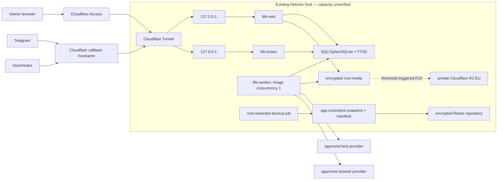

# Life in Days — Hetzner shared-host deployment spike

- **Date:** 2026-08-14
- **Owner:** Product Council — Technical Architect
- **Status:** Roadmap `In progress` — research report complete; live-host qualification, experiments, and deployment remain unexecuted
**Roadmap milestone:** R0 — Shared-Host Private Foundation (2026-08-17 to 2026-08-28)

## 1. Decision in one page

### Recommendation

Reuse the existing Hetzner server, but do **not** merge Life in Days into an existing application's deployment unit.

Create a dedicated, named Docker Compose project with:

- one immutable application image used by a human web/API service, a callback gateway, and a constrained worker;
- SQLCipher/SQLite with FTS5 on a dedicated local volume as the preferred database and durable job queue;
- no Redis and no database network service in the baseline;
- two distinct loopback-only published ports: one for human traffic and one for machine callbacks;
- a dedicated internal network, volumes, secret grants, health checks, log caps, CPU/memory/PID limits, and non-root containers;
- an encrypted root-resident media store for launch, with the PRD's capacity watermarks and a conditional Cloudflare R2 transition;
- an application-consistent encrypted Restic recovery path to an independent repository;
- Cloudflare Tunnel hostname-to-loopback routing, Cloudflare Access on the human application, and callback-specific authentication on the callback gateway.

Prefer a dedicated Life in Days tunnel/configuration unit on the same server when the current Cloudflare account permits it without incremental cost. If a new tunnel is not suitable, add two explicit mappings to the existing tunnel only after backing up, validating, and rule-testing the complete existing configuration. The application must not claim that edge enforcement alone replaces origin authorization.

### Database decision

Retain the existing architecture plan's **SQLCipher/SQLite baseline**. PostgreSQL is the fallback, not the default.

The SQLCipher baseline advances only if an R0 target-runtime spike proves all of the following on the same filesystem and container runtime intended for production:

1. the exact SQLCipher build is pinned and exposes FTS5;
2. the database, WAL, and temporary pages remain encrypted under the selected build flags;
3. one web process, one callback-gateway process, and one worker process meet the synthetic concurrency contract in WAL mode;
4. the durable job lease/outbox protocol survives kill/restart and stale leases;
5. online backup produces a restorable encrypted snapshot without copying a live database file incorrectly;
6. schema upgrade, compatible rollback, incompatible restore, and key-based recovery work;
7. measured memory, CPU, and I/O stay inside the coexistence budget established from the target host.

If any hard gate fails, use a private Compose-network PostgreSQL service with no host port. PostgreSQL would add a daemon, shared buffers, background processes, WAL operations, credentials, health sequencing, and a larger backup/upgrade surface; it is justified only by measured concurrency or operability evidence.

### What this spike does not establish

This spike did not connect to the server, inspect the Hetzner or Cloudflare account, create a tunnel, reserve a port, install Docker, configure secrets, create storage, deploy the application, or execute a restore. It therefore does not establish capacity, coexistence, authentication, backup, recovery, security, deployment, or production readiness.

## 2. Question and success criteria

The spike asks:

> Can Life in Days run on the already-paid Hetzner server without destabilizing existing systems, while preserving the product's privacy, recovery, and best-effort availability contracts?

The answer is **architecturally yes, operationally unproven**. The topology has no inherent requirement for a second server, but the target host must pass the live gates in section 13.

Success for this spike required:

- source-grounding in the global PRD, UX specification, v5 prototype/code, and existing architecture plan;
- current first-party evidence from Hetzner, Docker, Cloudflare, SQLite/SQLCipher, PostgreSQL, Restic, Backblaze, and Cloudflare R2;
- a public-safe record of read-only local discovery;
- a decision matrix and a reversible recommendation;
- explicit coexistence, rollback, recovery, and live-admission gates;
- no infrastructure mutation and no readiness claim.

## 3. Product and architecture constraints

| Constraint | Source | Architectural consequence |
| --- | --- | --- |
| One private human user; no anonymous or public journal route | `LID-SCP-001`, `LID-OPS-001` | Human surface is behind Access and origin JWT validation; no application account database. |
| Human and callback traffic have different trust contracts | `LID-OPS-002` | Separate loopback ports and services; callback gateway exposes no human route or media read path. |
| Fixed `Asia/Kolkata` Journal Date with immutable source time | `LID-SCP-002` | Store UTC instants and explicit journal dates; use IANA timezone rules in domain code. |
| Authentic sources, Corrections, and generated artifacts remain distinct | `LID-SCP-003`, `LID-SRC-*` | Append-only revisions and versioned derived artifacts; no mutable all-purpose entry row. |
| Photos and photo-derived data never enter AI requests | `LID-TG-009`, `LID-TG-010`, `LID-AIT-006` | Compile-time module boundary, allowlisted request DTOs, serialized-canary privacy tests. |
| Copied database/media should not disclose journal/photo content | `LID-OPS-004` | SQLCipher for the whole database, authenticated per-object media encryption, keys outside data volumes. |
| No plaintext image on ordinary disk or unencrypted swap | `LID-OPS-005` | Bounded tmpfs staging, constrained decoder, concurrency one, startup/health swap gate. |
| Root launch with exact watermarks and safe rejection | `LID-OPS-006` | Measure actual filesystem bytes; capacity guardrails are domain behavior, not an operator note. |
| Independent, proven recovery | `LID-OPS-011`, `LID-OPS-012` | Application-consistent encrypted Restic snapshots, checks, restores, and Recovery Ceremony before launch. |
| Best effort, no HA/SLA promise | `LID-OPS-018` | Controlled downtime is acceptable; durable jobs and dependency isolation matter more than active-active complexity. |
| v5 is a static, browser-memory prototype | v5 README and audit | Reuse interaction intent only; it is not application or infrastructure evidence. |

Authoritative sources:

- [Global PRD](../product/PRODUCT-REQUIREMENTS.md)
- [UX specification](../design/UX-SPECIFICATION.md)
- [Phase1 source baseline](../council/PHASE1-SOURCE-BASELINE.md)
- [Prototype v5 feature audit](../audits/PROTOTYPE-V5-FEATURE-AUDIT.md)
- [Existing implementation baseline](../architecture/IMPLEMENTATION-PLAN.md)
- [Phase1 Roadmap Manifest](../project/PHASE1-ROADMAP-MANIFEST.json)
- [Prototype v5](../../prototypes/calendar-ui/index-v5.html)
- [Prototype v5 behavior source](../../prototypes/calendar-ui/app-v5.js)
- [Prototype v5 presentation source](../../prototypes/calendar-ui/styles-v5.css)

## 4. Read-only discovery and experiment log

### 4.1 Repository and workstation observations

| Probe | Sanitized result | Interpretation |
| --- | --- | --- |
| Scan Phase1 for Dockerfile, Compose, systemd, Terraform, Ansible, Restic, and deploy/runbook files | None existed at spike start | Deployment automation has not been implemented in Phase1. |
| Inspect v5 HTML, JavaScript, CSS, README, handoff, and feature audit | Static fictional prototype; browser-memory behavior only | No API, persistence, encryption, integration, auth, backup, or deployment code exists. |
| Run `npm run check:v5` | Passed Node syntax checks for the v5 JavaScript and prototype server | This is syntax evidence only. |
| Check local deployment tools | `cloudflared` available; Docker, Restic, hcloud, Terraform, and Ansible unavailable | The workstation cannot be used as evidence for the target server or a Compose/Restic rehearsal. |
| Inspect local SSH configuration without printing aliases or destinations | Two aliases exist; neither is clearly identified as the target | There was no clearly authorized target, so no SSH connection was attempted. |
| Inspect local Cloudflare directory without reading credential contents | No locally managed tunnel configuration or credential file was found | Live tunnel topology and authorization remain unknown. |
| Inspect workstation SQLite build | SQLite 3.51.0 with FTS5; no SQLCipher binary | FTS5 syntax can exist locally, but SQLCipher packaging/encryption remains untested. |

The workstation results are deliberately not treated as target-host facts.

### 4.2 Live-host probe decision

No server alias, account context, or narrowly identified noninteractive read-only target was available in Phase1. Probing an arbitrary SSH alias would have expanded scope and risked disclosing private topology. No live host or provider call was made.

### 4.3 Reproducible R0 experiments still required

| Experiment | Method | Pass condition | Failure action |
| --- | --- | --- | --- |
| Sanitized host inventory | Run the read-only preflight in the shared-host runbook | OS/arch, Docker/Compose, `MemAvailable`, CPU/load, filesystem, ports, swap, existing service counts, and baseline percentiles recorded without names/IPs | Do not deploy; resolve runtime or capacity gap. |
| SQLCipher build proof | Build the pinned application image; query `cipher_version` and compile options | Expected SQLCipher version, FTS5, thread safety, temp-store policy, and key behavior pass | Select PostgreSQL fallback or a reviewed SQLCipher package. |
| Encrypted-file proof | Populate synthetic canaries; inspect DB/WAL/temp artifacts without key | No canary/plaintext is recoverable; wrong key fails closed | Block R0. |
| Web/hooks/worker concurrency | Synthetic browser reads, callback receipt writes, and durable worker writes under WAL | No lost work; bounded busy handling; queue leases recover after process kill | Tune single-writer discipline or select PostgreSQL. |
| Online backup/restore | Invoke application backup command, Restic snapshot, clean restore, schema/invariant verifier | Restored encrypted database/media and manifest match | Block launch and backup claims. |
| Compose collision rehearsal | `docker compose config`, dry inventory, unique project/ports/networks/volumes, health tests | No existing resource or listener is replaced; resource caps honored | Change names/ports/limits; never stop other stacks. |
| Tunnel rule rehearsal | Validate complete candidate config and test both host rules plus catch-all | Human and callback hostnames reach only their loopback services; unmatched traffic is 404 | Keep current tunnel unchanged. |
| Resource soak | Synthetic archive/capture/search/export/backup over the agreed observation window | Existing workloads remain inside agreed baseline; no swap/plaintext/disk threshold breach | Reduce limits/schedule, use native systemd alternative, or reject co-location. |

## 5. Current first-party findings

### 5.1 Hetzner facts

- Hetzner documents that shared-resource plans distribute compute resources between instances and may burst above a baseline. Dedicated-resource plans offer predictable CPU. The exact plan of the existing server was not inspected, so its CPU predictability is unknown. [Hetzner server FAQ](https://docs.hetzner.com/cloud/servers/faq/)
- Hetzner's console graphs do not show guest RAM because that requires in-guest instrumentation. Capacity admission therefore needs `MemAvailable`, cgroup, and process/container evidence collected on the server. [Hetzner server FAQ](https://docs.hetzner.com/cloud/servers/faq/)
- Hetzner Cloud Firewalls are stateful. Inbound rules end in implicit deny, while outbound becomes implicit deny only when outbound rules exist. A Tunnel design can avoid opening a new inbound web port, but existing SSH/firewall behavior must be preserved. [Hetzner Firewall FAQ](https://docs.hetzner.com/cloud/firewalls/faq/)
- Hetzner Backups and Snapshots copy the server disk, have a consistency caveat when taken from a running system, and omit attached Volumes. Backups have seven rotating slots and are bound to the server. They are useful host recovery aids, not a substitute for application-consistent independent Restic recovery. [Hetzner Backup/Snapshot FAQ](https://docs.hetzner.com/cloud/servers/backups-snapshots/faq/)

### 5.2 Docker Compose facts

- Compose project names group and isolate resources, allowing multiple deployments on one host without reusing each other's names. This supports the rule “reuse the host, not the deployment unit.” [Compose application model](https://docs.docker.com/compose/intro/compose-application-model/)
- Compose supports CPU, memory, PID, read-only filesystem, capability, tmpfs, health-check, logging, and service-user controls. Support for `deploy` is platform-dependent, so the R0 rehearsal must verify the exact Compose implementation and also use supported service-level controls where appropriate. [Compose services reference](https://docs.docker.com/reference/compose-file/services/) and [Compose deploy specification](https://docs.docker.com/reference/compose-file/deploy/)
- Publishing a container port without a host address exposes it broadly by default. Publishing explicitly to `127.0.0.1` restricts it to the Docker host under current Docker behavior; Docker warns about older Engine versions, so the version remains a gate. [Docker port publishing](https://docs.docker.com/engine/network/port-publishing/)
- Compose grants file-backed secrets per service under `/run/secrets`; this is preferable to broad environment variables, but the source secret file and host permissions still need explicit control. [Docker Compose secrets](https://docs.docker.com/compose/how-tos/use-secrets/)
- Compose starts services in dependency order but readiness requires health checks. The SQLCipher baseline avoids a database readiness race, while web/worker still require schema/config health gates. [Compose startup order](https://docs.docker.com/compose/how-tos/startup-order/)

### 5.3 Cloudflare facts

- Cloudflare Tunnel establishes outbound connections and maps public hostnames to local services; no new inbound web port is required. Multiple applications can share one tunnel. [Cloudflare Tunnel](https://developers.cloudflare.com/tunnel/) and [Tunnel routing](https://developers.cloudflare.com/tunnel/routing/)
- Locally managed ingress evaluates rules in order and requires a catch-all. `cloudflared tunnel ingress validate` checks syntax, and `cloudflared tunnel ingress rule` shows the first matching rule. [Tunnel configuration file](https://developers.cloudflare.com/cloudflare-one/networks/connectors/cloudflare-tunnel/do-more-with-tunnels/local-management/configuration-file/)
- Access application tokens are signed JWTs. Origin validation should verify signature, issuer, audience, expiry, and the matching rotating key rather than trust the presence of a header. [Validate Access JWTs](https://developers.cloudflare.com/cloudflare-one/access-controls/applications/http-apps/authorization-cookie/validating-json/)
- Access supports a policy/application session duration of seven days, and MFA is separately configurable. These settings are still unverified in the live account. [Access session management](https://developers.cloudflare.com/cloudflare-one/access-controls/access-settings/session-management/) and [MFA requirements](https://developers.cloudflare.com/cloudflare-one/access-controls/policies/mfa-requirements/)
- `Cache-Control: private` excludes shared caches, while `no-store` directs clients and intermediaries not to store the response. The app must emit these headers and an edge rule must not override them for personal paths. [Cloudflare cache control](https://developers.cloudflare.com/cache/concepts/cache-control/)

### 5.4 SQLCipher/SQLite and PostgreSQL facts

- SQLCipher transparently encrypts database pages and documents encrypted WAL/journal pages when built with the required temporary-store configuration. It is a specialized SQLite build, not a generic loadable extension; exact packaging and compile options matter. [SQLCipher design](https://www.zetetic.net/sqlcipher/design/)
- SQLite WAL permits concurrent readers and a writer, but only one writer exists at a time and every process must be on the same host. Long-lived readers can impede checkpoints. This fits a low-volume single-host design only after synthetic concurrency and checkpoint tests. [SQLite WAL](https://www.sqlite.org/wal.html)
- SQLite's Online Backup API copies a consistent live snapshot incrementally; a plain filesystem copy of a live WAL database is not the approved backup method. [SQLite Online Backup API](https://www.sqlite.org/backup.html)
- FTS5 is part of SQLite but may depend on compile-time enablement. The target SQLCipher package must prove FTS5 rather than assume it. [SQLite FTS5](https://www.sqlite.org/fts5.html)
- PostgreSQL typically starts with 128 MB of shared buffers and also uses background/worker processes and operating-system cache. That value is not a total-footprint estimate, but it proves a resident server resource surface absent from embedded SQLite. [PostgreSQL resource consumption](https://www.postgresql.org/docs/current/runtime-config-resource.html)
- PostgreSQL supports consistent `pg_dump` exports and stronger multi-writer/server operations. Its supplied encryption options do not provide SQLCipher-equivalent whole-database application-controlled encryption by default; client-side or column encryption complicates search and operational tooling. [PostgreSQL backup](https://www.postgresql.org/docs/current/backup-dump.html) and [PostgreSQL encryption options](https://www.postgresql.org/docs/current/encryption-options.html)

### 5.5 Recovery and conditional object storage facts

- Restic distinguishes repository structure checks from reading data packs; checks do not replace actual restores. [Restic repository checks](https://restic.readthedocs.io/en/stable/045_working_with_repos.html) and [Restic restore](https://restic.readthedocs.io/en/stable/050_restore.html)
- Backblaze recommends a scoped application key rather than the master key and documents a Restic/B2 integration. Credential files still require root-restricted handling. [Backblaze application keys](https://www.backblaze.com/docs/en/cloud-storage-application-keys) and [Restic with B2](https://www.backblaze.com/docs/cloud-storage-integrate-restic-with-backblaze-b2)
- Cloudflare R2 supports an EU jurisdiction and strongly consistent object listing. That does not prove a complete inventory unless pagination, expected-manifest comparison, hashes, and error handling all pass. [R2 data location](https://developers.cloudflare.com/r2/reference/data-location/) and [R2 consistency](https://developers.cloudflare.com/r2/reference/consistency/)
- Enabling a Cloudflare R2 development URL makes bucket contents public. The conditional design keeps public access disabled and streams decrypted content only through the authenticated application. [R2 public buckets](https://developers.cloudflare.com/r2/buckets/public-buckets/)

## 6. Proposed deployment topology

### Trust and process boundaries

| Unit | Allowed access | Explicitly denied |
| --- | --- | --- |
| `life-web` | Human routes, Access JWT validation, domain services, private media read | Telegram token, VoiceNotes secret, unrestricted host filesystem, Docker socket |
| `life-hooks` | Only callback routes, callback-specific secret/allowlist checks, enqueue/outbox transaction | Human HTML/search/media/export routes; Access cookie use as machine auth |
| `life-worker` | Durable jobs, source adapters, AI adapters, constrained media derivation | Public listener; browser session handling; unrestricted concurrency |
| SQLCipher volume | Web/worker/hook database connections on the same host | Network export; direct public mount; ordinary file copy as live backup |
| Media volume | Web read; worker write/derive; backup read | AI modules; callback response body; public object URLs |
| Backup service | Read-only consistent snapshot/media/config inputs; scoped repository credential | Application provider credentials; journal plaintext logs; Docker socket |
| `cloudflared` | Two explicit hostname mappings and catch-all 404 | Database/media volumes; application secrets other than its own tunnel credential |

## 7. SQLCipher/SQLite versus PostgreSQL

Scores are relative for this product: 1 is poor and 5 is strong. A score is a planning judgment, not a benchmark.

| Criterion | SQLCipher/SQLite | PostgreSQL | Evidence and consequence |
| --- | ---: | ---: | --- |
| Incremental hosting cost | 5 | 5 | Both can run on the existing host; neither proves that capacity exists. |
| Resident/process footprint | 5 | 2 | SQLite is embedded. PostgreSQL has a server, shared buffers, background processes, connection state, and WAL management. |
| Whole-database application-controlled encryption | 5 | 2 | SQLCipher encrypts pages/WAL. PostgreSQL needs client/column or filesystem/block encryption; search becomes harder. |
| Lexical search over private text | 5 | 3 | FTS5 can live inside the encrypted SQLCipher database. PostgreSQL FTS is strong, but plaintext `tsvector` conflicts with copied-disk secrecy unless separately protected. |
| Concurrent writers | 2 | 5 | SQLite WAL has one writer. PostgreSQL is stronger if measured workload needs multiple writers. |
| Single-host web + worker fit | 4 | 4 | SQLite fits if transactions are short and jobs serialize heavy writes; both are viable. |
| Backup simplicity | 4 | 3 | SQLite Online Backup can create one consistent encrypted snapshot; PostgreSQL has mature tools but more roles/WAL/version surface. |
| Operational familiarity/tooling | 3 | 5 | PostgreSQL offers extensive operations tooling; SQLCipher native packaging must be proven. |
| Container isolation | 4 | 4 | Both can be isolated; PostgreSQL adds a networked trust boundary and secret. |
| Horizontal growth | 2 | 5 | Not an MVP driver; the product is one user on one host. |
| **Weighted product fit** | **Preferred if gates pass** | **Fallback if gates fail** | Optimize for private single-user coexistence and encryption, not hypothetical scale. |

### Four-GB shared-host framing

The current planning material describes the shared host as 4 GB, but this spike did not verify that value, current availability, cgroup limits, swap behavior, or co-resident demand. Four GB is therefore a comparison frame, not an admission fact, and no fixed Life in Days allocation is approved.

| Operational surface | SQLCipher/SQLite baseline | PostgreSQL fallback | Required target evidence |
| --- | --- | --- | --- |
| Process and cgroup isolation | Database code runs inside the bounded web/hooks/worker processes; there is no database daemon or database network listener. Each process can still consume page cache, statement/FTS memory and WAL/checkpoint I/O. | Separate private-network service and credential; server parent/background/worker processes, shared buffers, connections and OS cache require their own CPU/memory/PID budget. No host port is permitted. | Per-service RSS/cgroup peaks, aggregate `MemAvailable`, OOM/swap evidence and co-resident percentiles under the same synthetic workload. |
| Resident-memory floor | No separate configured shared-buffer floor is introduced, but this is not a claim of zero database memory and no total is estimated before measurement. | PostgreSQL documents a typical 128 MB `shared_buffers` default; this is only one allocation and not total PostgreSQL memory. Connection/work memory, background processes and OS cache remain additional measured surfaces. [PostgreSQL resource consumption](https://www.postgresql.org/docs/current/runtime-config-resource.html) | Soak both the selected branch and application processes; retain protected host reserve rather than treating nominal 4 GB as available. |
| Disk and write amplification | Main encrypted file plus WAL/checkpoint/temp activity and an Online Backup snapshot; one writer means short transactions and bounded checkpoint behavior are hard gates. | Data files, WAL, temporary work, logs and dump/restore artifacts; more operational headroom and upgrade surface. | Peak bytes/inodes and I/O latency during ingest, search, checkpoint, backup, restore and heavy-job non-overlap. |
| Search and copied-disk secrecy | FTS5 resides inside SQLCipher pages if the pinned build exposes it; encrypted WAL/temp behavior must be demonstrated with canaries. | PostgreSQL FTS is mature, but PostgreSQL does not provide SQLCipher-equivalent application-controlled whole-database encryption by default; plaintext indexes/columns require a different reviewed encryption/search design. | Wrong-key tests, on-disk canary scan, exact query recall, index rebuild and backup/restore on the target image. |
| Backup consistency | SQLite Online Backup produces the consistent snapshot; copying the live DB/WAL is prohibited. One encrypted snapshot is operationally compact. | `pg_dump` can take a consistent export while the database is in use, but roles, server version, extensions, globals and restore sequencing expand the proof surface. | Clean separate-path restore, invariant/hash comparison, migration and compatible/incompatible rollback rehearsal. |
| Concurrency trigger | WAL allows readers with one writer; this is preferred only if web + worker busy handling, leases and checkpoints stay bounded. | Genuine multi-writer concurrency and richer server operations are stronger. | Select PostgreSQL only when the SQLCipher gates fail or measured concurrent-write/operability evidence justifies its extra footprint. |

The comparison intentionally reports official design/default facts and identifies missing measurements; it does not subtract guessed values from 4 GB or claim that either branch fits the live host.

### Clear decision rule

Use SQLCipher/SQLite if the R0 spike passes every hard gate. Do not switch to PostgreSQL merely because it is more familiar. Switch if any of these occurs:

- target runtime cannot provide a maintained, pinned SQLCipher + FTS5 build;
- encrypted WAL/temp behavior cannot be demonstrated;
- the three-process web/hooks/worker workload cannot meet bounded busy/checkpoint behavior;
- online backup/restore or migration/recovery is unreliable;
- measured host contention remains unsafe after sensible limits and scheduling;
- an approved future requirement introduces genuine multi-writer or multi-host needs.

## 8. Deployment option matrix

| Option | Cost | Coexistence | Isolation | Reproducibility | Recovery surface | Decision |
| --- | ---: | ---: | ---: | ---: | ---: | --- |
| Dedicated Compose project + SQLCipher/SQLite | 5 | 5 | 4 | 5 | 4 | **Preferred**, gated by runtime/concurrency/restore evidence |
| Native systemd processes + SQLCipher/SQLite | 5 | 4 | 3 | 3 | 4 | Fallback if Docker is absent or container overhead fails measured budget |
| Dedicated Compose project + PostgreSQL | 5 | 3 | 4 | 5 | 3 | Database fallback if SQLCipher gates fail |
| Add Life in Days services to another application's Compose project/network | 5 | 1 | 1 | 2 | 1 | Reject; coupled lifecycle, naming, credentials, and rollback |
| New Hetzner server | 1 | 5 | 5 | 5 | 4 | Reject for Phase1 cost objective; revisit only if co-location admission fails |

## 9. Coexistence controls

### 9.1 Resource and naming isolation

- Fixed Compose project name `life-in-days`; do not use `container_name` or reuse another stack's named network/volume.
- Dedicated loopback ports selected only after `ss`/Docker inventory; never bind host `80`, `443`, or a wildcard address.
- No Docker socket mount, privileged container, host PID/network namespace, or shared application volume.
- Non-root UID/GID, read-only root filesystem, dropped capabilities, `no-new-privileges`, bounded PIDs, tmpfs staging, explicit writable mounts.
- Memory/CPU/PID/I/O values remain placeholders until a sanitized host baseline and synthetic soak determine them.
- Image worker concurrency is one. Backup, export, image derivation, and AI artwork must use a shared heavy-job semaphore so they cannot saturate the host together.
- JSON log rotation is capped by size/count; no third-party telemetry.

### 9.2 Filesystem and storage isolation

- Separate application root, database, media, export, staging, backup-cache, and release paths; no parent directory shared with another application.
- Long-form Compose bind syntax with `create_host_path: false` avoids silently creating a misspelled root-owned directory.
- Database/media permissions are least privilege. Backup reads the prepared application snapshot, not a live database file.
- Root media enforcement follows `LID-OPS-006`; no hostwide cleanup, image pruning, or deletion/downsampling of Originals is an automated remediation.
- R10 is trigger-based and date-free. No Cloudflare R2 bucket or migration is created during R0.

### 9.3 Network and tunnel isolation

- `life-web` and `life-hooks` publish only to explicit loopback addresses.
- Human and callback traffic route to different ports/services. The callback service exposes a strict method/path allowlist and bounded body size.
- Keep a catch-all `http_status:404` rule after explicit tunnel routes.
- Protect human traffic with Access; validate JWT issuer/audience/signature/expiry at origin.
- Telegram secret + numeric sender/private-chat allowlist is evaluated before download. VoiceNotes authentication remains blocked on its synthetic spike.
- Personal responses emit `Cache-Control: private, no-store`; static content-hashed application assets are the only candidates for shared caching.

### 9.4 Lifecycle isolation

- One immutable digest drives web/hooks/worker. Migrations are a distinct one-shot command.
- Deployment never invokes hostwide Docker restart, prune, network cleanup, or another Compose project's commands.
- Use `docker compose -p life-in-days ...`; never use an unscoped `docker compose down` from an ambiguous directory.
- Retain the prior image digest, secret-free config, and application-consistent predeploy snapshot through the observation window.

## 10. Capacity-admission design

No numeric container limit is approved by this spike. The host must supply evidence first.

### Required baseline

Collect at least the agreed observation window for:

- total and available memory, swap state/activity, OOM history;
- CPU/load and CPU steal where available;
- root filesystem size/free/inode state and growth;
- existing container/service count and aggregate CPU/memory without publishing names;
- current listeners and candidate loopback-port availability;
- Docker Engine/Compose/storage-driver versions;
- backup/export/image-job timing and I/O contention;
- current cloudflared service/config ownership and restart procedure.

### Admission rule

R0 may proceed only when the Product Council records:

1. a protected host safety reserve;
2. aggregate limits for Life in Days that stay within observed headroom;
3. a heavy-job schedule that does not overlap known host peaks;
4. disk thresholds consistent with `LID-OPS-006`;
5. a verified stop-the-worker/read-only-web degradation path;
6. no listener, project-name, volume, network, timer, or tunnel collision.

If the host cannot admit the minimum web, worker, encrypted database, temporary image, and backup operations with reserve, the zero-extra-cost objective is not achievable on that host. The council must then reduce runtime overhead (native systemd alternative), reschedule heavy work, or explicitly revisit cost; it must not silently underprovision safeguards.

## 11. Deployment and rollback strategy

### Deployment

1. Verify live capacity, port/name isolation, Docker/Compose compatibility, tunnel ownership, and current restore evidence.
2. Pull the immutable image digest without changing running services.
3. Generate and review the resolved secret-free Compose configuration.
4. Create an application-consistent encrypted database snapshot and manifest; run repository check and a bounded restore proof according to milestone gate.
5. Pause new worker claims; let safe in-flight work finish or expire leases.
6. Apply the reviewed forward migration as a one-shot task.
7. Start new services on their existing loopback ports during controlled private downtime, unless measured headroom supports an alternate-port rehearsal.
8. Verify liveness, readiness, schema, callback negative tests, Access enforcement, cache headers, media decrypt, queue, budget, and System Health.
9. Resume jobs and observe existing workloads as well as Life in Days.

### Rollback

- **Compatible schema:** pause claims, switch to the prior immutable image digest, run health/invariant checks, resume.
- **Forward-only schema with healthy data:** use the reviewed forward fix; never improvise a destructive downgrade.
- **Suspected corruption/incompatible restore:** freeze writes, preserve evidence, restore the predeploy snapshot into a separate path, verify it, then cut over deliberately. Never overwrite the only current copy.
- **Callback failure:** remove/disable only the affected callback route after approval; keep captured receipts and reconciliation state.
- **AI failure:** disable the exact provider/model configuration; never silently route to another provider.
- **Host pressure:** stop the worker and reject new media while keeping authenticated reads/non-media management where safe.

The operational command sequence is in [HETZNER-SHARED-HOST-RUNBOOK](../architecture/HETZNER-SHARED-HOST-RUNBOOK.md).

## 12. Security and privacy analysis

| Threat | Control | Proof gate |
| --- | --- | --- |
| Other app lifecycle stops/replaces this app | Dedicated Compose project/network/volumes/ports | Collision rehearsal and exact resource-label inventory |
| Life in Days exhausts shared host | Container limits, concurrency one, heavy-job semaphore, watermarks | Baseline + soak + pressure degradation rehearsal |
| Bypass Cloudflare Access | Loopback-only binding, Tunnel, origin JWT validation | Direct-public negative test and invalid/missing JWT tests |
| Forged callback | Separate gateway, strict routes/methods/body sizes, provider auth/idempotency | Contract/security suite before live callbacks |
| Copied host disk reveals memories | SQLCipher DB, authenticated media encryption, external recovery key | Synthetic canary disk/WAL/temp inspection |
| Plaintext photo reaches disk/swap | tmpfs, bounded decoder, no swap gate, crash cleanup | Fault-injection and forensic artifact scan |
| Photo data reaches AI | Package dependency rule, allowlisted DTOs, serialized canaries | Release-blocking privacy suite |
| Live DB copied inconsistently | Application online-backup command; manifest; Restic snapshot | Clean restore/invariant verifier |
| Shared tunnel edit breaks another app | Separate config/tunnel preferred; otherwise backup, validate, rule-test, controlled replica | Complete configuration diff and service recovery test |
| Backup mistaken for recovery | Restic check plus sample/full restore and Recovery Ceremony | Recorded restore/decrypt evidence and owner sign-off |

## 13. Remaining live gates

| Gate | Evidence required | Milestone effect |
| --- | --- | --- |
| `HTZ-G01 Target identity` | Exact authorized host/account context identified without publishing it | Blocks every live probe and deploy action |
| `HTZ-G02 Capacity` | Sanitized host baseline and coexistence budget accepted | Blocks Compose limits and admission |
| `HTZ-G03 Runtime` | Supported Linux arch, Docker Engine/Compose, storage driver, systemd, cloudflared ownership verified | Blocks deployment topology freeze |
| `HTZ-G04 Collision` | Project/network/volume/listener/timer/tunnel names and ports prove isolated | Blocks first start |
| `HTZ-G05 SQLCipher` | Pinned build, FTS5, encrypted DB/WAL/temp, WAL concurrency, online backup/restore pass | Selects SQLite or PostgreSQL branch |
| `HTZ-G06 Media safety` | tmpfs, decoder limits/codecs, swap, crash cleanup, ciphertext verification pass | Blocks Telegram media enablement |
| `HTZ-G07 Access` | Exact owner allow policy, MFA/session, JWT validation, negative tests, cache bypass pass | Blocks human data use |
| `HTZ-G08 Callbacks` | Separate routing plus Telegram contract; VoiceNotes spike passes before its route | Blocks provider callback enablement |
| `HTZ-G09 Recovery` | Independent Restic repository, checks, clean restore, two off-server key-copy ceremony | Blocks private launch |
| `HTZ-G10 Rollback` | Compatible-image rollback and separate-path restore rehearsal pass | Blocks release candidate |
| `HTZ-G11 Owner acceptance` | User verifies release scenarios and authorizes live enablement | Blocks production launch |

## 14. Milestone recommendations

- **P0 — Council Planning Baseline (2026-08-14 to 2026-08-16):** planning artifacts may be Done only with the evidence named by the canonical manifest; no implementation status is implied.
- **R0 — Shared-Host Private Foundation:** live-host preflight, SQLCipher/FTS/backup spike, Compose isolation rehearsal, Access/tunnel negative tests, secrets/key ADR, and synthetic backup/restore. This milestone is deployable only as a private foundation with synthetic data.
- **R1–R9:** every release must carry forward coexistence, migration, rollback, cache, privacy, and recovery checks appropriate to its changed surface.
- **R10 — Conditional Object-store Transition:** remains date-free until a PRD capacity trigger occurs. It cannot be pulled forward merely because Cloudflare R2 is available.

## 15. Assumptions and confidence

| Item | State |
| --- | --- |
| Existing Hetzner server exists and can be used | User-provided fact; current topology/capacity unverified |
| Server has 4 GB RAM | Mentioned in the current PRD/plan; not live-verified and not used as capacity proof |
| Docker is installed on target | Unknown |
| Existing `cloudflared` can accept new routes safely | Unknown |
| Cloudflare plan supports the intended Access/tunnel arrangement without added cost | Unknown; verify before configuration |
| SQLCipher Community/package choice meets maintenance/licensing/security needs | Unknown; ADR and target build proof required |
| Root filesystem can admit the 10 GB media plan and safety floor | Unknown |
| Independent backup account/repository exists | Unknown |
| VoiceNotes can support unattended authoritative reconciliation | Unknown; synthetic spike blocks enablement |

**Confidence:** high in the topology and decision gates; medium in the SQLCipher preference pending target proof; no confidence claim for live-host capacity or readiness.

## 16. Product Council decision request

Adopt the following architectural baseline for planning:

1. reuse the host, isolate the deployment;
2. Compose + SQLCipher/SQLite is preferred;
3. PostgreSQL is the evidence-triggered fallback;
4. separate human and callback loopback services;
5. no new inbound web port;
6. no deployment or real content before the live gates, restore proof, and Recovery Ceremony;
7. R10 remains conditional and date-free.

This is a planning decision. It does not authorize provider, DNS, server, credential, or deployment changes.
