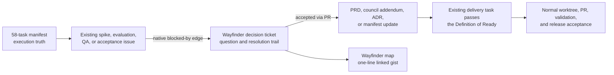

# Wayfinder for Life in Days Phase 1 — adoption and GitHub integration report

- **Research date:** 2026-08-14
- **Scope:** the locally installed `wayfinder` skill, the current Life in Days Phase 1 planning system, and GitHub.com capabilities that can implement the skill's map, child-ticket, dependency, claim, and frontier model
- **Source policy:** installed skill instructions, the upstream skill repository, current project artifacts, authenticated read-only GitHub queries, and GitHub-owned documentation/API/changelog sources
- **Change boundary:** this investigation created and refined only this Markdown report and its repository navigation. It did not create, edit, assign, relate, close, or comment on any GitHub issue, nor change any Project field, view, workflow, or repository setting.

> [!IMPORTANT]
> This report is a design recommendation, not authorization to create a Wayfinder map or mutate GitHub. The [Phase 1 roadmap manifest](../project/PHASE1-ROADMAP-MANIFEST.json) remains the canonical delivery source unless a later explicit product decision changes that authority.

## Executive summary

**Recommendation: adopt Wayfinder, but narrowly and additively.** Use it to clear the small set of evidence-gated decisions that can block Phase 1 execution. Do not use it to replace the existing 58 work packages, mirror the release plan, or claim that it will execute Phase 1 by itself.

| Executive decision | Recommendation |
| --- | --- |
| Should Life in Days use Wayfinder? | **Yes, conditionally.** Pilot it as a decision-readiness overlay. |
| What should remain authoritative? | The governing product/design/architecture artifacts and the 58-task roadmap manifest. |
| What should the pilot cover? | R0 shared-host admission and database-path decisions, for no more than two weeks. |
| What should it not cover? | The complete backlog, implementation tasks, routine QA, release status, or the frozen prototype program. |
| What must happen first? | Protect the delivery views with `label:phase1`, harden Project auto-add/close workflows, keep decision issues out of Project #1, update the sync/runbook sources, and revalidate the exact 58-task projection. |
| When should it expand? | Only after the pilot proves value; strongest later candidates are R5 VoiceNotes, R6/R7 model qualification, and trigger-activated R10. |
| What is the expected benefit? | A resumable, auditable frontier for route-changing decisions across agent sessions, without pretending uncertainty is delivery progress. |
| How does it help complete full Phase 1? | At each qualifying gate: canonical evidence → Wayfinder owner decision → merged PRD/Council/ADR update → delivery task passes the Definition of Ready → normal implementation, QA, and release acceptance. |
| Current action | Research and design only. No Wayfinder issues, labels, relationships, views, or other GitHub mutations were created. |

The fit is unusually good at the decision gates already named by the Product Council: shared-host admission, SQLCipher versus PostgreSQL, VoiceNotes go/no-go, exact text-model configuration, exact artwork configuration, private-launch authority, and the conditional R10 trigger. Those are questions whose answer changes the route. They match Wayfinder's decision-ticket model. Most design, implementation, QA, and release-acceptance issues do not; they are work to execute after the route is clear.

GitHub now provides the native pieces Wayfinder expects:

- parent/sub-issue relationships, with up to 100 direct children and eight hierarchy levels;
- native blocked-by and blocking relationships, with up to 50 links in each direction;
- issue assignment that can show claimed ownership, although it is not a unique session lock in this local environment;
- Project hierarchy display, Parent issue and Sub-issue progress fields;
- filters for `parent-issue:`, `is:blocked`, `is:blocking`, `blocked-by:`, `blocking:`, assignees, labels, and issue state;
- current GitHub CLI support for parent, sub-issue, dependency, assignee, and relationship JSON operations.

Sources: [adding sub-issues](https://docs.github.com/en/issues/tracking-your-work-with-issues/using-issues/adding-sub-issues), [dependencies GA](https://github.blog/changelog/2025-08-21-dependencies-on-issues/), [hierarchy view GA](https://github.blog/changelog/2026-03-19-hierarchy-view-in-github-projects-is-now-generally-available/), [filtering Projects](https://docs.github.com/en/issues/planning-and-tracking-with-projects/customizing-views-in-your-project/filtering-projects), and [GitHub CLI relationship support](https://github.blog/changelog/2026-06-10-manage-sub-issues-types-and-dependencies-from-github-cli/).

There are two decisive safeguards:

1. **Keep two ledgers from competing.** A Wayfinder resolution is an auditable decision conversation and pointer. A product or architecture decision is not complete until the appropriate PRD, council record, ADR, manifest, or other authoritative repository artifact is updated and merged. The map's Notes must say this explicitly.
2. **Protect the canonical Project before adding any Wayfinder issue.** The current sync tool continually sets both Phase 1 saved views to `repo:arunpr614/Life-Reflection is:issue`, while enabled workflows auto-add open issues/sub-issues, set Status to Backlog or Done, and close items moved to Done. Before a pilot, change the manifest-driven views and auto-add boundary to `label:phase1`, update the runbook, keep Wayfinder items out of Project #1, and prove the Project, views, workflows, and status projection still reconcile to exactly the 58 delivery issues.

The recommended first move is a **small R0 pilot**, not a full-map launch: one map starting with two or three decision tickets and capped at five, the existing R0 spike as the pre-build evidence blocker, the native issue hierarchy, and one verified frontier query. If an initial charting session finds no genuine decision fog beyond the already-defined pass/fail gates, create no map and continue with `SPK-R0-001`; that is a successful Wayfinder outcome. Expand only if the pilot preserves source authority, status counts, privacy, and human comprehensibility.

## 1. What the installed Wayfinder skill actually does

The installed skill is a planning method for work too large or uncertain for one agent session. Its central artifact is a GitHub issue called the **map**, labelled `wayfinder:map`. The map names a destination, carries standing Notes, indexes completed decisions, records still-imprecise in-scope fog, and states what is out of scope.

### Installed-skill provenance

This report used the installed files directly rather than relying on a third-party summary:

| Local primary source | Identifying metadata | SHA-256 at research time |
| --- | --- | --- |
| `~/.codex/skills/wayfinder/SKILL.md` | Frontmatter name `wayfinder`; description begins “Plan a huge chunk of work”; `disable-model-invocation: true` | `d33e2141f7c8bbfd137fef0213cbec465820e4680e67da5d0f0815d6742d26c2` |
| `~/.codex/skills/setup-matt-pocock-skills/issue-tracker-github.md` | GitHub tracker adapter; section `Wayfinding operations` | `ec8332bb69e7e79e349989e940be481a0c79b552be3acc613e718278bcc5e03d` |

These hashes identify the exact local instructions inspected on 2026-08-14; a future implementation should re-read the installed files because a skill update could change the operating rules. The installed Wayfinder file also matched the current [upstream Wayfinder source](https://github.com/mattpocock/skills/blob/main/skills/engineering/wayfinder/SKILL.md) by Git blob identity at research time. The GitHub tracker adapter still describes raw REST wiring for relationships, so this report cross-checked it against the newer native GitHub CLI 2.94 support rather than assuming every command example remained current.

An [open upstream report about Codex not honoring the `wayfinder:grilling` label](https://github.com/mattpocock/skills/issues/625) is an operational warning, not proof that this local installation will fail. Until that issue is resolved and locally revalidated, every session must preflight the selected ticket's title, body, labels, assignees, parent, and blocker state before working it. A human-in-the-loop ticket must never be treated as autonomous merely because its label was not loaded into context.

Open work is not copied into the map body. Each precise question is a child issue of the map and has one type label:

| Type | Interaction | Purpose |
| --- | --- | --- |
| `wayfinder:research` | Agent-led | Establish an external or local fact on which a decision waits. |
| `wayfinder:prototype` | Human-in-the-loop | Create a cheap concrete artifact so a behavior or design choice can be judged. |
| `wayfinder:grilling` | Human-in-the-loop | Resolve a decision through live discussion with the person who owns the answer. |
| `wayfinder:task` | Agent-led or human-in-the-loop | Complete manual work that must happen before a decision can be made. It exists to unblock a decision, not to deliver the destination. |

The skill's most important rules are:

- **Plan by default.** The map is complete when nothing material remains to decide before execution. It does not normally implement the destination.
- **Name the destination first.** Scope and all subsequent tickets depend on the exact end state.
- **Ticket only a precise question.** A foreseeable but not yet precisely stateable question remains under Not yet specified—the “fog of war.”
- **Use native dependencies.** A ticket is unblocked when every blocker is closed.
- **Use assignment as the claim in the skill's generic protocol.** An open, unassigned ticket is unclaimed and the first write is assignment. Because all local Codex sessions authenticate as the same GitHub identity, the Phase 1 pilot must additionally serialize selection through one orchestrator; assignment alone cannot distinguish or exclude two concurrent local sessions.
- **Define the frontier as open + unblocked + unassigned map children.** That is the set safely available to work now.
- **Dispatch every charted research child immediately.** Use a research subagent, capture its result on a throwaway `research/<name>` branch, and put a context pointer on the ticket. In this shared filesystem, each branch must have its own worktree before parallel research begins.
- **Resolve one non-research ticket per session.** Record the answer in a resolution comment, close the ticket, and append only a one-line linked gist to the map's Decisions so far.
- **Refer to tickets by linked names, not bare numbers.** This keeps the map readable to a human.
- **Keep decision detail in the ticket.** The map is an index, not a duplicate decision store.

The skill metadata disables automatic model invocation. In practice, Wayfinder should be invoked explicitly for a named map or a deliberate charting session. That is an advantage here: ordinary implementation work should not silently turn itself into a Wayfinder exercise.

## 2. Current Phase 1 baseline

The repository is not starting from a loose idea. It already has a detailed, evidence-gated execution system:

- [58 canonical work packages](../project/PHASE1-ROADMAP-MANIFEST.json) across P0 and R0–R10;
- 78 requirements, of which 71 are active and seven explicitly deferred;
- [release PRDs/PID](../product/releases/) and a detailed [implementation plan](../architecture/PHASE1-IMPLEMENTATION-PLAN.md);
- a [council decision record](../council/PHASE1-COUNCIL-DECISION-RECORD.md) that explicitly lists seven decisions left evidence-gated;
- a manifest-driven [GitHub Project synchronization contract](../project/PHASE1-GITHUB-PROJECT-SYNC.md);
- a private [Life Reflection Project](https://github.com/users/arunpr614/projects/1) with Status and Roadmap views;
- a public repository and public issue conversations, which means issue bodies and comments must contain sanitized planning information only.

The current manifest status is 40 Backlog, four Next, one In progress, and 13 Done. The Done items are planning/definition evidence, not implementation or deployment. The active item is the R0 shared-host coexistence and rollback spike; sanitized live-host proof is still outstanding.

### 2.1 Read-only live capability audit

Authenticated read-only checks on 2026-08-14 established:

| Observation | Result | Implication |
| --- | --- | --- |
| Repository | Public `arunpr614/Life-Reflection`; Issues and Projects enabled | Map tickets and comments will be public even though the Project is private. |
| GitHub CLI | Version 2.94.0 | Native sub-issue and dependency flags are available; raw REST wiring is unnecessary for normal operation. |
| Canonical Phase 1 issues | 58 | The manifest/issue baseline is intact. |
| Existing assignees | 0 of 58 | Claim semantics are not presently overloaded by an existing assignment convention. |
| Existing parent/sub-issue relationships | 0 of 58 | A pilot can introduce hierarchy without rewriting an existing issue hierarchy. |
| Existing dependency relationships | 0 of 58 | Manifest dependencies are currently text/data relationships, not native GitHub edges. |
| Project fields | 25 visible to the authenticated owner | The current field set already includes Assignees, Parent issue, and Sub-issues progress; no new custom field is required for the core Wayfinder model. |
| Current saved-view filter | `repo:arunpr614/Life-Reflection is:issue` | New Wayfinder issues would enter both canonical Phase 1 views unless the filter is narrowed first. |
| Enabled Project workflows | Auto-add open issues/PRs, auto-add sub-issues, Backlog on add, Done on close, close on Done, plus linked/merged PR reactions | A hidden decision item could still affect shared Status, closure, raw item counts, and Insights; view filters alone are insufficient. |

The audit used read-only forms of `gh --version`, `gh issue list --json`, `gh project view`, `gh project field-list`, and repository GET requests. It did not print or persist tokens, Project node identifiers, personal content, or private topology.

## 3. Fit: decision layer versus execution layer

### 3.1 Where Wayfinder fits

The Council already distinguishes settled product scope from evidence-gated decisions. That is the exact seam where Wayfinder adds value.

| Existing evidence-gated decision | Evidence producer in the 58-task plan | Wayfinder value |
| --- | --- | --- |
| Is the existing host safe for the stack? | `SPK-R0-001` | Makes the pre-build admit/hold/reject decision explicit rather than treating spike completion as implicit approval. `REL-R0-001` remains a later release-acceptance gate. |
| Is SQLCipher/SQLite suitable, or must PostgreSQL be selected? | `SPK-R0-001`, R0 ADR work | Keeps an evidence-based branch visible and prevents both databases from being deployed by assumption. |
| Is the VoiceNotes contract implementable? | `SPK-R5-001` | Turns the provider-contract evidence into an explicit go/no-go/reopen decision. |
| Which exact text configuration may be enabled, if any? | `EVAL-R6-001` | Separates blind evaluation facts from the owner/configuration decision. |
| Which exact artwork configuration and sweep eligibility may be enabled, if any? | `EVAL-R7-001` | Preserves a deliberate safety/quality/cost choice after the evaluation. |
| May private launch proceed? | `QA-R9-001` and `REL-R9-001` evidence | Gives the owner go/no-go decision an explicit human-in-the-loop home. |
| Has the R10 trigger fired, and may transition begin? | R8 capacity evidence and R10 entry record | Keeps the conditional milestone genuinely date-free until an approved decision exists. |

These seven questions are already recorded in the [Council Decision Record](../council/PHASE1-COUNCIL-DECISION-RECORD.md#decisions-deliberately-left-evidence-gated). Wayfinder would make their sequencing, blockers, claims, and resolution trails easier to operate across many agent sessions.

### 3.2 Where Wayfinder does not fit

Do not turn the following into Wayfinder tickets merely because they are large:

- implementing Calendar, Journal Day, upload, Telegram capture, search, lifecycle, AI adapters, or recovery;
- running a test matrix whose method and acceptance threshold are already decided;
- producing a named release artifact already represented by a manifest work package;
- moving an issue between Backlog, Next, In progress, and Done;
- a change small enough to understand and finish in one normal session;
- a question already answered by the governing PRD or a direct owner decision;
- any work whose issue would require real journals, real photos, credentials, private URLs, unsanitized host data, or photo-derived descriptions.

Those belong in the existing task/PR/release process. Wayfinder should answer “which route is now approved?” rather than “did an implementation task finish?”

### 3.3 Why the 58 existing issues should not all become map children

Technically, one GitHub parent can have 100 direct sub-issues, so 58 children would fit. That does not make it a good model. [GitHub permits 100 direct children and eight hierarchy levels](https://docs.github.com/en/issues/tracking-your-work-with-issues/using-issues/adding-sub-issues), while the REST API's `replace_parent` behavior shows that a sub-issue has one current parent relationship. [REST sub-issue API](https://docs.github.com/en/rest/issues/sub-issues?apiVersion=2026-03-10)

Converting all 58 delivery issues would:

- violate Wayfinder's “decision ticket, not a build slice” default;
- create two meanings for the same issue—delivery work package and decision ticket;
- make assignment mean both execution ownership and a transient Wayfinder claim;
- conflate map completion with Phase 1 implementation completion;
- make future hierarchy choices harder because each issue has one parent;
- add relationship churn without improving the already-complete release decomposition.

The safer design is a small set of new decision tickets as map children. Existing delivery issues can be referenced as evidence producers or native blockers where useful, but remain governed by the manifest.

### 3.4 Release-by-release fit

| Milestone | Fit | Recommended use |
| --- | --- | --- |
| P0 | None now | Do not backfill accepted planning decisions. Use the council change process if later evidence reopens one. |
| R0 | Strong pilot | Resolve only genuine host-admission, database-path, access-boundary, recovery, or rollback choices. Use synthetic and sanitized evidence. |
| R1 | Exception only | Use only if R0 evidence reopens source, date, persistence, or recovery policy. Authentic-memory admission remains an explicit owner decision. |
| R2 | Low | Capture, gallery, cover, deduplication, and derivative rules are already specified. Use Wayfinder only if evidence exposes a new privacy or storage tradeoff; never reopen the no-photo-to-AI boundary. |
| R3 | Low | Timeline, lexical search, date review, and atomic redating are implementation work unless target evidence invalidates the design. |
| R4 | Low to medium | Use only for a material unresolved export-passphrase, conflict, suppression, or lifecycle choice. Otherwise execute the canonical tasks. |
| R5 | Strong later | If `SPK-R5-001` exposes a genuine route-changing branch, parallelize only the additional research it requires and record the implement/reopen/no-go decision without duplicating the spike. |
| R6 | Strong later | Keep provider facts and evaluation evidence separate from the human decision to enable an exact text configuration or leave it disabled. |
| R7 | Strong later | Record the exact accepted artwork configuration and sweep eligibility, or an explicit disabled outcome, after evaluation. |
| R8 | Exception only | QA, capacity measurement, and fault hardening stay in the delivery plan. Use Wayfinder only if evidence forces a route-changing architecture choice. |
| R9 | Limited | At most one owner proceed/hold/rollback decision after canonical UAT, Recovery Ceremony, observation, and severity evidence. Add no new scope. |
| R10 | Strong only after trigger evidence | Canonical capacity metrics establish whether the threshold has been reached; one owner decision confirms activation. Create a map only if activation exposes multiple transition choices, and keep R10 date-free until that decision. |

This pattern intentionally leaves most of Phase 1 outside Wayfinder. Its value is highest where the route branches; it adds little where the work is already precisely specified.

## 4. GitHub capability matrix

| Wayfinder concept | Current GitHub support | Exact constraint or caution | Life in Days pattern |
| --- | --- | --- | --- |
| Map | Ordinary issue plus `wayfinder:map` label | Public repository means public body/comments. | One sanitized issue with Destination, Notes, Decisions so far, Not yet specified, and Out of scope. |
| Child ticket | Native sub-issue | 100 direct children; eight levels; at least triage permission; a child has one current parent; API add is restricted to the same repository owner. | New decision issues under the map; keep the hierarchy shallow. |
| Ticket type | Repository label | Labels are taxonomy, not enforcement. | Four required type labels, `wayfinder:map`, and a required umbrella `wayfinder` label for stable search/isolation. |
| Blocking | Native issue dependency | Up to 50 links per direction; at least triage permission; rapid writes can trigger secondary rate limits. | Wire edges after issues exist; preflight the graph before adding relationships. |
| Claim | Issue assignee | Write access is required to assign; up to 10 assignees. Every local Codex session uses the same owner identity, so two sessions can both assign and re-read the same result without detecting a collision. | Use one orchestrator as the only selector/claimer during the pilot. Assignment remains human-visible ownership, not an atomic session lock. Use distinct identities or an external atomic lease before allowing independent claimers. |
| Frontier | Project/repository filters plus dependency state | `is:blocked` is documented by GitHub's dependency GA announcement; use a simple saved filter and still verify by API before claiming. | `parent-issue:OWNER/REPO#MAP is:open no:assignee -is:blocked`. |
| Low-resolution map | Issue body | Do not duplicate open tickets or full decisions. | Keep only destination, notes, closed-ticket gists, fog, and out-of-scope lines. |
| Decision resolution | Comment + closed issue | Shared Project workflows can set Done or close an issue before the required handoff is complete. | Keep pilot tickets out of Project #1. In a later isolated decision Project, omit auto-close until the closure invariant is proven; never infer delivery completion. |
| Hierarchy visualization | Native issue hierarchy and optional Project hierarchy view | Project hierarchy is GA, enabled by default on new views, and toggleable on existing views. | Use the issue hierarchy during the pilot; add a table with Parent issue/Sub-issues progress only in a later isolated decision Project. |
| Progress | Sub-issue progress field | Counts closure, not whether the decision changed authoritative docs correctly. | Treat it as navigation, never acceptance proof. |
| Automation | Built-in workflows, APIs, webhooks, Actions | Current Project workflows would auto-add open Wayfinder issues/sub-issues and apply shared Status/closure behavior; auto-add is plan-limited and does not backfill; `GITHUB_TOKEN` cannot access Projects; not every webhook event is an Actions trigger. | Keep decision issues out of Project #1, harden workflow filters before the pilot, and use on-demand CLI. Do not add credentialed automation until a stable invariant justifies it. |

Sources: [adding sub-issues](https://docs.github.com/en/issues/tracking-your-work-with-issues/using-issues/adding-sub-issues), [REST sub-issues](https://docs.github.com/en/rest/issues/sub-issues?apiVersion=2026-03-10), [creating dependencies](https://docs.github.com/en/issues/tracking-your-work-with-issues/using-issues/creating-issue-dependencies), [REST dependency endpoints](https://docs.github.com/en/rest/issues/issue-dependencies?apiVersion=2026-03-10), [assigning issues](https://docs.github.com/en/issues/tracking-your-work-with-issues/using-issues/assigning-issues-and-pull-requests-to-other-github-users), [Parent issue/Sub-issue progress fields](https://docs.github.com/en/issues/planning-and-tracking-with-projects/understanding-fields/about-parent-issue-and-sub-issue-progress-fields), [dependency filters and limits](https://github.blog/changelog/2025-08-21-dependencies-on-issues/), [built-in Project automation](https://docs.github.com/en/issues/planning-and-tracking-with-projects/automating-your-project/using-the-built-in-automations), and [Actions automation](https://docs.github.com/en/issues/planning-and-tracking-with-projects/automating-your-project/automating-projects-using-actions).

## 5. Recommended operating architecture



This architecture preserves a clean boundary:

- **The manifest says what work exists and its delivery state.**
- **The evidence issue or artifact proves facts.**
- **The Wayfinder ticket records the decision discussion and points to the accepted change.**
- **The authoritative repository document carries the normative outcome.**
- **Normal implementation agents and PRs execute the work.**

### 5.1 Source-of-truth contract

| Layer | Authority |
| --- | --- |
| Governing PRD, UX specification, release PRD/PID, architecture/ADR, and Council record | Normative product, experience, system, and approval decisions |
| Roadmap generator and `PHASE1-ROADMAP-MANIFEST.json` | Delivery-task identity, scope, status, dates, dependencies, evidence expectations, and requirement mapping |
| Canonical repository issues and GitHub Project views | Synchronized execution and visualization projections |
| Wayfinder decision ticket | Temporary working record for one unresolved question, its evidence, ownership, and resolution trail |
| Wayfinder map | Bounded index and frontier for one decision effort; never a duplicate specification or release plan |

While a decision is open, its ticket is the working conversation. On resolution, the governing artifact receives the normative answer, the manifest changes only if delivery metadata changed, and the ticket closes with links to both the accepted source and affected delivery issue. The map receives only a one-line linked gist.

### 5.2 Required map Notes for this project

The map's Notes should include these standing rules:

1. Read the [AI-agent resource index](../project/AI-AGENT-RESOURCE-INDEX-2026-08-14-15-10-39-IST.md), governing PRD, UX Specification, Council Decision Record, applicable release PRD/PID, implementation plan, and manifest before resolving a ticket.
2. The manifest remains delivery truth. Wayfinder governs decision readiness only.
3. A decision ticket closes only after the normative outcome is merged into the applicable authority document, or the resolution explicitly establishes that no normative change is required.
4. The resolution comment links the exact artifact/PR/commit and summarizes evidence boundaries. It does not paste a second copy of the decision contract.
5. Use fictional or sanitized evidence only. Never put journals, photos, credentials, account identifiers, private URLs, raw host topology, provider responses, or photo-derived data in an issue or asset.
6. Real-photo data never enters an AI request.
7. Do not mutate providers, DNS, host services, credentials, deployment, backup, restore, or production state without separate explicit authorization.
8. A closed decision ticket does not mark an implementation or release issue Done.
9. Use ticket names in human-facing narration and map gists, with the URL inside the name.
10. Work at most one non-research decision ticket per session. The designated orchestrator serializes all claims; it may coordinate independent research in parallel.
11. Immediately dispatch each charted `wayfinder:research` ticket to a research subagent in its own worktree on a throwaway `research/<name>` branch, then add the result's context pointer to the ticket.

This is the essential adaptation that prevents Wayfinder's canonical map from displacing the repository's established source-precedence rules.

## 6. Proposed R0 pilot and later map portfolio

Do not create one permanent “Complete Phase 1” map. Its destination would be too broad, it would remain open for months, and its future tickets would become a second release backlog. Use small release-scoped maps only when at least two material, evidence-dependent decisions can change the route. Keep at most one such map active during the pilot.

### 6.1 Pilot destination

Suggested map title: **R0 Decision Readiness Map**

> **R0 is decision-complete for synthetic-shell implementation: shared-host admission, database path, access/callback boundary, and the intended recovery and rollback contract are resolved in governing artifacts and linked to existing delivery work, without deploying the shell or admitting authentic memory data.**

If the Wayfinder-required charting conversation finds that current R0 documents already make the route unambiguous and only evidence collection remains, stop without creating the map. Continue through canonical `SPK-R0-001`, then the normal architecture, engineering, and release-acceptance sequence.

### 6.2 Candidate pilot tickets

These are candidate names and shapes, not issue-creation instructions. Final charting must use the skill's grilling and domain-modeling pass, start with two or three children, and never exceed five during the pilot.

| Proposed linked-name style | Type | Initial blocker/evidence | Resolution shape |
| --- | --- | --- | --- |
| **Admit, hold, or reject the existing shared host for R0** | `wayfinder:grilling` | Canonical `SPK-R0-001` capacity, collision, coexistence, restart, rollback, and non-regression evidence | Record the owner-approved host disposition and measured boundary in the applicable ADR/council artifact. |
| **Retain SQLCipher/SQLite or activate the PostgreSQL fallback** | `wayfinder:grilling` | Canonical target-runtime proof for encryption, FTS5, WAL concurrency, backup, restore, migration, and crash recovery | Freeze exactly one database path in ADR-002; do not deploy both by assumption. |
| **Accept the R0 access, callback, recovery, and rollback design boundary** | `wayfinder:grilling` | Canonical R0 spike and architecture evidence | Accept one bounded pre-build design contract or name the precise evidence gap that keeps implementation held. |

The existing R0 spike feeds the pre-build decisions. `REL-R0-001` remains downstream of architecture and engineering and must not block those decisions, which would create a dependency cycle. Do not recreate either canonical checklist as `wayfinder:task` children.

### 6.3 Fog and out-of-scope boundaries

Keep these under **Not yet specified** unless R0 evidence makes one a precise question:

- a native-systemd route if the accepted Compose route proves unsupported;
- an alternate topology under the no-new-instance constraint if the host fails admission;
- a different key or recovery design if the preferred proof fails;
- an external-fact refresh only after charting names the exact possibly stale fact, the decision waiting on it, and its freshness cutoff; do not duplicate the existing shared-host spike;
- a Council addendum if evidence invalidates an accepted baseline.

Keep these explicitly **Out of scope**:

- building or deploying the shell;
- authentic journals or photos;
- credential collection or paid/provider mutation;
- R1–R10 feature implementation;
- private topology, identifiers, capacity detail, URLs, or raw provider responses in public issues.

### 6.4 Later maps—create just in time, not now

| Candidate decision effort | Earliest creation point | Destination |
| --- | --- | --- |
| **VoiceNotes Contract Decision Map** | Only when `SPK-R5-001` produces a non-trivial branch | Accept the exact prospective contract, explicitly reopen affected requirements, or retain VoiceNotes as blocked. |
| **Text Configuration Decision Map** | When current provider facts and `EVAL-R6-001` evidence exist | Enable one exact passing configuration or deliberately leave generated text disabled. |
| **Artwork Configuration Decision Map** | When `EVAL-R7-001` evidence exists | Enable exact passing configurations and sweep eligibility, or deliberately leave artwork disabled. |
| **Private Launch decision ticket** | After R8/R9 evidence is complete | Use a single owner ticket unless several real tradeoffs emerge; do not create a map by default. |
| **R10 activation decision, then optional Transition Decision Map** | After canonical metrics show the threshold has been reached | Use one owner ticket to confirm activation; create a map only if multiple transition choices then need to be resolved. |

### 6.5 Pilot success and stop rules

Run the pilot for no more than two weeks. Start with two or three open tickets, enforce a hard cap of five, keep additional owner time at or below 60 minutes per week, and hold one 15-minute weekly frontier review.

Success requires:

- the two canonical Phase 1 views contain exactly the manifest's current 58 delivery issues, and their status distribution matches the manifest at every reconciliation; the 2026-08-14 baseline is 40/4/1/13;
- Project #1 contains no Wayfinder issue, and its 58 canonical issue items remain the only issue inputs to delivery Status and Insights;
- zero Wayfinder tickets duplicate canonical tasks;
- at least two material uncertainties are resolved if a map is created;
- a fresh session identifies the frontier, current blockers, governing authority, and next permitted action within 10 minutes without a repository-wide scan;
- every closed ticket links the merged governing artifact or explicitly records that no normative change was required;
- additional owner time remains at or below 60 minutes per week;
- closing a decision ticket does not change a delivery issue's manifest status;
- no sensitive or personal information is written to GitHub.

Stop or pause if charting finds no real fog, more than 20% of proposed tickets duplicate existing artifacts, any Wayfinder item enters Project #1, the delivery views stop reconciling to 58, more than five open decision tickets exist without a clear frontier, owner overhead exceeds 90 minutes per week for two weeks, a decision closes before source reconciliation, Wayfinder Done is treated as implementation evidence, or any privacy incident occurs.

## 7. GitHub tracker and Project-isolation design

### 7.1 Mandatory precondition: isolate the canonical Project, not only its views

The current sync script sets both saved views to:

```text
repo:arunpr614/Life-Reflection is:issue
```

That filter was exact only while the repository had exactly the 58 canonical issues. Before creating Wayfinder issues, change the script-owned filter to:

```text
repo:arunpr614/Life-Reflection is:issue label:phase1
```

Then update [the synchronization runbook](../project/PHASE1-GITHUB-PROJECT-SYNC.md), run the tool's dry-run, apply only with explicit GitHub mutation authority, and independently verify that all 58 manifest issues—and no decision issues—match the delivery views, with a status distribution equal to the manifest at that time. The 2026-08-14 baseline is 40/4/1/13. The script currently rewrites the views on every apply, so a UI-only filter change would be temporary and is not sufficient.

View filtering alone is not containment. Read-only inspection found an enabled auto-add rule for open issues/PRs from this repository, enabled sub-issue auto-add, Backlog-on-add, Done-on-close, close-on-Done, and linked/merged-PR workflows. A Wayfinder issue would enter the Project under the current open-issue rule, receive delivery-style Status updates, affect Project-wide Insights, and could be closed by automation even while hidden from the two delivery views.

The safest pilot policy is:

1. keep every Wayfinder map and child issue **out of Project #1**;
2. narrow the Project's issue auto-add rule to `label:phase1` and prove the sub-issue workflow cannot add non-`phase1` children, or disable that sub-issue rule before the pilot;
3. audit the Status/close workflows and prove they cannot act on Wayfinder tickets;
4. use repository issue hierarchy and search for the pilot frontier; and
5. after creating each authorized pilot item, verify the Project's raw item set, delivery views, Insights inputs, and workflows remain free of Wayfinder issues.

If Project visualization later proves valuable, create a separate private **Life Reflection Decisions** Project with its own fields and workflows. Do not add decision items to the existing delivery Project merely to reuse its Status field.

### 7.2 Tracker placement gate

The repository is public. A private Project does not make the underlying issue body or comments private. Use the repository tracker only when the entire question, evidence summary, discussion, and resolution can remain public-safe.

For a decision that depends on private host measurements, identifiers, topology, credentials, personal content, or non-public provider material:

1. keep the sensitive evidence in an approved private location;
2. put only a sanitized conclusion and evidence class in the public ticket; and
3. if the decision cannot be understood safely that way, use a private decision repository or an explicitly configured local-Markdown tracker instead of the public repository.

Do not place a sensitive local map under an unignored repository scratch path. Verify the storage location and ignore rules before writing it.

### 7.3 Labels

Minimum required labels:

- `wayfinder:map`
- `wayfinder:research`
- `wayfinder:prototype`
- `wayfinder:grilling`
- `wayfinder:task`

Required umbrella label for this operating model:

- `wayfinder` — applied to both the map and all child tickets to support stable repository search and, later, an isolated decision-Project filter.

Do not add `phase1` to Wayfinder issues unless the Product Council deliberately decides that those decision tickets belong in the canonical 58-task delivery count. The recommended design keeps them separate.

### 7.4 Pilot issue queries and optional isolated views

Use the map issue's native sub-issue hierarchy plus repository issue searches during the pilot. The same filters can become saved views only inside a later isolated decision Project.

| Surface | Filter or action | Use |
| --- | --- | --- |
| **Wayfinder map** | Open the `wayfinder:map` issue and its native sub-issue hierarchy | Destination, fog, decisions, parent-child order, and progress navigation. |
| **All Wayfinder items** | `repo:arunpr614/Life-Reflection is:issue label:wayfinder` | Audit taxonomy and find maps/tickets without entering Project #1. |
| **Wayfinder frontier** | `parent-issue:arunpr614/Life-Reflection#MAP is:open no:assignee -is:blocked` | Candidate tickets for the single orchestrator to preflight and claim. |
| **Wayfinder claimed** | `parent-issue:arunpr614/Life-Reflection#MAP is:open has:assignee` | Human-visible ownership; not proof of a unique local session lease. |
| **Wayfinder blocked** | `parent-issue:arunpr614/Life-Reflection#MAP is:open is:blocked` | Inspect native dependency edges and current blockers. |
| **Wayfinder decisions** | `parent-issue:arunpr614/Life-Reflection#MAP is:closed` | Resolution history, interpreted from comments and authoritative links. |

GitHub's dependency GA announcement explicitly documents `is:blocked`, `is:blocking`, `blocked-by:`, and `blocking:` in Projects and repository issue search. [Dependencies on issues](https://github.blog/changelog/2025-08-21-dependencies-on-issues/) Project filters also support `no:assignee`, `parent-issue:`, negation, and saved views. [Filtering Projects](https://docs.github.com/en/issues/planning-and-tracking-with-projects/customizing-views-in-your-project/filtering-projects) Explicit `AND`/`OR` became GA in July 2026, but the simple filters above avoid depending on complex Boolean parsing. [Advanced Project search GA](https://github.blog/changelog/2026-07-16-advanced-search-for-projects-is-generally-available/)

### 7.5 Status is a projection, not the frontier definition

Do not add another custom “Frontier” or “Blocked” field. GitHub already has native dependency and assignee state. A copied field would drift.

If an isolated Wayfinder Project is added after the pilot, its Status may show decision items as Backlog, In progress, or Done. That projection is a convenience only. The canonical logic remains:

- open + unassigned + no open blockers = frontier;
- open + assigned = visibly claimed by the owner identity, with the designated orchestrator holding the actual local session lease;
- open + at least one open blocker = blocked;
- closed = resolved or ruled out of scope, interpreted from its resolution.

GitHub allows 50 fields per Project, including system fields. Field capacity is not the reason to avoid copied state; eliminating drift and automation coupling is. [About Projects](https://docs.github.com/en/issues/planning-and-tracking-with-projects/learning-about-projects/about-projects)

## 8. CLI and API implementation guidance

### 8.1 Prefer the current native CLI

The installed tracker adapter tells Wayfinder to use raw REST calls for sub-issues and dependencies. That was once necessary, but the workstation now has GitHub CLI 2.94.0. GitHub added native hierarchy/dependency support in that release, including create/edit flags and JSON fields. [GitHub CLI 2.94 relationship support](https://github.blog/changelog/2026-06-10-manage-sub-issues-types-and-dependencies-from-github-cli/)

For a future authorized implementation, prefer these high-level operations:

```text
gh issue create --repo OWNER/REPO --parent MAP --label wayfinder --label wayfinder:TYPE ...
gh issue edit TICKET --repo OWNER/REPO --add-blocked-by BLOCKER
gh issue edit TICKET --repo OWNER/REPO --add-assignee @me
gh issue list --repo OWNER/REPO --json number,title,state,assignees,parent,blockedBy,blocking,subIssues
```

The commands above are examples only and were not executed as mutations during this research.

Advantages over raw REST wiring:

- callers use issue numbers or URLs instead of confusing an issue number with its numeric database ID;
- the CLI already exposes the relationship fields an agent needs to compute/verify the frontier;
- command intent is clearer in audit logs;
- less custom parsing and API-version handling is required.

The REST APIs remain useful for a dedicated integration. Adding a sub-issue requires the sub-issue's numeric ID and permits `replace_parent`; adding a dependency requires the blocking issue's numeric database ID. Both mutation families can return validation errors, and rapid relationship writes can cause secondary rate limiting. [REST sub-issues](https://docs.github.com/en/rest/issues/sub-issues?apiVersion=2026-03-10) and [REST dependencies](https://docs.github.com/en/rest/issues/issue-dependencies?apiVersion=2026-03-10)

### 8.2 Frontier verification

Before claiming a ticket, the single designated orchestrator should re-read current GitHub state—not rely on a stale Project tab:

1. Load the map and its ordered child issues.
2. Keep only open children.
3. Drop any issue with an assignee.
4. Drop any issue whose current open-blocker count is non-zero.
5. Select the first remaining ticket in map/sub-issue order.
6. Assign it to `@me` as the first write.
7. Record which local task received the work in the orchestrator's coordination state, then dispatch it.
8. Re-read blockers and ticket type before any resolution write.

Assignment cannot provide mutual exclusion between independent local sessions because they all authenticate as `arunpr614`; simultaneous assignments converge to the same visible state. Do not run independent claimers during the pilot. Distinct GitHub identities or an external atomic lease would be required before relaxing the single-orchestrator rule.

GraphQL exposes `subIssues`, `assignees`, `blockedBy`, `blocking`, and `issueDependenciesSummary`. The summary distinguishes current counts from totals including closed relationships, which is what frontier computation needs. [GraphQL Issues reference](https://docs.github.com/en/graphql/reference/issues)

The current GraphQL `subIssues` field exposes pagination but no explicit `orderBy` argument. GitHub's hierarchy UI synchronizes issue and Project hierarchy ordering, but an automation should test that the returned connection order matches the human map order before depending on “first” as a stable priority contract. This is an implementation verification requirement, not a claim that the order is wrong.

### 8.3 Automation posture

Start with on-demand CLI operations. Do not build an automation merely because webhooks and APIs exist.

GitHub provides dedicated `issue_dependencies` and `sub_issues` webhooks, but the current Actions event reference warns that not every webhook event triggers a workflow and does not list those two as native `on:` triggers. A GitHub App/webhook receiver, scheduled reconciliation, or explicit `workflow_dispatch` would therefore be required for some real-time or derived behavior. [Webhook events](https://docs.github.com/en/webhooks/webhook-events-and-payloads) and [Actions trigger reference](https://docs.github.com/en/actions/reference/workflows-and-actions/events-that-trigger-workflows)

Further constraints:

- Built-in auto-add adds newly created or later-updated matching items but does not backfill old matches.
- Auto-add workflow count is plan-limited: one on Free, five on Pro/Team, and 20 on Enterprise Cloud/Server.
- A workflow's repository `GITHUB_TOKEN` cannot access Projects; a user Project mutation needs an appropriate Project-capable credential.
- The existing Project has enabled open-issue/PR and sub-issue auto-add rules plus shared Status/closure workflows. Any authorized pilot must narrow or isolate them deliberately rather than overwrite unrelated behavior.

Sources: [auto-add workflows](https://docs.github.com/en/issues/planning-and-tracking-with-projects/automating-your-project/adding-items-automatically), [Actions and Projects](https://docs.github.com/en/issues/planning-and-tracking-with-projects/automating-your-project/automating-projects-using-actions), and [using the Projects API](https://docs.github.com/en/issues/planning-and-tracking-with-projects/automating-your-project/using-the-api-to-manage-projects?tool=cli).

## 9. Advantages for completing Phase 1

### 9.1 It controls uncertainty instead of hiding it

The current release plan is detailed, but several future branches intentionally wait on evidence. Wayfinder gives those branches a first-class decision graph. It avoids two common failure modes: treating a proposal as decided because it appears in an implementation plan, and creating a large speculative backlog before upstream evidence is known.

### 9.2 It reduces context-reload cost across agent sessions

An agent loads the map once, selects one frontier ticket, and zooms into only the linked evidence it needs. Closed ticket details remain available on demand. For a project with hundreds of artifacts and a multi-month release sequence, this can materially reduce repeated repository-wide rediscovery.

### 9.3 It makes blocker-aware research parallelism visible

Native blockers identify what cannot begin, and assignment shows human-visible ownership. One orchestrator can safely coordinate multiple independent research tickets while keeping HITL decisions deliberate. It is more legible than parallel agents selecting tasks from a flat Backlog label, but it is not an atomic distributed lock between same-account Codex sessions.

### 9.4 It preserves genuine human decisions

Grilling and prototype tickets require the owner's participation. The agent cannot answer Arun's side of a preference, privacy, provider, launch, or cutover decision. That is particularly valuable for a personal archive, where “technically possible” is not equivalent to “owner-authorized.”

### 9.5 It turns fog into a managed state

Not yet specified is useful here because downstream provider and recovery questions will sharpen only after earlier evidence. The map can acknowledge those areas without inventing false precision or prematurely changing release tasks.

### 9.6 It creates a durable decision audit trail

The issue records the question, evidence links, discussion, resolution, actor, time, and relationship history. The map remains readable because it contains one-line pointers rather than repeated detail. This complements the Council Decision Record when the Notes require authoritative document updates before closure.

### 9.7 GitHub's current UI matches the mental model

Hierarchy view, dependency indicators, dependency filters, assignee filters, and sub-issue progress make the map usable without a separate planning product. Native relationships also remain available through REST, GraphQL, CLI, and webhooks. [Hierarchy GA](https://github.blog/changelog/2026-03-19-hierarchy-view-in-github-projects-is-now-generally-available/) and [dependencies GA](https://github.blog/changelog/2025-08-21-dependencies-on-issues/)

## 10. Costs, limitations, and failure modes

| Risk | Why it matters here | Mitigation |
| --- | --- | --- |
| Wayfinder is not an execution engine | The user wants full Phase 1 completed; the skill plans by default. | Use it only to clear decisions, then hand work to normal worktrees, PRs, tests, and release acceptance. Do not advertise map completion as product completion. |
| Duplicate sources of truth | The map/tickets could conflict with PRD, council, ADR, manifest, or Project fields. | Put the authority contract in Notes; require merged canonical change before ticket closure; map stores only linked gists. |
| Delivery-Project contamination | Current views select every repository issue, and enabled workflows auto-add/open, status, and close Project items. | Keep Wayfinder out of Project #1, narrow the sync-owned views and auto-add boundary to `label:phase1`, and revalidate raw items, views, workflows, Insights inputs, and status parity. |
| Public issue exposure | The Project is private, but repository issues/comments are public. | Sanitized planning only; never private content, credentials, topology, or provider payloads. |
| Ticket-type context can be missed | An open upstream report describes Codex ignoring a `wayfinder:grilling` label, which could turn a human decision into apparent autonomous work. | Before every claim, fetch and verify labels, body, assignees, parent, and blockers; never answer the human side of a grilling or prototype ticket. |
| Assignment is not a local-session lock | All local sessions authenticate as the same GitHub user; simultaneous assignment calls converge and cannot reveal a collision. | Serialize selection through one orchestrator. Treat assignment as human-visible ownership only; require distinct identities or an external atomic lease for independent claimers. |
| Parallel research shares a filesystem | Two research branches in one checkout can overwrite or contaminate each other's files even when the issue graph is correct. | Give every `research/<name>` branch its own clean worktree, and link its result from the ticket before removing the throwaway branch. |
| Abandoned claims | A crashed session can leave a ticket assigned forever. | Define a claim-recovery rule in Notes: review stale assignments by Updated time, contact the owner/session if possible, and unassign only through an explicit recovery action. |
| Relationship drift | GitHub edges could diverge from the map intent or manifest text dependencies. | Add a read-only map validator; do not silently infer delivery status from native edges. |
| Resolution/closure race | A ticket could close before its authoritative PR merges. | Closure checklist requires merged artifact link and post-merge re-read. |
| Automation side effects | Built-in add → Backlog, close → Done, and Done → close can bypass the required decision-resolution handoff. | Exclude Wayfinder from Project #1. If a separate decision Project is later used, omit auto-close until the closure invariant is independently proven. |
| API rate limiting | Mass ticket creation and edge wiring are content mutations. | Create tickets first, wire in a second paced pass, preflight current edges, honor rate-limit guidance, and resume idempotently. |
| Process overhead | A map can become bureaucracy when the route is already clear. | Do not ticket settled questions or ordinary implementation. Stop charting if grilling finds no meaningful fog. |
| One-ticket-per-session cadence | Applying the rule to minor decisions would slow delivery. | Size tickets to material route-changing questions; use normal issues for ordinary work; parallelize research only. |
| Future GitHub changes | Hierarchy, filters, APIs, and CLI continue to evolve. | Re-run the small read-only capability audit before implementation or when commands fail. |

## 11. Adoption decision

### Use Wayfinder if

- multiple material decisions remain and their ordering depends on evidence;
- work spans more context than one agent session can safely hold;
- Arun must personally decide privacy, provider, launch, or cutover outcomes;
- one orchestrator needs a visible blocker protocol and wants to coordinate parallel research;
- future questions are known to exist but not yet precise enough to ticket;
- the team is willing to maintain the map and authoritative artifacts together.

### Do not use Wayfinder if

- the next work package is already fully specified and can proceed under the manifest;
- the only need is task status or a release timeline;
- the proposed map merely copies all 58 tasks;
- the issue would contain sensitive operational or personal evidence;
- no one will enforce the closure-to-authority-document rule;
- the expected decision set is small enough for one normal conversation.

### Overall verdict

**Yes—use it as a controlled decision-governance layer, after an R0 pilot.** Its biggest advantage is not more planning detail; this repository already has plenty. Its advantage is maintaining a clear, resumable, concurrency-aware frontier when evidence changes the route.

The full Phase 1 operating model should be:

```text
Wayfinder clears route-changing decisions.
The manifest controls delivery work and status.
Worktrees and pull requests implement the chosen route.
Release issues and linked evidence prove acceptance.
The owner retains authority over authentic data, launch, and conditional migration.
```

Do not create a Phase 1-wide mega-map. If the R0 pilot proves that the layer reduces ambiguity without creating another stale roadmap, create later release-scoped maps just in time for R5–R7 or trigger-activated R10.

## 12. Proposed implementation sequence after explicit approval

1. Amend the manifest-driven Project sync and its runbook so canonical views use `label:phase1`; dry-run and verify the expected 58-item projection.
2. Narrow the current open-issue auto-add boundary to `label:phase1`, prove or disable non-`phase1` sub-issue auto-add, audit shared Status/close workflows, and establish that Wayfinder items remain outside Project #1.
3. Create the five required type/map labels and the required `wayfinder` umbrella label.
4. Chart the R0 map using the Wayfinder-required grilling and domain-modeling pass.
5. Create only the precise R0 decision tickets; then add parent and blocker relationships in a second pass.
6. Immediately dispatch every charted `wayfinder:research` child to a research subagent in a dedicated clean worktree on its throwaway `research/<name>` branch, and add a ticket context pointer to the result.
7. Use native issue hierarchy and verified repository queries for the pilot; create a separate private decision Project only after the pilot demonstrates a real visualization need.
8. Through the designated orchestrator, run one non-research ticket through the full claim → evidence → authoritative PR → resolution comment → close → map-gist cycle.
9. Reconcile repository issues, manifest, Project raw items/views/workflows/Insights inputs, counts, and privacy boundaries.
10. Review the pilot with Arun. Expand through small release-scoped maps only if the success criteria pass; do not backfill all seven gates into one long-lived map.

Every GitHub mutation in this sequence requires a separate authorized implementation action. This research did not perform any of them.

## Source index

### Local primary sources

- Installed `wayfinder` skill instructions, inspected 2026-08-14
- Installed GitHub issue-tracker adapter's Wayfinding operations, inspected 2026-08-14
- [Upstream Wayfinder skill source](https://github.com/mattpocock/skills/blob/main/skills/engineering/wayfinder/SKILL.md)
- [Open upstream Codex label-routing report](https://github.com/mattpocock/skills/issues/625)
- [AI Agent Resource Index](../project/AI-AGENT-RESOURCE-INDEX-2026-08-14-15-10-39-IST.md)
- [Phase 1 Roadmap Manifest](../project/PHASE1-ROADMAP-MANIFEST.json)
- [Phase 1 Release Plan](../project/PHASE1-RELEASE-PLAN.md)
- [Phase 1 Council Decision Record](../council/PHASE1-COUNCIL-DECISION-RECORD.md)
- [Phase 1 Implementation Plan](../architecture/PHASE1-IMPLEMENTATION-PLAN.md)
- [GitHub Project Sync Contract](../project/PHASE1-GITHUB-PROJECT-SYNC.md)
- [GitHub Projects Roadmap Research](GITHUB-PROJECTS-ROADMAP-RESEARCH.md)

### Current GitHub documentation and APIs

- [Adding sub-issues](https://docs.github.com/en/issues/tracking-your-work-with-issues/using-issues/adding-sub-issues)
- [REST API endpoints for sub-issues](https://docs.github.com/en/rest/issues/sub-issues?apiVersion=2026-03-10)
- [Creating issue dependencies](https://docs.github.com/en/issues/tracking-your-work-with-issues/using-issues/creating-issue-dependencies)
- [REST API endpoints for issue dependencies](https://docs.github.com/en/rest/issues/issue-dependencies?apiVersion=2026-03-10)
- [GraphQL Issues reference](https://docs.github.com/en/graphql/reference/issues)
- [Assigning issues and pull requests](https://docs.github.com/en/issues/tracking-your-work-with-issues/using-issues/assigning-issues-and-pull-requests-to-other-github-users)
- [Parent issue and Sub-issue progress fields](https://docs.github.com/en/issues/planning-and-tracking-with-projects/understanding-fields/about-parent-issue-and-sub-issue-progress-fields)
- [Filtering Projects](https://docs.github.com/en/issues/planning-and-tracking-with-projects/customizing-views-in-your-project/filtering-projects)
- [About Projects](https://docs.github.com/en/issues/planning-and-tracking-with-projects/learning-about-projects/about-projects)
- [Built-in Project automations](https://docs.github.com/en/issues/planning-and-tracking-with-projects/automating-your-project/using-the-built-in-automations)
- [Auto-add Project workflows](https://docs.github.com/en/issues/planning-and-tracking-with-projects/automating-your-project/adding-items-automatically)
- [Automating Projects using Actions](https://docs.github.com/en/issues/planning-and-tracking-with-projects/automating-your-project/automating-projects-using-actions)
- [Using the API to manage Projects](https://docs.github.com/en/issues/planning-and-tracking-with-projects/automating-your-project/using-the-api-to-manage-projects?tool=cli)
- [Webhook events and payloads](https://docs.github.com/en/webhooks/webhook-events-and-payloads)
- [Events that trigger GitHub Actions workflows](https://docs.github.com/en/actions/reference/workflows-and-actions/events-that-trigger-workflows)

### Dated GitHub announcements

- [Sub-issues GA and evolving Issues/Projects — 2025-04-09](https://github.blog/changelog/2025-04-09-evolving-github-issues-and-projects/)
- [Dependencies on issues GA — 2025-08-21](https://github.blog/changelog/2025-08-21-dependencies-on-issues/)
- [Hierarchy view in Projects GA — 2026-03-19](https://github.blog/changelog/2026-03-19-hierarchy-view-in-github-projects-is-now-generally-available/)
- [GitHub CLI sub-issue/dependency support — 2026-06-10](https://github.blog/changelog/2026-06-10-manage-sub-issues-types-and-dependencies-from-github-cli/)
- [Advanced Project search GA — 2026-07-16](https://github.blog/changelog/2026-07-16-advanced-search-for-projects-is-generally-available/)
