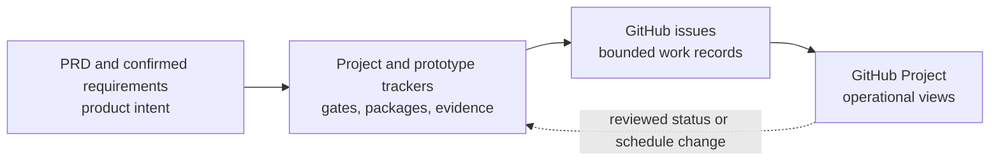

# Life in Days — GitHub Projects Roadmap design spike

- **Updated:** 2026-08-14
- **Status:** Design complete; the owner-created Project was inspected read-only and was not changed by this spike
- **Recommended platform:** Native GitHub Projects Roadmap
- **Target project:** [`Life Reflection` — user Project #1](https://github.com/users/arunpr614/projects/1)
- **Owner:** `arunpr614`
- **Visibility at inspection:** Private
- **Default repository:** [`arunpr614/Life-Reflection`](https://github.com/arunpr614/Life-Reflection)

> [!NOTE]
> This is the historical eight-item pilot design. The Product Council subsequently adopted the [58-task Phase 1 roadmap manifest](../project/PHASE1-ROADMAP-MANIFEST.json) and [release plan](../project/PHASE1-RELEASE-PLAN.md) as the execution authority while retaining this document as design rationale.

## 1. Outcome

Use the existing private `Life Reflection` Project as a **shadow operational projection** of the repository's delivery trackers. Give it two complementary headline views: a date-free horizon board inspired by GitHub's public roadmap and a true timeline Roadmap for owner-approved dates. Keep the pilot private; consider public visibility only after its issues, Project README, fields, and views pass the same publication review as the repository. Do not build a separate custom roadmap application for the first release.

The first pilot should model the stable prototype packages `PVA-001` through `PVA-008`—completed v6–v10 plus queued v11–v13—as one GitHub issue per package. This is enough to test completed and queued states, a dependency chain, grouping, filters, evidence links, and date-free work without importing the full 212-task program backlog.

The roadmap must not become a second product specification or imply dates, implementation, deployment, or production readiness that the repository does not prove. The [prototype completeness tracker](../project/PROTOTYPE-COMPLETENESS-TRACKER.md) remains authoritative for prototype-package status; the [project tracker](../project/PROJECT-TRACKER.md) remains authoritative for program gates and implementation status.

## 2. Why native GitHub Projects wins the spike

The [GitHub Projects Roadmap research](../research/GITHUB-PROJECTS-ROADMAP-RESEARCH.md) shows that the native product already supplies the useful core:

- issues, pull requests, and draft items in one project;
- table, board, and roadmap views over the same data;
- date and iteration fields for timeline placement;
- grouping, sorting, filtering, slicing, markers, and zoom;
- issue relationships, sub-issue progress, saved views, charts, and built-in workflows;
- repository-native ownership, permissions, history, and links to implementation evidence.

A custom view would initially duplicate GitHub's item, filter, permission, and update model while creating another application to maintain. Reconsider a custom renderer only if the native pilot proves a material gap—for example, a required sequence-only timeline, a read-only portfolio presentation that cannot be expressed with saved views, or automation that GitHub's API cannot support safely.

The two references that motivated this spike are related but not identical. The Roadmap feature is GitHub's date/iteration timeline layout. GitHub's own current [public roadmap Project](https://github.com/orgs/github/projects/4247) is presently organized through board views, with its primary view grouped by Quarter and sliced by Product Focus Area. This design intentionally tests both patterns instead of assuming the reference repository currently uses the timeline layout.

## 3. Spike boundaries

### In scope

- translate the existing prototype package register into a GitHub Project information model;
- define fields, statuses, saved views, item templates, and operating rules;
- define a small reversible pilot and its acceptance checks;
- identify what can be automated and what must be configured in the GitHub UI;
- preserve the repository's source precedence, evidence gates, and privacy rules.

### Out of scope

- inventing start dates, target dates, delivery quarters, or effort estimates;
- changing the owner-created live GitHub Project, repository issues, milestones, or token scopes as part of this documentation spike;
- importing all 212 executable tasks, 78 requirements, or 30 prototype packages during the pilot;
- changing G1, build authorization, implementation, deployment, or production status;
- storing personal journal text, real photos, photo-derived data, credentials, private identifiers, or provider payloads in GitHub.

### Current live-state evidence

The authenticated read-only UI inspection on 2026-08-14 established this exact baseline:

| Surface | Observed state |
| --- | --- |
| Project | `Life Reflection`, user Project #1, private, zero added collaborators |
| Repository | `arunpr614/Life-Reflection` is the default repository; repository Projects are enabled |
| Content | Zero Project items; the repository has zero issues and zero milestones |
| Views | `Monthly roadmap`, `Quarterly roadmap`, and `Backlog` from the Roadmap template |
| Fields | Status, Sub-issues progress, Team, Iteration, Quarter, Start date, and Target date |
| Status options | Todo, In progress, Done |
| Template taxonomy | Team contains Squad 1–3 and is not meaningful for this single-owner project |
| Template cadence | Iteration contains three generated two-week windows beginning 2026-08-13; Quarter contains three generated 90-day windows beginning 2026-08-13 |
| Project description | Short description and Project README are blank |
| Workflows | Seven enabled; Auto-add is on for `Life-Reflection` with `is:issue,pr is:open` |

The generated Iteration and Quarter ranges are template defaults, not approved Life in Days forecasts. No item is assigned to them. The broad auto-add rule will capture every future open issue and pull request, not only roadmap work; narrow it before repository activity grows.

The active GitHub CLI token has `gist`, `read:org`, `repo`, and `workflow` scopes but lacks `read:project` and `project`. The signed-in browser supplied the private Project evidence above. No authentication scope, Project setting, field, view, workflow, issue, milestone, or item was changed during this spike.

## 4. Source-of-truth contract

GitHub should make the plan easier to scan, not split authority across competing records.



| Information | Authoritative source | GitHub representation | Update rule |
| --- | --- | --- | --- |
| Product behavior and scope | PRD, confirmed discovery requirements, direct owner decisions | Linked requirement IDs and a concise issue summary | Never redefine behavior in a field or label. Resolve conflicts in the canonical documents first. |
| Prototype package scope and gate status | Prototype completeness tracker | One issue per `PVA-###`; Project `Status`, `Prototype stage`, and `Evidence state` | Update GitHub only from reviewed tracker evidence. A field value alone cannot close a gate. |
| Program gates, milestones, and implementation status | Project tracker | Optional phase-two gate/milestone issues | Keep separate from prototype status; a completed static prototype does not mean product implementation is complete. |
| Evidence | Frozen files, QA records, council records, commits | Links in the issue body | Link synthetic/public evidence only. Do not upload private test data. |
| Planning dates | Explicit owner-approved plan | `Start date` and `Target date` fields | Blank by default. A drag operation is a schedule change and requires the same review as typing a date. |

## 5. Item model

### Pilot grain

Create one repository issue for each prototype feature package. Use the stable package ID in the title:

```text
[PVA-006] Needs Date Review (v11)
```

The pilot contains eight items:

| ID | Version | Package | Initial status |
| --- | --- | --- | --- |
| `PVA-001` | v6 | Private Search State | Complete |
| `PVA-002` | v7 | Calendar Contract Completion | Complete |
| `PVA-003` | v8 | Cross-month Almanac | Complete |
| `PVA-004` | v9 | First-use Readiness | Complete |
| `PVA-005` | v10 | Resilient Application Shell | Complete |
| `PVA-006` | v11 | Needs Date Review | Queued |
| `PVA-007` | v12 | Telegram Capture Companion | Queued |
| `PVA-008` | v13 | Telegram Duplicate Handling | Queued |

Completed items are included to verify that the view can distinguish frozen evidence from future work. Queued items test the active dependency chain. Expanding to `PVA-030` is a separate decision after the pilot passes.

### Issue body contract

Each package issue should contain:

1. stable package ID, prototype version, and exact tracker link;
2. outcome and primary audit/requirement references;
3. dependencies and any council decision references;
4. explicit included and excluded behavior;
5. gate checklist for Product, Design, Council, Implementation, QA, and Freeze;
6. public synthetic evidence links when each gate passes;
7. the statement: “Prototype evidence only; this issue does not prove backend implementation, integration, security, storage, deployment, backup, recovery, or production readiness.”

Use issue dependencies for genuine blocking relationships where the GitHub UI supports them. Use sub-issues only when a package has independently owned executable units; do not create six administrative sub-issues merely to mirror the six gate columns.

Draft items are appropriate for an unapproved idea. Once a package exists in the governed tracker, prefer a repository issue so discussion, links, and closure history remain durable.

### Labels

Use labels for durable repository taxonomy, not for values already held in Project fields:

- `kind:prototype-package`
- `area:capture`, `area:reflection`, `area:ai`, `area:operations`, or another approved area
- `roadmap`

Do not create duplicate `status:*` labels. Status belongs in the Project field and the canonical tracker.

## 6. Field schema

| Field | Type | Values or rule | Purpose |
| --- | --- | --- | --- |
| Title | Built in | `[PVA-###] Package name (vN)` | Stable scan key and readable outcome. |
| Status | Built-in single select | Backlog; Ready; In progress; Blocked; In review; Done | Broad workflow state that also works for later program tasks. Replace the template's Todo/In progress/Done vocabulary deliberately and recheck its workflows. |
| Prototype version | Number | 6–35 | Numeric sort without parsing the title. |
| Workstream | Rename the template's Team single select | Capture; Reflection; Source integrity; AI text; Artwork; Operations and recovery; Security and access; Accessibility and closeout | Replaces meaningless Squad 1–3 values and groups packages without changing sequence. |
| Horizon | Single select | Frozen; Next; Queued; Unscheduled | Provides a date-free public board. `Next` means the next package in the approved dependency sequence, not a time commitment. |
| Prototype stage | Single select | Queued; Product; Design; Council; Implementation; QA; Freeze | Mirrors the package's active gate while Status remains a general workflow field. Detailed pass/fail evidence remains in the tracker. |
| Evidence state | Single select | Planned; Submitted; Accepted | Prevents Done from implying that required evidence has been reviewed. Completed prototype packages use Accepted. |
| Planning confidence | Single select | Unscheduled; Tentative; Owner-approved | Prevents a date from silently becoming a commitment. |
| Start date | Existing Date field | Blank unless explicitly planned | Roadmap start field. Do not backfill guessed historical dates. |
| Target date | Existing Date field | Blank unless explicitly planned | Roadmap target field. Do not derive it from version number or iteration length. |
| Iteration | Existing Iteration field | Keep unassigned before G4 Build Readiness | The template's generated two-week windows are not an adopted cadence. |
| Quarter | Existing Iteration field | Keep unassigned until a quarter forecast is explicitly approved | The template's generated 90-day windows are not owner commitments. |

Prototype-stage mapping is explicit:

| Canonical prototype state | Project Status | Prototype stage | Evidence state |
| --- | --- | --- | --- |
| Queued | Backlog | Queued | Planned |
| PM in progress | In progress | Product | Planned or Submitted |
| Design in progress | In progress | Design | Planned or Submitted |
| Council review | In review | Council | Submitted |
| Implementation in progress | In progress | Implementation | Planned or Submitted, based on linked evidence |
| QA in progress | In review | QA | Submitted |
| QA failed | Blocked | QA | Submitted |
| Blocked | Blocked | Current named stage | Planned or Submitted |
| Complete | Done | Freeze | Accepted |

The GitHub CLI can create text, number, date, and single-select fields, but its core `gh project` command does not expose saved-view commands. Current GraphQL and REST APIs can create Project views—including a Roadmap layout—and can establish some initial view configuration; iteration fields are also available through API paths. Roadmap-specific Start/Target selection, markers, zoom, slicing, sums, and tab ordering still require the GitHub UI based on the current exposed schemas.

### Project presentation copy

Recommended short description:

> Private shadow roadmap for Life in Days planning. Dates are owner-approved forecasts; prototype completion does not imply product implementation or deployment.

Recommended Project README:

```markdown
# Life Reflection roadmap

This private Project is a shadow planning view for `arunpr614/Life-Reflection`.
The repository's PRD, project tracker, and prototype completeness tracker remain authoritative.

- No date or quarter is a commitment unless its Planning confidence is Owner-approved.
- Done requires accepted evidence; a merged pull request is not sufficient by itself.
- Prototype completion does not prove backend implementation, integrations, security, storage, deployment, backup, recovery, or production readiness.
- Never add real journals, photos, photo-derived data, credentials, private identifiers, or provider payloads.

Start with Horizon board for sequence, Backlog for unscheduled work, and Monthly roadmap only for approved dates.
```

## 7. Saved views

### A. Horizon board

- **Layout:** Board
- **Columns:** Horizon
- **Filter:** `label:"kind:prototype-package"`
- **Slice:** Workstream when comparing areas
- **Sort:** Prototype version ascending

This is the closest truthful analogue to GitHub's current public roadmap and should be the first tab after the private pilot passes. `Frozen`, `Next`, `Queued`, and `Unscheduled` communicate sequence without translating versions into fictional quarters. For the pilot, v6–v10 are Frozen, v11 is Next, and v12–v13 are Queued.

### B. Monthly roadmap — retain and configure

- **Layout:** Roadmap
- **Filter:** `label:"kind:prototype-package"`
- **Timeline:** `Start date` to `Target date`
- **Group:** Workstream
- **Sort:** Prototype version ascending
- **Markers:** owner-approved milestones or planning windows only
- **Zoom:** Quarter for the default, Month for active planning

This existing template view shows only dated items. It must display a clear description that blank dates mean **unscheduled**, not missing data or a hidden commitment.

### C. Quarterly roadmap — retain and configure

- **Layout:** Roadmap
- **Filter:** `label:"kind:prototype-package"`
- **Timeline:** `Start date` to `Target date`
- **Group:** Workstream
- **Sort:** Prototype version ascending
- **Markers:** none until dates are approved
- **Zoom:** Quarter

This is the longer-range presentation of the same approved dates, not a license to assign the template's generated Quarter values.

### D. Backlog / unscheduled sequence — retain and configure

- **Layout:** Table
- **Filter:** prototype packages with no `Start date` and no `Target date`
- **Sort:** Prototype version ascending
- **Columns:** Title, Status, Prototype stage, Evidence state, Workstream, dependencies, Planning confidence

This is a first-class view, not a cleanup queue. It preserves the current plan honestly before owner-approved dates exist.

### E. Prototype pipeline

- **Layout:** Board
- **Columns:** Prototype stage
- **Filter:** `label:"kind:prototype-package" -status:Done`
- **Sort:** Prototype version ascending

The board provides the package-gate view that a timeline cannot. Status and Evidence state remain visible on each card so QA failure, general blocking, and accepted Freeze are not collapsed.

### F. Review and blockers

- **Layout:** Table
- **Filter:** Status = In review or Blocked
- **Columns:** Title, Status, Prototype stage, Evidence state, dependencies, assignees, linked pull requests, sub-issue progress

This is the working review queue. It should expose the named unblock condition or evidence need in each issue.

### G. Frozen evidence

- **Layout:** Table
- **Filter:** Status = Done and Evidence state = Accepted
- **Sort:** Prototype version descending
- **Columns:** Title, Workstream, Prototype stage, Evidence state, linked pull requests

Issue bodies contain the evidence links; the Project does not copy screenshots or personal content.

### Phase-two program views

Only after the prototype pilot succeeds, evaluate a separate layer for G0–G9 gates and M0–M11 milestones. Do not mix a prototype package marked Complete with a program task marked Not started unless the `Track` is unmistakable; otherwise viewers may infer that the product is implemented because the static prototype is frozen.

## 8. Date and roadmap policy

The current trackers intentionally express sequence through dependencies and gates, not calendar estimates. Preserve that choice:

1. `Start date` and `Target date` remain blank until Arun approves an actual planning window.
2. A package can be `Queued` and unscheduled indefinitely without being considered late.
3. Historical dates are entered only when supported by an authoritative evidence record; do not guess a start date from Git history or set equal start/end dates merely to make an item appear.
4. Dragging or resizing a roadmap item changes its underlying field. Treat that as a schedule mutation, not a visual-only adjustment.
5. Every tentative date carries `Planning confidence = Tentative`; only explicit owner confirmation changes it to `Owner-approved`.
6. The Project description should say that forward-looking items may change and are not delivery commitments.
7. Milestone and iteration markers are added only when their dates have the same approval basis.

This policy means the Roadmap views may be sparse at first. The Horizon board, Backlog, and Prototype pipeline still provide immediate value without manufacturing precision.

## 9. Automation boundary

### Safe initial automation

- narrow the existing broad auto-add rule from every open issue/pull request to `is:issue,pr is:open label:roadmap` before seeding;
- initialize newly added package issues to `Status = Backlog`, `Prototype stage = Queued`, `Evidence state = Planned`, and `Planning confidence = Unscheduled`;
- keep frozen pilot items active so the Frozen evidence view can display them; archived items are available only through the Project archive, not ordinary saved views.

### Keep human-reviewed

- setting `Status = Done`, `Prototype stage = Freeze`, or `Evidence state = Accepted`;
- setting or moving Start date, Target date, Iteration, or Quarter;
- translating `QA failed` or `Blocked` into another status;
- changing package scope, requirement coverage, dependencies, or evidence;
- closing the repository issue.

The native “closed issue → Done” workflow should not be the authority for this project. Freeze evidence must exist first; then the tracker, Project Status, Evidence state, and issue closure can be updated together. Review all seven template-enabled workflows after the Status vocabulary changes so old option IDs or broad rules do not produce accidental transitions.

### Tooling reality

- `gh project` can create and edit projects, link repositories, add items, and create several field types after the token has the required Projects scope.
- GraphQL added Project view create/update/delete operations in July 2026, and REST API version `2026-03-10` can create a view with `layout=roadmap` plus initial filter, sort, and group settings. These API additions are newer than the 2023 Roadmap-layout GA.
- Roadmap Start/Target selection, markers, zoom, slicing, field sums, saved-view order, and post-creation group/sort reconfiguration still require manual UI work under the current documented inputs.
- The current authenticated CLI session did not have the Projects read scope during this spike. Expanding token scope requires an explicit interactive authorization and was not attempted.

## 10. Pilot execution plan

| Step | Action | Method | Exit evidence |
| --- | --- | --- | --- |
| 1 | Authorize configuration of existing private Project #1 and, if API automation is desired, expand the GitHub token to `project`. | Owner decision and optional interactive GitHub authorization | Configuration method is agreed; no token value is recorded. |
| 2 | Add the short description and Project README while keeping visibility private. | GitHub UI or API | Project explains source precedence, dates, evidence, prototype limits, and private-data rules. |
| 3 | Narrow auto-add, replace template taxonomy, add the pilot fields, and audit all enabled workflows. | GitHub UI or API where supported | Field names/options match Section 6; only labeled roadmap items auto-add; workflow transitions are understood. |
| 4 | Create eight package issues from the canonical tracker; the narrowed rule adds them to the Project. | Reviewed script or manual issue creation | `PVA-001`–`PVA-008` each appear exactly once with correct source links and status. |
| 5 | Configure the three existing views and add Horizon board, Prototype pipeline, Review and blockers, and Frozen evidence. | API plus GitHub UI | View configuration matches Section 7. |
| 6 | Run a privacy and truthfulness review. | Manual review | No private content; no unsupported date, implementation, deployment, or readiness claim. |
| 7 | Exercise one reversible status change and one tentative date change on a disposable synthetic draft item, not a real package. | UI and audit-history review | Mutation behavior and rollback are understood; canonical trackers are not silently changed. |
| 8 | After the private pilot, decide whether to expand to `PVA-030`, add program gates, publish the Project, or stop. | Owner review | Recorded go/adjust/stop/visibility decision and residual gaps. |

## 11. Acceptance criteria

The pilot passes only when:

- the Project is owned by the intended account and linked to the intended repository;
- the Project stays private throughout the pilot and has no collaborators unless Arun explicitly adds one;
- exactly eight pilot packages exist once each, with stable IDs and correct tracker links;
- v6–v10 are represented as Done + Freeze + Accepted only because their frozen evidence exists;
- v11–v13 remain Backlog + Queued + Planned with no invented dates;
- broad Status, exact Prototype stage, and Evidence state follow the mapping in Section 6;
- Horizon board, both Roadmap views, Backlog, Prototype pipeline, Review and blockers, and Frozen evidence work as designed;
- generated Iteration and Quarter windows remain unassigned unless separately approved;
- the auto-add workflow is narrowed to labeled roadmap items before repository issues or pull requests grow;
- date dragging is understood as a field mutation and governed accordingly;
- issue bodies preserve the prototype-only evidence boundary;
- no real journal, image, photo-derived data, credential, private identifier, or private provider response is present;
- closing or moving an issue cannot by itself prove a gate, implementation, deployment, backup, recovery, or production state;
- the owner records a decision before the project expands beyond the pilot.

## 12. Risks and mitigations

| Risk | Consequence | Mitigation |
| --- | --- | --- |
| A public timeline is read as a delivery promise. | False expectations and pressure to preserve guessed dates. | Blank-by-default dates, Planning confidence, and a forward-looking disclaimer. |
| GitHub fields drift from the trackers. | Two conflicting status systems. | One-way source precedence, reviewed synchronization, and periodic reconciliation. |
| “Prototype Complete” is read as “product implemented.” | Materially false project status. | Package issue disclaimer, separate tracks, and no implementation claims in prototype views. |
| All 212 tasks are imported immediately. | Noise, upkeep, and unusable views. | Eight-item pilot; expand only after measured value. |
| Drag-and-drop edits dates accidentally. | Silent schedule mutation. | Restrict editors where practical, review Project changes, and require owner approval for dates. |
| Automation closes work prematurely. | Evidence gates are bypassed. | Do not use issue closure or a native Done transition as the authority for Freeze. |
| Sensitive personal data enters issues. | Public privacy breach. | Synthetic/public metadata only, issue template warning, and pre-publication review. |
| CLI/API coverage is assumed to match the UI. | Incomplete or brittle setup scripts. | Keep view and iteration configuration as documented manual steps; verify current API behavior before automation. |

## 13. Decision and next owner action

**Decision recommendation:** proceed with a native GitHub Projects Roadmap pilot; do not build a custom roadmap view yet.

**Next owner action:** authorize—or decline—configuration of the existing private Project #1 and creation of the eight public repository issues that will feed it. If API automation is preferred, separately authorize the interactive `project` token scope. Until then, this spike makes no claim that Project #1 has been configured beyond its owner-created Roadmap template.
